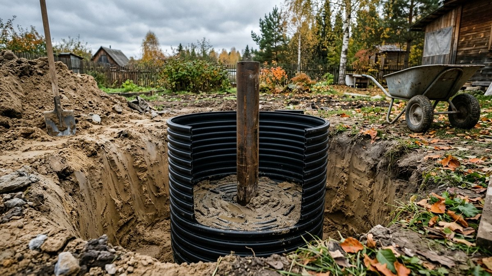
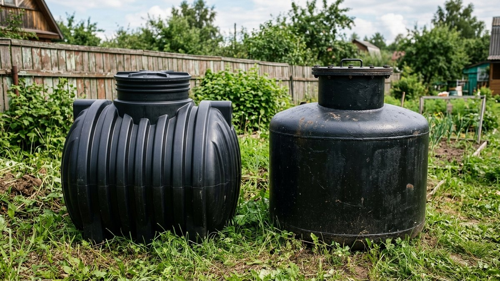
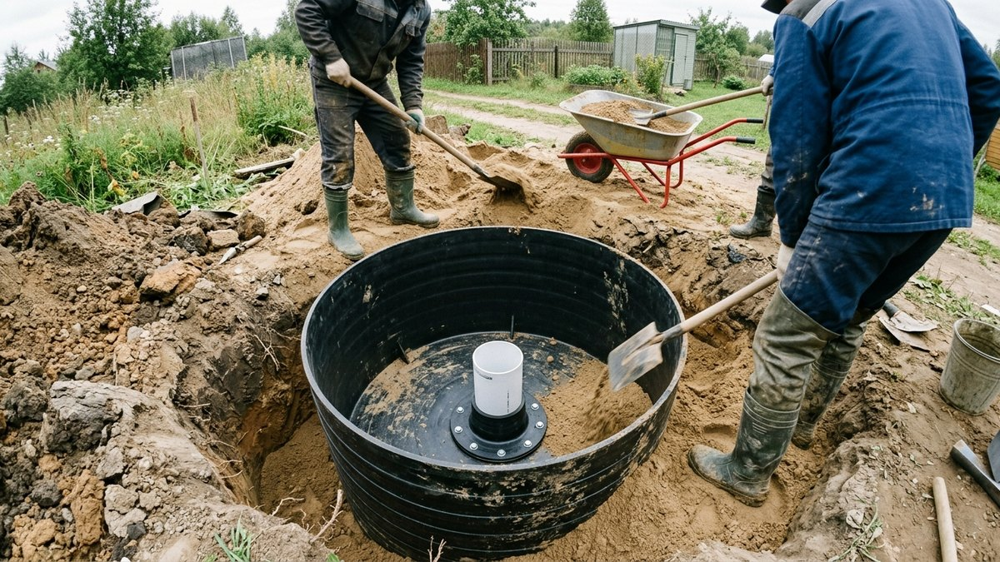
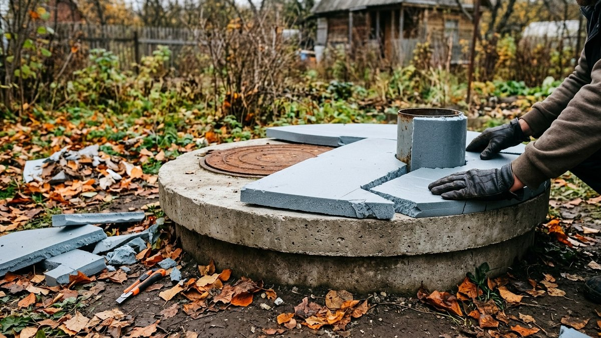
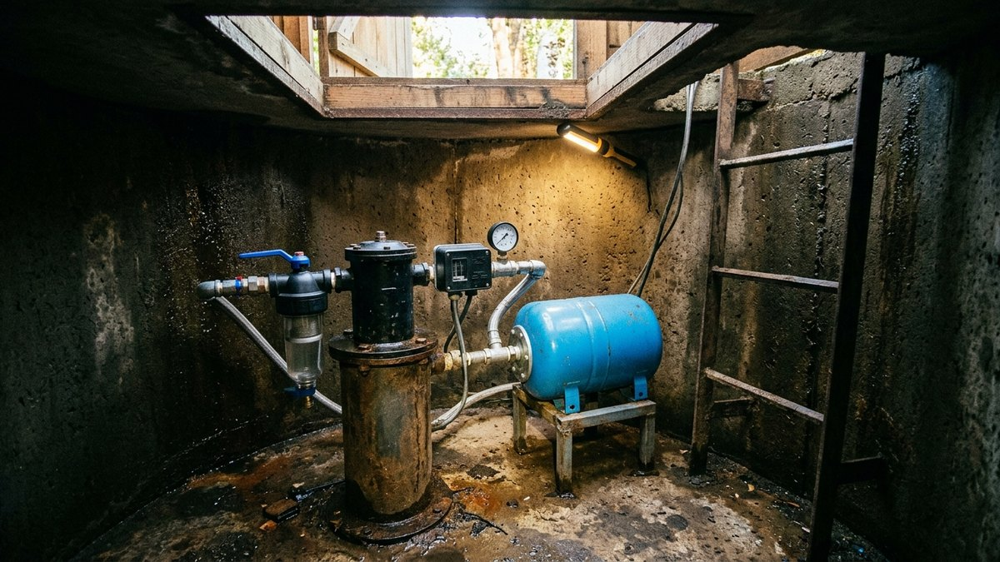
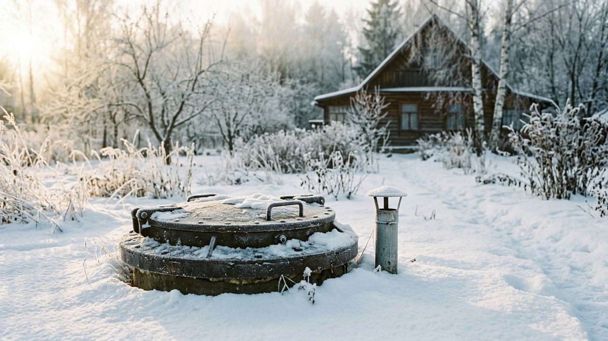

Кессон для скважины своими руками ставят, чтобы вода на даче шла
и в мороз: оголовок, краны и автоматика уходят под землю, где грунт
не промерзает. Ошибки здесь дорогие. Пластиковый кессон весной
выдавливает грунтовыми водами, бетонные кольца протекают по швам,
а неутеплённая крышка превращает камеру в морозилку, и к январю
лопается реле давления. Ниже разберём, когда кессон действительно
нужен, а когда хватит скважинного адаптера, сравним пластик, металл
и кольца, посчитаем глубину котлована и объём работ калькулятором,
пройдём монтаж по шагам и отдельно — утепление на зиму.

## Зачем нужен кессон и когда хватит адаптера

Кессон — герметичная камера под землёй вокруг оголовка скважины.
В ней ставят то, что боится мороза и должно быть под рукой: кран,
фильтр грубой очистки, гидроаккумулятор, реле давления, манометр.
Вода из скважины выходит в камеру ниже глубины промерзания и уходит
в дом по трубе в траншее.

Альтернатива — **скважинный адаптер**. Это муфта, которая врезается
в обсадную трубу ниже глубины промерзания и выводит воду наружу
прямо в грунт, без камеры. Сверху остаётся только оголовок с крышкой.

| Решение | Когда подходит | Минусы |
|---|---|---|
| Адаптер | скважина «на песок» или неглубокая, погружной насос, вся автоматика в доме, в доме есть тёплое место под гидроаккумулятор | обслуживать адаптер неудобно, при поломке приходится раскапывать; металлическая обсадная труба нужна прочная |
| Кессон | автоматику некуда поставить в доме, дом зимой не отапливается постоянно, нужна поверхностная насосная станция, обсадная труба пластиковая | дороже, больше земляных работ, нужен выбор материала под грунтовые воды |
| Домик над скважиной | только как дополнение к адаптеру или кессону | от промерзания на уровне грунта не защищает |

Если на даче зимой бываете наездами, а дом не отапливается, кессон
почти всегда выгоднее: автоматика остаётся в тепле под землёй, а не
в выстуженном доме. О том, чем кессон отличается от надземного
[домика для скважины](https://mir-doma.pro/domik-dlya-skvazhiny-na-dache/),
стоит помнить при выборе: домик закрывает оголовок от мусора и
осадков, а от промерзания на глубине защищает только кессон или адаптер.

Если скважины ещё нет и вы выбираете источник воды, сначала сравните
затраты в статье [«Скважина или колодец на даче»](https://mir-doma.pro/skvazhina-ili-kolodec/) —
кессон входит в смету скважины отдельной строкой.

## Пластик, металл или бетонные кольца

| Материал | Плюсы | Минусы | Когда выбирать |
|---|---|---|---|
| Пластиковый (полиэтилен, с рёбрами жёсткости) | герметичен с завода, лёгкий, не гниёт, ставится вдвоём без техники | всплывает при высоких грунтовых водах, стенки деформируются от давления грунта при плохой обратной засыпке | основной вариант для дачи: нужна анкеровка к плите и засыпка песком |
| Металлический (сталь 4–5 мм) | прочный, не деформируется, можно приварить гильзы где угодно | ржавеет без антикоррозийной обработки, нужна сварка и техника для опускания, конденсат на стенках | плотные глины, где пластик сожмёт, или при готовой сварке |
| Бетонные кольца с днищем | недорогие материалы, тяжёлые — не всплывают | швы между кольцами протекают, нужна гидроизоляция, кран для монтажа | низкие грунтовые воды и доступ для техники |
| Монолит или кирпич | любая форма и размер | долго, мокрые процессы, гидроизоляция обязательна | если камера нужна под много оборудования |

На дачном участке со средней полосы чаще всего ставят пластик.
Он дороже колец по материалу, но выигрывает на работе: нет крана,
нет гидроизоляции швов, камера сухая с первого дня. Его главный
враг — вода в грунте: весной пустой пластиковый кессон ведёт
себя как поплавок. Поэтому почти каждая инструкция к пластиковому
кессону начинается с бетонной плиты на дне котлована.

Металлический кессон дольше всего живёт с полимерной или битумной
защитой снаружи и обработкой изнутри. Без неё через 10–15 лет
в стенках появляются сквозные точки ржавчины.

## Размеры кессона и глубина котлована

Внутренний диаметр кессона определяют два требования: в нём нужно
работать стоя или хотя бы на корточках, и всё оборудование должно
поместиться без тесноты. Для оголовка, крана и реле давления хватит
1 м. Если внутри будет гидроаккумулятор на 50–100 л, берите 1,25–1,5 м.

Глубину считают от глубины промерзания грунта в вашем районе. Труба
в дом должна выходить из кессона ниже этой отметки с запасом, а под
выходом трубы нужно ещё 30–50 см до дна — там располагается оголовок
обсадной трубы и запорная арматура. Обычно для средней полосы это
2–2,4 м от поверхности до дна. Горловина выступает над землёй на
15–30 см, чтобы талая вода не заливала крышку.

Глубину промерзания для своего района смотрят по карте нормативной
глубины промерзания (СП 22.13330). Ориентир для средней полосы —
от 1,2 до 1,8 м в зависимости от грунта: песок промерзает глубже
глины. Калькулятор ниже считает глубину котлована, объём грунта и
бетона под плиту, а также утеплитель для крышки.

<!-- wp:html -->

<h3 class="md-ks__title">Калькулятор кессона для скважины</h3>

Считает глубину кессона по глубине промерзания, размер и объём котлована, бетон на анкерную плиту и утеплитель на крышку и верх стенок.

<label class="md-ks__f">Глубина промерзания грунта, м<input type="number" id="ksF" value="1.5" min="0.5" max="3" step="0.1"></label>
<label class="md-ks__f">Наружный диаметр кессона, м
<select id="ksD">
<option value="1.0">1,0</option>
<option value="1.2" selected>1,2</option>
<option value="1.5">1,5</option>
<option value="2.0">2,0 (бетонные кольца КС-15)</option>
</select></label>
<label class="md-ks__f">Горловина над землёй, м<input type="number" id="ksN" value="0.2" min="0.1" max="0.5" step="0.05"></label>
<label class="md-ks__f">Грунтовые воды
<select id="ksW">
<option value="1" selected>Высокие или не знаю — нужна плита</option>
<option value="0">Низкие — песчаная подушка</option>
</select></label>
<label class="md-ks__f">Утеплитель (ЭППС), толщина
<select id="ksI">
<option value="50">50 мм</option>
<option value="100" selected>100 мм (два слоя по 50)</option>
</select></label>

Глубина до дна кессона<b id="ksDepth">—</b>

Высота корпуса<b id="ksBody">—</b>

Котлован (диаметр × глубина)<b id="ksPit">—</b>

Объём грунта<b id="ksSoil">—</b>

Бетон / песок на дно<b id="ksBase">—</b>

ЭППС на крышку и верх стенок<b id="ksXps">—</b>

Выход трубы — на 0,2 м ниже глубины промерзания, под ним 0,4 м до дна. Котлован шире кессона на 0,3 м с каждой стороны для обратной засыпки. Плита — 0,2 м бетона, подушка — 0,2 м песка. Утеплитель: крышка и верхний пояс стенок на глубину промерзания с запасом 10% на подрезку.

<button type="button" id="ksCopy" class="md-ks__btn md-ks__btn--main">Скопировать результат</button>
<a id="ksVk" class="md-ks__btn md-ks__btn--vk" href="#" target="_blank" rel="noopener noreferrer">Поделиться ВКонтакте</a>
<a id="ksTg" class="md-ks__btn md-ks__btn--tg" href="#" target="_blank" rel="noopener noreferrer">Поделиться в Telegram</a>
<button type="button" id="ksShareNative" class="md-ks__btn" hidden>Поделиться…</button>
<button type="button" id="ksPrint" class="md-ks__btn">Печать</button>

<!-- /wp:html -->

Объём грунта получается внушительный: для кессона 1,2 м при промерзании
1,5 м — около 6 м³. Вручную это два-три дня работы вдвоём, поэтому
котлован часто копают экскаватором-погрузчиком за час, а всё остальное
делают сами.

## Монтаж кессона пошагово

Порядок ниже — для пластикового кессона, самого распространённого
на дачах. Для металлического отличается только опускание (нужна
техника) и обработка швов, для колец — гидроизоляция стыков.

1. **Разметить и выкопать котлован.** Центр котлована — ось обсадной
   трубы. Диаметр — на 0,5–0,6 м больше кессона, глубина — по
   калькулятору плюс 0,2 м на основание. Обсадную трубу на время
   работ закройте, чтобы в скважину не попал грунт.
2. **Подготовить основание.** При высоких грунтовых водах на дно
   заливают бетонную плиту 15–20 см с закладными петлями или
   анкерами для ремней. При низких хватает утрамбованной песчаной
   подушки. Обсадную трубу при этом не бетонируют — вокруг неё
   оставляют зазор.
3. **Подготовить кессон.** В днище вырезают отверстие под обсадную
   трубу и ставят гильзу с уплотнением из комплекта. В стенке на
   нужной высоте — гильзу под водопроводную трубу в дом и, если
   нужно, под электрокабель насоса.
4. **Опустить кессон.** Корпус надевают на обсадную трубу и опускают
   на основание, выставляя горловину по уровню. Пластиковый кессон
   1,2 м весом 60–90 кг опускают вдвоём на верёвках.
5. **Загерметизировать ввод обсадной трубы.** Гильзу на днище
   затягивают или герметизируют по инструкции производителя.
   Обсадную трубу обрезают так, чтобы она выступала над дном
   на 30–50 см, и ставят оголовок.
6. **Закрепить от всплытия.** При высоких грунтовых водах кессон
   притягивают к плите ремнями или тросами из нержавейки.
7. **Подключить трубу в дом.** Через гильзу в стенке заводят трубу
   ПНД, которая уходит в траншею ниже глубины промерзания. Траншею
   делают с небольшим уклоном к кессону, чтобы трубу можно было
   опорожнить при консервации.
8. **Обратная засыпка.** Пазухи засыпают слоями по 20–30 см песком
   или песчано-цементной смесью и проливают водой. Глиной и строительным
   мусором засыпать нельзя: зимой они пучатся и сминают пластиковые
   стенки. Засыпку ведут равномерно по кругу, иначе кессон перекосит.
9. **Смонтировать оборудование.** Кран, фильтр, обратный клапан,
   реле давления, манометр, гидроаккумулятор. Электрические
   соединения — в герметичных коробках выше пола.

## Как утеплить кессон на зиму

Дно и нижняя часть кессона лежат ниже глубины промерзания, там грунт
держит плюсовую температуру всю зиму. Холод приходит сверху: через
крышку, горловину и верхний пояс стенок, который находится в мёрзлом
грунте. Поэтому утепляют именно эти места. У колодца из бетонных колец
то же самое, только шахта открыта до воды: как утеплить кольца, крышку
и сделать внутреннюю диафрагму, разобрано в статье про
[утепление колодца на зиму](https://mir-doma.pro/kak-uteplit-kolodec-na-zimu/).

- **Крышка.** Изнутри или сверху — плита экструдированного
  пенополистирола (ЭППС) 50–100 мм. Если крышка металлическая,
  на ней без утеплителя за ночь нарастает иней, который потом
  капает на автоматику.
- **Верхний пояс стенок.** Снаружи, до засыпки, на глубину
  промерзания кессон обкладывают ЭППС или напыляют пенополиуретан.
  Второй вариант удобнее для металлического кессона: заодно это
  антикоррозийная защита.
- **Горизонтальное утепление вокруг.** Плиты ЭППС, уложенные вокруг
  горловины под слоем грунта по радиусу 0,5–1 м, отодвигают
  промерзание от стенок. Это работает так же, как утеплённая
  отмостка у фундамента.
- **Вентиляция.** Две трубки — приточная до низа камеры и вытяжная
  под крышкой — убирают конденсат. На зиму их прикрывают, но не
  заглушают наглухо.

Если дача зимой стоит пустой, а температура в кессоне всё равно падает
к нулю, последний рубеж — греющий кабель на участке трубы от кессона
до траншеи и на выходе в дом. Какой кабель выбрать и где его класть,
разобрано в статье про [греющий кабель для водопровода](https://mir-doma.pro/greyushchiy-kabel-dlya-vodoprovoda/).

## Что ставить внутри и как обслуживать

В кессоне всё должно быть доступно с лестницы или стоя на дне: через
горловину 60–80 см протиснуться с инструментом можно, а работать
лёжа над оголовком неудобно.

| Оборудование | Зачем | Совет |
|---|---|---|
| Оголовок скважины | защищает обсадную трубу от мусора и воды | обязательно с уплотнением кабеля насоса |
| Кран и обратный клапан | перекрыть воду и не дать ей уйти обратно в скважину | ставьте шаровой кран полнопроходной |
| Фильтр грубой очистки | защищает автоматику от песка | с прозрачной колбой, чтобы видеть засорение |
| Реле давления и манометр | включают и выключают насос | в кессоне — модель с защитой от влаги |
| Гидроаккумулятор | смягчает пуски насоса | при 50–100 л нужен кессон от 1,25 м |

Раз в год, обычно осенью, кессон осматривают: проверяют, нет ли воды
на дне, конденсата на стенках, ржавчины на металлических деталях.
Если дача на зиму консервируется полностью, воду из трубы до дома
сливают, а гидроаккумулятор опорожняют. Порядок слива и что делать
с насосом, показан в статье о том, как [законсервировать полив на
зиму](https://mir-doma.pro/konservaciya-poliva-na-zimu/) — для
водопровода от скважины шаги те же.

## Частые ошибки

- **Пластиковый кессон без анкеровки при высоких грунтовых водах.**
  Весной его выдавливает вверх, обсадная труба гнётся или ломается
  гильза.
- **Засыпка глиной и вынутым грунтом.** Мёрзлая глина давит на
  стенки, пластик сминается, металлический кессон перекашивается.
- **Неутеплённая крышка.** Самая частая причина, по которой
  автоматика в кессоне перемерзает, хотя камера стоит на правильной
  глубине.
- **Горловина вровень с землёй.** Талая вода заходит через крышку,
  и в кессоне весной стоит лужа.
- **Труба в дом выше глубины промерзания.** Кессон тёплый, а труба
  в траншее замерзает.
- **Обсадная труба, забетонированная в плиту.** При подвижках грунта
  её ломает; вокруг трубы оставляют зазор с уплотнением.
- **Кабели и розетки на дне.** При первом подтоплении — короткое
  замыкание и выход насоса из строя.

## Частые вопросы

### Какой кессон лучше для скважины: пластиковый или металлический

Для дачи с высокими грунтовыми водами — пластиковый с анкеровкой
к бетонной плите: он герметичен и не ржавеет. Металлический выбирают
для плотных глинистых грунтов, где пластик может смять, и только
с антикоррозийной защитой снаружи.

### На какую глубину ставить кессон для скважины

Так, чтобы труба в дом выходила ниже глубины промерзания, а под ней
оставалось 30–50 см до дна. Для средней полосы это обычно 2–2,4 м
от поверхности до дна. Точную глубину под свой район посчитайте
калькулятором выше.

### Как утеплить кессон на зиму

Утеплить крышку плитой ЭППС 50–100 мм, обложить верхний пояс стенок
до глубины промерзания и уложить горизонтальные плиты вокруг
горловины. Вентиляционные трубки на зиму прикрыть, но не заглушать.

### Можно ли обойтись без кессона

Можно, если поставить скважинный адаптер и вынести автоматику
в отапливаемый дом. Для дачи, где зимой бывают наездами и дом
стоит холодным, надёжнее кессон.

### Нужен ли кессон для скважины на песок

Чаще нет: на неглубокой скважине на песок обычно ставят адаптер
и погружной насос, а автоматику держат в доме. Кессон нужен,
если оборудование некуда поставить в тепле.
