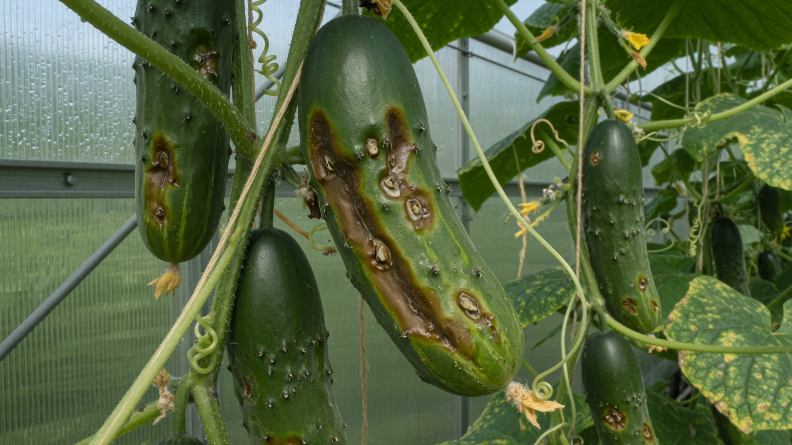
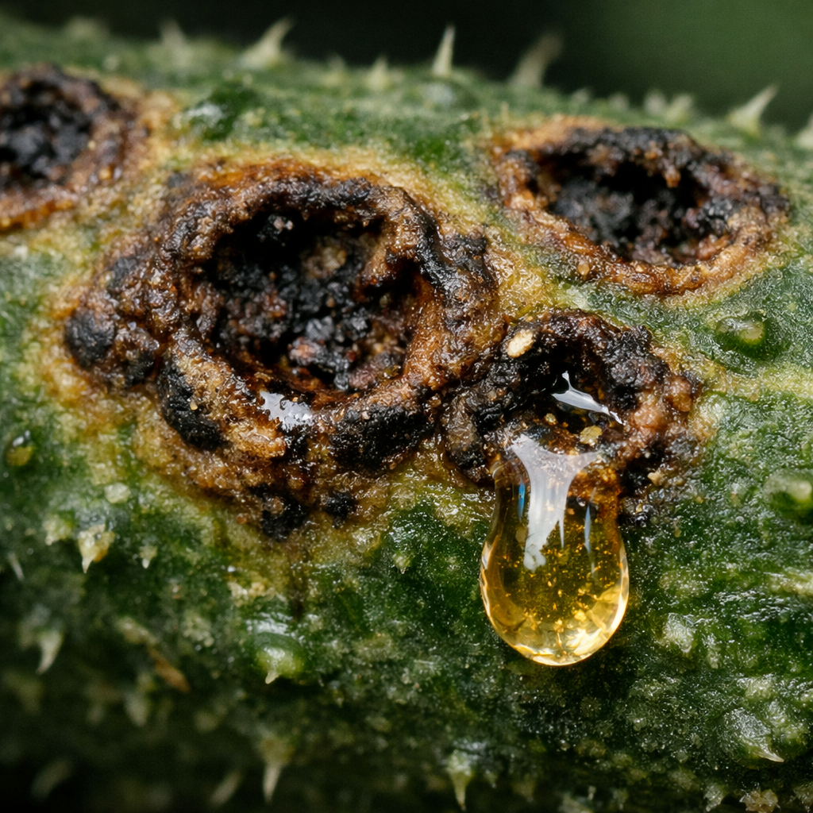
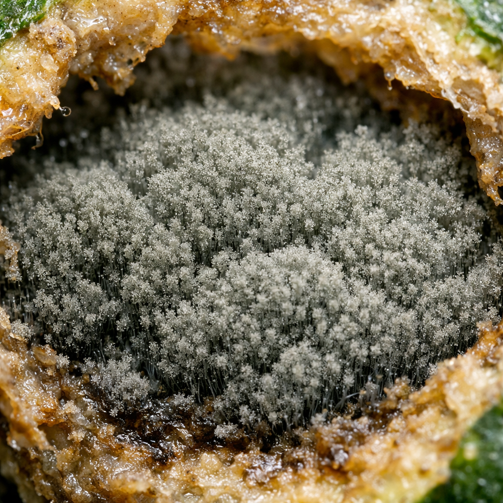
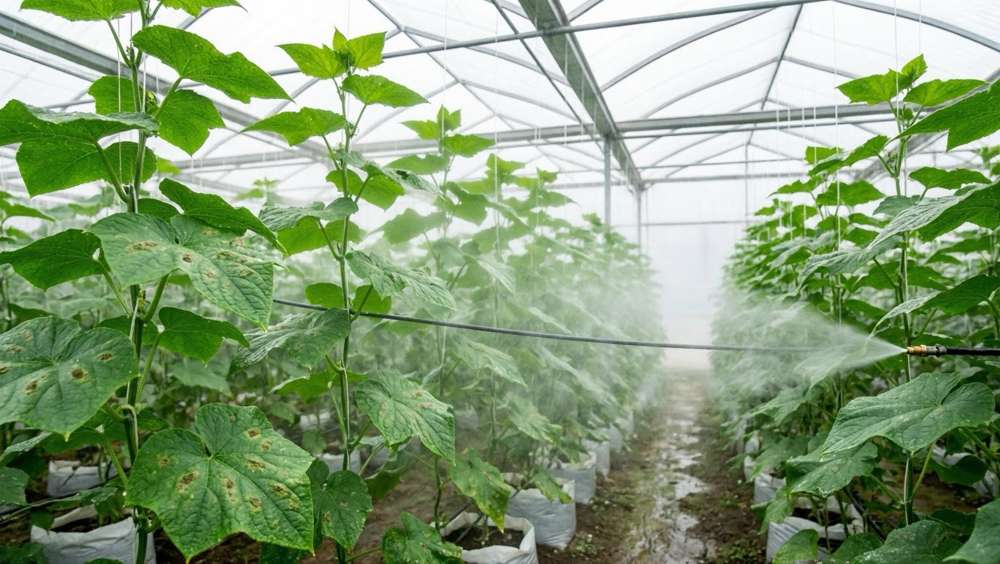
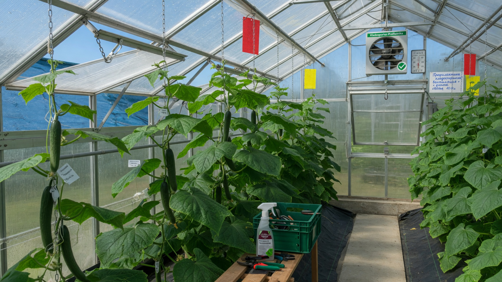

Кладоспориоз, или оливковая пятнистость, обычно накрывает огурцы в самый неподходящий момент — в конце лета, когда плодоношение в разгаре. Коварство этой болезни в том, что она бьёт прежде всего **по плодам**: огурцы покрываются вдавленными язвочками с бархатистым налётом и в пищу уже не годятся. Разберём, чем обработать огурцы от кладоспориоза, что делать в первую очередь и как не допустить вспышку в следующем сезоне.

## 🫒 Что такое кладоспориоз и чем он опасен

Кладоспориоз вызывает грибок, который зимует **на растительных остатках, в почве, на конструкциях теплицы и семенах**. Весной и летом его споры разносятся с каплями воды, сквозняком, на руках и инструменте.

Главная опасность — скорость и мишень. В прохладную сырую погоду болезнь развивается за считанные дни и портит именно **урожай**: плоды становятся уродливыми, покрываются язвами и загнивают прямо на плети. Листья при этом могут выглядеть почти нормально, поэтому проблему часто замечают поздно.

## 🔍 Как распознать: признаки на плодах и листьях

Симптомы у кладоспориоза узнаваемые:

- **На плодах** (главный признак) — сначала маслянистые пятнышки, затем **вдавленные язвочки**, будто выеденные ямки. В них появляется **оливково-серый бархатистый налёт**, а из язвы выступает студенистая капля. Огурцы искривляются и загнивают.
- **На листьях** — мелкие бурые или оливковые пятна; ткань в них подсыхает, крошится и выпадает, оставляя дырки.
- **На стеблях и черешках** — вытянутые язвочки.
- Молодые завязи при сильном поражении просто засыхают.

## ⚖️ Как отличить от других болезней огурцов

Лечение у этих болезней разное, поэтому «диагноз» важно поставить точно:

| Болезнь | По чему узнать |
|---|---|
| **Кладоспориоз** | Удар по **плодам**: вдавленные язвы с **оливково-серым** налётом и студенистой каплей |
| **Антракноз** | Тоже язвы на плодах, но налёт **розоватый**; на листьях округлые бурые пятна |
| **Бактериоз** | **Угловатые** маслянистые пятна на листьях, мутные капли снизу, дырки |
| **Мучнистая роса** | **Белый** мучнистый налёт на верхней стороне листа |
| **Пероноспороз** | Жёлтые угловатые пятна сверху, **серо-фиолетовый** налёт снизу |

Проще всего ориентироваться по цвету налёта в язвах: оливково-серый — кладоспориоз, розовый — [антракноз](https://mir-doma.pro/antraknoz-ogurtsov/). Если пятна угловатые и с каплями снизу листа — это [бактериоз](https://mir-doma.pro/bakterioz-ogurtsov/), а белый налёт сверху означает [мучнистую росу](https://mir-doma.pro/muchnistaya-rosa-na-ogurtsah/).

## 🌡️ Почему появляется в конце лета

Кладоспориоз любит именно августовскую погоду, и это объясняет, почему вспышки начинаются к концу сезона:

- **прохлада +16…+20 °C** — оптимум для грибка;
- **резкие перепады** дня и ночи, из-за которых в теплице выпадает конденсат;
- **высокая влажность**, роса, затяжные дожди;
- **полив холодной водой и по листьям**;
- **загущённые посадки** и плохое проветривание;
- **неубранные растительные остатки** с прошлого сезона.

Отсюда и практический вывод: чем стабильнее температура и суше листва, тем меньше шансов у болезни.

## 🧪 Чем обработать огурцы от кладоспориоза

План действий при первых признаках:

1. **Убрать поражённое.** Собрать и уничтожить больные плоды и листья — не в компост, а с участка.
2. **Прекратить полив на 3–4 дня** и снизить влажность: грибку нужна сырость, без неё он тормозится.
3. **Поднять температуру и проветрить** теплицу — стабильное тепло без конденсата останавливает развитие болезни.
4. **Обработать фунгицидом.** Работают медьсодержащие препараты — бордоская жидкость, ХОМ, оксихлорид меди; при сильном поражении применяют системные фунгициды по инструкции.
5. **Биопрепараты** (фитоспорин, триходерма) эффективны на самой ранней стадии и как профилактика между обработками.
6. **Повторить обработку** через 7–10 дней и обязательно выдержать срок ожидания перед сбором плодов, указанный на упаковке.

Важно: пока в теплице сыро и холодно по ночам, одна только химия проблему не решит — обязательно меняйте условия.

## 🥒 Что делать с плодами

- **Огурцы с язвами и налётом** в пищу и на заготовки не годятся — их убирают и уничтожают.
- **Внешне здоровые плоды** с обработанного растения собирать можно, но только после срока ожидания препарата.
- **Не оставляйте больные огурцы на грядке** — они становятся источником спор для соседних растений.
- Поражённые плоды **не хранятся**: гниль развивается за считанные дни.

## 🛡️ Как не допустить в следующем сезоне

- **Обеззараживайте семена** перед посевом — они один из источников инфекции.
- **Соблюдайте севооборот**, не сажая огурцы после тыквенных несколько лет.
- **Убирайте все растительные остатки** осенью.
- **Дезинфицируйте теплицу** после сезона — грибок зимует в грунте и на конструкциях; как это сделать, подробно в статье про [обработку теплицы осенью](https://mir-doma.pro/obrabotka-teplicy-osenyu/).
- **Поливайте тёплой водой под корень**, без дождевания.
- **Не загущайте посадки** и регулярно проветривайте теплицу, избегая ночных перепадов.
- **Выбирайте устойчивые гибриды** — у современных сортов устойчивость к оливковой пятнистости указывают в описании.

## ❓ Частые вопросы

**Чем обработать огурцы от кладоспориоза?**
Медьсодержащими препаратами — бордоской жидкостью, ХОМом или оксихлоридом меди; при сильном поражении применяют системные фунгициды. Одновременно убирают больные плоды, прекращают полив на несколько дней и проветривают теплицу.

**На огурцах появились язвочки с налётом — что это и что делать?**
Похоже на кладоспориоз, особенно если налёт в язвах оливково-серый. Соберите и уничтожьте поражённые плоды, снизьте влажность, проветрите теплицу и обработайте растения фунгицидом.

**Можно ли есть огурцы с кладоспориозом?**
Плоды с язвами и налётом есть нельзя — они горчат и загнивают. Внешне здоровые огурцы с обработанного куста употребляют только после срока ожидания препарата, указанного на упаковке.

**Почему огурцы начали портиться пятнами в конце лета?**
Кладоспориоз активизируется в прохладную сырую погоду с перепадами дня и ночи — как раз в августе. Конденсат в теплице и полив холодной водой ускоряют вспышку.

**Чем кладоспориоз отличается от антракноза?**
И там, и там на плодах язвы, но при кладоспориозе налёт в них оливково-серый, а при антракнозе — розоватый. На листьях у антракноза пятна округлые, у кладоспориоза мелкие и с дырками.

**Как избавиться от кладоспориоза в теплице навсегда?**
Одной обработкой не выйдет: нужно осенью убрать остатки, продезинфицировать теплицу и грунт, соблюдать севооборот, обеззараживать семена, поливать тёплой водой под корень и не допускать ночных перепадов температуры.

---

Кладоспориоз узнаётся по вдавленным язвам на плодах с оливково-серым налётом и лечится связкой из двух вещей: фунгицидов и смены условий — сухая листва, тепло и проветривание. Главное — не спутать его с антракнозом и бактериозом, у которых своё лечение. Полный разбор всех огуречных болезней и вредителей с симптомами и обработкой собран в статье про [мучнистую росу на огурцах](https://mir-doma.pro/muchnistaya-rosa-na-ogurtsah/), а если листья желтеют без пятен, причина может быть в уходе — об этом в материале [почему желтеют листья у огурцов](https://mir-doma.pro/zhelteyut-listya-u-ogurtsov/).
