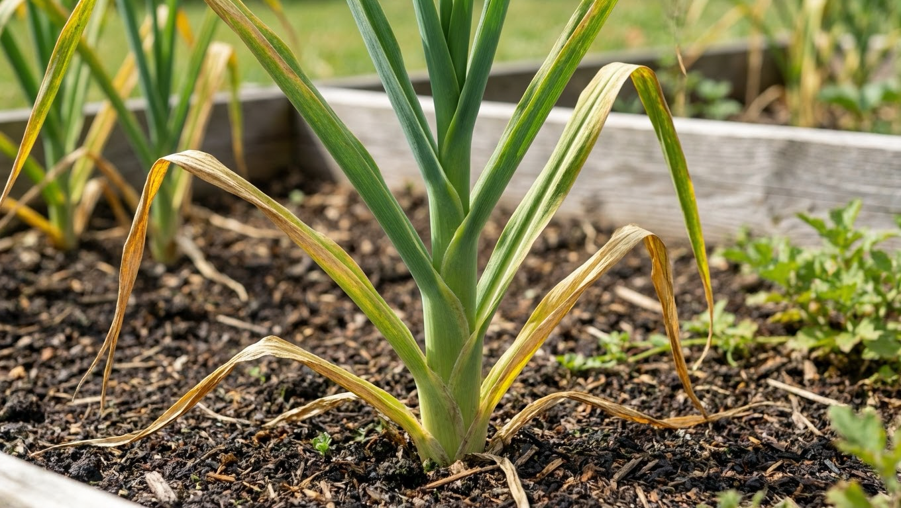
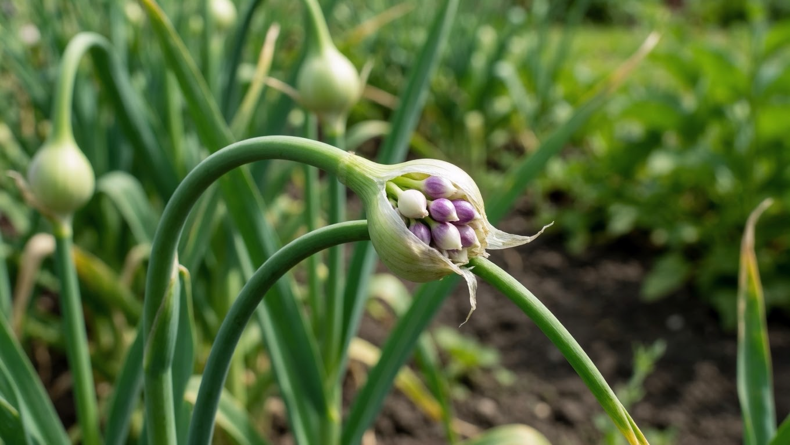
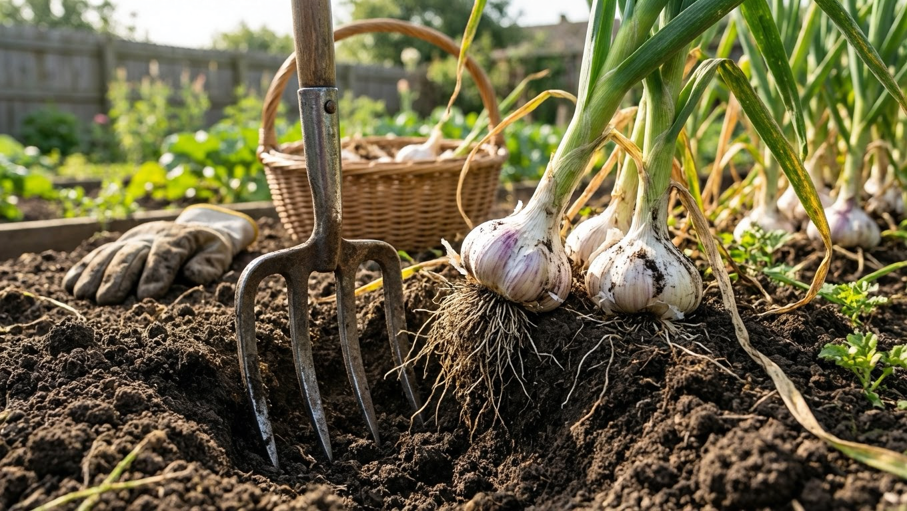
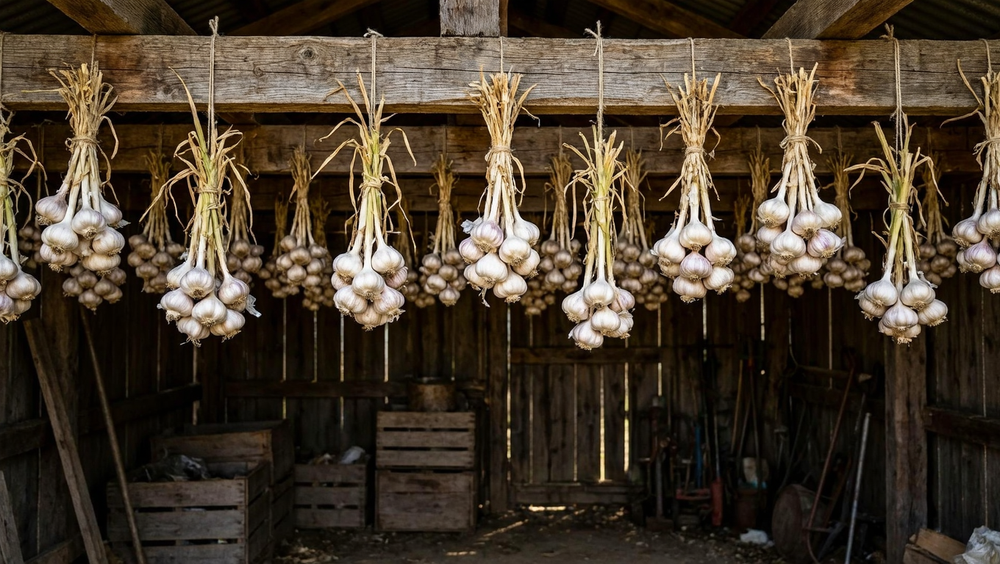
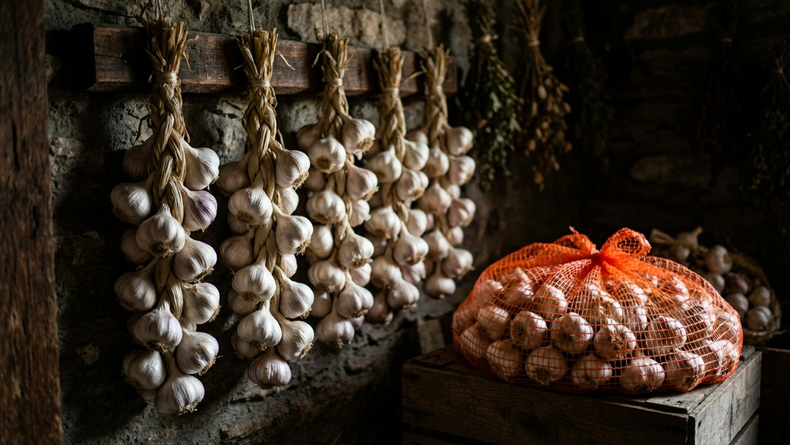

Убрать чеснок вовремя не менее важно, чем правильно его вырастить: поспешишь — головки будут рыхлыми и мелкими, опоздаешь — они распадутся на зубки прямо в земле и не будут храниться. При этом ориентироваться на календарь недостаточно — всё решают погода и признаки зрелости самого чеснока. В этой статье разберём, когда убирать чеснок с грядки, по каким признакам понять, что он созрел, и как правильно выкопать, просушить и подготовить урожай к хранению.

## 🧄 Озимый и яровой чеснок: разные сроки

Сроки уборки зависят от того, какой чеснок вы выращиваете:

- **Озимый чеснок** (посаженный осенью) созревает раньше — обычно в июле.
- **Яровой чеснок** (посаженный весной) убирают позже — в августе, а то и в сентябре.

Разница объяснима: озимый чеснок зимует в земле и трогается в рост раньше, поэтому и созревает первым. Именно с уборкой озимого чеснока у большинства дачников и связаны хлопоты в разгар лета.

Точные даты сильно зависят от региона и погоды конкретного года, поэтому надёжнее ориентироваться не на календарь, а на признаки зрелости. К моменту уборки чеснок должен успеть сформировать крупную головку — этому помогают своевременные [подкормки](https://mir-doma.pro/letnie-podkormki-ovoshchey/) в течение сезона.

## 🌱 Признаки зрелости чеснока

Понять, что чеснок пора убирать, помогают несколько признаков:

- **Нижние листья желтеют и подсыхают**, а у ярового чеснока перо полегает.
- **Кроющие чешуйки головки** становятся плотными и сухими, в 3–4 слоя.
- **Зубки хорошо сформированы** и легко отделяются друг от друга.

У стрелкующегося озимого чеснока есть удобный «маячок»: оставьте на грядке одну-две стрелки. Когда оболочка на соцветии с бульбочками растрескается, коробочки приоткроются, а сама стрелка выпрямится — чеснок созрел и его пора убирать. Этот способ удобен тем, что не нужно выкапывать головки для проверки: маячок виден прямо на грядке.

## ⚠️ Почему важно не поспешить и не опоздать

Собрать урожай нужно в правильный момент:

- **Если убрать рано**, головки будут недозрелыми — рыхлыми, с тонкой чешуёй и мелкими зубками, и плохо хранятся.
- **Если опоздать**, кроющие чешуи растрескаются, головка распадётся на отдельные зубки прямо в земле, оголится и станет непригодной для длительного хранения, а то и начнёт прорастать или загнивать.

Именно поэтому за зрелостью чеснока следят внимательно и не пропускают нужный срок. Ориентировочный «коридор» уборки — около недели-двух: за это время нужно успеть выкопать урожай, как только появились признаки зрелости.

## 🍴 Как правильно убирать чеснок

Чтобы не повредить головки и заложить основу для хорошего хранения:

1. **Прекратите полив** за 2–3 недели до уборки — так чеснок вызреет, а кроющая чешуя окрепнет и станет плотной. Влажная земля перед уборкой, наоборот, задерживает вызревание и способствует загниванию при хранении.
2. **Убирайте в сухую погоду** — влажные головки хуже сохнут и хранятся.
3. **Подкапывайте вилами или лопатой**, а не выдёргивайте за ботву — иначе можно оборвать её и повредить донце.
4. **Отряхните землю**, но не мойте головки.

Аккуратно выкопанный сухой чеснок — залог того, что он долежит до весны. Выкопанные головки не бросают на солнцепёк надолго: под палящими лучами они могут «свариться» и хуже храниться, поэтому чеснок сразу убирают в тень на просушку.

## ☀️ Просушка и подготовка к хранению

После уборки чеснок обязательно просушивают:

- Разложите или подвесьте головки **вместе с ботвой и корнями** в сухом, проветриваемом месте в тени.
- Сушите 1–3 недели: за это время питательные вещества из ботвы перейдут в головку, а чешуя окончательно окрепнет.
- После просушки обрежьте ботву, оставив шейку 3–5 см, и укоротите корни.

Только хорошо просушенный чеснок готов к закладке на хранение. Проверить готовность просто: шейка у хорошо высушенного чеснока становится сухой и тонкой, а сама головка — лёгкой и «шуршащей».

## 📦 Как хранить чеснок

Хранят чеснок в сухом месте — в косах, сетках, капроновых чулках или ящиках. Яровой чеснок лежит дольше (почти до нового урожая), озимый — хуже, поэтому его стараются использовать в первую очередь. Оптимальная влажность для чеснока низкая, а температура — прохладная или комнатная. Периодически запасы перебирают и убирают подгнившие или проросшие головки, чтобы они не испортили остальные. Подробнее об условиях и способах — в статье о том, [как хранить овощи зимой](https://mir-doma.pro/kak-hranit-ovoshchi-zimoy/).

## 🛡️ Частые ошибки

- **Уборка по календарю, а не по признакам.** Сроки сдвигаются из-за погоды. Ориентируйтесь на состояние чеснока.
- **Опоздание с уборкой.** Перезревшая головка распадается на зубки и не хранится. Не пропускайте срок.
- **Выдёргивание за ботву.** Повреждает донце и головку. Подкапывайте вилами.
- **Не прекратили полив.** Чеснок не вызревает, чешуя остаётся слабой. Прекращайте полив заранее.
- **Плохая просушка.** Недосушенный чеснок гниёт при хранении. Сушите как следует.

## ❓ Частые вопросы

### Когда убирать озимый чеснок?

Озимый чеснок обычно убирают в июле, но точный срок зависит от региона и погоды. Надёжнее ориентироваться на признаки: нижние листья желтеют, а у стрелкующегося чеснока растрескивается оболочка на соцветии с бульбочками и выпрямляется стрелка. Это и есть сигнал к уборке.

### Когда убирать яровой чеснок?

Яровой чеснок, посаженный весной, созревает позже озимого — его убирают в августе или начале сентября. Главный признак готовности — массовое пожелтение и полегание пера. Как и с озимым, ориентируются на состояние растений, а не только на календарь.

### Как понять, что чеснок созрел?

О зрелости говорят пожелтевшие нижние листья, плотные сухие кроющие чешуйки в 3–4 слоя и хорошо сформированные зубки. У стрелкующегося чеснока дополнительный признак — растрескавшаяся оболочка на бульбочках и выпрямившаяся стрелка. По совокупности признаков и определяют срок уборки.

### Нужно ли прекращать полив перед уборкой чеснока?

Да, полив прекращают примерно за 2–3 недели до уборки. Это помогает чесноку вызреть, а кроющей чешуе — окрепнуть, что важно для хранения. Убирать чеснок тоже лучше в сухую погоду, чтобы головки были сухими.

### Что будет, если опоздать с уборкой чеснока?

Перезревший чеснок растрескивается, его головка распадается на отдельные зубки прямо в земле, оголяется и теряет защитную оболочку. Такой чеснок плохо хранится, может прорастать и загнивать. Поэтому важно не пропустить момент зрелости.

### Можно ли мыть чеснок после уборки?

Мыть чеснок перед хранением не нужно — влага провоцирует загнивание. Головки просто отряхивают от земли и просушивают. Мыть чеснок стоит уже непосредственно перед употреблением.

### Нужно ли обрезать ботву у чеснока сразу?

Нет, сразу ботву не обрезают. Чеснок сушат вместе с ботвой и корнями 1–3 недели — за это время питательные вещества переходят из листьев в головку. Только после полной просушки ботву обрезают, оставляя шейку 3–5 см.

### Как сушить чеснок после уборки?

Выкопанный чеснок просушивают вместе с ботвой и корнями в сухом проветриваемом месте в тени в течение 1–3 недель. За это время питательные вещества переходят из ботвы в головку. После просушки ботву обрезают, оставляя шейку 3–5 см, и укорачивают корни.

## Заключение

Убирают чеснок, ориентируясь не на дату, а на признаки зрелости: пожелтевшие нижние листья, плотную сухую чешую и «маячок» из растрескавшихся бульбочек у стрелкующихся сортов. Озимый чеснок готов обычно к июлю, яровой — к августу-сентябрю. Прекратите полив заранее, выкопайте головки вилами в сухую погоду, хорошо просушите с ботвой — и чеснок долго пролежит без потерь. Главное — не поспешить и не опоздать, тогда весь урожай сохранится крепким и здоровым. А часть отборных крупных головок можно оставить как посадочный материал для осенней посадки под зиму.

А по каким признакам убираете чеснок вы? Делитесь опытом в комментариях и подписывайтесь, чтобы не пропустить новые статьи об урожае и его хранении.
