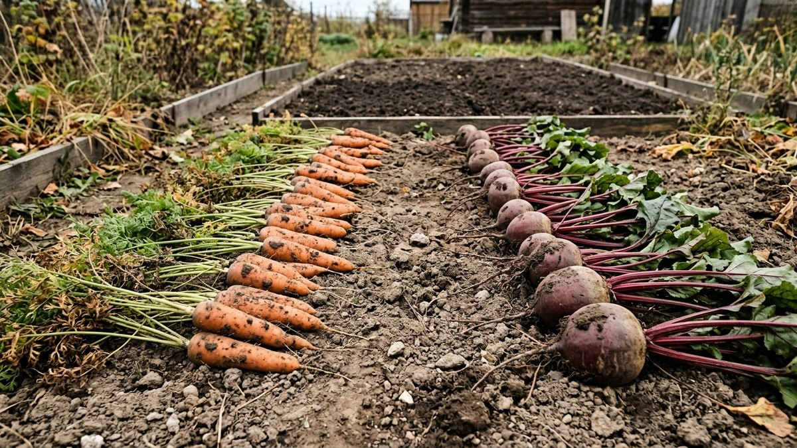
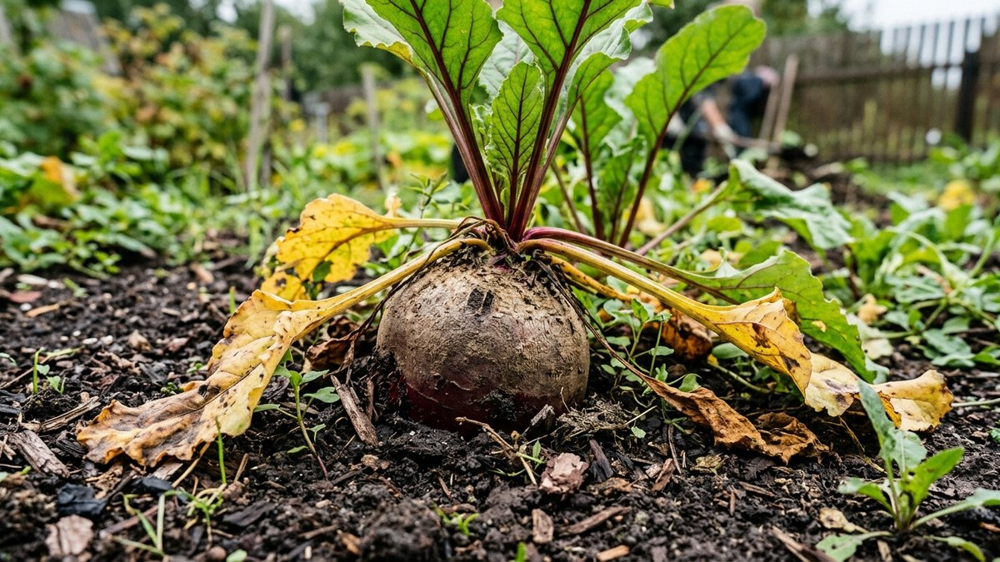
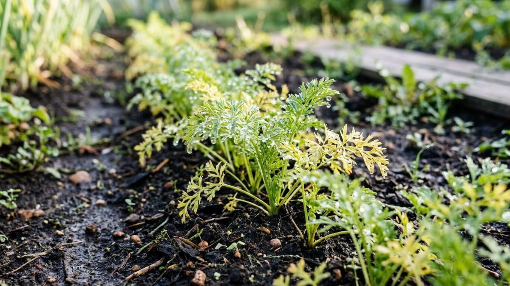
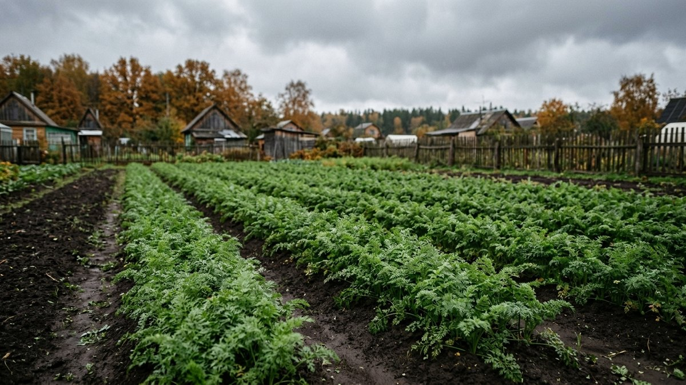
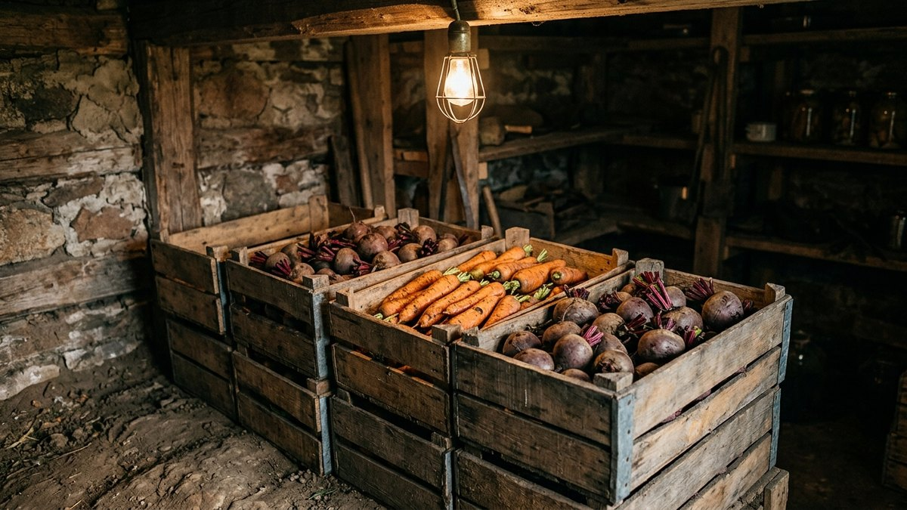
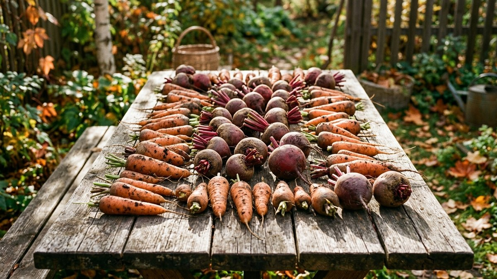

Слишком рано — корнеплоды не успели набрать сахар и размер, слишком поздно — попали под заморозки и начали гнить в погребе уже через месяц. Момент уборки моркови и свёклы решает, долежит ли урожай до весны, и календарная дата тут вторична: важнее признаки на грядке и прогноз погоды на ближайшую неделю. Разберём, как определить нужный момент для каждой культуры отдельно — сроки у них не совпадают.

## Свёклу убирают раньше моркови

Свёкла хуже моркови переносит даже лёгкий заморозок — подмороженная в земле, она теряет лёжкость почти полностью, хотя внешне может выглядеть нормально. Убирать её нужно до устойчивого похолодания, пока температура по ночам не опускается ниже +2…+3 °C.

Признаки готовности:
- нижние листья желтеют и подсыхают, но верхние остаются зелёными;
- корнеплод показался над землёй на треть-половину — сорт набрал нужный размер;
- при лёгком нажиме на плечики корнеплод плотный, без пустот.

## Морковь можно держать в земле дольше

Морковь, в отличие от свёклы, переносит лёгкие заморозки до −2…−3 °C без потери качества — более того, кратковременное похолодание перед уборкой даже увеличивает содержание сахара в корнеплодах. Поэтому её убирают позже свёклы, часто вплотную к устойчивым холодам.

Признаки готовности:
- нижние листья ботвы желтеют и полегают;
- корнеплод достиг сортового размера (смотрите на пакетик от семян — там указан ориентир по дням от всходов);
- кожица плотная, при царапании ногтем не продавливается сразу.

Тянуть с уборкой моркови до затяжных дождей не стоит: переувлажнённая почва провоцирует растрескивание корнеплодов и делает их более уязвимыми к загниванию при хранении.

## Ориентир по срокам для средней полосы

Для Подмосковья и похожих климатических зон ориентировочный календарь такой:

- **свёкла** — конец августа – середина сентября, до первых устойчивых похолоданий;
- **морковь** — середина сентября – начало октября, можно держать до первых лёгких заморозков.

Это ориентир, а не жёсткое правило: тёплая продолжительная осень сдвигает сроки на одну-две недели позже, ранние холода — раньше. Погода конкретного сезона важнее календаря.

## Погода решает больше, чем дата

Убирать корнеплоды лучше в сухую погоду, через день-два после дождя, когда верхний слой почвы подсох, но не пересох до твёрдой корки. Если впереди по прогнозу несколько дней дождя подряд — лучше убрать чуть раньше расчётного срока, чем упустить сухое окно и копать в грязи: мокрые корнеплоды хуже хранятся и сложнее просушиваются перед закладкой.

## Что будет, если убрать рано или поздно

| Ситуация | Морковь | Свёкла |
|---|---|---|
| Убрали слишком рано | Меньше размер, меньше сахара, хуже лёжкость | Меньше размер, водянистый вкус |
| Убрали слишком поздно | Растрескивание после дождей, риск загнивания верхушки | Подмерзание, резкое падение лёжкости, гниль в погребе уже через месяц |
| Попала под заморозок в земле | Переносит −2…−3 °C без потерь | Теряет лёжкость даже при лёгком заморозке |

## Как убирать правильно

Свёклу выдёргивают за ботву, если почва рыхлая; на плотной глине лучше подкопать вилами, чтобы не оборвать корнеплод. Морковь почти всегда требует подкопки вилами с боков рядка — если тянуть за ботву без подкопки, велик риск обломить корнеплод у основания, а место обрыва становится точкой загнивания при хранении. После выкапывания корнеплоды отряхивают от земли, но не моют — мытые хранятся заметно хуже.

Дальше — подготовка к закладке. У свёклы ботву и корешок обрезают не под самый край, а с отступом, иначе повреждённая точка роста начинает гнить одной из первых: подробная схема — в статье [«Как обрезать свёклу для хранения на зиму»](https://mir-doma.pro/obrezka-svekly-dlya-hraneniya/). Моркови ботву обрезают сразу и полностью, оставляя пенёк не более 1 см. После обрезки корнеплоды пару часов просушивают в тени на воздухе, а затем закладывают на хранение — по каким условиям и в какой таре, разобрано в статье [«Как хранить овощи зимой в погребе и дома»](https://mir-doma.pro/kak-hranit-ovoshchi-zimoy/).

## Частые ошибки

- **Ориентироваться только на календарь, игнорируя погоду.** Одна и та же дата в разные годы может означать и тёплую сухую землю, и промёрзшую грязь.
- **Затягивать с уборкой свёклы до первых холодов.** В отличие от моркови, она не прощает даже лёгкий заморозок.
- **Копать сразу после дождя.** Мокрые корнеплоды хуже хранятся и требуют более долгой просушки.
- **Обрывать ботву без подкопки.** Обломанный кончик корнеплода — частая причина ранней гнили в погребе.
- **Мыть корнеплоды перед закладкой.** Достаточно стряхнуть землю руками — мытые хранятся хуже.

## Частые вопросы

### Что убирать раньше — морковь или свёклу?

Свёклу убирают раньше моркови, потому что она хуже переносит холода — уже лёгкий заморозок резко снижает её лёжкость. Морковь можно держать в земле дольше, вплоть до первых несильных заморозков.

### Можно ли морковь оставлять в земле под снегом?

Небольшую часть урожая можно оставить зимовать в грядке под толстым слоем мульчи в южных и умеренных регионах, но для полноценного хранения весь урожай убирают до устойчивых морозов — иначе корнеплоды промерзают насквозь и становятся непригодны.

### Что будет, если выкопать морковь слишком рано?

Корнеплоды не успеют набрать сортовой размер и сахаристость, вкус будет более водянистым, а лёжкость заметно хуже, чем у моркови, убранной в оптимальный срок.

### Нужно ли ждать, пока пожелтеет вся ботва?

Нет — ориентир это пожелтение нижних листьев при ещё зелёных верхних. Ждать полного пожелтения всей ботвы не стоит: это часто означает, что уборка уже запоздала.

### Как понять, что свёклу пора убирать?

По размеру корнеплода (виден над землёй на треть-половину) и по прогнозу погоды — убирать нужно до похолодания ниже +2…+3 °C по ночам, не дожидаясь пожелтения ботвы, как у моркови.
