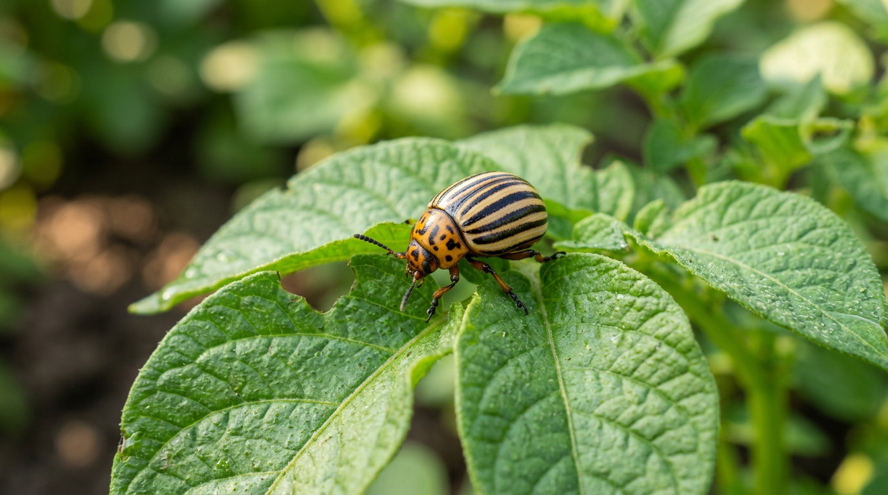
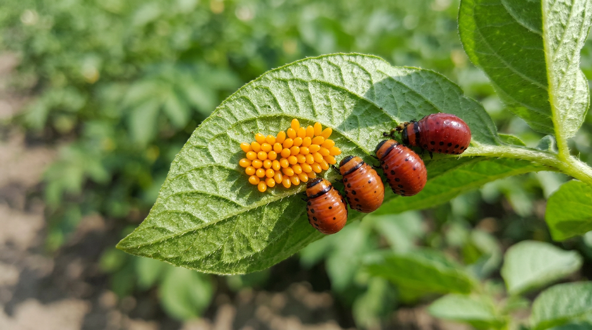
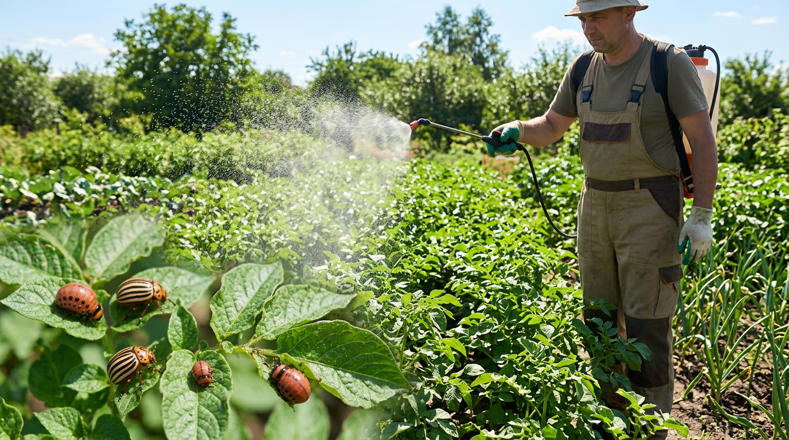
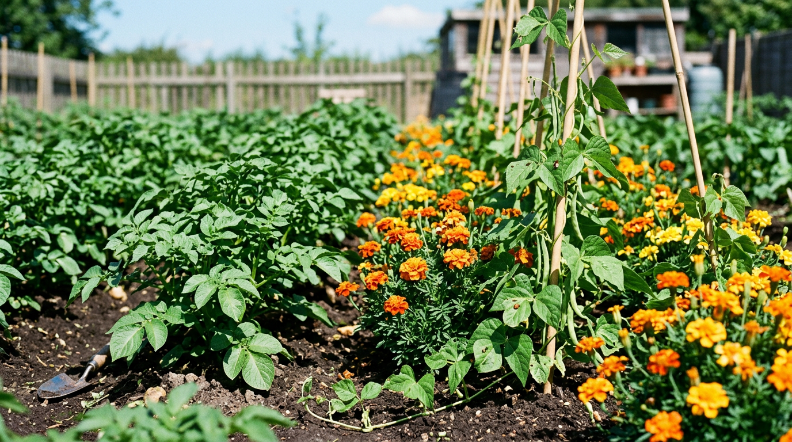
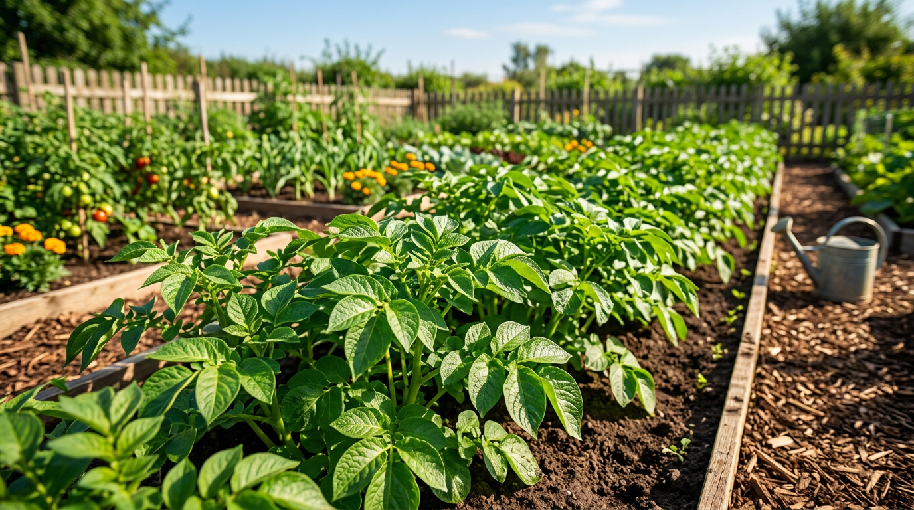
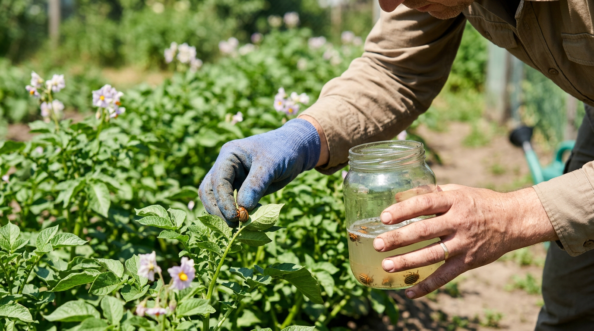

Стоит картофелю подняться, как на листьях появляются полосатые жуки, а через неделю-другую от ботвы остаются одни черешки. Колорадский жук — самый прожорливый и упрямый вредитель картофеля: одна личинка съедает несколько листьев в день, а колония способна оголить грядку за считанные дни. Многие сразу хватаются за сильную химию, но травить картофель, который потом сами же будем есть, хочется в последнюю очередь. Хорошая новость: с жуком вполне реально справиться без ядов. В этой статье разберём, как избавиться от колорадского жука без химии — народные средства, ловушки, отпугивающие растения и профилактику, которая снижает нашествие в разы.

## 🪲 Чем опасен колорадский жук

Колорадский жук — небольшой полосатый листоед длиной около сантиметра, с характерными чёрно-жёлтыми полосами на спинке. Питается он растениями семейства паслёновых, и картофель — его любимое блюдо. Но при случае жук с удовольствием переходит на баклажаны, перец, помидоры и даже физалис.

### Чем именно вредит

Опасны и взрослые жуки, и особенно их личинки — красно-оранжевые, мягкие, с двумя рядами чёрных точек по бокам. Взрослые жуки прокусывают листья весной и откладывают яйца, но настоящий аппетит у личинок: за две-три недели развития одна личинка съедает в десятки раз больше собственного веса. Именно личинки наносят основной урон:

- они объедают листья и молодые побеги, оставляя от ботвы голые стебли;
- лишённый листвы куст не может нормально фотосинтезировать, и клубни мельчают или не образуются вовсе;
- при сильном поражении в начале сезона можно потерять до 80% урожая.

### Как развивается за сезон

Понимание жизненного цикла помогает выстроить защиту. Перезимовавшие в почве жуки выходят на поверхность весной, когда прогревается земля, и сразу принимаются за молодые всходы. Вскоре самки откладывают на нижнюю сторону листьев оранжевые яйца — по 20–40 штук в кладке и до нескольких сотен за сезон. Через 1–2 недели из них отрождаются личинки, которыеактивно питаются 2–3 недели, затем уходят в почву окукливаться, ивыходит новое поколение. За тёплое лето успевает смениться одно-два поколения, а в южных регионах и больше — поэтому численность жука нарастает лавинообразно, если не вмешаться вовремя.

### Почему с ним так трудно бороться

Главная проблема жука — его живучесть и плодовитость. Самка за сезон откладывает сотни яиц, а за лето сменяется одно-два поколения. Жуки зимуют глубоко в почве и весной выходят не все разом, а волнами, поэтому одной обработки никогда не хватает. Вдобавок колорадский жук быстро вырабатывает устойчивость к ядам — препарат, который работал в прошлом году, на следующий может оказаться бесполезным. Именно поэтому ставка на народные методы и профилактику часто оказывается надёжнее, чем гонка за всё более сильной химией.

## 🔍 Как вовремя заметить жука

Чем раньше обнаружите вредителя, тем проще не дать ему расплодиться. Осматривайте посадки каждые несколько дней, особенно с момента всходов, и обращайте внимание на признаки:

- сами полосатые жуки на листьях и стеблях;
- оранжево-жёлтые кладки яиц на **нижней** стороне листьев;
- красноватые личинки, облепившие верхушки кустов;
- объеденные, продырявленные листья и голые черешки.

Перевернуть несколько верхних листьев и проверить изнанку на кладки — самый верный способ застать нашествие в самом начале.

## 🖐️ Ручной сбор — самый надёжный способ

Как бы просто это ни звучало, на небольших участках ручной сбор остаётся самым эффективным и абсолютно безопасным методом. Никакой яд не сравнится по надёжности с прямым удалением вредителя.

### Как собирать правильно

Возьмите банку или ведро, налейте на дно крепкий солевой раствор или керосин (можно просто мыльную воду) и стряхивайте туда жуков, личинок и обрывайте листья с кладками. Делать это лучше утром, когда жуки малоподвижны. Главное правило — **не давить жуков на земле**: раздавленные особи привлекают новых, а яйца из них могут уцелеть. Собранных вредителей уничтожают, а не выбрасывают рядом с участком — иначе они просто вернутся обратно. Личинок удобно стряхивать, наклонив куст над ёмкостью и постучав по стеблю. Заодно при обходе обрывайте и листья с оранжевыми кладками яиц — это убирает будущее поколение ещё до его появления.

Обходить грядки нужно регулярно, каждые 2–3 дня, особенно в начале сезона, пока не вышло основное поколение. Это кропотливо, но именно постоянство решает исход: если пройтись по грядкам один раз и забросить, через неделю всё вернётся. Зато при регулярном сборе уже через пару недель жука становится заметно меньше, и дальше держать ситуацию под контролем гораздо легче.

## 🌿 Народные средства от колорадского жука

Народные методы работают как опрыскивание для отпугивания и угнетения жука, а также как припудривание. Они безопасны для урожая, но требуют регулярности и повторения после дождя.

### Настой чистотела

Чистотел ядовит для жука. Ведро на треть заполняют свежей травой, заливают кипятком или горячей водой, настаивают несколько часов, процеживают и опрыскивают кусты. Работать с чистотелом нужно в перчатках. Алкалоиды чистотела угнетают жука и личинок, при этом средство быстро разлагается и не накапливается в клубнях. Опрыскивание повторяют раз в 7–10 дней и после дождя.

### Зола

Просеянной древесной золой опудривают кусты по росе — жук и личинки не выносят золу, а растения получают калийную подкормку. Особенно хорошо работает по молодой ботве. Опудривание повторяют после каждого дождя. Для опрыскивания можно сделать зольно-мыльный раствор: 1–2 стакана просеянной золы залить кипятком, настоять сутки, процедить и добавить немного мыла для прилипания. Такой раствор держится на листьях дольше сухого опудривания.

### Настой полыни

Горькая полынь отпугивает вредителя своим резким запахом и горечью. Измельчённую траву (горсть на ведро, можно с добавлением древесной золы) заливают горячей водой, настаивают 2–3 часа, процеживают и опрыскивают посадки. Запах полыни сбивает жука с толку и мешает самкам откладывать яйца. Полынь хороша тем, что растёт почти везде и сырьё для настоя всегда под рукой.

### Горчица и уксус

Сухую горчицу (100 г) разводят в 10 л воды, добавляют немного столового уксуса и опрыскивают кусты. Раствор раздражает жука и личинок, а резкий запах отпугивает новых особей и мешает самкам садиться на кусты. Горчица к тому же слегка подкисляет поверхность листа, делая её менее привлекательной для вредителя. Обработку повторяют каждые 7–10 дней.

### Настой луковой шелухи

Шелуху заливают горячей водой, настаивают сутки, процеживают и опрыскивают ботву. Средство мягкое, подходит для частых обработок и заодно укрепляет растения за счёт содержащихся в шелухе веществ. Луковый настой хорошо чередовать с более резкими средствами вроде чистотела или полыни — так жук не успевает привыкнуть к одному запаху.

### Настой острого перца

Жгучий перец отпугивает жука резкостью. Стручки острого перца (или 50 г сушёного) заливают кипятком, настаивают сутки, процеживают, разводят в 10 л воды и добавляют мыло. Работают с настоем в перчатках — он едкий.

### Берёзовый дёготь

Резкий запах дёгтя жук переносит плохо. Столовую ложку берёзового дёгтя разводят в 10 л тёплой воды, размешивают и опрыскивают кусты по периметру и сверху. Запах отпугивает вредителя и сбивает самок с откладки яиц.

> Совет: любой настой испытайте сначала на паре кустов. Народные средства не убивают жука мгновенно, как химия, — их сила в регулярности и в отпугивании, поэтому опрыскивания повторяют каждые 5–7 дней и обязательно после дождя.

## 🪤 Ловушки для колорадского жука

Ловушки помогают отлавливать жука весной, когда он только выходит из земли и ищет, чем поживиться, — ещё до посадки картофеля.

### Картофельные ловушки

Ранней весной разложите по участку кусочки клубней или картофельные очистки в банках, вкопанных вровень с землёй. Голодные жуки после зимовки сползаются на приманку, и их остаётся только собрать и уничтожить. Проверять ловушки нужно каждые 1–2 дня и обновлять приманку. Такие ловушки заметно сокращают число вредителей ещё до всходов картофеля, когда жуку больше нечем поживиться.

### Ловушки после уборки

Осенью, после копки картофеля, оставленные на участке кучки ботвы и мелких клубней приманивают оставшихся жуков. Через несколько дней приманку с вредителями убирают — так вы уменьшаете число особей, уходящих на зимовку.

## 🌱 Растения, отпугивающие жука

Колорадский жук не выносит запаха некоторых растений, и их можно посадить между рядами картофеля или по периметру грядки как живой барьер:

- **бархатцы** — их запах сбивает жука с толку;
- **календула** (ноготки) — отпугивает многих вредителей;
- **бобовые** (фасоль, особенно кустовая) — частый спутник картофеля;
- **котовник, пижма, полынь** — сильно пахнущие травы;
- **чеснок и лук** — высаженные рядом, отгоняют жука.

Такое соседство не уничтожает вредителя полностью, но заметно снижает его численность и хорошо работает вместе с другими методами. Бонус — многие из этих растений (бархатцы, календула, бобовые) полезны и сами по себе: улучшают почву и привлекают опылителей. Высаживать их можно как сплошной полосой по краю картофельного поля, так и островками в междурядьях.

## 🍅 Колорадский жук на помидорах и баклажанах

Картофель — любимая, но не единственная цель жука. Когда картофельная ботва объедена или ещё не выросла, вредитель охотно переходит на другие паслёновые, и сильнее всего страдают баклажаны — их жук любит почти так же, как картофель. Помидоры и перец повреждаются реже, но молодую рассаду колония способна уничтожить быстро.

Защита здесь та же, но с поправкой на то, что эти культуры мы едим целиком и часто почти без срока ожидания: ставка только на ручной сбор, золу и народные настои, а из усиленных средств — биопрепараты. Баклажаны полезно прикрывать в начале сезона лёгким агроволокном — оно физически не пускает жука к молодым кустам. Не забывайте осматривать [помидоры](https://mir-doma.pro/kogda-sazhat-pomidory-na-rassadu-v-2026/) и [перец](https://mir-doma.pro/kogda-sazhat-perets-na-rassadu/) на изнанку листьев так же, как картофель.

## 🐔 Биологические помощники

У колорадского жука есть и природные враги, которых стоит привлекать на участок:

- **птицы** — некоторые охотно склёвывают личинок;
- **домашняя птица** — цесарки и индюшата поедают жуков, их иногда специально выпускают на картофельные грядки;
- **хищные насекомые** — божьи коровки, златоглазки и некоторые клопы поедают яйца и личинок.

Чтобы сохранить этих союзников, важно не злоупотреблять химией: сильные инсектициды убивают полезных насекомых вместе с вредителем, и природный баланс нарушается. Чем меньше ядов на участке, тем активнее работают естественные враги жука — и тем меньше его становится год от года. Это ещё один довод в пользу безопасных методов.

## 🧪 Биопрепараты — если народных средств мало

Если жука слишком много и руками с настоями уже не справиться, разумная альтернатива химии — биопрепараты на основе бактерий и грибов. Они действуют избирательно на личинок и безопасны для человека, пчёл и полезных насекомых.

Популярные биопрепараты против колорадского жука — **Битоксибациллин**, **Фитоверм**, **Актофит**. Эффект проявляется не мгновенно, а за несколько дней, и работают они лучше всего по молодым личинкам, поэтому важно не упустить момент массового отрождения. Обрабатывать ими нужно в сухую тёплую погоду, ближе к вечеру, и обязательно повторять через 7–10 дней, так как по яйцам они не действуют — нужно захватить новое поколение личинок. Важно строго соблюдать дозировку на упаковке: в слабой концентрации эффект будет неполным. Это разумный компромисс — не «химия», которая копится в клубнях, но заметно мощнее народных настоев.

## 📊 Сравнение методов борьбы

| Метод | Скорость | Безопасность | Когда применять |
|-------|----------|--------------|-----------------|
| Ручной сбор | Высокая | Полная | Малые участки, начало сезона |
| Народные настои | Средняя | Высокая | Профилактика и небольшие колонии |
| Ловушки | Средняя | Полная | Весна и осень, до и после посадки |
| Растения-репелленты | Низкая | Полная | Профилактика на весь сезон |
| Биопрепараты | Средняя | Высокая | Массовое отрождение личинок |

## 🛡️ Профилактика: как снизить нашествие

Полностью извести жука на участке почти невозможно — он перелетает с соседних огородов и зимует в почве. Но грамотная профилактика снижает его численность в разы и облегчает борьбу. Работает она не мгновенно, а в долгую: чем дольше вы придерживаетесь этих правил, тем меньше жука с каждым сезоном.

- **Соблюдайте севооборот.** Не сажайте картофель и другие паслёновые на одном месте каждый год — чередуйте с бобовыми, капустой, зеленью.
- **Глубоко перекапывайте почву осенью.** Часть зимующих жуков при этом гибнет от мороза.
- **Сажайте раньше и используйте ранние сорта.** Окрепшие кусты легче переносят повреждения, а ранний урожай успевает сформироваться.
- **Окучивайте кусты** — присыпанные землёй нижние листья и часть кладок гибнут.
- **Высаживайте растения-репелленты** по периметру и в междурядьях.
- **Мульчируйте посадки соломой** — по такой мульче жуку труднее перемещаться, а в ней охотнее селятся его естественные враги.

Полезно помнить, что жук поражает все паслёновые, поэтому защищать стоит не только картофель. Если вы выращиваете [помидоры](https://mir-doma.pro/kogda-sazhat-pomidory-na-rassadu-v-2026/) или [перец](https://mir-doma.pro/kogda-sazhat-perets-na-rassadu/), осматривайте и их. А ослабленные вредителем растения чаще болеют — поэтому борьбу с жуком логично совмещать с защитой от [тли](https://mir-doma.pro/kak-izbavitsya-ot-tli/) и [фитофторы](https://mir-doma.pro/fitoftora-na-pomidorah/).

## 🌡️ Когда жук особенно активен

Колорадский жук теплолюбив, и его активность напрямую зависит от погоды. Самые опасные периоды — устойчивое тепло выше 20 °C и сухая солнечная погода: в это время жуки активно летают, спариваются и откладывают яйца, а личинки быстро развиваются. Именно в такие дни осмотр и сбор нужно проводить чаще всего.

В прохладную и дождливую погоду жук малоподвижен и прячется, но расслабляться не стоит — он просто пережидает, а с потеплением выходит с новой силой. Первый и самый важный всплеск приходится на весну, когда перезимовавшие жуки выбираются из земли: если перехватить эту волну ручным сбором и ловушками, всё лето бороться будет заметно легче. Второй пик — массовое отрождение личинок в начале лета, и это лучший момент для биопрепаратов.

## 🚑 Что делать при сильном нашествии

Если жука уже очень много и ботва на глазах исчезает, действуйте комплексно:

1. **Соберите вручную** максимум взрослых жуков, личинок и листьев с кладками — это сразу и заметно снизит давление на посадки.
2. **Обработайте биопрепаратом** по молодым личинкам, повторив через 7–10 дней.
3. **Опудрите золой** междурядья и кусты, чтобы сдержать оставшихся.
4. **Усильте профилактику** на будущее: севооборот, ранние сорта, репелленты и осенняя перекопка.
5. **Не давайте жуку уйти на зимовку** — осенью соберите оставшихся особей с помощью ловушек из ботвы, чтобы весной их вышло меньше.

Действовать важно сразу по всем фронтам, а не по одному методу за раз: жук слишком живуч, чтобы отступить от единственного средства. Даже в запущенном случае сочетание ручного сбора, биопрепаратов и народных средств позволяет сберечь урожай без тяжёлой химии — проверено не одним поколением огородников.

## ⚠️ Частые ошибки в борьбе с жуком

Иногда жук возвращается снова и снова не потому, что методы плохие, а из-за типичных промахов:

- **Давят жуков прямо на грядке.** Запах раздавленных особей приманивает новых, а яйца могут уцелеть. Жуков собирают в ёмкость с раствором.
- **Ждут, пока жука станет много.** Бороться нужно с первых всходов и первых кладок, а не когда ботва уже наполовину объедена.
- **Делают одну обработку и успокаиваются.** Жук выходит из земли волнами, а настои смывает дождём — обработки повторяют курсом.
- **Опрыскивают только сверху листьев.** Кладки и личинки сидят на изнанке — туда и должно попадать средство.
- **Сажают картофель на одном месте годами.** Без севооборота зимующие жуки каждую весну выходят прямо на свежие посадки.
- **Сразу хватаются за сильную химию.** Жук быстро вырабатывает к ней устойчивость, а полезные насекомые гибнут — и в следующий раз бороться только труднее.

## ❓ Частые вопросы

### Можно ли полностью избавиться от колорадского жука?

Полностью извести жука на участке практически нельзя — он перелетает с соседних огородов и зимует в почве. Но регулярной борьбой и профилактикой его численность реально снизить до уровня, при котором урожаю он почти не вредит.

### Какое народное средство самое эффективное против жука?

Универсального нет: на маленьком участке надёжнее всего ручной сбор, для отпугивания хорошо работают зола, настой чистотела и полыни. Лучший результат даёт сочетание нескольких методов, а не одно средство.

### Помогает ли зола от колорадского жука?

Да, опудривание сухой просеянной золой по росе отпугивает жука и личинок, а растениям служит калийной подкормкой. Обработку повторяют после каждого дождя, который смывает золу.

### Чем обработать картофель, если жука очень много?

Когда народные средства не справляются, разумная альтернатива химии — биопрепараты (Битоксибациллин, Фитоверм). Они безопасны для урожая и хорошо действуют по молодым личинкам, но требуют повторной обработки.

### Какие растения отпугивают колорадского жука?

Бархатцы, календула, бобовые, чеснок, лук, полынь, пижма и котовник. Высаженные между рядами и по периметру картофеля, они снижают численность вредителя, хотя и не уничтожают его полностью.

### Когда начинать борьбу с колорадским жуком?

С момента всходов картофеля, как только появляются первые жуки и кладки яиц. Чем раньше начать сбор и обработки, тем меньше вредителей успеет отродиться и тем легче удержать численность под контролем весь сезон.

### Поражает ли колорадский жук помидоры и баклажаны?

Да. Баклажаны жук любит почти так же, как картофель, а помидоры и перец повреждает реже, но молодую рассаду может уничтожить. Их защищают теми же безопасными методами — сбором, золой и народными настоями.

### Почему нельзя давить жуков прямо на грядке?

Раздавленные жуки привлекают своим запахом новых особей, а яйца из самок при этом могут уцелеть и попасть в почву. Поэтому жуков собирают в ёмкость с раствором и уничтожают отдельно.

## Заключение

Колорадский жук — противник упорный, но победить его без химии вполне реально, если действовать системно. На небольшом участке основу составляет регулярный ручной сбор, который усиливают народными настоями, золой, ловушками и отпугивающими растениями. При сильном нашествии на помощь приходят безопасные биопрепараты. А севооборот, ранняя посадка и профилактика год за годом снижают давление вредителя. Такой подход бережёт и урожай, и здоровье — ведь картофель с этой грядки вы будете есть сами.

А как вы боретесь с колорадским жуком без химии? Делитесь своими проверенными способами в комментариях — и подписывайтесь, чтобы не пропустить новые статьи о защите сада и огорода.
