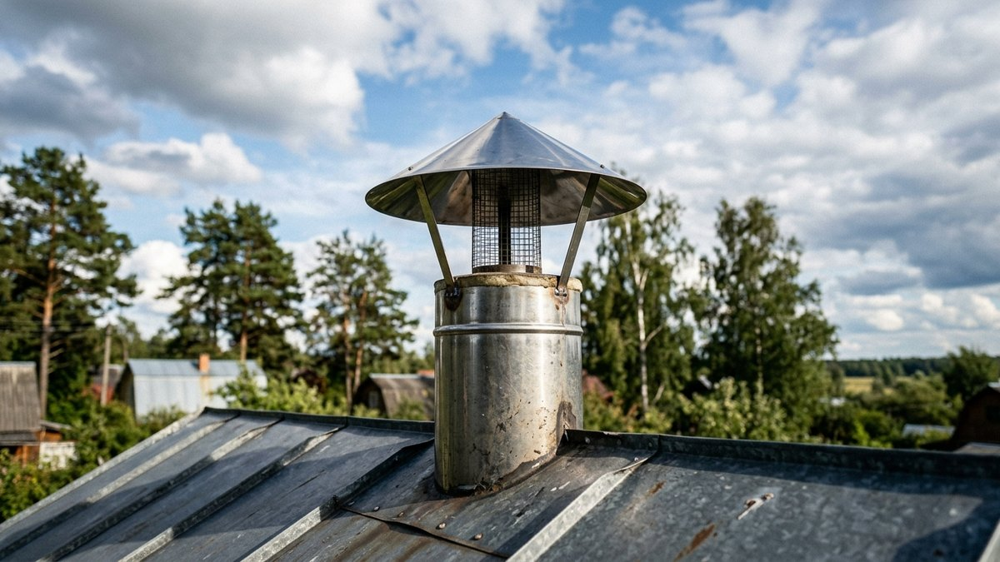
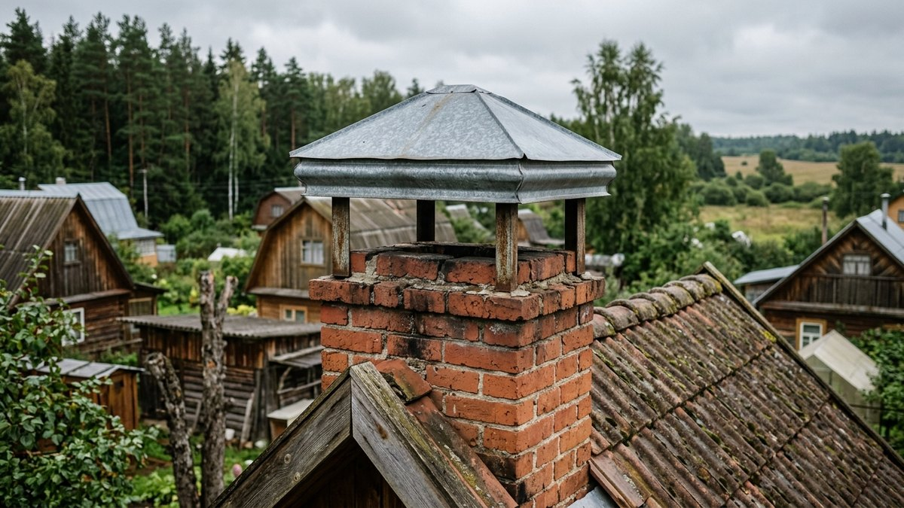
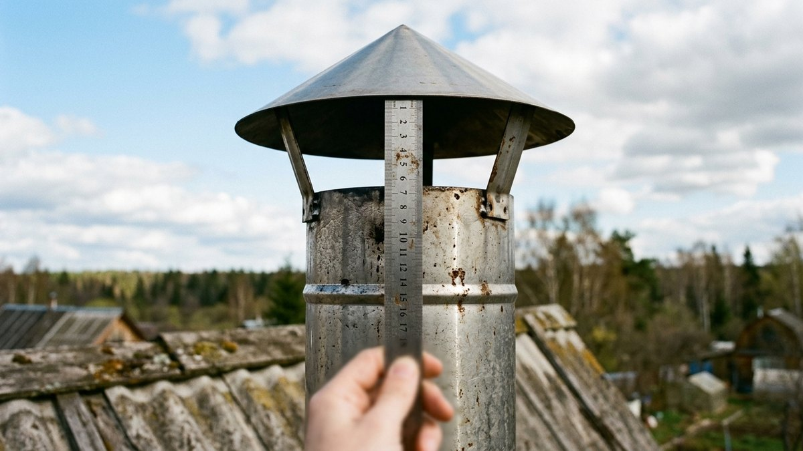
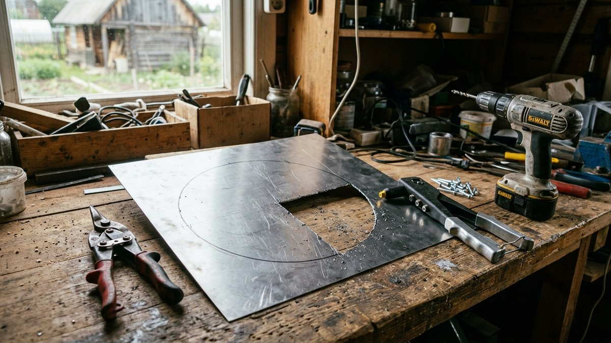
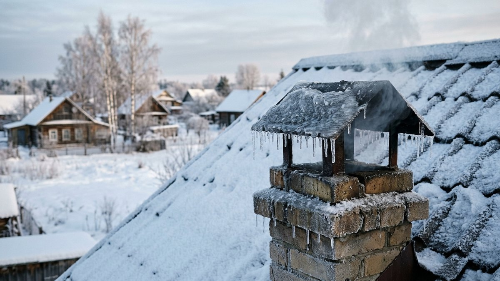
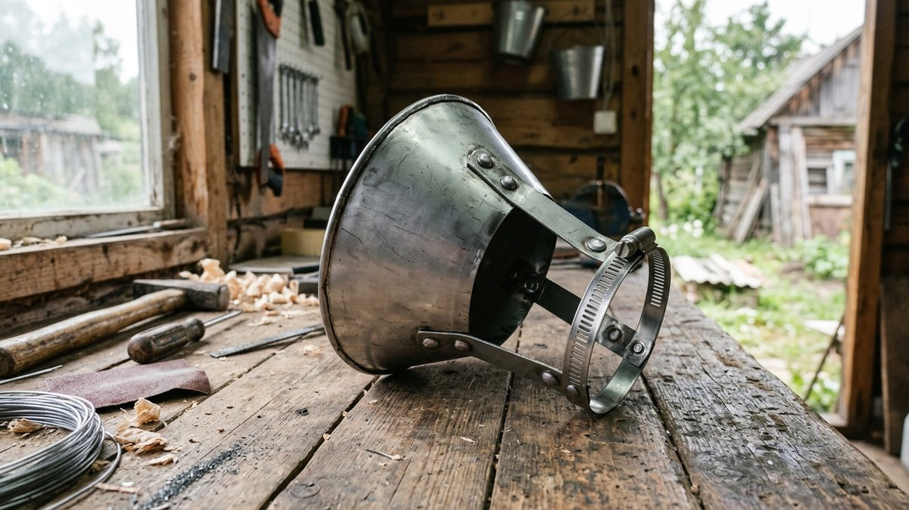

Колпак на трубу дымохода нужен не для красоты. Дождь и снег, попадающие
в открытую трубу, за несколько лет разрушают кирпич оголовка, а в
стальной трубе дают ржавчину и чёрные потёки конденсата по стене. Но
неправильный колпак хуже, чем никакого: опущенный слишком низко, он душит
тягу, а зимой обрастает льдом и закрывает трубу почти полностью. Разберём,
какой колпак подходит для круглой стальной трубы и для кирпичной, на какой
высоте его ставить, где колпак ставить нельзя. Если хотите сделать зонт
сами, калькулятор ниже посчитает под ваш диаметр выкройку конуса, зазор
и длину ножек.

## Зачем нужен колпак и когда без него можно

Что даёт колпак:

- **защиту от осадков.** Вода в трубе — это мокрая сажа, которая плохо
  горит и забивает дымоход, замерзание воды в швах кирпичной кладки
  и коррозия стальной трубы изнутри;
- **защиту от птиц и листьев.** Гнездо в неработающем летом дымоходе —
  частая причина обратной тяги при первой осенней топке;
- **меньше задувания.** Порыв ветра сверху загоняет дым обратно в печь,
  колпак частично от этого прикрывает.

Без колпака обходятся, когда у трубы есть другая защита: заводской
оголовок с конденсатоотводом на сэндвич-трубе, искрогаситель с крышкой
на бане или бетонная плита-капельник с боковыми продухами на кирпичной
трубе. Колпак в этих случаях просто дублирует защиту.

**Где колпак ставить нельзя или только по проекту:** на дымоходах газовых
котлов и колонок. Для газа действуют отдельные нормы, конструкция
оголовка задаётся проектом и проверяется газовой службой — самодельный
зонт там может стать причиной отказа в пуске газа и опасного опрокидывания
тяги. Всё, что ниже, — про печи, камины, банные печи и твердотопливные
котлы.

## Колпак, зонт, дефлектор, флюгарка: в чём разница

| Вид | Как устроен | Что даёт | Для чего |
|---|---|---|---|
| Зонт (конус) | Конус на 3–4 ножках над срезом трубы | Защита от осадков | Круглые стальные трубы, бани |
| Колпак-домик | Двускатная или четырёхскатная крышка на стойках | Защита от осадков, вид | Кирпичные трубы |
| Дефлектор (ЦАГИ и др.) | Цилиндр-обечайка вокруг зонта | Усиливает тягу при ветре | Трубы в «ветровой тени», вентиляция |
| Флюгарка | Поворотный козырёк, разворачивается от ветра | Защита от задувания | Трубы на ветреных местах |
| Колпак-искрогаситель | Зонт + сетка | Гасит искры | Бани, печи рядом с горючей кровлей |

Для дачной печи или камина почти всегда достаточно обычного зонта или
колпака-домика. Дефлектор нужен, когда тяга плохая из-за ветра или соседних
высоких деревьев и конька, а не из-за ошибок в высоте трубы. Если искры
летят на кровлю или траву, нужен искрогаситель — как подобрать сетку
и колпак к нему, разобрано в статье про
[искрогаситель на дымоход](https://mir-doma.pro/iskrogasitel-na-dymokhod-dlya-bani/).

## Размеры: как поставить колпак, чтобы не пропала тяга

Главное правило — площадь, через которую выходит дым под колпаком, должна
быть не меньше сечения трубы с запасом. Для круглой трубы это даёт простые
ориентиры:

- **зазор от среза трубы до нижнего края колпака** — от 0,5 до 1 диаметра
  трубы. Для трубы 150 мм это 75–150 мм. Меньше — тяга падает, больше —
  косой дождь задувает под колпак;
- **диаметр зонта** — в 1,6–2 раза больше диаметра трубы, чтобы капли
  с края падали мимо среза;
- **угол ската конуса** — 30–45° к горизонтали. Положе 30° снег держится
  на зонте, круче 45° зонт получается высоким и парусит;
- **ножки** — 3–4 полосы шириной 20–25 мм из той же стали, крепление
  хомутом или заклёпками к трубе, не к зонту изнутри трубы.

Для кирпичной трубы:

- **свес колпака за кладку** — 5–10 см с каждой стороны;
- **подъём над оголовком** — не меньше ширины дымового канала. Для
  канала 140×140 мм — от 15 см, для 140×270 мм — от 20–27 см;
- **оголовок кладки** сверху закрывают цементной стяжкой с уклоном
  от канала или бетонной плитой-капельником, иначе вода будет течь
  по стенкам трубы под колпаком.

## Калькулятор зонта на круглую трубу

Введите внутренний диаметр трубы и угол ската. Калькулятор посчитает
диаметр зонта, зазор над срезом, выкройку конуса из листа (радиус
и угол выреза) и длину ножек.

<!-- wp:html -->

  
Калькулятор зонта на дымоход

  <label class="md-calc__label" for="mdKdD">Диаметр трубы, мм</label>
  <input type="number" id="mdKdD" class="md-calc__input" min="80" step="5" value="150">
  <label class="md-calc__label" for="mdKdA">Угол ската конуса</label>
  <select id="mdKdA" class="md-calc__input">
    <option value="30">30° — низкий, неприметный</option>
    <option value="35" selected>35° — универсальный</option>
    <option value="45">45° — снежный регион</option>
  </select>
  <label class="md-calc__label" for="mdKdK">Во сколько раз зонт шире трубы</label>
  <select id="mdKdK" class="md-calc__input">
    <option value="1.6">1,6 — тихое место</option>
    <option value="1.8" selected>1,8 — обычно</option>
    <option value="2">2 — ветрено, косой дождь</option>
  </select>
  
Заполните поля

<!-- /wp:html -->

Пример для трубы 150 мм при скате 35° и зонте в 1,8 раза шире трубы:
зонт 270 мм, зазор около 110 мм, выкройка — круг радиусом примерно 165 мм
с вырезанным сектором около 65°. Площадь выхода дыма при таком зазоре
втрое больше сечения трубы, тяга не страдает.

## Из чего делать колпак

| Материал | Толщина | Срок | Комментарий |
|---|---|---|---|
| Нержавеющая сталь AISI 304 или 321 | 0,5–0,8 мм | 15–25 лет | Лучший выбор для дров и угля, не боится кислого конденсата |
| Нержавейка AISI 430 | 0,5 мм | 7–10 лет | Дешевле, хуже держит конденсат |
| Оцинкованная сталь | 0,5–0,7 мм | 3–7 лет над топкой на дровах | Цинк выгорает от горячих газов, подходит для вентиляции и колпака-домика над кирпичом |
| Медь | 0,6–0,8 мм | 50+ лет | Дорого, темнеет, красиво на кирпичной трубе |
| Окрашенный металл, профнастил | 0,5 мм | Короткий | Краска над дымом выгорает, для дымохода не годится |

Для круглой стальной трубы дымохода берите нержавейку той же марки, что
и сама труба. Если вы ещё выбираете саму трубу — сэндвич или нержавейку,
диаметр и высоту над кровлей, это разобрано в статье о том,
[какой дымоход лучше для бани](https://mir-doma.pro/kakoy-dymokhod-luchshe-dlya-bani/):
правила те же для любой дровяной печи.

## Как сделать зонт на трубу своими руками: по шагам

Инструмент: ножницы по металлу, дрель, заклёпочник, маркер, циркуль или
шнур, молоток и киянка, перчатки. Материал: лист нержавейки 0,5 мм,
полоса на ножки, хомут под диаметр трубы, заклёпки из нержавейки.

1. **Посчитайте размеры** в калькуляторе и начертите на листе круг
   выкройки. Отметьте сектор под вырез и полосу 20 мм на нахлёст.
2. **Вырежьте заготовку** ножницами по металлу. Края зачистите напильником,
   иначе порежетесь при сборке.
3. **Сверните конус** по шву с нахлёстом и скрепите 3–4 заклёпками. Если
   нужен, отогните по краю капельник 5–10 мм вниз — с него вода падает
   дальше от трубы.
4. **Нарежьте ножки** нужной длины, загните концы: один под зонт,
   другой под хомут.
5. **Приклепайте ножки** к зонту изнутри, равномерно по кругу.
6. **Закрепите на хомуте** и проверьте на земле: наденьте на обрезок трубы
   и замерьте зазор.
7. **Установите на трубу** в сухую безветренную погоду, со страховкой.
   Хомут — на внешнюю трубу сэндвича или на саму трубу, не изнутри.

## Колпак зимой: что делать со льдом

Колпак — самое холодное место дымохода. Влажный дым на нём конденсируется
и замерзает, особенно у печей, которые топят влажными дровами или
держат на тлении. Через неделю морозов под зонтом может нарасти лёд,
закрывающий половину зазора: тяга падает, дым идёт в дом.

Что помогает:

- **сухие дрова** — влажность ниже 20 %, тогда пара в дыме меньше. Сколько
  дров нужно на сезон и как их хранить, чтобы просохли, разобрано в статье
  [сколько дров нужно на зиму](https://mir-doma.pro/skolko-drov-nuzhno-na-zimu/);
- **утеплённая труба** выше кровли — сэндвич до самого оголовка, а не
  одностенная труба последние полметра;
- **увеличенный зазор**, ближе к 1 диаметру трубы;
- **зонт без сетки** или с крупной ячейкой: мелкая сетка обмерзает первой;
- **осмотр после сильных морозов**: если на колпаке сосульки и наледь,
  сбейте её, а в следующий сезон увеличьте зазор.

## Частые ошибки

- **Колпак ниже половины диаметра над срезом.** Тяга падает, печь
  начинает дымить при открывании дверцы.
- **Оцинковка над дровяной печью.** Цинк выгорает за пару сезонов,
  колпак ржавеет и даёт рыжие потёки по кровле.
- **Колпак на газовом дымоходе без проекта.** Для газа — только по
  требованиям газовой службы.
- **Сетка с ячейкой 5 мм «от птиц».** Забивается сажей и обмерзает. Если
  нужна защита от птиц, ячейка 10–15 мм, а от искр — отдельный
  искрогаситель.
- **Кирпичный оголовок без стяжки.** Колпак сверху есть, а вода всё равно
  течёт по кладке и разрушает швы.
- **Крепление колпака внутрь трубы.** Ножки внутри сужают сечение и
  собирают сажу. Хомут — снаружи.

## Частые вопросы

### Нужен ли колпак на трубу дымохода

На трубе дровяной печи, камина или бани — желательно: он защищает от
дождя, снега, птиц и листьев. Если у трубы уже есть заводской оголовок
или искрогаситель с крышкой, отдельный колпак не нужен. На газовых
дымоходах — только по проекту.

### На каком расстоянии от трубы ставить колпак

Нижний край колпака — на высоте от 0,5 до 1 диаметра трубы над срезом.
Для трубы 115 мм это 60–115 мм, для 150 мм — 75–150 мм. На кирпичной
трубе подъём не меньше ширины дымового канала.

### Влияет ли колпак на тягу

Правильно установленный — почти нет. Если колпак опущен ниже половины
диаметра или под ним намёрз лёд, тяга падает. Дефлектор при ветре,
наоборот, немного её усиливает.

### Какой колпак лучше на кирпичную трубу

Колпак-домик из нержавейки или меди со свесом 5–10 см за кладку, на
стойках высотой не меньше ширины канала. Под ним оголовок закрывают
стяжкой с уклоном или бетонной плитой-капельником.

### Как сделать колпак на трубу своими руками

Вырежьте из нержавейки круг нужного радиуса, удалите сектор, сверните
конус и скрепите заклёпками. Приклепайте 3–4 ножки и закрепите их на
хомуте снаружи трубы. Размеры под ваш диаметр считает калькулятор в статье.
