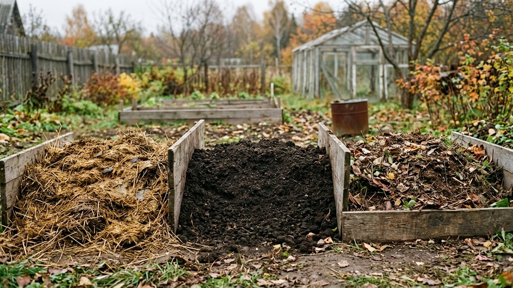
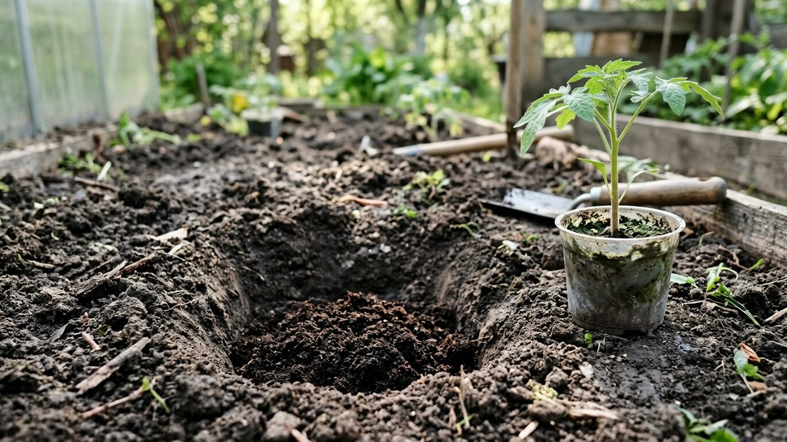
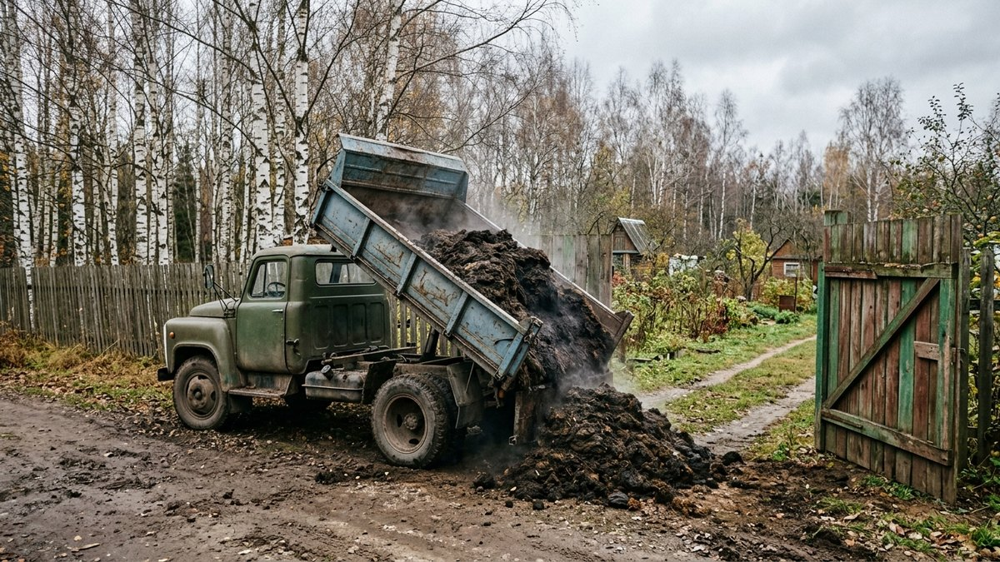
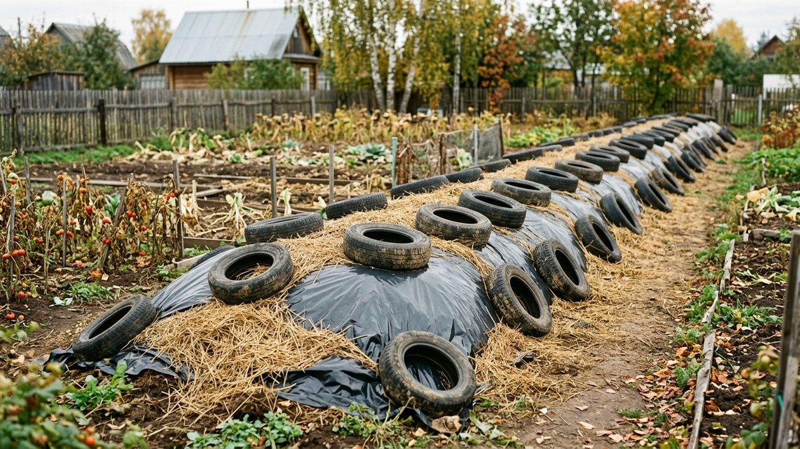
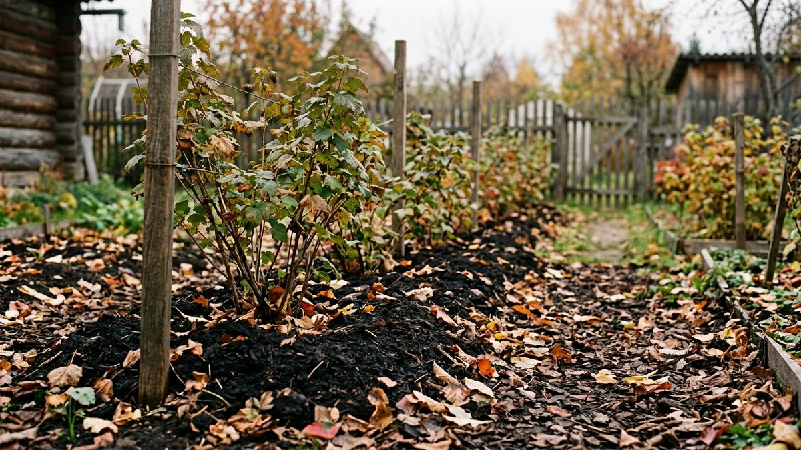
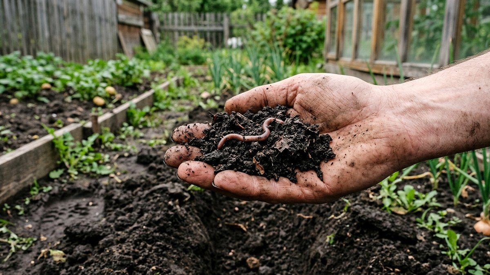

Компост и перегной в чём разница — вопрос, который возникает каждый раз,
когда на дачу привозят машину «чернозёма» или «перепревшего навоза» и
непонятно, что именно купили и куда это класть. Коротко: навоз — сырьё,
перегной — тот же навоз через 2–3 года, компост — перепревшие растительные
остатки, иногда с навозом. Разница не в названии, а в том, что каждое из
них можно делать без вреда для растений. Ниже — сравнительная таблица,
что лучше под каждую задачу, дозы на квадратный метр, как проверить
готовность руками и калькулятор, сколько заказывать тонн и кубов на ваш
огород.

## Навоз, перегной и компост: главное отличие

**Навоз** — экскременты животных вместе с подстилкой. Свежий навоз
горячий: в нём много аммиачного азота, семена сорняков, яйца гельминтов,
он греется в куче до 60–70 °C. Под корни его класть нельзя, только
осенью под перекопку или в основание тёплой грядки.

**Перегной** — навоз, который пролежал в куче 2–3 года и полностью
разложился. Объём уменьшился примерно вдвое, исчезли запах и солома,
получилась однородная рыхлая тёмная масса. Это уже безопасное удобрение:
его можно в лунки, под рассаду и в мульчу.

**Компост** — продукт разложения растительных остатков: травы, ботвы,
листьев, кухонных очисток, опилок. Навоз или помёт в компост добавляют
как ускоритель, но основа — растительная. Созревает от 3–4 месяцев
в горячей куче до 1–2 лет в обычной.

| | Свежий навоз | Перегной | Компост |
|---|---|---|---|
| Из чего | Экскременты + подстилка | Навоз через 2–3 года | Растительные остатки ± навоз |
| Вид и запах | Солома видна, резкий запах аммиака | Тёмный, рассыпчатый, пахнет землёй | Тёмный или коричневый, местами видны кусочки веток, пахнет лесом |
| Азот, % (ориентир) | 0,5–0,6 (КРС) | 0,5–1 | 0,5–1,5 |
| Опасность для корней | Высокая, обжигает | Нет | Нет, если дозрел |
| Семена сорняков | Много | Почти нет | Зависит от того, как грелась куча |
| Когда вносить | Осенью под перекопку | Весной и осенью, в лунки | В любое время, мульча |
| Цена | Самый дешёвый | Самый дорогой | Бесплатно, если свой |

Всё, что продают как «перегной» с видимой соломой и запахом, — навоз
возрастом в один сезон. Пользоваться им можно, но как навозом: осенью,
а не весной в лунку.

## Что лучше для огорода: под какую задачу

Спор «перегной или компост» не имеет смысла без задачи. Ответ зависит
от того, куда и когда вносить:

| Задача | Что лучше | Почему |
|---|---|---|
| Осенняя заправка пустых грядок | Свежий или полуперепревший навоз | За зиму перепреет в почве, а стоит в 2–3 раза дешевле перегноя |
| Тёплая грядка, парник | Свежий навоз, лучше конский | Греется сам, даёт тепло корням ранней весной |
| Весной в лунки томатов, огурцов, капусты | Перегной | Готовое безопасное питание прямо у корней |
| Рассадная земля | Просеянный перегной или зрелый компост, 1 часть на 2–3 части земли | Чистые от патогенов при правильном созревании |
| Мульча под ягодники и деревья | Компост | Улучшает структуру, кормит червей, не обжигает |
| Тяжёлая глина | Компост с опилками, листовой компост | Разрыхляет надолго, азота немного |
| Песчаная почва | Перегной | Держит воду и питание |
| Морковь, свёкла, лук | Перегной под предшественника, а под них — ничего свежего | От свежей органики корнеплоды ветвятся |

Если бюджет ограничен, рабочая схема такая: навоз осенью на освободившиеся
грядки, свой компост весь сезон в мульчу, а перегной покупать только для
лунок и рассады. Так покупной перегной уходит туда, где без него не
обойтись.

## Как проверить, что перегной и компост готовы

Готовность проверяют руками и носом, лаборатория не нужна:

- **Запах.** Готовая органика пахнет лесной землёй. Аммиак, тухлятина
  или кислый запах — процесс не закончен.
- **Структура.** Сожмите горсть: готовый перегной рассыпается, не мажется
  и не тянется волокнами. Видимая солома или целые листья — рано.
- **Температура.** Засуньте руку в середину кучи. Если там теплее, чем
  снаружи, разложение ещё идёт.
- **Кресс-салатный тест.** В стаканчик с органикой посейте кресс-салат
  или редис, в контрольный — покупной грунт. Если через 5–7 дней всходы
  одинаковые, органика готова; если пожелтели или не взошли — нет.

Как ускорить созревание своей кучи и сколько нужно зелёного и коричневого
материала, разобрано в статье про [компост осенью](https://mir-doma.pro/kak-uskorit-sozrevanie-komposta-osenyu/),
а устройство самой ямы или ящика — в статье про
[компостную яму своими руками](https://mir-doma.pro/kompostnaya-yama-svoimi-rukami/).

## Сколько вносить: дозы на м²

| Органика | Под перекопку | В лунку | Мульча |
|---|---|---|---|
| Свежий навоз КРС | 4–6 кг/м², только осенью, раз в 2–3 года | Нельзя | Нельзя |
| Конский навоз | 3–5 кг/м², осенью | Нельзя | Нельзя |
| Перегной | 4–8 кг/м² (около ведра) | 1–2 горсти, 0,5–1 кг | Слой 2–3 см |
| Компост | 3–6 кг/м² | 1–2 горсти | Слой 3–5 см |
| Куриный помёт | 0,5–1 кг/м², осенью | Только гранулы | Нельзя |

Перевод в привычные меры:

- **ведро 10 л перегноя или компоста** весит 6–8 кг;
- **ведро свежего навоза с подстилкой** — около 7–8 кг;
- **кубометр** перегноя — около 0,6–0,8 т, навоза с подстилкой — 0,7–0,8 т.

Больше 10 кг перегноя на метр не дают: избыток азота уходит в нитраты,
а фосфор копится годами. Помёт втрое сильнее навоза, его дозы отдельно —
в статье про [куриный помёт как удобрение](https://mir-doma.pro/kurinyy-pomet-kak-udobrenie/).

## Калькулятор: сколько органики заказать

Введите площадь, которую хотите заправить, и выберите вид органики.
Калькулятор посчитает, сколько килограммов, тонн, кубометров и вёдер нужно
по дозам из таблицы. Продавцы привозят и по тоннам, и по кубам — сверяйте
единицы при заказе.

<!-- wp:html -->

  
Калькулятор органики для огорода

  <label class="md-calc__label" for="mdOrgT">Что вносите</label>
  <select id="mdOrgT" class="md-calc__input">
    <option value="navoz">Свежий навоз КРС (осенью)</option>
    <option value="kon">Конский навоз (осенью)</option>
    <option value="peregnoy">Перегной</option>
    <option value="kompost">Компост</option>
  </select>
  <label class="md-calc__label" for="mdOrgA">Площадь грядок, м²</label>
  <input type="number" id="mdOrgA" class="md-calc__input" min="0" step="1" value="100">
  <label class="md-calc__label" for="mdOrgS">Почва</label>
  <select id="mdOrgS" class="md-calc__input">
    <option value="mid">Обычный суглинок</option>
    <option value="poor">Песок или бедная почва — верхняя граница</option>
    <option value="rich">Ухоженная, удобрялась каждый год — нижняя граница</option>
  </select>
  
Заполните поля

<!-- /wp:html -->

## Как не купить навоз под видом перегноя

Перегной стоит в 2–3 раза дороже навоза, поэтому подмена — обычное дело.
Перед оплатой:

1. **Попросите раскопать кучу** или кузов на глубину лопаты. Сверху
   органика подсыхает и выглядит готовой, внутри может быть свежий навоз.
2. **Посмотрите на солому и опилки.** В перегное их не видно. Если
   волокна целые — материалу один-два сезона.
3. **Понюхайте.** Аммиак и запах фермы — это навоз.
4. **Спросите возраст.** «Прошлогодний» — это навоз. Перегной — от двух
   лет, и честные продавцы так и пишут.
5. **Смотрите на объём.** Если продают «машину перегноя» по цене навоза,
   скорее всего это навоз.

Если всё же привезли полуперепревший навоз, ничего страшного: используйте
его осенью под перекопку или сложите в бурты, укройте плёнкой и через
год он будет перегноем.

## Как хранить навоз, чтобы он стал перегноем

- **Бурт на ровном месте**, шириной 1,5–2 м и высотой до 1–1,5 м.
  Выше — середина задыхается и закисает.
- **Перекладка землёй или торфом** слоями по 20–30 см уменьшает потерю
  азота.
- **Укрытие** плёнкой или шифером от дождя: иначе питательные вещества
  вымываются в землю под буртом.
- **Перелопачивание** раз в сезон ускоряет созревание.
- **Не у забора соседа и не у колодца**: стоки из кучи — это аммиак и
  нитраты.

## Навоз, перегной, компост и кислотность почвы

Органика немного подкисляет почву при разложении, но не настолько, чтобы
отказываться от неё на кислых участках. Известь и навоз только не вносят
одновременно: азот улетает аммиаком. Схема — известь осенью, органику
весной, или наоборот. Как определить кислотность и сколько извести
нужно, разобрано в статье про
[известкование почвы осенью](https://mir-doma.pro/izvestkovanie-pochvy-osenyu/).

Если органики не хватает, часть работы сделают сидераты: горчица или рожь,
посеянные осенью, весной заделываются в почву и дают ту же структуру без
покупного перегноя. Что и когда сеять — в статье про
[сидераты осенью](https://mir-doma.pro/sideraty-osenyu/).

## Частые ошибки

- **Свежий навоз в лунку весной.** Ожог корней и вспышка сорняков. Свежий —
  только осенью.
- **Перегной под морковь и лук каждый год.** Ботва мощная, корнеплод
  ветвистый, лук не вызревает. Под эти культуры органику вносят под
  предшественника.
- **Органика на поверхности на всю зиму.** Азот улетает и смывается.
  Заделывайте в почву сразу или укрывайте.
- **Огромные дозы «чтобы надолго».** Больше 10 кг/м² — не запас, а
  нитраты и засоление.
- **Компост с больной ботвой.** Фитофторная ботва томатов и картофеля
  в обычной холодной куче не обеззараживается. Её сжигают или кладут
  в горячий компост.
- **Навоз вместе с золой или известью.** Потеря азота. Разносите по сезонам.

## Частые вопросы

### Компост и перегной: в чём разница

Перегной — полностью перепревший навоз, ему 2–3 года. Компост —
перепревшие растительные остатки, иногда с добавкой навоза. По действию
они близки: оба безопасны для корней, улучшают структуру почвы. Перегной
обычно богаче азотом, компост дешевле, потому что делается из своих
отходов.

### Что лучше для огорода: перегной или навоз

Для весенней посадки — перегной: его кладут прямо в лунки. Для осенней
заправки пустых грядок — навоз: за зиму он перепреет в почве, а стоит
в 2–3 раза дешевле. Под тёплые грядки — только свежий навоз, перегной
не греется.

### Можно ли вносить перегной осенью

Да. Перегной вносят и осенью, и весной: 4–8 кг на 1 м² под перекопку.
Осенью удобнее, если весной не хватит времени, но часть азота за зиму
уйдёт с талой водой, поэтому на песчаных почвах лучше весной.

### Сколько лет перегнивает навоз

В обычном бурте — 2–3 года до полноценного перегноя. Если перекладывать
кучу, увлажнять и укрывать, срок сокращается до 1–1,5 года. Свежий навоз
через год — уже не свежий, но ещё не перегной: его можно вносить осенью
под перекопку.

### Чем компост лучше навоза

Компост не обжигает корни, почти не содержит семян сорняков при горячем
созревании, бесплатен и подходит для мульчи. Навоз дешевле перегноя и
богаче азотом, но требует выдержки или осеннего внесения.
