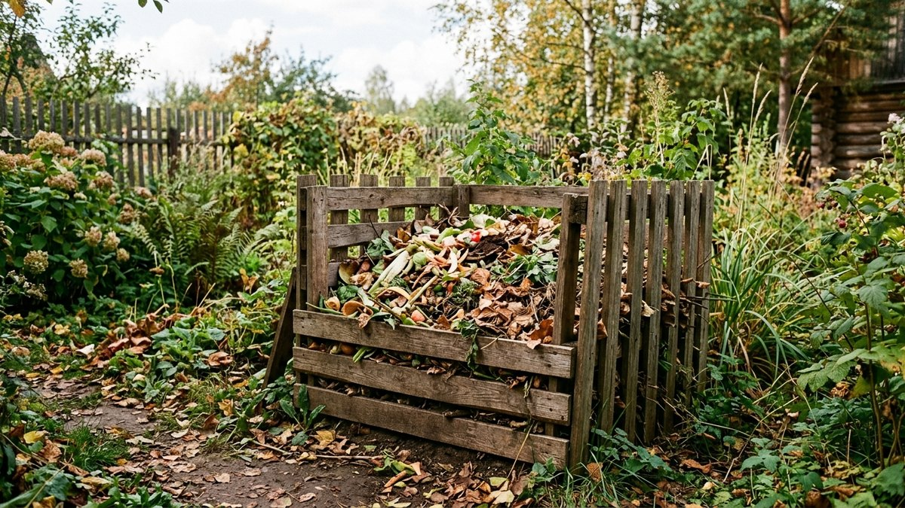
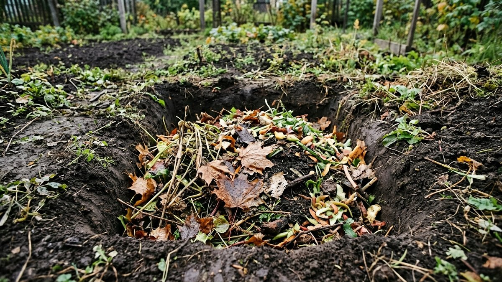
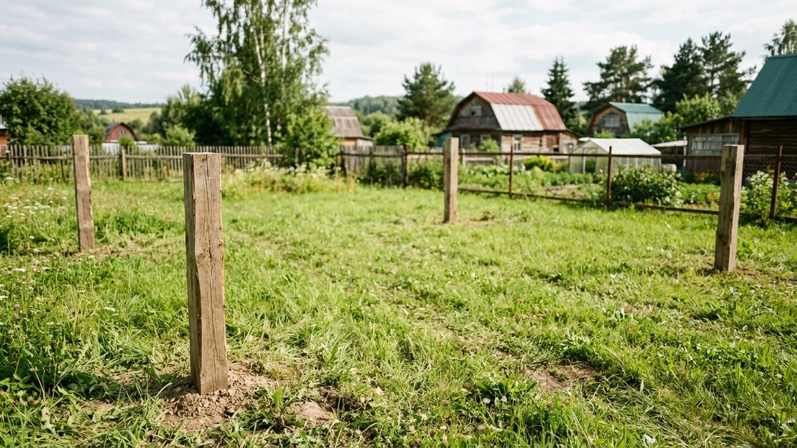
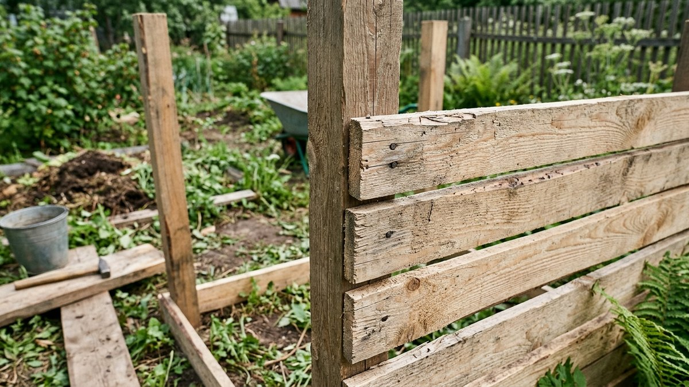
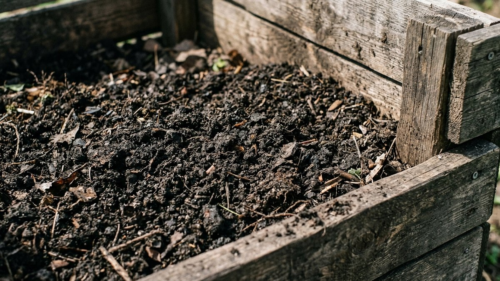
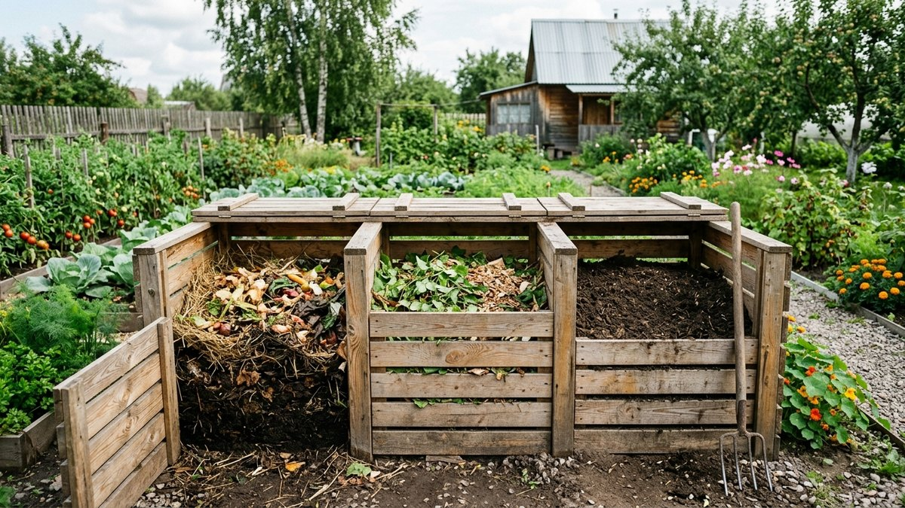

Эта статья не про то, как ускорить созревание компоста, — про то, куда его вообще складывать. Правильно устроенная компостная яма или короб решает половину задачи ещё до того, как в неё попадут первые растительные остатки: неправильное место или герметичная конструкция без доступа воздуха превращают компост в гниющую кучу с запахом вместо рыхлого удобрения. Разберём, где разместить, что выбрать — яму или короб, и как собрать короб из досок своими руками.

## Где разместить компостную яму

- **Расстояние от дома и скважины** — не менее 8 метров от жилых построек и не менее 15–20 метров от источника питьевой воды (скважины, колодца), чтобы продукты разложения не попадали в грунтовые воды.
- **От забора и соседей** — не менее 1 метра, а лучше согласовать место, если участок компактный, — запах при правильном компостировании минимален, но не нулевой.
- **Освещение** — частичная тень предпочтительнее прямого солнца весь день: куча на солнцепёке пересыхает и разложение замедляется, в глухой тени — переувлажняется.
- **Доступ** — место должно быть удобно для подъезда тачки с растительными остатками и для того, чтобы периодически ворошить и вынимать готовый компост.

## Яма или короб: что выбрать

**Яма в грунте** — самый простой вариант: выкопать углубление 50–70 см и складывать отходы туда. Плюс — не требует материалов и времени на постройку. Минусы — хуже аэрация (воздух хуже проникает вглубь), неудобно ворошить содержимое, а вынимать готовый компост снизу почти невозможно без разбора всей кучи сверху.

**Короб (ящик)** — конструкция из досок, шифера или сетки, установленная на поверхности земли. Даёт лучшую вентиляцию по бокам, удобный доступ для ворошения и выгрузки готового компоста, а при секционной конструкции позволяет держать одновременно свежие отходы, дозревающий и готовый компост раздельно. Для большинства участков короб — более практичный вариант, и дальше разберём именно его сборку.

## Из чего строить короб

- **Доски** — самый распространённый и простой в работе материал, с зазорами между досками для вентиляции.
- **Шифер** — долговечнее дерева, не гниёт, но хуже пропускает воздух — обязательно оставлять зазоры или отверстия.
- **Деревянные поддоны (паллеты)** — готовое решение: щели между досками паллеты уже обеспечивают вентиляцию, а сама конструкция быстро собирается скреплением 3–4 поддонов по периметру.
- **Сетка (рабица) на каркасе** — самый дешёвый и хорошо проветриваемый вариант, но требует отдельного каркаса из бруса или труб для жёсткости.

## Размеры и секции

Одна секция компостного короба обычно делается объёмом 1–1,5 м³ — например, 1×1×1,2 м. Этого достаточно для куста среднего дачного участка, а компост в такой куче хорошо разогревается и вызревает равномерно; более крупные кучи хуже прогреваются в середине, более мелкие — быстро пересыхают по краям.

Практичнее делать не одну секцию, а две-три в ряд: в одну складывают свежие отходы, во второй компост дозревает, из третьей уже можно брать готовый. Это позволяет использовать компост без остановки цикла закладки новых отходов.

## Пошаговая сборка короба из досок

1. Разметить и вкопать четыре угловых столба (деревянный брус или металлические трубы) на глубину 40–50 см для устойчивости.
2. Прибить или прикрутить доски к столбам с зазором 1,5–2 см между досками по всему периметру — зазор обеспечивает приток воздуха.
3. Одну сторону (обычно переднюю) сделать съёмной — из досок, вставляемых в пазы, или на петлях как дверцу, — чтобы удобно вынимать готовый компост снизу и ворошить содержимое.
4. Дно короба не заделывать полностью — компост должен контактировать с землёй: снизу в него заходят дождевые черви и микроорганизмы, а лишняя влага уходит в грунт, не застаиваясь.
5. При многосекционной конструкции — повторить для соседних отделений, используя общие боковые стенки между секциями.

## Вентиляция и баланс отходов

Хорошая вентиляция короба — только половина дела: важен и баланс закладываемых остатков, иначе даже проветриваемый короб превращается в вонючую слизистую массу. Приёмы, которые реально ускоряют созревание, и баланс «зелёных» и «коричневых» отходов подробно разобраны в статье [«Как ускорить созревание компоста осенью»](https://mir-doma.pro/kak-uskorit-sozrevanie-komposta-osenyu/) — она пригодится сразу после того, как короб будет готов.

## Частые ошибки

- **Делать герметичный ящик без зазоров.** Без доступа воздуха отходы гниют и воняют вместо того, чтобы компостироваться.
- **Бетонировать или застилать дно полностью.** Компост должен контактировать с землёй — без этого в него не попадают нужные микроорганизмы и черви, а влага застаивается.
- **Ставить слишком близко к скважине или дому.** Нарушает санитарные нормы и рискует испортить воду в источнике.
- **Ограничиваться одной секцией.** Без второй-третьей секции приходится останавливать закладку новых отходов, пока не будет выбран весь готовый компост.
- **Ставить на открытом солнце весь день.** Куча пересыхает, и разложение резко замедляется.

## Частые вопросы

### На каком расстоянии от дома делать компостную яму?

Не менее 8 метров от жилых построек и не менее 15–20 метров от скважины или колодца — это защищает источник питьевой воды от продуктов разложения.

### Что лучше — яма в грунте или короб?

Короб практичнее для большинства участков: лучше вентиляция, удобнее ворошить содержимое и выгружать готовый компост. Яма в грунте проще в исполнении, но хуже во всём остальном.

### Нужно ли делать дно у компостного короба?

Нет, дно оставляют открытым — компост должен контактировать с землёй для доступа микроорганизмов и червей и для отвода лишней влаги в грунт.

### Сколько секций нужно для компостного короба?

Оптимально две-три: пока в одной созревает компост, в другую уже закладывают свежие отходы, а из третьей можно брать готовое удобрение — цикл не прерывается.

### Из чего лучше построить компостный короб?

Доски — самый простой и доступный вариант с естественной вентиляцией через зазоры. Поддоны собираются ещё быстрее, шифер долговечнее, но требует дополнительных отверстий для воздуха.
