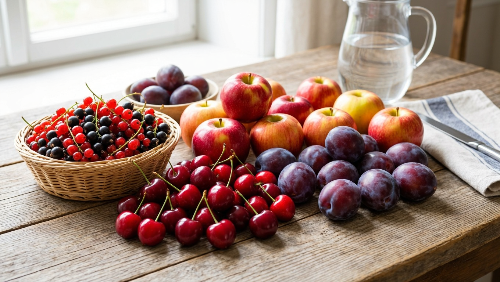
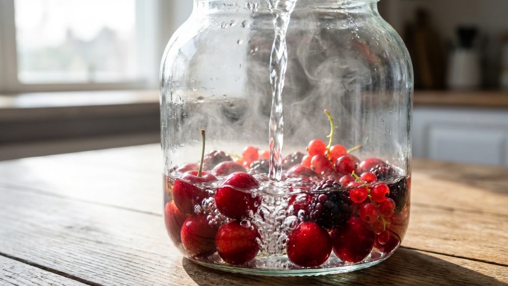
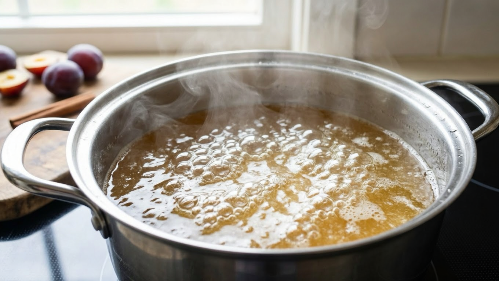
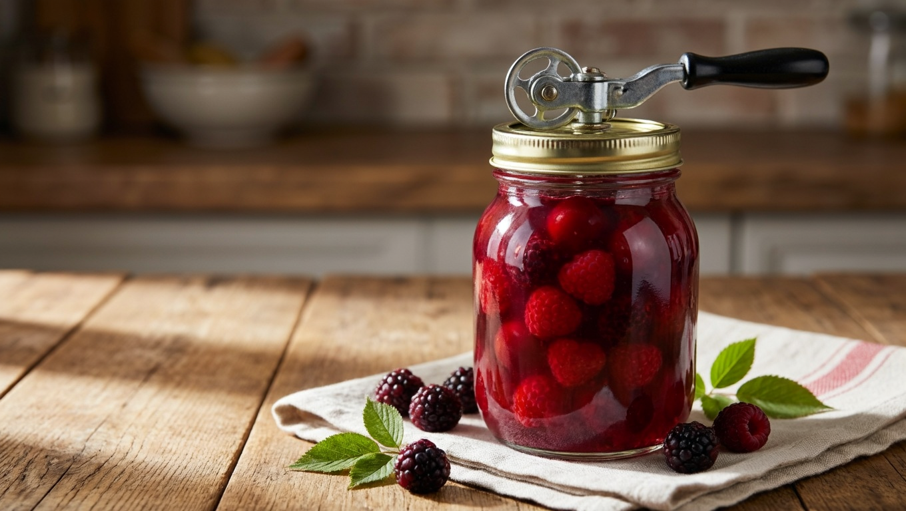
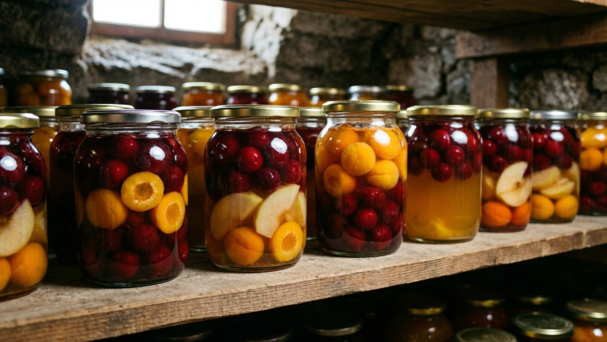

Домашний компот на зиму — это вкус лета в банке и полезная альтернатива магазинным сокам без лишней химии. А главное — готовить его проще всех заготовок: не нужно ни варить часами, ни стерилизовать банки в кастрюле. Освоив один базовый принцип, вы сможете закрыть компот из любых ягод и фруктов. Разберём, как сварить компот на зиму без стерилизации, в каких пропорциях брать сахар и что учесть для разных плодов.

## 🍇 Из чего варят компот

Компот закрывают практически из всего, что созрело на участке и в саду:

- **ягоды** — смородина, малина, вишня, клубника, крыжовник, ирга;
- **фрукты** — яблоки, груши, сливы, абрикосы, персики;
- **ассорти** — смесь ягод и фруктов даёт самый интересный вкус;
- **экзотика и добавки** — виноград, арбуз, а для аромата — мята, лимон, специи.

Плоды берут спелые, но плотные, без гнили и повреждений. Кислые ягоды (смородина, вишня) дают яркий насыщенный компот, сладкие фрукты (груши, абрикосы) — мягкий; их часто комбинируют, чтобы сбалансировать вкус.

## 💧 Базовый принцип: тройная заливка

Секрет компота без стерилизации — метод **горячей заливки**. Плоды не варят, а несколько раз заливают кипятком и сиропом прямо в банке — этого достаточно, чтобы компот хранился всю зиму. Общий алгоритм:

1. **Подготовить банки.** Вымыть и простерилизовать банки и крышки.
2. **Заложить плоды.** Наполнить банку ягодами или фруктами на 1/3 (для насыщенного) или меньше (для лёгкого компота).
3. **Первая заливка.** Залить крутым кипятком до краёв, накрыть крышкой и дать постоять 10–15 минут — плоды прогреются.
4. **Слить и сварить сироп.** Слить воду в кастрюлю, добавить сахар, довести до кипения.
5. **Вторая заливка.** Залить плоды кипящим сиропом, закатать, перевернуть и укутать до остывания.

Для более надёжного результата (крупные или плотные фрукты, тёплое хранение) делают **тройную заливку** — кипятком дважды и сиропом в третий раз. Многократная горячая заливка прогревает содержимое не хуже стерилизации.

## 🍬 Сколько сахара класть

Пропорции сахара — вопрос вкуса и кислоты плодов. Ориентир на **трёхлитровую банку**:

- **кислые ягоды и фрукты** (смородина, вишня, слива) — 250–350 г сахара;
- **сладкие** (груши, абрикосы, виноград) — 150–200 г;
- **среднее универсальное значение** — около 250 г (стакан) на 3 литра.

Компот получается концентрированным — зимой его при желании разбавляют водой. Поэтому сахар кладут по вкусу готового напитка, а не «залпом»: лучше попробовать сироп и отрегулировать.

## 🍎 Особенности для разных плодов

Базовый метод один, но нюансы есть:

- **Смородина, малина, клубника** — нежные, достаточно двойной заливки, чтобы не разварились.
- **Вишня** — можно с косточкой (ароматнее) или без (хранится дольше и безопаснее при длительном хранении).
- **Яблоки и груши** — плотные, лучше тройная заливка; крупные режут дольками, чтобы прогрелись.
- **Сливы, абрикосы** — прокалывают или закладывают целыми; из очень спелых компот получается мутноватым.
- **Виноград** — закрывают гроздьями или ягодами, отлично хранится.
- **Ассорти** — сочетают кислые и сладкие плоды, ориентируясь на общий баланс.

Кислоту и аромат добавляют долькой лимона, веточкой мяты или щепоткой лимонной кислоты — она же помогает компоту не забродить.

## 🫙 Как и сколько хранить

Компот, закрытый горячей заливкой в стерильные банки, хранится **до года** в тёмном прохладном месте — погребе, подвале или кладовке.

- банки и крышки обязательно стерилизовать, заливать кипятком и сиропом;
- закатанные банки перевернуть и укутать до полного остывания — это дополнительная «самостерилизация»;
- мутный компот или вздувшаяся крышка — признак нарушения технологии, такую банку не употребляют.

Общие правила хранения заготовок — в статье [как хранить овощи зимой](https://mir-doma.pro/kak-hranit-ovoshchi-zimoy/). А часть урожая ягод можно [заморозить](https://mir-doma.pro/chto-zamorozit-na-zimu/) — зимой из них тоже варят свежий компот.

## ❌ Частые ошибки

- **Плохо простерилизовали банки** — компот мутнеет, крышки вздуваются, заготовка портится.
- **Слишком короткая заливка** — плоды не прогрелись, для плотных фруктов нужна тройная заливка.
- **Переспелые или мятые плоды** — компот выходит мутным и хуже хранится; берут спелые, но плотные.
- **Косточковые на долгое хранение** — компот с косточками (вишня, слива) не хранят больше года: со временем в косточках накапливаются вредные вещества.
- **Не перевернули банки** — потеряли дополнительную «самостерилизацию» при остывании.
- **Мало сахара в некислом компоте** — пресный вкус; сладость и лёгкая кислинка балансируют напиток.

## ❓ Частые вопросы

**Как сварить компот на зиму без стерилизации?**
Заложить плоды в стерильную банку, залить кипятком на 10–15 минут, слить воду, сварить на ней сироп с сахаром и залить плоды кипящим сиропом, затем закатать. Для надёжности делают тройную заливку.

**Сколько сахара нужно на 3-литровую банку компота?**
В среднем около 250 г (стакан) на 3 литра. Для кислых плодов — 300–350 г, для сладких — 150–200 г. Компот концентрированный, зимой его разбавляют водой.

**Сколько плодов класть в банку?**
Для насыщенного компота банку наполняют плодами примерно на треть, для лёгкого — меньше. Чем больше ягод, тем ярче и концентрированнее вкус.

**Нужно ли стерилизовать банки для компота?**
Банки и крышки стерилизуют, но сам компот не стерилизуют в кастрюле — его заменяет многократная горячая заливка кипятком и сиропом.

**Можно ли варить компот из замороженных ягод?**
Да, зимой компот отлично получается из замороженных ягод — их не размораживают, а сразу заливают кипятком или проваривают. Для заготовки на зиму используют свежие плоды.

**Почему компот забродил или помутнел?**
Причины: плохо простерилизованные банки, недостаточная заливка, испорченные плоды или косточки при длительном хранении. Мутную или вздувшуюся банку в пищу не употребляют.

**Нужна ли лимонная кислота в компоте?**
Не обязательно, но она подкисляет сладкий компот, улучшает вкус и помогает заготовке не забродить. Особенно полезна для малокислых фруктов вроде груш.

---

Компот — самая простая и благодарная заготовка: один принцип тройной заливки, и вы закрываете вкус лета из любых ягод и фруктов. Наполните банку плодами, залейте кипятком и сиропом — и зимой достанете ароматный домашний напиток. А в компанию к нему заготовьте [помидоры](https://mir-doma.pro/pomidory-na-zimu-recepty/), [огурцы на зиму](https://mir-doma.pro/ogurtsy-na-zimu/) и [лечо](https://mir-doma.pro/lecho-na-zimu/). Кстати, откуда берётся урожай ягод для компота — из статей про [обрезку смородины](https://mir-doma.pro/obrezka-smorodiny/) и [обрезку малины](https://mir-doma.pro/obrezka-maliny/).
