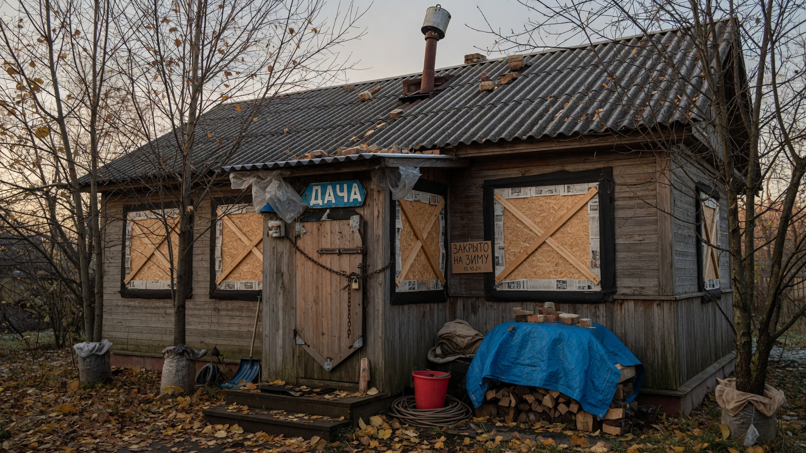
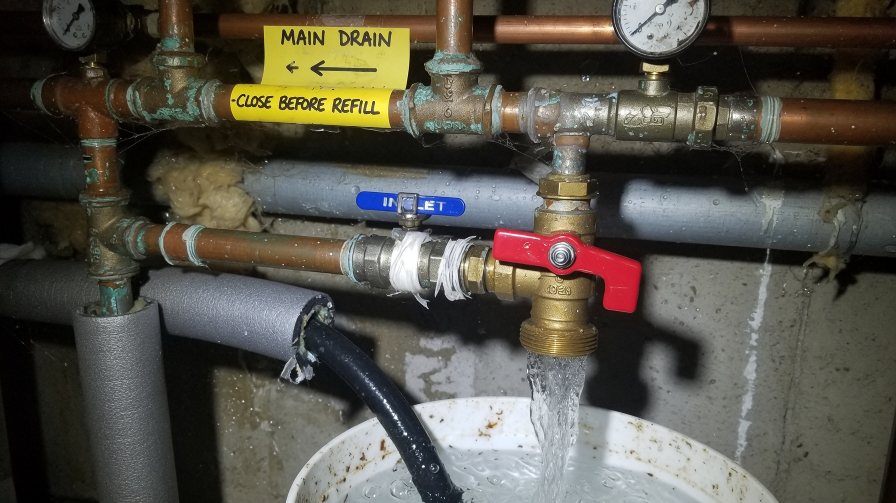
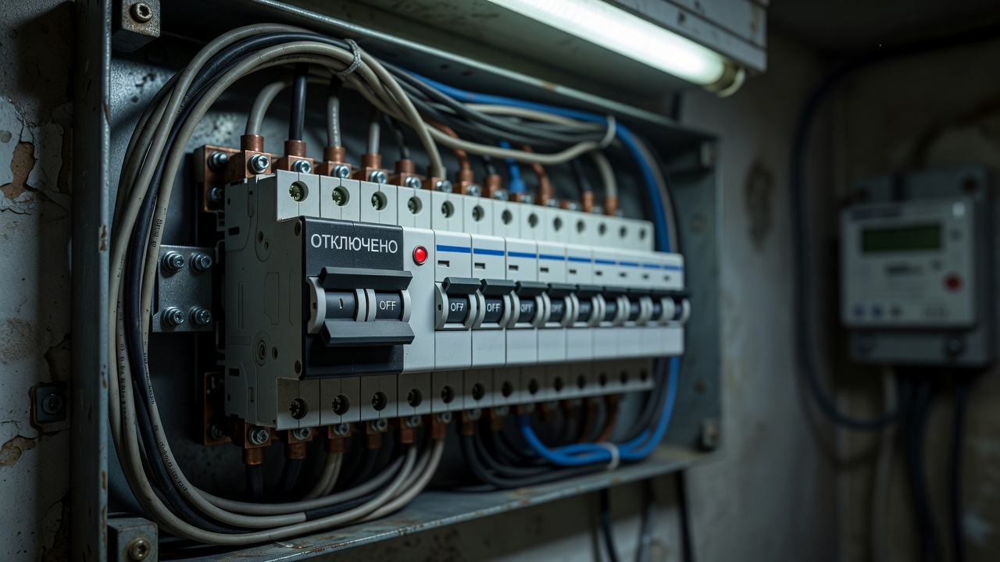
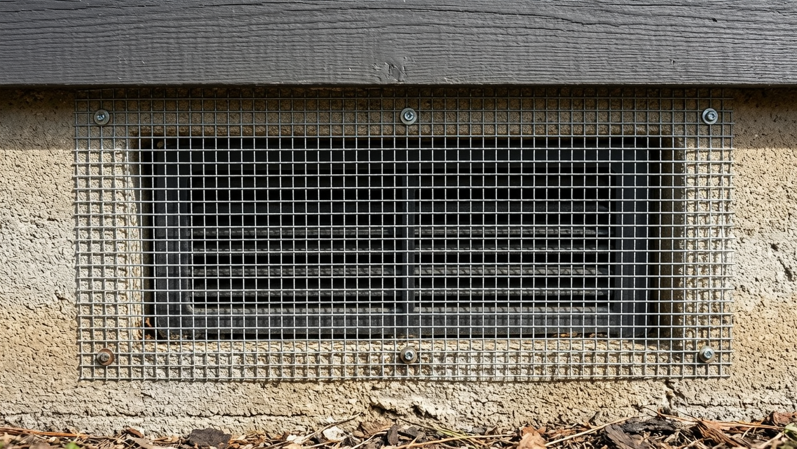
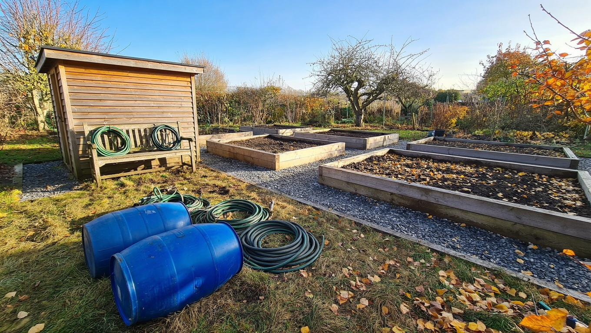
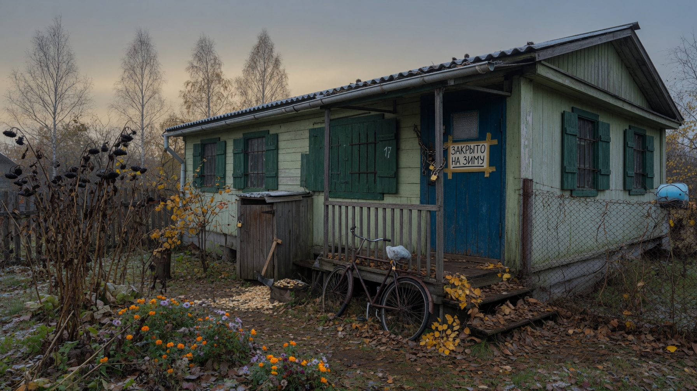

Сезонная дача остаётся одна на пять-шесть месяцев, и всё это время её испытывают на прочность мороз, сырость и грызуны. Одна забытая мелочь — не слитая вода в трубе — обходится весной в разорванный водопровод, лопнувший бойлер и затопленный дом. Правильная консервация занимает один-два выходных, зато весной вы просто приезжаете и всё работает. Разберём по шагам, что слить, отключить и закрыть на даче перед зимой.

## 📅 Когда консервировать дачу

Оптимальный срок — **до устойчивых морозов**, обычно октябрь-ноябрь, в зависимости от региона. Тянуть до последнего опасно: достаточно одной морозной ночи, чтобы вода в трубе замёрзла и разорвала её, а вы об этом узнаете только весной.

Ориентир простой: закрывайте дачу, когда ночные температуры уверенно уходят к нулю, но днём ещё плюс — так вы успеете спокойно всё слить и просушить.

## 💧 Вода: главное, что нужно слить

Вода при замерзании расширяется и рвёт всё, в чём осталась. Поэтому осушают **всю** систему, без исключений.

- **Водопровод.** Перекройте ввод, откройте все краны (в самой нижней и самой верхней точке), слейте воду через сливные краны. Остатки продувают компрессором или автомобильным насосом — в трубах не должно остаться ни капли.
- **Насос и насосная станция.** Слейте воду, а сам насос лучше снять и унести в тепло.
- **Гидроаккумулятор** — слить полностью.
- **Водонагреватель (бойлер).** Полностью слить через сливной кран — замёрзшая вода разрывает бак, а это самая дорогая потеря.
- **Фильтры и счётчик** — слить, картриджи вынуть.
- **Унитаз и сифоны.** Слейте воду из бачка и вычерпайте из чаши. В сифоны раковин и унитаза залейте незамерзающую жидкость (автомобильную незамерзайку или крепкий солевой раствор) — она не даст воде замёрзнуть, но сохранит гидрозатвор от запаха.
- **Система отопления.** Если теплоноситель вода — слить полностью. Если залит антифриз (незамерзающий теплоноситель) — оставляют как есть.
- **Бочки, ёмкости, бассейн, шланги, лейки** — слить, перевернуть, шланги свернуть и убрать под крышу.

**Скважина и колодец.** Насос из скважины поднимают или оставляют по инструкции, оголовок утепляют; колодец накрывают и утепляют крышку. Подробнее об устройстве источника — в статье [скважина или колодец](https://mir-doma.pro/skvazhina-ili-kolodec/).

⚠️ **Септик полностью откачивать нельзя!** Пустую ёмкость может вытолкнуть грунтовыми водами или сдавить пучением грунта. Стоки откачивают частично, оставляя ёмкость заполненной по уровню, указанному производителем. Как устроен септик — в отдельной статье про [септик для дачи](https://mir-doma.pro/septik-dlya-dachi/).

## ⚡ Электрика и газ

- **Обесточьте дом** — отключите вводной автомат в щитке. Это защита и от пожара, и от скачков напряжения.
- Если что-то должно работать зимой (сигнализация, камера, обогреватель для поддержания «плюса»), оставьте только нужную линию, а остальное отключите.
- **Выньте приборы из розеток** — даже в режиме ожидания они уязвимы к скачкам.
- **Холодильник** разморозьте, вымойте, просушите и **оставьте дверцу приоткрытой** — иначе внутри заведётся плесень.
- **Газовый баллон** перекройте и вынесите из дома в проветриваемое место (хранить баллоны в закрытом помещении нельзя).

## 🏠 Дом изнутри: сырость и продукты

Зимой главный враг закрытого дома — сырость.

- **Вывезите все продукты.** Крупы и сладости привлекают грызунов, а жидкости в стекле (вода, напитки, заготовки) на морозе просто лопнут.
- **Уберите текстиль** — постель, полотенца, шторы: заберите домой или сложите в герметичные пакеты. Матрасы поставьте на ребро.
- **Просушите всё** перед отъездом: сырые вещи и мокрая мебель к весне покроются плесенью.
- **Обеспечьте циркуляцию воздуха**: приоткройте дверцы шкафов, отодвиньте мебель от стен, оставьте межкомнатные двери открытыми.
- **Не запечатывайте дом наглухо** — вентиляция должна работать, иначе конденсат и плесень. Продухи и вентканалы прикрывают, но не закупоривают.
- Помогают **влагопоглотители** (силикагель, соль в открытых ёмкостях) в сырых углах.

## 🐭 Защита от грызунов

Пустой дом зимой — идеальное убежище для мышей.

- **уберите всю еду и крошки** — без корма дом им неинтересен;
- **заделайте щели** в фундаменте, стенах и вокруг вводов труб;
- **закройте продухи мелкой сеткой** — так подпол проветривается, но мыши не пролезут;
- разложите **ловушки, приманки или ультразвуковые отпугиватели**;
- уберите мягкие материалы (вату, поролон, тряпки) — из них мыши строят гнёзда.

## 🌳 Участок и постройки

- **Инвентарь и инструмент** — вымыть, просушить, убрать в сарай; металл смазать от коррозии.
- **Садовая мебель** — занести под крышу или накрыть чехлами.
- **Теплица** — обработать и подготовить к зиме: убрать остатки, продезинфицировать, снять нагрузку с каркаса. Подробно — в статье про [обработку теплицы осенью](https://mir-doma.pro/obrabotka-teplicy-osenyu/).
- **Сад** — влагозарядковый полив, побелка, обвязка стволов от грызунов; всё это разобрано в статье про [подготовку сада к зиме](https://mir-doma.pro/podgotovka-sada-k-zime/).
- **Водостоки** — прочистить от листвы, иначе зимой их разорвёт льдом.

## 🔒 Безопасность

- **Не оставляйте ценное** — технику, инструмент, документы заберите с собой.
- **Уберите лестницу** и всё, чем можно воспользоваться для проникновения.
- Закройте **ставни или ролеты**, если они есть.
- Договоритесь с соседями или сторожем присматривать за домом; при желании поставьте сигнализацию или камеру с GSM-модулем.

## ✅ Чек-лист перед отъездом

1. Перекрыт ввод воды, слиты трубы, бойлер, насос, гидроаккумулятор.
2. Слита система отопления (или в ней антифриз).
3. В сифоны залита незамерзайка, бачок унитаза пуст.
4. Септик откачан частично, по инструкции.
5. Обесточен дом, перекрыт газ, холодильник разморожен и приоткрыт.
6. Вывезены продукты, текстиль и всё, что боится мороза.
7. Заделаны щели, закрыты продухи сеткой, разложены ловушки.
8. Убран инвентарь, обработана теплица, подготовлен сад.
9. Дом просушен, обеспечена вентиляция.
10. Заперты двери и окна, вывезены ценности.

## ❓ Частые вопросы

**Когда консервировать дачу на зиму?**
До устойчивых морозов — обычно в октябре-ноябре, когда ночью уже около нуля, но днём ещё плюс. Затягивать нельзя: одной морозной ночи достаточно, чтобы разорвало трубу.

**Как слить воду из системы на даче?**
Перекрыть ввод, открыть все краны, слить воду через сливные краны в нижней точке и продуть трубы компрессором. Отдельно сливают бойлер, насос, гидроаккумулятор и фильтры.

**Нужно ли откачивать септик на зиму?**
Полностью — нет: пустую ёмкость может вытолкнуть грунтовыми водами или сдавить пучением грунта. Стоки откачивают частично, оставляя уровень, рекомендованный производителем.

**Что делать с водонагревателем зимой?**
Полностью слить воду через сливной кран и обесточить. Оставшаяся вода при замерзании разрывает бак — это одна из самых дорогих ошибок консервации.

**Нужно ли отключать электричество на даче на зиму?**
Да, вводной автомат отключают — это защита от пожара и скачков напряжения. Если нужна работающая сигнализация или обогрев, оставляют только эту линию.

**Как защитить дачу от мышей зимой?**
Убрать всю еду, заделать щели, закрыть продухи мелкой сеткой, разложить ловушки или приманки и убрать мягкие материалы, из которых мыши делают гнёзда.

**Нужно ли оставлять окна приоткрытыми на зиму?**
Нет — это риск для сохранности дома. Но полностью запечатывать его тоже нельзя: оставьте работать вентиляцию, приоткройте дверцы шкафов и отодвиньте мебель от стен, чтобы воздух циркулировал.

---

Консервация дачи — это не про «запереть дверь», а про то, чтобы в доме не осталось воды, еды и сырости. Слейте всё до капли, обесточьте, просушите и закройте вход грызунам — и весна начнётся с чашки чая, а не с ремонта лопнувших труб. Заодно перед отъездом стоит [утеплить окна и двери](https://mir-doma.pro/uteplenie-okon-i-dverey/) — это уменьшит промерзание дома за зиму.
