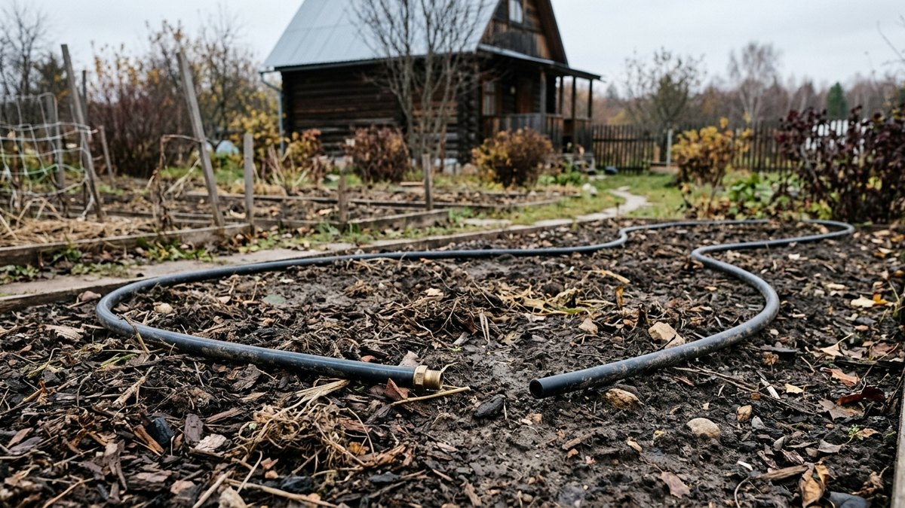
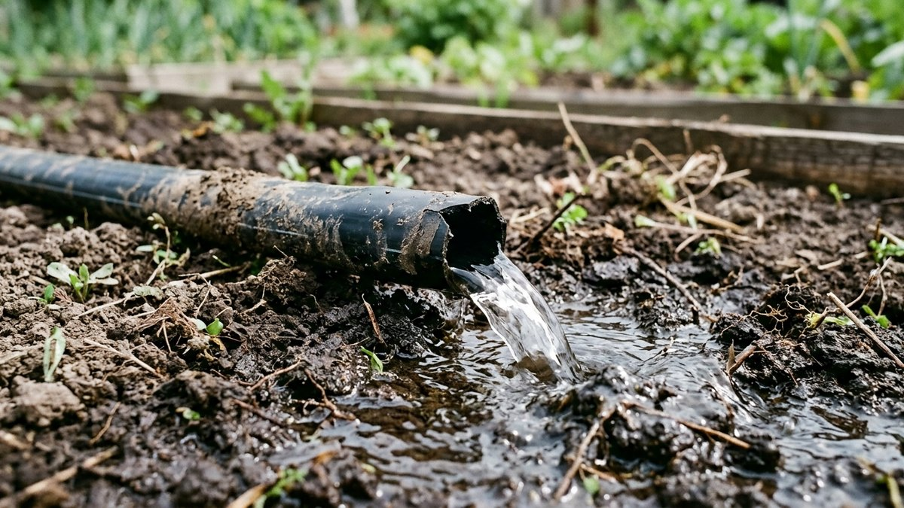
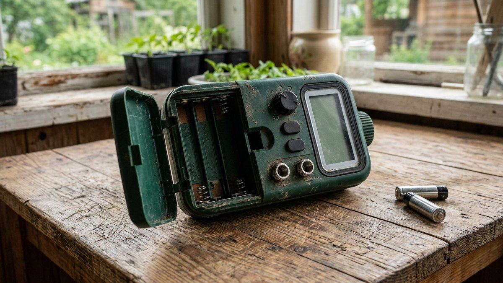
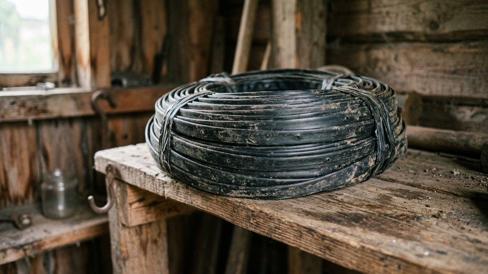
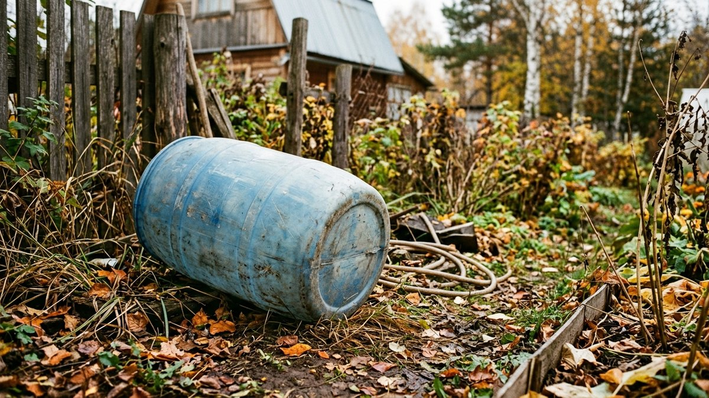
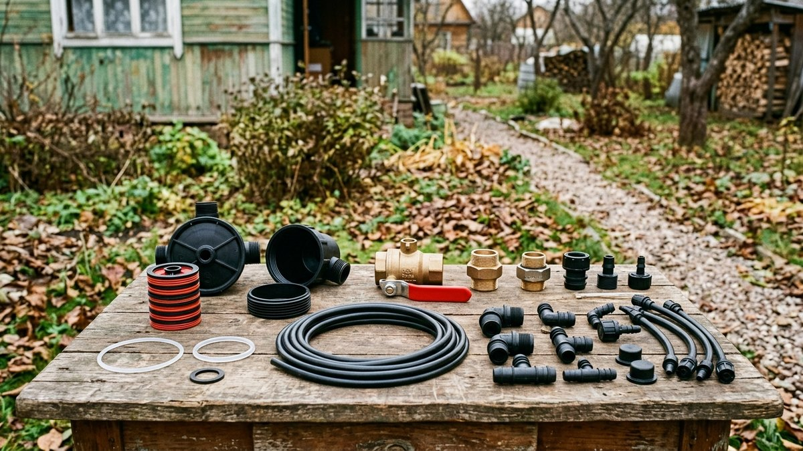

# Как законсервировать систему полива на зиму

«Слить воду из шланга» — не вся консервация системы полива: вода
остаётся в капельной ленте, в корпусе фильтра, в насосной станции и в
редукторе, а замерзая, рвёт их изнутри. Разберём полную последовательность
для капельного полива и автополива — от магистрали до таймера — чтобы
по весне не пришлось покупать систему заново. Тот же принцип касается и
[системы автополива газона](https://mir-doma.pro/sistema-poliva-gazona-svoimi-rukami/) —
вода, оставшаяся в дождевателях и клапанах зон, точно так же рвёт их морозом.

## Когда консервировать полив

Систему отключают до первых заморозков, а не по календарю — в средней
полосе это обычно конец сентября — начало октября. Лучше законсервировать
на неделю раньше, чем один раз попасть на ночной заморозок с полной
системой воды в трубках.

## Слив воды из всех участков системы

- **Магистральный шланг или труба** — отключить от источника, поднять
  свободный конец выше остальной трассы и дать воде стечь самотёком.
- **Капельная лента и микротрубки** — открыть заглушки на концах линий,
  продуть систему компрессором или ручным насосом, чтобы вытолкнуть
  остатки воды из тонких каналов — самотёком из капельной ленты вода
  уходит не полностью.
- **Фильтр** — разобрать корпус, промыть и просушить картридж, сам
  корпус оставить открытым или снять до весны.
- **Редуктор давления и обратный клапан** — слить воду из корпуса,
  зимой при отрицательных температурах в закрытой полости остатки воды
  расширяются и трескают пластик.

## Насос и насосная станция

Насос полностью сливают и, если это погружная или переносная модель,
снимают и убирают в тёплое помещение — гараж, дом, отапливаемый сарай.
Стационарную насосную станцию, которую не унести, сливают через нижний
кран и утепляют корпус на месте. Общий порядок консервации водоснабжения
дачи целиком, включая насос и водопровод в доме, разобран в статье
[консервация дачи на зиму](https://mir-doma.pro/konservaciya-dachi-na-zimu/) —
здесь рассмотрена именно система полива отдельно и подробнее.

## Таймер и автоматика

Электронный таймер полива снимают с крана и убирают в помещение —
батарейки вынимают, чтобы они не потекли за зиму и не испортили контакты.
Если таймер несъёмный, его как минимум закрывают от влаги и промерзания,
но съёмная модель зимой в тепле служит заметно дольше.

## Капельная лента и трубки: снимать или оставлять

- **Тонкую капельную ленту** для однолетних грядок обычно снимают
  полностью — она недорогая, а весенняя перекопка и посадка всё равно
  требуют её убрать с пути.
- **Магистральные трубки ПНД** под многолетними посадками можно оставить
  в земле, если они полностью слиты и заглушены — но открытые концы на
  зиму лучше поднять над уровнем возможного застоя воды.

Как устроена система капельного полива и какие материалы для неё
используются, подробно разобрано в статье [капельный полив своими
руками](https://mir-doma.pro/kapelnyy-poliv-svoimi-rukami/) — на этапе
консервации важно вернуться к тем же узлам, которые монтировали весной.

## Бочка-накопитель и автополив теплицы

Бочку для полива освобождают полностью — оставшаяся на дне вода замерзает
и распирает стенки, особенно у пластиковых ёмкостей. Пустую бочку
переворачивают или убирают под навес. Если в теплице был смонтирован
отдельный контур автополива, его отключают и сливают так же тщательно —
устройство систем автополива для теплицы и их узлы разбирали в статье
[автополив для теплицы своими руками](https://mir-doma.pro/avtopoliv-dlya-teplitsy-svoimi-rukami/).

## Частые ошибки

- **Сливают только магистральный шланг**, забывая про капельную ленту и
  фильтр — вода в тонких каналах и корпусе фильтра замерзает и рвёт их
  изнутри.
- **Оставляют насосную станцию на улице без слива** — застрявшая в
  корпусе вода разрывает редуктор и мембрану.
- **Не вынимают батарейки из таймера** — потёкшие батарейки портят
  контакты, и электроника не переживает зиму.
- **Тянут с консервацией до первого заморозка** — одна холодная ночь
  успевает повредить систему, которую не слили заранее.

## Частые вопросы

**Когда нужно консервировать систему полива на даче?**
До первых устойчивых заморозков — обычно конец сентября или начало
октября в средней полосе, лучше на неделю раньше, чем позже.

**Нужно ли снимать капельную ленту на зиму?**
Тонкую ленту для однолетних грядок обычно снимают полностью, магистральные
трубки под многолетниками можно оставить в земле при условии полного
слива и заглушки концов.

**Что будет, если не слить воду из фильтра для полива?**
Замёрзшая вода расширяется и трескает корпус фильтра изнутри — трещина
часто незаметна до первого включения весной, когда система начинает течь.

**Нужно ли убирать насосную станцию на зиму?**
Переносную станцию лучше унести в тёплое помещение. Стационарную, которую
не унести, полностью сливают и утепляют корпус на месте.

**Можно ли оставить бочку для полива на улице на зиму?**
Да, если она полностью пустая и перевёрнута или укрыта — оставшаяся на
дне вода при замерзании распирает и повреждает стенки бочки.
