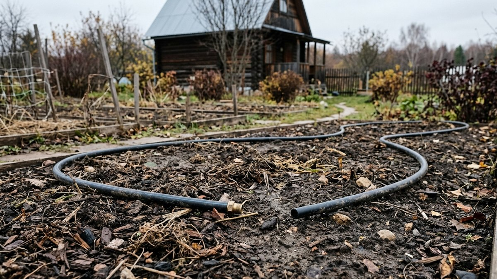
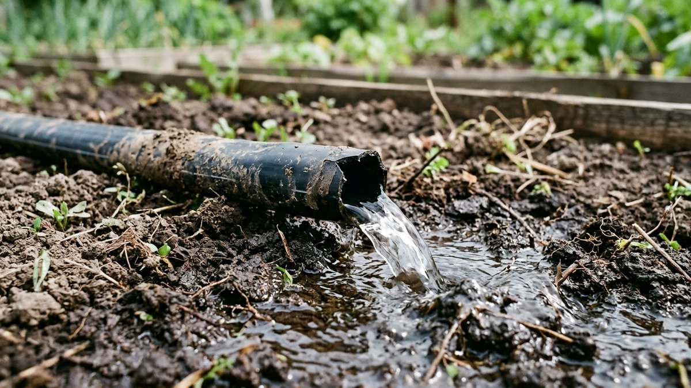
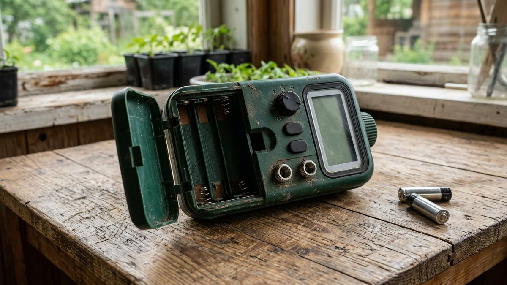
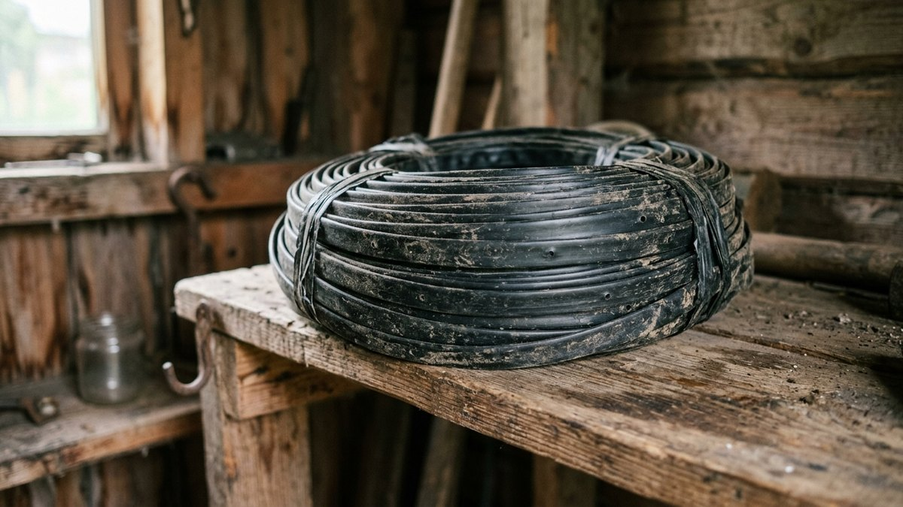
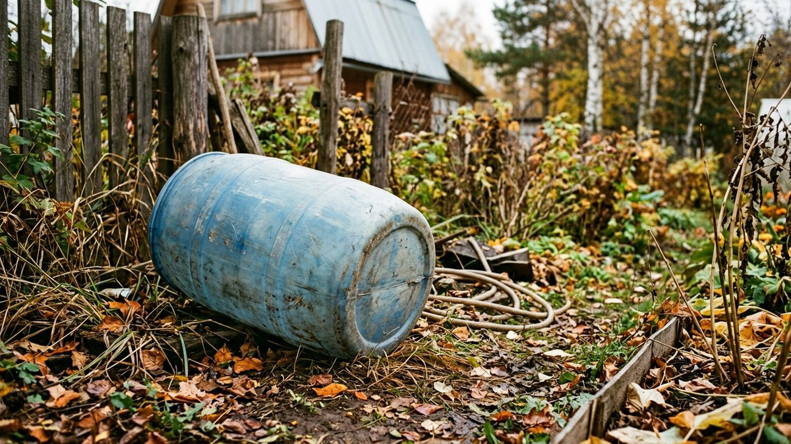
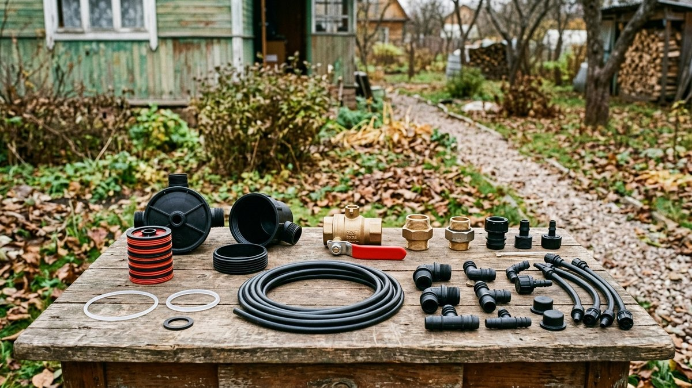

# Как законсервировать систему полива на зиму

«Слить воду из шланга» — не вся консервация системы полива: вода
остаётся в капельной ленте, в корпусе фильтра, в насосной станции и в
редукторе, а замерзая, рвёт их изнутри. Разберём полную последовательность
для капельного полива и автополива — от магистрали до таймера — чтобы
по весне не пришлось покупать систему заново. Тот же принцип касается и
[системы автополива газона](https://mir-doma.pro/sistema-poliva-gazona-svoimi-rukami/) —
вода, оставшаяся в дождевателях и клапанах зон, точно так же рвёт их морозом.

## Когда консервировать полив

Систему отключают до первых заморозков, а не по календарю — в средней
полосе это обычно конец сентября — начало октября. Лучше законсервировать
на неделю раньше, чем один раз попасть на ночной заморозок с полной
системой воды в трубках.

## Слив воды из всех участков системы

- **Магистральный шланг или труба** — отключить от источника, поднять
  свободный конец выше остальной трассы и дать воде стечь самотёком.
- **Капельная лента и микротрубки** — открыть заглушки на концах линий,
  продуть систему компрессором или ручным насосом, чтобы вытолкнуть
  остатки воды из тонких каналов — самотёком из капельной ленты вода
  уходит не полностью.
- **Фильтр** — разобрать корпус, промыть и просушить картридж, сам
  корпус оставить открытым или снять до весны.
- **Редуктор давления и обратный клапан** — слить воду из корпуса,
  зимой при отрицательных температурах в закрытой полости остатки воды
  расширяются и трескают пластик.

## Продувка компрессором: давление и порядок

Самотёком вода уходит только из труб с уклоном. В провисших участках,
капельных каналах и корпусах кранов она остаётся. Поэтому систему
продувают, но давление ограничивают: избыточный воздух рвёт ленту и
выбивает фитинги.

**Какое давление ставить.** Компрессор подключают только через редуктор
с манометром.

- **Капельная лента:** не выше рабочего давления с упаковки. Для
  тонкостенной ленты это обычно около 1 бар.
- **Капельная трубка и ПНД-магистраль:** до 2–3 бар.
- **Шланги:** не выше рабочего давления, указанного на оплётке.

Для одной-двух грядок хватит автомобильного насоса или пылесоса,
включённого на выдув. Важен объём воздуха, а не напор.

**Порядок продувки:**

1. Перекройте подачу воды и стравите давление в системе: откройте любой
   кран.
2. Откройте заглушки на концах всех линий. Если продувать закрытую
   систему, давление растёт, и первым не выдерживает самый слабый узел.
3. Подключите компрессор **после насоса и фильтра**. Если продувать через
   насос, крыльчатка раскрутится без воды, а картридж фильтра разорвёт
   потоком воздуха.
4. Продувайте по одной линии или зоне, начиная с самой дальней от
   компрессора. Остальные краны держите закрытыми, иначе воздух уйдёт по
   пути наименьшего сопротивления.
5. Дуйте, пока из конца линии вместо струи не пойдёт водяная пыль, а
   потом сухой воздух. Это обычно 1–2 минуты на линию.
6. Через 5–10 минут пройдите по линиям ещё раз: вода из провисших мест
   успеет стечь к выходу.

Долго гонять сухой воздух не нужно. Без воды пластиковые фитинги
нагреваются от трения. Работайте в очках: из открытых концов вылетает
грязь, скопившаяся за сезон.

## Сколько воды в системе: калькулятор

Введите длину каждого вида труб. Калькулятор покажет, сколько воды
должно вытечь при сливе. Если в ведро ушло заметно меньше, значит, вода
осталась в провисших участках. Такую линию продуйте повторно или
приподнимите и слейте с конца.

<!-- wp:html -->

  
Калькулятор объёма воды в системе полива

  <label class="md-calc__label" for="mdKpT">Капельная лента 16 мм, м</label>
  <input type="number" id="mdKpT" class="md-calc__input" min="0" step="1" value="100">
  <label class="md-calc__label" for="mdKpK">Капельная трубка 16 мм, м</label>
  <input type="number" id="mdKpK" class="md-calc__input" min="0" step="1" value="0">
  <label class="md-calc__label" for="mdKp20">Труба ПНД 20 мм, м</label>
  <input type="number" id="mdKp20" class="md-calc__input" min="0" step="1" value="0">
  <label class="md-calc__label" for="mdKp25">Труба ПНД 25 мм, м</label>
  <input type="number" id="mdKp25" class="md-calc__input" min="0" step="1" value="20">
  <label class="md-calc__label" for="mdKp32">Труба ПНД 32 мм, м</label>
  <input type="number" id="mdKp32" class="md-calc__input" min="0" step="1" value="0">
  <label class="md-calc__label" for="mdKpH">Садовый шланг 1/2", м</label>
  <input type="number" id="mdKpH" class="md-calc__input" min="0" step="1" value="0">
  <label class="md-calc__label" for="mdKpH2">Садовый шланг 3/4", м</label>
  <input type="number" id="mdKpH2" class="md-calc__input" min="0" step="1" value="0">
  
Заполните поля

<!-- /wp:html -->

## Насос и насосная станция

Насос полностью сливают и, если это погружная или переносная модель,
снимают и убирают в тёплое помещение — гараж, дом, отапливаемый сарай.
Стационарную насосную станцию, которую не унести, сливают через нижний
кран и утепляют корпус на месте. Общий порядок консервации водоснабжения
дачи целиком, включая насос и водопровод в доме, разобран в статье
[консервация дачи на зиму](https://mir-doma.pro/konservaciya-dachi-na-zimu/) —
здесь рассмотрена именно система полива отдельно и подробнее.

## Скважина или абиссинка как источник полива

Если скважина работает только на полив и зимой не нужна, сам погружной
насос можно не поднимать. Он стоит в воде ниже глубины промерзания, и
мороз ему не страшен. Замерзает другое: вода в трубе от насоса до
оголовка и отвод от скважины к участку. Обратный клапан держит эту воду
в трубе.

- **Есть сливной («зимний») клапан ниже уровня промерзания:** после
  отключения насоса откройте кран на поверхности. Вода из вертикальной
  трубы уйдёт обратно в скважину.
- **Клапана нет, оголовок открыт и не утеплён:** поднимите насос и
  слейте трубу. Другой вариант — отсоединить трубу от отвода, чтобы
  вода из её верхней части вытекла.
- **Отвод к участку проложен выше глубины промерзания:** слейте его
  через нижнюю точку и продуйте, как магистраль полива.

У абиссинки с поверхностным насосом или ручной колонкой слейте корпус
насоса, а сам насос унесите в тепло. Обратный клапан держит воду в
колонне трубы, поэтому верх колонны тоже нужно освободить.

Если скважина нужна и зимой, её не консервируют, а утепляют. Как
сделать это через кессон, разобрано в статье [кессон для скважины
своими руками](https://mir-doma.pro/kesson-dlya-skvazhiny-svoimi-rukami/):
там есть расчёт глубины и утеплителя. Для колодца из бетонных колец —
своя схема с утеплением колец и внутренней крышкой, она в статье про
[утепление колодца на зиму](https://mir-doma.pro/kak-uteplit-kolodec-na-zimu/). Для отвода, который нельзя
заглубить, подойдёт [греющий кабель для
водопровода](https://mir-doma.pro/greyushchiy-kabel-dlya-vodoprovoda/).

## Таймер и автоматика

Электронный таймер полива снимают с крана и убирают в помещение —
батарейки вынимают, чтобы они не потекли за зиму и не испортили контакты.
Если таймер несъёмный, его как минимум закрывают от влаги и промерзания,
но съёмная модель зимой в тепле служит заметно дольше.

## Капельная лента и трубки: снимать или оставлять

- **Тонкую капельную ленту** для однолетних грядок обычно снимают
  полностью — она недорогая, а весенняя перекопка и посадка всё равно
  требуют её убрать с пути.
- **Магистральные трубки ПНД** под многолетними посадками можно оставить
  в земле, если они полностью слиты и заглушены — но открытые концы на
  зиму лучше поднять над уровнем возможного застоя воды.

Как устроена система капельного полива и какие материалы для неё
используются, подробно разобрано в статье [капельный полив своими
руками](https://mir-doma.pro/kapelnyy-poliv-svoimi-rukami/) — на этапе
консервации важно вернуться к тем же узлам, которые монтировали весной.
Если весной планируете менять раскладку грядок, заранее [пересчитайте
количество капельниц под новую схему](https://mir-doma.pro/raschet-kapelnic-dlya-poliva/) —
проще купить нужное число сразу, чем докупать в разгар сезона.

## Бочка-накопитель и автополив теплицы

Каркасный бассейн на зиму обычно разбирают целиком — порядок слива,
сушки и хранения чаши разобран в статье
[как хранить каркасный бассейн зимой](https://mir-doma.pro/kak-hranit-karkasnyy-basseyn-zimoy/).

Бочку для полива освобождают полностью — оставшаяся на дне вода замерзает
и распирает стенки, особенно у пластиковых ёмкостей. Пустую бочку
переворачивают или убирают под навес. Если в теплице был смонтирован
отдельный контур автополива, его отключают и сливают так же тщательно —
устройство систем автополива для теплицы и их узлы разбирали в статье
[автополив для теплицы своими руками](https://mir-doma.pro/avtopoliv-dlya-teplitsy-svoimi-rukami/).

## Летний водопровод по участку

Летний водопровод отличается от капельного полива. Трубы лежат на
поверхности или в мелкой траншее и ведут к кранам у грядок, теплицы и
летнего душа. Сами трубы из ПНД выдерживают одно-два замерзания.
Трескаются краны, компрессионные фитинги и тройники: у них жёсткий
корпус, который не растягивается вместе с трубой.

- **Слив с нижней точки.** Если трасса проложена с уклоном к сливному
  крану, достаточно открыть его и все краны-колонки. Если уклона нет,
  систему придётся продувать по частям, как описано выше.
- **Краны оставьте открытыми на всю зиму.** Если в трубе останется
  немного воды, при замерзании ей будет куда расшириться.
- **Разборные участки снимите.** Гибкие подводки, шланги на быстросъёмах
  и пластиковые краны-«ёлочки» уберите под крышу.
- **Заглушите открытые концы**, но не плотно, например пакетом на
  резинке. Так внутрь не попадут мусор и насекомые, а конденсат сможет
  выйти.
- **Отметьте трассу** колышками или нарисуйте схему. Весной так проще
  найти, где лопнул фитинг, и не повредить трубу лопатой.

Если на участке стоит [летний душ](https://mir-doma.pro/letniy-dush-dlya-dachi-svoimi-rukami/)
с баком, бак и подводку к нему сливают так же. Трубы водопровода в доме
сливают по общей схеме из статьи о консервации дачи.

## Частые ошибки

- **Сливают только магистральный шланг**, забывая про капельную ленту и
  фильтр — вода в тонких каналах и корпусе фильтра замерзает и рвёт их
  изнутри.
- **Оставляют насосную станцию на улице без слива** — застрявшая в
  корпусе вода разрывает редуктор и мембрану.
- **Не вынимают батарейки из таймера** — потёкшие батарейки портят
  контакты, и электроника не переживает зиму.
- **Продувают компрессором без редуктора** — давление 6–8 бар срывает
  капельную ленту со стартеров и выбивает фитинги.
- **Продувают через насос и фильтр** — крыльчатка крутится всухую,
  картридж рвёт потоком воздуха. Компрессор подключают после них.
- **Закрывают краны летнего водопровода на зиму** — оставшейся в трубе
  воде некуда расширяться, и трескается именно кран.
- **Тянут с консервацией до первого заморозка** — одна холодная ночь
  успевает повредить систему, которую не слили заранее.

## Частые вопросы

**Когда нужно консервировать систему полива на даче?**
До первых устойчивых заморозков — обычно конец сентября или начало
октября в средней полосе, лучше на неделю раньше, чем позже.

**Нужно ли снимать капельную ленту на зиму?**
Тонкую ленту для однолетних грядок обычно снимают полностью, магистральные
трубки под многолетниками можно оставить в земле при условии полного
слива и заглушки концов.

**Что будет, если не слить воду из фильтра для полива?**
Замёрзшая вода расширяется и трескает корпус фильтра изнутри — трещина
часто незаметна до первого включения весной, когда система начинает течь.

**Нужно ли убирать насосную станцию на зиму?**
Переносную станцию лучше унести в тёплое помещение. Стационарную, которую
не унести, полностью сливают и утепляют корпус на месте.

**Можно ли оставить бочку для полива на улице на зиму?**
Да, если она полностью пустая и перевёрнута или укрыта — оставшаяся на
дне вода при замерзании распирает и повреждает стенки бочки.

**Какое давление ставить на компрессоре для продувки полива?**
Для капельной ленты — не выше рабочего давления с упаковки, обычно около
1 бар. Для капельной трубки и ПНД-магистрали — 2–3 бар. Компрессор
подключают только через редуктор с манометром.

**Можно ли продуть полив без компрессора?**
Да. Короткие линии продувают автомобильным насосом или пылесосом,
включённым на выдув. Главное — открыть концы линий и продувать по одной.

**Нужно ли поднимать насос из скважины на зиму?**
Погружной насос ниже уровня промерзания можно оставить. Нужно слить
трубу над ним через сливной клапан или поднять насос, если клапана нет
и оголовок не утеплён.

**Нужно ли заливать в систему полива антифриз?**
Нет. Автомобильный и отопительный антифриз ядовиты для растений и почвы.
Достаточно слить воду и продуть систему.
