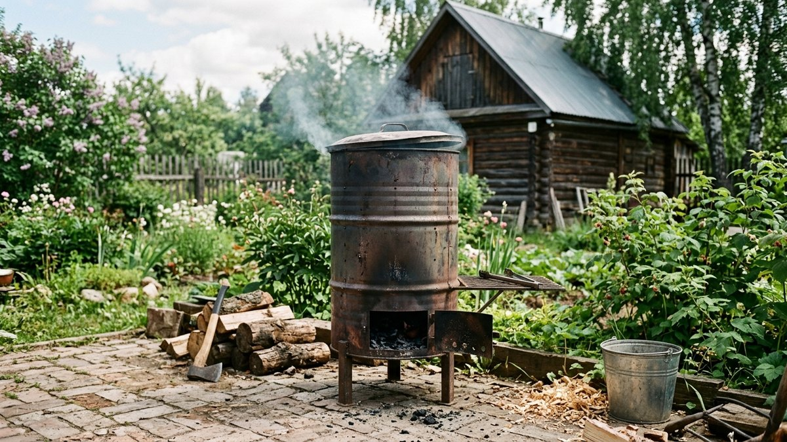
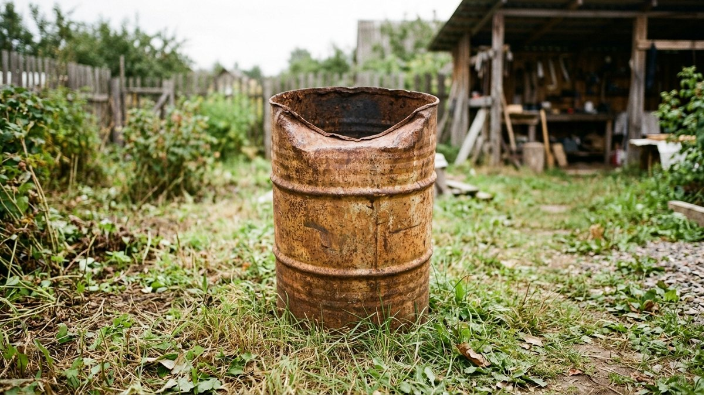
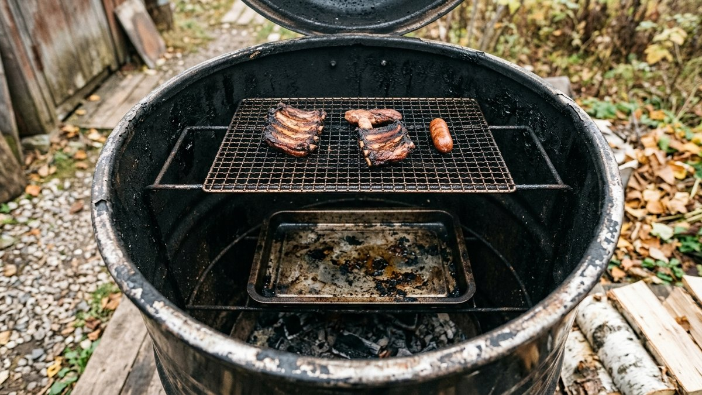
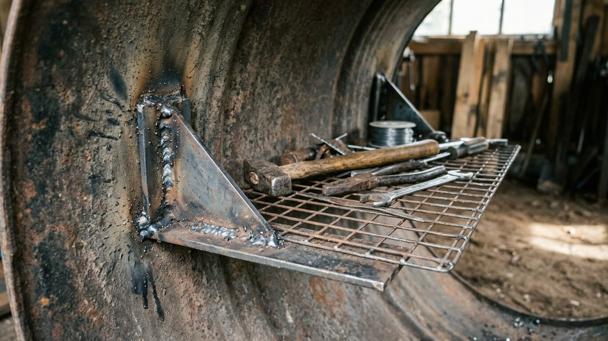
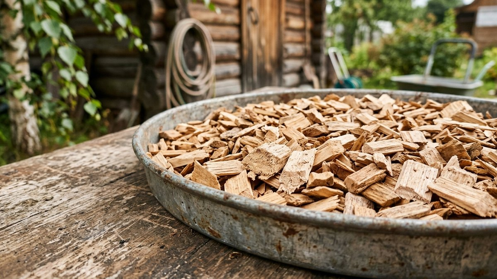
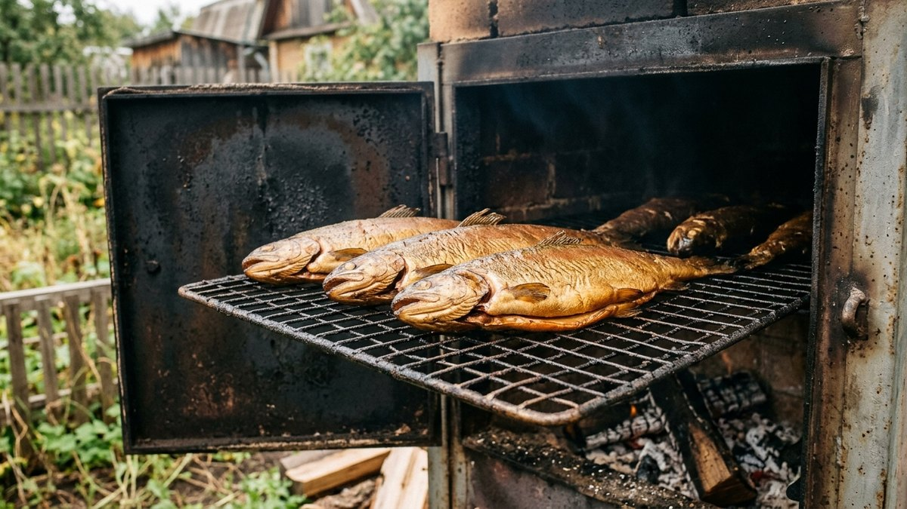

Горячее копчение — самый быстрый способ получить готовый продукт: от закладки до стола проходит от получаса до нескольких часов, а не сутки, как при холодном копчении. Конструкция при этом простая и по силам сварить или собрать самостоятельно из подручного металла за один день. Разберём устройство и разберём пошагово, как собрать коптильню из бочки — самого доступного и распространённого варианта.

## Как работает горячее копчение

Продукт готовится при температуре 80–120 °C прямым нагревом снизу — под коптильней разводят огонь или ставят её на мангал, тепло нагревает опилки в поддоне на дне корпуса, они начинают тлеть и дымиться, дым поднимается вверх и обрабатывает продукт на решётках или крючках. В отличие от холодного копчения, здесь нет отдельного дымогенератора и длинного дымохода — источник тепла и камера с продуктом совмещены в одном корпусе.

## Из чего сделать коптильню

- **Металлическая бочка (обычно 200 л)** — самый популярный и бюджетный вариант: бочка уже имеет нужную форму корпуса, остаётся врезать решётки, поддон и крышку.
- **Газовый баллон** — тот же принцип переделки, что и в мангале из баллона: баллон разрезают, приваривают ножки и внутренние опоры, получая герметичный толстостенный корпус, который служит намного дольше бочки.
- **Сварной короб из листового металла** — самый трудоёмкий, но и самый долговечный вариант: сталь толщиной от 3 мм не прогорает годами, а форму и размер можно сделать под себя.

Для баллона важно соблюдать ту же меру безопасности, что и при переделке под мангал: перед резкой баллон полностью освобождают от остатков газа, заполняют водой и только потом режут — подробный порядок подготовки и сварки разобран в статье [«Мангал из газового баллона своими руками»](https://mir-doma.pro/mangal-iz-gazovogo-ballona-svoimi-rukami/), тот же принцип применим и к коптильне. А про выбор материала под открытый огонь в целом — в статье про [мангал из кирпича своими руками](https://mir-doma.pro/mangal-iz-kirpicha-svoimi-rukami/).

## Устройство коптильни

Независимо от материала корпуса, коптильня горячего копчения состоит из одних и тех же элементов:

- **Поддон для опилок** — на самом дне корпуса, над источником тепла;
- **Поддон для сбора жира** — между опилками и продуктом, обязательный элемент: без него капающий жир попадает на тлеющие опилки и даёт горький привкус дыму;
- **Решётки или крючки** — для укладки или подвешивания продукта, на одном или нескольких уровнях;
- **Крышка** — для горячего копчения не обязательно герметичная с гидрозатвором (это требование скорее для холодного копчения), но должна плотно закрывать корпус, чтобы дым не уходил слишком быстро.

## Пошаговая сборка из бочки

1. **Подготовить бочку.** Тщательно очистить от остатков предыдущего содержимого, при необходимости прокалить на огне, чтобы выжечь заводское масляное покрытие изнутри — иначе оно даст неприятный запах и вкус первым же копчениям.
2. **Вырезать или подготовить крышку.** Если бочка без штатной крышки, вырезают круг из листового металла с ручкой.
3. **Приварить внутренние опоры.** На нужной высоте изнутри привариваются уголки или прутки под будущие поддоны и решётки — обычно два-три уровня: под опилки внизу, под поддон для жира чуть выше, под решётки с продуктом ещё выше.
4. **Сделать поддон для опилок.** Плоский металлический лист или готовый противень подходящего диаметра, устанавливается на нижние опоры.
5. **Сделать поддон для жира.** Аналогично, но с бортиками, чтобы жир не стекал мимо на опилки.
6. **Установить решётки.** Из нержавеющей стальной сетки или прутка — на верхний уровень опор, либо приварить крючки для подвешивания рыбы и мяса целиком.
7. **Проверить герметичность и тягу.** Собранную коптильню стоит протестировать на холостом розжиге — убедиться, что дым равномерно заполняет камеру, а не уходит мимо продукта через щели.

## Какие опилки использовать

Для копчения подходят опилки и щепа лиственных пород — ольха, дуб, яблоня, вишня, груша, бук. Ольха — универсальный вариант, доступный и дающий нейтральный мягкий дым. Хвойные породы (сосна, ель) категорически не подходят: смола в древесине при тлении даёт горький привкус и чёрный неприятный нагар на продукте. Опилки перед использованием слегка увлажняют — сухие быстро вспыхивают открытым пламенем вместо того, чтобы тлеть и дымить.

Коптильню, как и мангал, разумно ставить на негорючее основание и подальше от построек и заборов — требования пожарной безопасности и устройство навеса над зоной готовки разобраны в статье [«Навес для мангала своими руками»](https://mir-doma.pro/naves-dlya-mangala-svoimi-rukami/).

## Частые ошибки

- **Использовать хвойные опилки.** Смолистый дым портит вкус продукта и оставляет горький привкус.
- **Не ставить поддон для жира.** Капающий на опилки жир горит и коптит горечью, а не создаёт нужный ароматный дым.
- **Слишком высокая температура.** При перегреве продукт скорее варится в собственном соку, чем коптится, — снаружи подгорает, а внутри остаётся сырым.
- **Частое открывание крышки.** Каждое открытие выпускает дым и сбрасывает температуру, увеличивая общее время готовки.
- **Сухие немоченые опилки.** Вспыхивают открытым огнём вместо тления и дают едкий горелый дым вместо ароматного.

## Частые вопросы

### Сколько времени коптить горячим способом?

От 30–40 минут для мелкой рыбы до 2–4 часов для крупных кусков мяса, в зависимости от размера продукта и температуры в коптильне. Точное время определяется опытным путём под конкретную коптильню.

### Какая температура нужна для горячего копчения?

Оптимальный диапазон — 80–120 °C. При более низкой температуре продукт коптится слишком долго и рискует испортиться до готовности, при более высокой — скорее варится и подгорает, чем коптится.

### Какие опилки лучше использовать для копчения?

Опилки лиственных пород — ольха, дуб, яблоня, вишня, бук. Ольха — самый универсальный и доступный вариант. Хвойные породы не используют из-за смолистого горького дыма.

### Можно ли использовать коптильню как обычный мангал?

Нет, это разные задачи и разная конструкция: мангал рассчитан на открытый огонь и прямой жар, коптильня — на тление опилок при умеренной температуре в закрытой камере с дымом. Использовать одно вместо другого не получится без переделки.

### Нужна ли крышка с гидрозатвором для горячего копчения?

Нет, это требование в первую очередь для холодного копчения с долгим процессом. Для горячего копчения достаточно крышки, плотно закрывающей корпус и не выпускающей дым слишком быстро.
