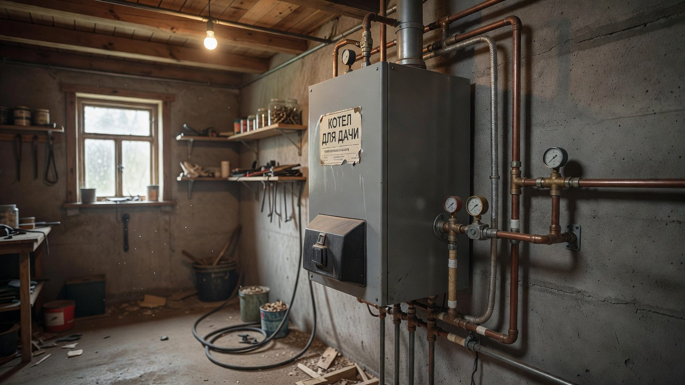
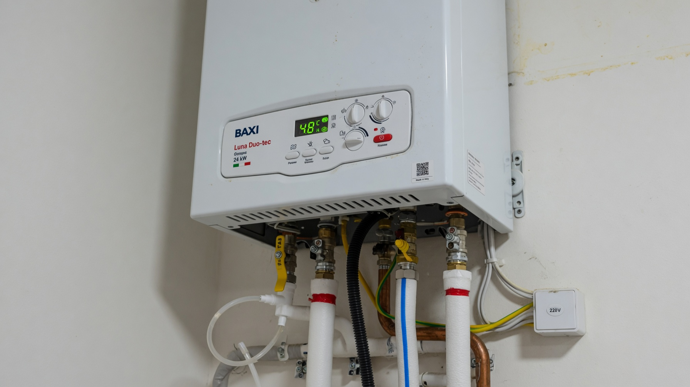
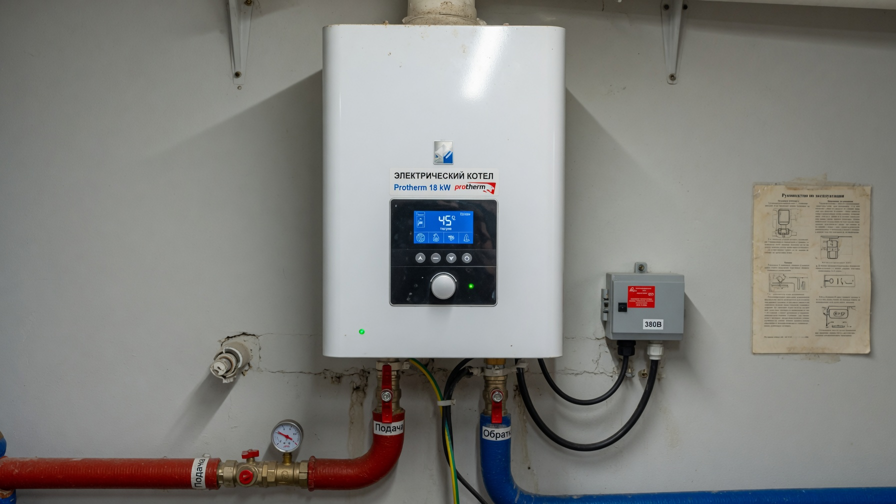
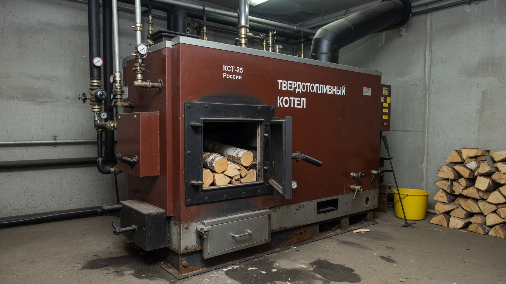
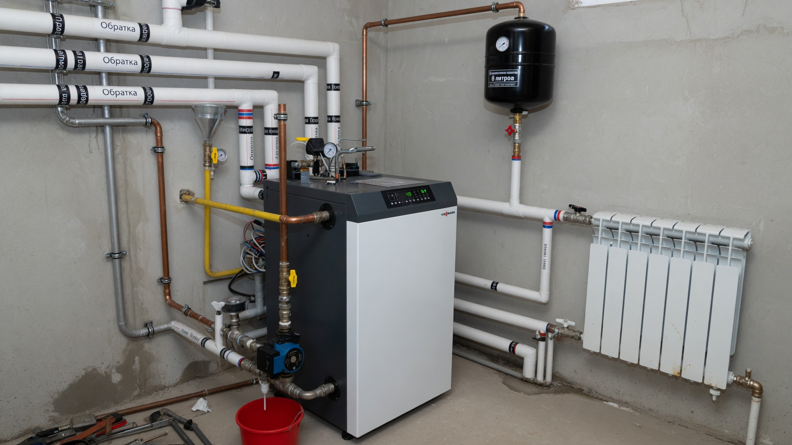
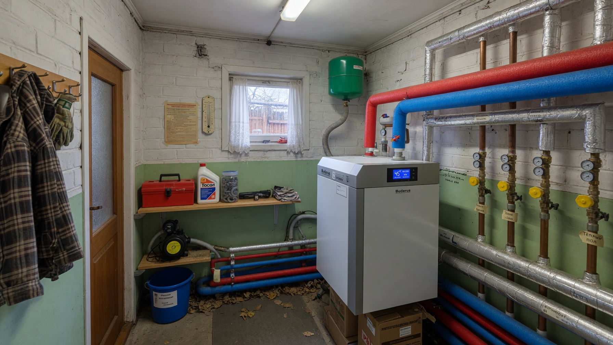

Если дача становится домом для круглогодичной жизни, обогревателями и печкой уже не обойтись — нужна полноценная система водяного отопления с котлом и радиаторами. Котёл греет теплоноситель, тот расходится по батареям, и в доме тепло во всех комнатах разом. Главный вопрос — на каком топливе: от него зависят и удобство, и расходы, и цена установки. Разберём, какой котёл выбрать для дачи: сравним газовый, электрический, твердотопливный и дизельный и определим нужную мощность.

## 🔥 Когда нужен котёл, а когда нет

Котёл с системой водяного отопления оправдан, если:

- вы живёте на даче зимой постоянно или подолгу;
- дом большой, и нужно греть несколько комнат равномерно;
- хочется автоматики, а не подкидывать дрова каждые пару часов.

Если же вы бываете на даче наездами или обогреваете одну-две комнаты, дешевле и проще обойтись [печью](https://mir-doma.pro/pech-dlya-dachi/) или [электрообогревателями](https://mir-doma.pro/elektricheskoe-otoplenie-dachi/) — котёл и разводка радиаторов для такого режима избыточны.

И главное правило, общее для любого отопления: **сначала утепление, потом котёл.** В неутеплённом доме любой котёл будет топить улицу — как утеплить дачу, разобрано в статье про [утепление дачного дома](https://mir-doma.pro/kak-uteplit-dachnyy-dom/).

## ⚙️ Типы котлов: сравнение

Выбор топлива — ключевое решение. Разберём каждый вариант.

**Газовый котёл.** Если к участку подведён магистральный газ — это самый выгодный вариант отопления: топливо дешёвое, котёл работает автоматически. Минусы — высокая стоимость подключения и проекта, необходимость дымохода и разрешительных документов. На сжиженном газе (баллоны, газгольдер) газовый котёл тоже работает, но экономия уже меньше.

**Электрический котёл.** Самый простой в установке: не нужны дымоход, топливо и разрешения — повесил на стену и подключил. Работает бесшумно и полностью автоматически. Минус один, но весомый — **дорогое электричество** и зависимость от сети: при отключении света дом остывает. Хорош как основной котёл в утеплённом доме или как резервный к другому.

**Твердотопливный котёл (дрова, уголь, пеллеты).** Автономен и не зависит от газа и стабильной электросети — выручает там, где нет магистрального газа. Дрова и уголь дёшевы. Минусы — нужно **регулярно загружать топливо** и чистить котёл, требуется место для хранения дров и дымоход. Пеллетные котлы с автоподачей удобнее, но дороже.

**Дизельный (жидкотопливный) котёл.** Автономный и мощный, ставят там, где нет ни газа, ни возможности топить дровами. Минусы — дорогое топливо, нужна ёмкость для солярки и отдельное помещение: котёл шумит и пахнет.

| Котёл | Топливо | Плюсы | Минусы |
|---|---|---|---|
| Газовый | Магистральный газ | Дёшево, автоматика | Дорогое подключение, документы |
| Электрический | Электричество | Простой монтаж, тихий | Дорого в эксплуатации, зависит от сети |
| Твердотопливный | Дрова, уголь, пеллеты | Автономность, дешёвое топливо | Загрузка вручную, чистка, место |
| Дизельный | Солярка | Автономность, мощность | Дорогое топливо, шум, запах |

## 🎯 Какой котёл выбрать под ситуацию

Выбор проще делать по тому, что доступно на участке:

- **Есть магистральный газ** → газовый котёл, вне конкуренции по экономичности.
- **Газа нет, но есть стабильное электричество и утеплённый дом** → электрический котёл (простой и тихий) или связка с твердотопливным.
- **Нет ни газа, ни надёжной сети** → твердотопливный котёл как основа автономного отопления.
- **Нужна максимальная независимость** → часто ставят **комбинацию**: твердотопливный (основной) + электрический (поддерживает тепло ночью и когда некому подкинуть дров).

Комбинированные и двухконтурные котлы решают сразу две задачи: двухконтурный, помимо отопления, ещё и греет воду для бытовых нужд — удобно, если на даче есть [водоснабжение](https://mir-doma.pro/skvazhina-ili-kolodec/).

## 📐 Какая нужна мощность

Мощность котла подбирают под площадь дома и его утепление. Грубый ориентир для средней полосы и утеплённого дома — **1 кВт мощности на 10 м² площади** (при высоте потолков около 2,5–3 м). То есть для дома 80 м² нужен котёл примерно на 8–10 кВт.

Но это лишь прикидка. На реальную мощность влияют:

- **степень утепления** — в плохо утеплённом доме потребуется заметно больше;
- **климат** региона;
- **площадь остекления** и количество наружных стен;
- **нужен ли нагрев воды** (для двухконтурного котла мощность берут с запасом).

Точный расчёт лучше доверить специалисту: и заниженная, и завышенная мощность одинаково плохи — первая не прогреет дом, вторая работает неэффективно и быстрее изнашивается.

## 🔧 Что ещё нужно, кроме котла

Котёл — лишь сердце системы. Для полноценного отопления понадобятся:

- **радиаторы** (батареи) в комнатах и трубы разводки;
- **циркуляционный насос** — гонит теплоноситель по системе (в энергозависимых котлах встроен);
- **расширительный бак** — компенсирует расширение теплоносителя при нагреве;
- **теплоноситель** — вода или незамерзающий антифриз (для дачи, которую зимой не топят постоянно, антифриз надёжнее — система не разморозится);
- **группа безопасности и автоматика** — контроль давления и температуры;
- **дымоход** — для газовых, твердотопливных и дизельных котлов.

Всю систему проектируют целиком, а не покупают котёл отдельно.

## 🏠 Где установить котёл

- **Настенные котлы** (газовые, электрические) компактны и вешаются на стену — им хватит места на кухне или в коридоре.
- **Напольные и твердотопливные** требуют отдельного помещения — котельной с вентиляцией и негорючими поверхностями.
- Для газовых, дизельных и мощных твердотопливных котлов к котельной предъявляют требования по объёму, вентиляции и дымоходу — их прописывают нормы, и лучше уточнить заранее.

## ❌ Частые ошибки

- **Купили котёл в неутеплённый дом** — топливо уходит на обогрев улицы.
- **Взяли мощность «на глаз»** — котёл не тянет дом или, наоборот, работает вхолостую с перерасходом.
- **Вода вместо антифриза на сезонной даче** — при отключении отопления система размерзается и рвётся.
- **Сэкономили на автоматике** — котёл сложнее и опаснее в эксплуатации.
- **Не предусмотрели дымоход и вентиляцию** для котельной — нарушение норм и риск.
- **Электрокотёл на слабую проводку** — перегрузка сети.

## ❓ Частые вопросы

**Какой котёл выбрать для дачи?**
Если есть магистральный газ — газовый (самый экономичный). Без газа, но с надёжной сетью и в утеплённом доме — электрический. Там, где нет ни газа, ни стабильного электричества, — твердотопливный. Часто ставят комбинацию твердотопливного и электрического.

**Что дешевле в эксплуатации?**
Дешевле всего отапливать магистральным газом, затем дровами и углём. Электричество и солярка — самые дорогие виды топлива. Но экономичность любого котла сильно зависит от утепления дома.

**Какой мощности нужен котёл?**
Ориентировочно 1 кВт на 10 м² площади утеплённого дома при потолках 2,5–3 м. Точную мощность рассчитывают с учётом утепления, климата и остекления.

**Можно ли поставить котёл на даче без газа?**
Да. Без газа ставят электрический (если сеть надёжная и дом утеплён), твердотопливный (дрова, уголь, пеллеты) или дизельный котёл. Твердотопливный даёт максимальную автономность.

**Чем заливать систему отопления на даче — водой или антифризом?**
Для дачи, которую зимой не отапливают постоянно, надёжнее антифриз (незамерзающий теплоноситель): он не разморозит систему при отключении котла. Вода дешевле, но требует, чтобы дом всегда был тёплым.

**Нужна ли отдельная котельная?**
Настенным газовым и электрическим котлам достаточно места на стене. Напольным, твердотопливным и дизельным нужна котельная с вентиляцией, дымоходом и негорючей отделкой.

**Нужно ли утеплять дом перед установкой котла?**
Обязательно. В неутеплённом доме любой котёл будет работать на максимуме и топить улицу. Сначала утепляют стены, крышу, пол и окна, и только потом подбирают котёл под уже сниженные теплопотери.

---

Котёл превращает дачу в дом, где тепло во всех комнатах и зимой. Выбор сводится к простому вопросу — какое топливо доступно на участке: есть газ — газовый, нет — электрический или твердотопливный. Не забудьте про мощность под площадь, антифриз для сезонного дома и, самое главное, про утепление: [утеплённый дом](https://mir-doma.pro/kak-uteplit-dachnyy-dom/) с грамотным котлом обходится в отоплении в разы дешевле. А для быстрого локального тепла к котлу хорошо дополнить [электрообогреватели](https://mir-doma.pro/elektricheskoe-otoplenie-dachi/) или живую [печь](https://mir-doma.pro/pech-dlya-dachi/).
