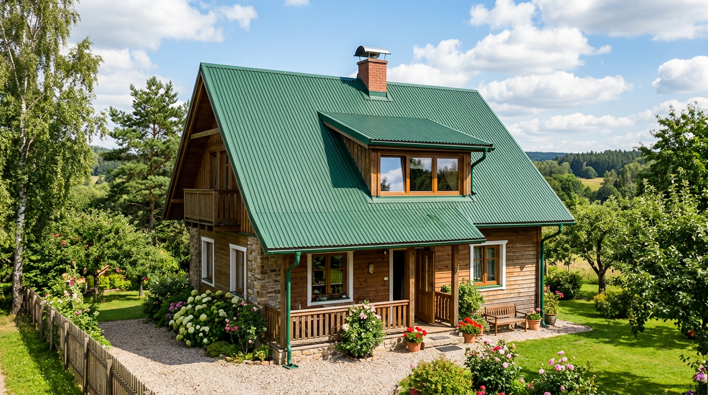
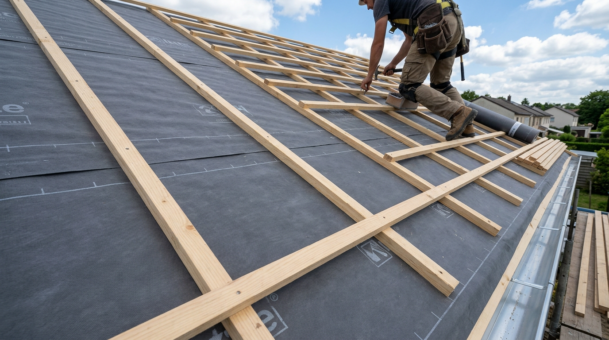
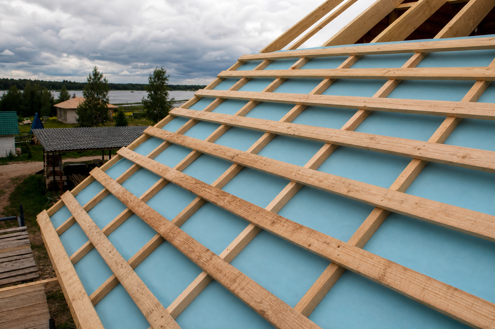
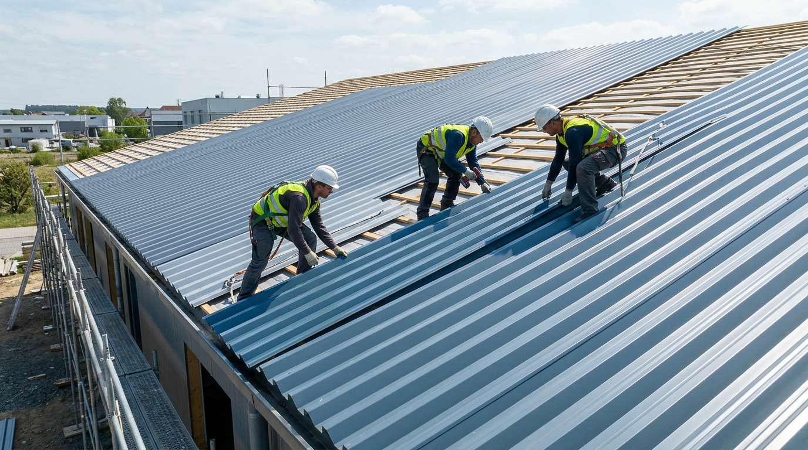
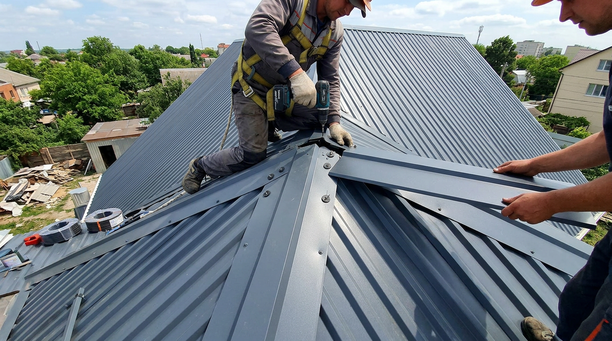

Профнастил — один из самых популярных материалов для кровли дачного дома, сарая, гаража, бани или [теплицы](https://mir-doma.pro/teplitsa-iz-polikarbonata-svoimi-rukami/): он недорогой, лёгкий, долговечный и быстро монтируется. А главное — крышу из профнастила вполне реально покрыть своими руками, без бригады кровельщиков, если действовать аккуратно и по правилам. В этой статье разберём, как сделать крышу из профнастила своими руками: как выбрать материал, рассчитать количество, собрать кровельный пирог и обрешётку, уложить листы и закрепить доборные элементы, а также каких ошибок избегать.

## 🏠 Чем хорош профнастил для крыши

Профнастил (профлист) заслуженно популярен в кровле благодаря целому ряду достоинств:

- **Невысокая цена** — один из самых бюджетных кровельных материалов.
- **Лёгкость** — небольшой вес не нагружает стропила и фундамент.
- **Долговечность** — лист с полимерным покрытием служит несколько десятилетий.
- **Быстрый монтаж** — крыша покрывается за считаные дни.
- **Простота работы** — можно справиться своими силами с минимумом инструментов.
- **Большой выбор цветов** — полимерное покрытие бывает любого оттенка.

При правильном монтаже такая крыша будет надёжно защищать дом от дождя и снега долгие годы. Профнастил одинаково хорош и для жилого дома, и для хозяйственных построек — сарая, гаража, навеса, — поэтому им часто перекрывают все строения на участке в едином стиле.

## 📐 Выбор профнастила для кровли

Для крыши берут не любой профлист. Важны несколько параметров:

- **Марка.** Для кровли подходит несущий профнастил марки **НС** или **С** с высотой волны от 20 мм (например, НС35, С21). Чем выше волна, тем жёстче лист и тем лучше он держит нагрузку.
- **Толщина металла** — не менее 0,5 мм.
- **Покрытие.** Лучше брать лист с полимерным покрытием — он долговечнее и красивее оцинкованного.
- **Капиллярная канавка.** Желательно выбирать профлист с дренажной канавкой на крайней волне — она отводит воду из нахлёста.

Важный момент — **уклон крыши**: для профнастила он должен быть не менее 12°, а лучше от 15–20°. Чем меньше уклон, тем больше делают нахлёст листов и тщательнее герметизируют стыки. Также заранее продумайте длину листов: один лист на весь скат избавляет от горизонтальных стыков, но такие листы тяжелее и сложнее поднимать на крышу вдвоём — учитывайте это при заказе.

## 🧮 Расчёт материала

Чтобы закупить всё необходимое, измерьте скаты крыши. Понадобятся:

- **Профлисты** — по площади скатов с учётом нахлёстов и свесов. Удобно заказывать листы длиной во весь скат, чтобы не было горизонтальных стыков.
- **Кровельные саморезы** с уплотнительной прокладкой в цвет — примерно 6–8 штук на квадратный метр.
- **Доборные элементы** — конёк, торцевые (ветровые) и карнизные планки, при сложной крыше — ендовы и планки примыкания.
- **Гидроизоляционная плёнка** и брус для обрешётки и контробрешётки.

К рассчитанному количеству листов добавьте небольшой запас на подрезку. Доборные элементы (конёк, планки) считают по длине соответствующих линий крыши с учётом нахлёста между планками 5–10 см. Лучше сразу заказать доборку в цвет основных листов, чтобы крыша смотрелась аккуратно.

## 🧰 Инструменты

Из инструментов понадобятся: шуруповёрт, ножницы по металлу или просечные электроножницы (болгаркой профлист резать нельзя — абразив выжигает покрытие, и кромка ржавеет), рулетка, маркер, уровень, шнур, лестница и страховочное снаряжение для работы на высоте.

## 🪵 Кровельный пирог и обрешётка

Перед укладкой листов готовят основание — кровельный пирог. От него зависит, не будет ли крыша течь и «потеть».

Для **холодной крыши** (неотапливаемого чердака) пирог простой:

1. По стропилам раскатывают **гидроизоляционную плёнку** с небольшим провисом, горизонтальными полосами снизу вверх с нахлёстом.
2. Поверх стропил вдоль них набивают **контробрешётку** (брусок) — она создаёт вентиляционный зазор.
3. Поперёк набивают **обрешётку** из доски или бруска с нужным шагом.

Для **тёплой крыши** (мансарды) между стропилами дополнительно укладывают утеплитель, а изнутри — пароизоляцию. Вентиляционный зазор обязателен в любом случае: без него под листами скапливается конденсат, и дерево гниёт. Воздух должен свободно проходить от карниза к коньку, поэтому продухи на карнизе и вентиляцию на коньке не перекрывают. Это продлевает жизнь и кровле, и стропилам.

## 🔩 Монтаж профнастила пошагово

Когда основание готово, приступают к укладке листов. Работают аккуратно, в нескользкой обуви, наступая только в прогиб волны над обрешёткой.

1. **Начинайте снизу, от карниза**, с торца с подветренной стороны. Первый лист выровняйте строго, с небольшим свесом за карниз (4–5 см) — от него зависит ровность всей крыши.
2. **Укладывайте листы с нахлёстом** в одну волну по горизонтали. Если скат выше длины листа, верхний ряд кладут на нижний с вертикальным нахлёстом (20 см и более, в зависимости от уклона).
3. **Крепите кровельными саморезами** с уплотнительной прокладкой. Саморез вкручивают **в прогиб волны** (не в гребень!), к обрешётке. По карнизу и коньку крепят в каждую волну, в середине листа — через одну.

4. **Не перетягивайте саморезы** — иначе продавите прокладку, и стык потечёт. Шуруп должен прижимать прокладку плотно, но без вмятины.
5. **Двигайтесь рядами** снизу вверх и в сторону, контролируя ровность по шнуру.

Поднимают листы на крышу по лагам или направляющим, аккуратно, чтобы не погнуть и не поцарапать покрытие. В ветреную погоду монтаж не ведут — лист парусит и может вырваться из рук.

## 🏔️ Доборные элементы

После укладки листов ставят доборные элементы — они закрывают стыки и края крыши.

- **Карнизная планка** — крепится по нижнему краю ската ещё до листов, отводит воду в водосток.
- **Торцевые (ветровые) планки** — закрывают боковые края крыши, защищают от ветра и влаги.
- **Конёк** — устанавливают в самом конце по верхнему стыку скатов, обязательно с уплотнителем и вентиляционным зазором.
- **Ендова** — нужна в местах внутренних углов на сложных крышах, монтируется до листов.
- **Планки примыкания** — закрывают стыки кровли со стенами, трубами и другими вертикальными поверхностями.

Все срезы и царапины подкрашивают краской в цвет, чтобы металл не начал ржаветь.

## ⚠️ Техника безопасности на крыше

Кровельные работы ведутся на высоте, поэтому безопасность — не формальность:

- работайте со страховочной привязкой, закреплённой за надёжную опору;
- используйте устойчивую лестницу и трапы, ходите по обрешётке и в прогиб волны;
- надевайте нескользкую обувь и перчатки — кромки листов острые;
- не выходите на крышу в дождь, росу, ветер и мороз;
- поднимайте листы вдвоём, а инструмент держите в сумке на поясе.

Аккуратность и страховка важнее скорости — крыша подождёт, а здоровье дороже.

## 🛡️ Частые ошибки

Чтобы крыша не текла и служила долго, избегайте типичных промахов:

- **Резка болгаркой.** Абразивный круг выжигает покрытие, и кромка быстро ржавеет. Режьте ножницами по металлу.
- **Крепёж в гребень волны.** Саморезы вкручивают только в прогиб волны, иначе стык протекает.
- **Перетянутые саморезы.** Продавленная прокладка пропускает воду. Затягивайте плотно, но без вмятины.
- **Нет вентзазора и гидроизоляции.** Под листами образуется конденсат, дерево гниёт. Контробрешётка и плёнка обязательны.
- **Малый уклон без герметизации.** На пологих крышах нужен больший нахлёст и уплотнение стыков.
- **Незащищённые срезы.** Необработанные кромки и царапины — первые очаги ржавчины.

## ❓ Частые вопросы

### Можно ли покрыть крышу профнастилом в одиночку?

Технически можно, но неудобно и небезопасно: листы длинные, парусят на ветру, а работа ведётся на высоте. Лучше делать это вдвоём — один подаёт и придерживает лист, другой крепит. Это и быстрее, и безопаснее.

### Какой профнастил выбрать для крыши?

Несущий профлист марки НС или С с высотой волны от 20 мм (например, НС35, С21) и толщиной от 0,5 мм, с полимерным покрытием. Желательно с капиллярной канавкой для отвода воды. Чем выше волна, тем жёстче и надёжнее кровля.

### Какой минимальный уклон крыши для профнастила?

Минимум около 12°, а лучше от 15–20°. Чем меньше уклон, тем больше делают нахлёст листов и тщательнее герметизируют стыки, чтобы вода не затекала под кровлю.

### Куда вкручивать саморезы — в волну или в гребень?

В прогиб волны, то есть в нижнюю часть профиля, плотно к обрешётке. Крепить в гребень (верх волны) нельзя — там скапливается и затекает вода. По краям ската крепят в каждую волну, в поле — через одну.

### Можно ли резать профнастил болгаркой?

Нет. Абразивный круг болгарки выжигает цинк и полимерное покрытие, и кромка быстро ржавеет. Профнастил режут ножницами по металлу, просечными электроножницами или дисковой пилой с твердосплавным диском, а срезы подкрашивают.

### Нужна ли гидроизоляция под профнастил?

Да, обязательно. Гидроизоляционная плёнка и вентиляционный зазор (контробрешётка) защищают от конденсата, который иначе скапливается под листами и приводит к гниению стропил. Без них крыша «потеет» и быстро портится.

### Какой нахлёст делать у листов профнастила на крыше?

По горизонтали листы кладут с нахлёстом в одну волну. Вертикальный нахлёст между рядами зависит от уклона: при крутой крыше достаточно около 20 см, при пологой его увеличивают и дополнительно герметизируют, чтобы вода не затекала.

### Сколько саморезов нужно на крышу из профнастила?

Ориентировочно 6–8 кровельных саморезов на квадратный метр. По карнизу и коньку крепят в каждую волну, в середине листа — через одну. Используют только кровельные саморезы с уплотнительной прокладкой в цвет покрытия.

## Заключение

Крыша из профнастила своими руками — задача посильная даже для новичка, если действовать по этапам: выбрать качественный лист с полимерным покрытием, правильно собрать кровельный пирог с гидроизоляцией и вентзазором, аккуратно уложить листы снизу вверх с нахлёстом и закрепить саморезами в прогиб волны. Уделите внимание уклону, вентиляции и защите срезов, не забывайте о безопасности на высоте — и крыша десятилетиями будет надёжно держать дождь и снег. А единый цвет с другими постройками, например с [забором из профнастила](https://mir-doma.pro/zabor-iz-profnastila-svoimi-rukami/), сделает участок аккуратным и стильным.

А вы перекрывали крышу профнастилом? Делитесь опытом и вопросами в комментариях и подписывайтесь, чтобы не пропустить новые статьи о строительстве и ремонте.
