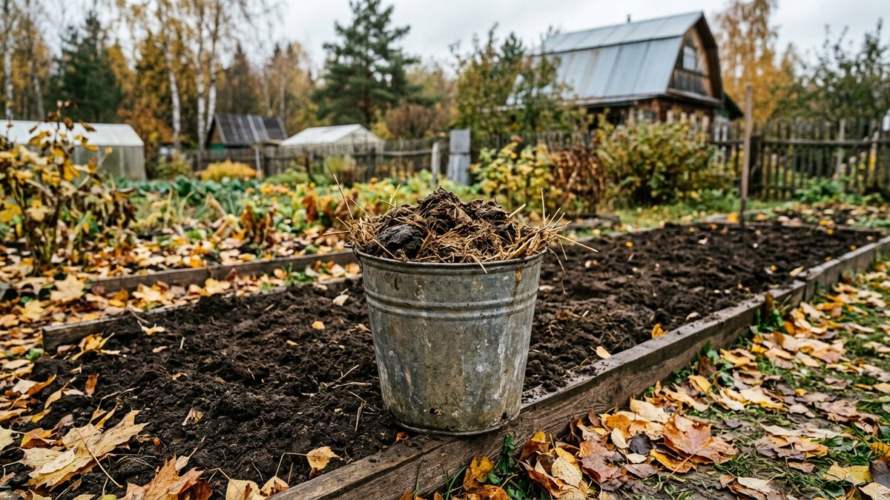
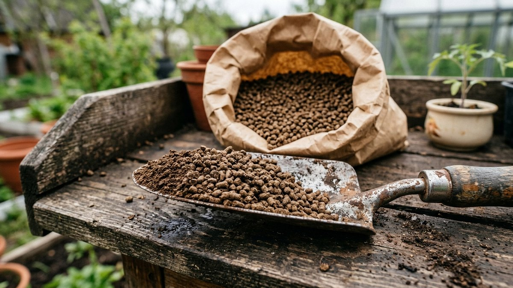
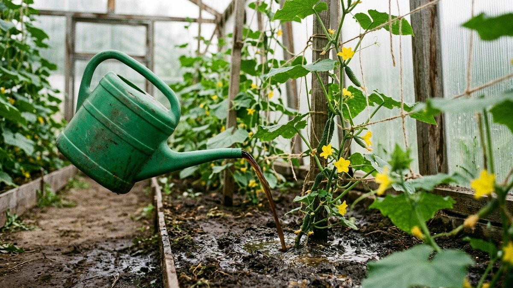
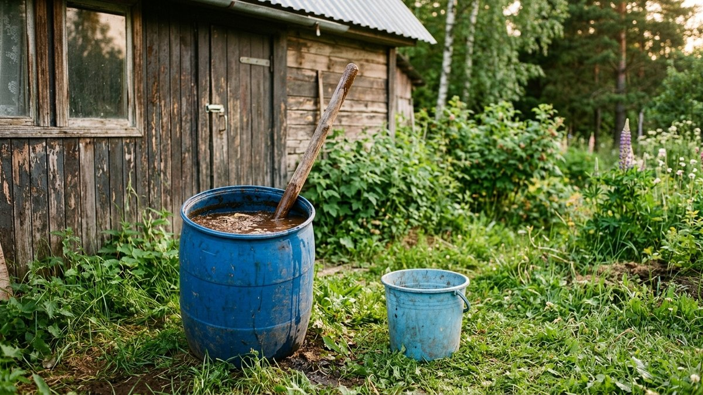
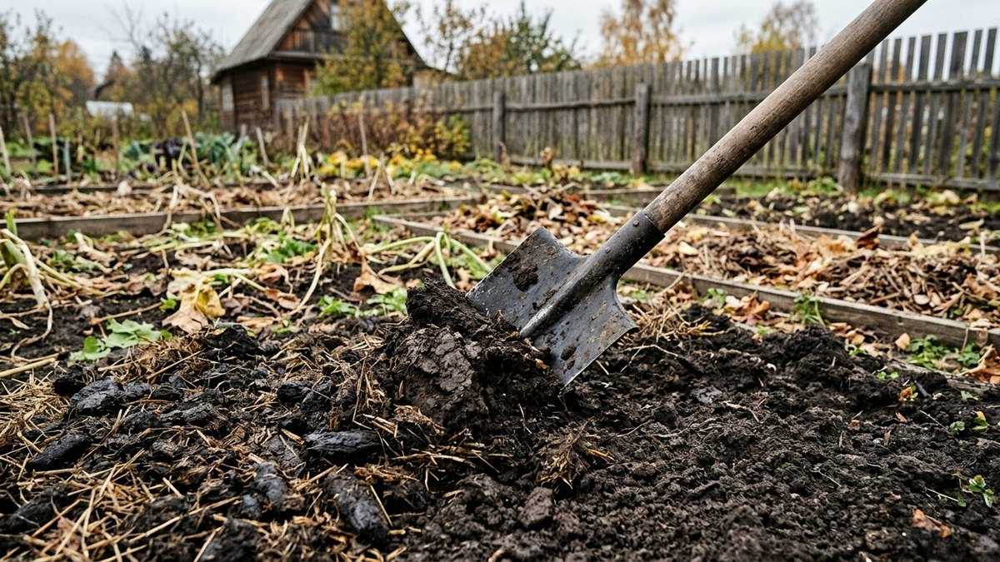
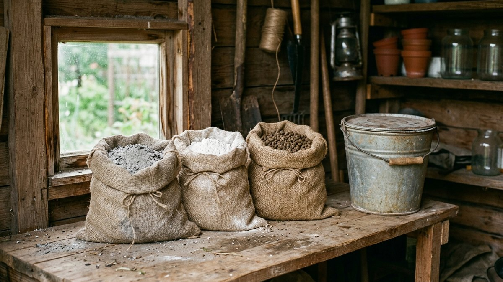

Куриный помёт как удобрение в несколько раз сильнее коровьего навоза. Поэтому
им чаще всего и вредят: свежий помёт, положенный под корни весной, сжигает
рассаду за пару дней. Разберём три формы помёта (свежий, сухой из курятника
и гранулированный из магазина), пропорции настоя, дозы на квадратный метр,
какие культуры его не любят и почему лучшее время для свежего помёта —
октябрь. В середине статьи калькулятор: он посчитает, сколько помёта нужно
на ваши грядки или на нужный объём настоя.

## Чем куриный помёт отличается от навоза

Куры не выделяют мочу отдельно: азот у них выходит вместе с помётом в виде
мочевой кислоты. Отсюда два свойства, которые определяют всё обращение с
помётом:

- **азота много и он быстрый.** В почве мочевая кислота за дни превращается
  в аммиак и аммоний — отсюда ожог корней и запах;
- **фосфора почти столько же, сколько азота.** У навоза фосфора в разы
  меньше, поэтому помёт заметно лучше работает на цветение и завязи.

| Удобрение | Азот (N), % | Фосфор (P₂O₅), % | Калий (K₂O), % | Насколько «горячее» |
|---|---|---|---|---|
| Куриный помёт свежий | 1,5–2 | 1,5–1,9 | 0,8–1 | Очень: только осенью или в настой |
| Куриный помёт сухой, гранулы | 3–5 | 2–4 | 1,5–2,5 | Сильное, но предсказуемое |
| Навоз КРС свежий | 0,5 | 0,25 | 0,6 | Умеренно |
| Конский навоз свежий | 0,6 | 0,3 | 0,6 | Умеренно, быстро греется |

Цифры — средние ориентиры: состав зависит от корма, подстилки и того,
сколько помёт пролежал. Для гранул точный состав написан на упаковке,
ориентируйтесь на него. Главный вывод из таблицы: **помёт примерно втрое
концентрированнее навоза**, и дозы берут втрое меньше.

## Три формы помёта и что с каждой делать

### Свежий помёт из курятника

Самый сильный и самый опасный. Под корни его не кладут никогда. Варианта
два: разбросать осенью под перекопку (дозы ниже) или сделать жидкий настой
для летних подкормок. Перед этим подстилку с помётом лучше подсушить под
навесом: мокрая куча на солнце за первые месяцы теряет заметную часть
азота в виде аммиака, это тот самый резкий запах.

Если кур держите сами, про подстилку и уборку помёта — в статье про
[курятник своими руками](https://mir-doma.pro/kuryatnik-svoimi-rukami/):
от того, как устроен пол и насест, зависит, сколько чистого помёта вы
соберёте и насколько он будет перемешан с опилками.

### Сухой и гранулированный помёт

Гранулы из магазина — тот же помёт, высушенный при высокой температуре.
Сушка убивает семена сорняков и большую часть бактерий, азот в гранулах
отдаётся медленнее, и ожог при правильной дозе маловероятен. Именно поэтому
у гранул есть «способ применения» прямо в лунку, а у свежего помёта его нет.

Гранулы концентрированнее свежего помёта: в нём до 70% воды, в гранулах
около 10–15%. Поэтому граммовка у них в 4–5 раз меньше, а настой
разводят сильнее.

### Компост из помёта

Самый безопасный вариант: помёт перекладывают слоями с соломой, опилками
или листвой, примерно одна часть помёта на две-три части сухого материала.
Помёт даёт куче азот и разогревает её, опилки и солома забирают лишний
аммиак. Через 6–12 месяцев получается компост, который можно класть хоть
весной в лунки. Как ускорить созревание кучи и сколько азотного материала
ей нужно — в статье про [компост осенью](https://mir-doma.pro/kak-uskorit-sozrevanie-komposta-osenyu/):
куриный помёт там как раз основной ускоритель.

## Какие растения любят куриный помёт, а какие нет

Помёт нужен культурам, которые быстро наращивают массу и много берут из
почвы. Тем, у кого урожай — корнеплод или луковица, избыток азота мешает:
растение уходит в ботву.

| Культура | Как относится | Как давать |
|---|---|---|
| Огурцы, кабачки, тыквы | Любят | Настой 1:20 с начала цветения, раз в 2 недели |
| Капуста белокочанная | Любит | Настой в период нарастания листьев, до завязывания кочана |
| Картофель | Хорошо | Осенняя заправка поля или гранулы в лунку |
| Томаты, перец, баклажаны | Осторожно | 1–2 раза: после приживания и в начале завязи. Иначе жируют |
| Клубника | Хорошо | Настой весной и после сбора ягод, не по листьям |
| Смородина, малина, деревья | Хорошо | Настой по периметру кроны до середины июля |
| Морковь, свёкла, редис | Не любят | Только по осенней заправке прошлого года |
| Лук на репку, чеснок | Не любят свежий | Один слабый настой в начале роста, потом нет |
| Горох, фасоль, бобы | Не нужен | Сами берут азот из воздуха, помёт гонит ботву |
| Укроп, салат, шпинат | Не стоит | Копят нитраты в листьях, которые вы едите |

Отдельно про огурцы: это главный потребитель помёта на даче. Первую
подкормку делают, когда появились 3–4 настоящих листа или начинается
цветение, дальше раз в 10–14 дней. Чередуйте с золой, а не смешивайте:
зола даёт огурцам калий, без которого плоды получаются крючком. Дозы золы
и почему её нельзя сыпать вместе с помётом — в статье про
[золу как удобрение](https://mir-doma.pro/zola-kak-udobrenie/).

## Сколько вносить: дозы на м² и под растение

| Форма | Осенью под перекопку | Весной при посадке | Настой |
|---|---|---|---|
| Свежий | 0,5–1 кг/м², раз в 2–3 года | Нельзя | 1:20 по объёму |
| Сухой из курятника (без подстилки) | 0,3–0,5 кг/м² | Нельзя в лунку, только вразброс за 2–3 недели до посадки | 1:30–1:40 |
| Гранулированный | 100–200 г/м² | 1 ч. л. (5–10 г) в лунку, перемешать с землёй | 1:50 по массе (20 г на литр) |
| Компост из помёта | 3–5 кг/м² | 1–2 горсти в лунку | Не нужен |

Как перевести в привычные меры:

- **ведро 10 л свежего помёта** весит около 7–9 кг, в зависимости от
  влажности. Для точного расчёта один раз взвесьте своё ведро;
- **столовая ложка гранул** — около 15 г, чайная — 5–7 г;
- **на сотку** под осеннюю перекопку уходит 50–100 кг свежего помёта,
  то есть примерно 6–12 вёдер.

Один кг свежего помёта даёт около 15–20 г азота. Это примерно годовая
потребность квадратного метра огорода, поэтому больше 1 кг/м² класть
бессмысленно: лишнее уйдёт в грунтовые воды или в нитраты.

## Калькулятор: сколько помёта на грядки и на настой

Выберите, что считаете: осеннюю заправку площади или настой для летних
подкормок. Калькулятор берёт дозы из таблицы выше. Если на упаковке гранул
написана другая норма — верьте упаковке.

<!-- wp:html -->

  
Калькулятор куриного помёта

  <label class="md-calc__label" for="mdKpF">Форма помёта</label>
  <select id="mdKpF" class="md-calc__input">
    <option value="fresh">Свежий из курятника</option>
    <option value="dry">Сухой из курятника, без подстилки</option>
    <option value="gran">Гранулированный из магазина</option>
  </select>
  <label class="md-calc__label" for="mdKpM">Что считаем</label>
  <select id="mdKpM" class="md-calc__input">
    <option value="area">Заправку грядок под перекопку</option>
    <option value="tea">Настой для подкормки</option>
  </select>
  <label class="md-calc__label" for="mdKpA">Площадь грядок, м²</label>
  <input type="number" id="mdKpA" class="md-calc__input" min="0" step="1" value="30">
  <label class="md-calc__label" for="mdKpN">Растений под подкормку (огурцы, капуста, томаты), шт.</label>
  <input type="number" id="mdKpN" class="md-calc__input" min="0" step="1" value="20">
  <label class="md-calc__label" for="mdKpL">Литров настоя под одно растение</label>
  <input type="number" id="mdKpL" class="md-calc__input" min="0" step="0.5" value="1">
  <label class="md-calc__label" for="mdKpR">Подкормок за сезон</label>
  <input type="number" id="mdKpR" class="md-calc__input" min="1" step="1" value="3">
  
Заполните поля

<!-- /wp:html -->

## Как развести куриный помёт для подкормки: настой по шагам

Настой — основной летний способ. Пропорция для свежего помёта **1:20 по
объёму**: литровая банка помёта на два ведра воды. Для сухого из курятника
1:30–1:40, для гранул **1:50 по массе**, то есть 20 г на литр или
200 г на ведро.

1. **Возьмите ёмкость не из металла** — пластиковую бочку или ведро.
   Аммиачный настой разъедает железо.
2. **Положите помёт и залейте водой** в пропорции выше. Тёплая вода
   из бочки ускоряет брожение.
3. **Настаивайте 1–3 дня**, перемешивая раз в день. Свежий помёт можно
   использовать уже через сутки, гранулам хватает нескольких часов
   набухания, но лучше подождать сутки, чтобы они разошлись полностью.
   Долго, по 10–14 дней, настаивают концентрат 1:1, который потом
   разводят ещё 1:10. Это то же самое, только с большим запахом.
4. **Процедите или перемешайте перед поливом**, чтобы осадок не лёг комом
   у одного растения.
5. **Полейте грядку чистой водой**, потом настоем под корень, 0,5–1 л
   под растение огурца, капусты или томата. Если настой попал на листья,
   смойте его из лейки.
6. **Остатки не храните неделями**: настой продолжает бродить и теряет азот.
   Лучше разводить под конкретную подкормку.

Если настой остро пахнет аммиаком и пенится, он слишком крепкий —
разбавьте вдвое. Подкармливают вечером или в пасмурную погоду, чтобы
настой не высыхал на солнце у стебля.

## Когда вносить: осень или весна

**Свежий помёт — только осенью.** Октябрь как раз подходящее время: урожай
снят, земля ещё не замёрзла. Разбросайте помёт ровным слоем по норме
и сразу перекопайте или заделайте плоскорезом на 10–15 см. За зиму
мочевая кислота разложится, аммиак уйдёт, и весной почва будет уже
безопасной для посадки. Не оставляйте помёт на поверхности до весны: заметная
часть азота испарится, ещё часть смоет талой водой.

На кислой почве известь вносят отдельно от помёта, иначе азот улетит
аммиаком. Сроки и нормы известкования — в статье про
[известкование почвы осенью](https://mir-doma.pro/izvestkovanie-pochvy-osenyu/).
Если в этом году известкуете, помёт отложите до весны в виде гранул или
компоста.

**Весной** работают гранулы и компост: вразброс под перекопку или в лунку.
**Летом** — только настой, и не позже середины июля для плодовых деревьев
и кустарников: поздний азот задерживает рост побегов, древесина не успевает
вызреть и подмерзает зимой.

| Месяц | Что можно |
|---|---|
| Март–апрель | Гранулы, компост под перекопку, настой для чеснока по всходам |
| Май–июнь | Гранулы в лунки, настой для огурцов, капусты, ягодников |
| Июль | Настой для огурцов и кабачков, деревья — последний раз до 15 июля |
| Август | Только огурцы и кабачки в теплице, не позже чем за 3 недели до последнего сбора |
| Сентябрь–октябрь | Свежий помёт под перекопку на освободившиеся грядки |

Что ещё стоит внести осенью вместе с органикой и в каком порядке — в
статье про [осенние подкормки](https://mir-doma.pro/osennie-podkormki/).

## Безопасность: ожог корней, нитраты и бактерии

**Ожог корней.** Самая частая ошибка: горсть свежего помёта в лунку
к рассаде. Признак — через 2–4 дня нижние листья желтеют с краёв,
растение вянет на влажной земле. Помочь можно только обильным поливом,
чтобы вымыть аммиак, и то не всегда.

**Нитраты.** Азот помёта быстро становится доступным. Если растению его
больше, чем оно успевает превратить в белок, излишек остаётся в листьях
и плодах. Поэтому лимит — не больше трёх подкормок за сезон и последняя
не позже чем за 3 недели до сбора. Листовую зелень помётом не кормят.

**Бактерии.** В свежем помёте бывают сальмонеллы и кишечная палочка.
Для сравнения: американский стандарт органического земледелия
USDA NOP (7 CFR §205.203(c)(2)) требует вносить сырой навоз не позднее
чем за 120 дней до сбора, если съедобная часть касается почвы, и за 90
дней для остальных культур. Отсюда практическое правило для дачи: свежий
помёт — осенью, летом — только настой под корень, и работать в перчатках.

## С чем нельзя смешивать

- **С золой** — щелочь зольного раствора переводит азот в аммиак, он улетает.
  Интервал между ними — хотя бы неделя, а лучше чередование подкормок.
- **С известью, доломитовой мукой** — по той же причине. Разносите на
  разные сезоны.
- **С мочевиной и селитрой** — двойной азот: гарантированный ожог и нитраты.
  Если подкармливали помётом, минеральный азот в этот раз не нужен.
- **С суперфосфатом можно** — он даже связывает часть аммиака и уменьшает
  запах в компостной куче.

## Частые ошибки

- **Свежий помёт в лунку весной.** Ожог корней за пару дней. Весной — только
  гранулы или компост.
- **Настой «на глаз» погуще.** 1:10 из свежего помёта уже обжигает. Слабее
  и чаще всегда безопаснее.
- **Подкормка по сухой земле.** Концентрированный раствор у сухих корней
  обжигает их. Сначала чистая вода, потом настой.
- **Помёт под морковь и лук в год посадки.** Ботва мощная, корнеплод
  мелкий и ветвистый, лук не вызревает.
- **Помёт оставили на поверхности на зиму.** Заметная часть азота испарится.
  Заделывать сразу.
- **Каждый год по полной норме на одну грядку.** Фосфор накапливается,
  почва засоляется. Свежий помёт — раз в 2–3 года, в остальные годы
  компост.

## Частые вопросы

### Как развести куриный помёт для подкормки растений

Свежий помёт разводят водой 1:20 по объёму, сухой из курятника 1:30–1:40,
гранулированный 1:50 по массе — 200 г гранул на ведро воды. Настаивают
1–3 дня и льют 0,5–1 л под растение по влажной земле.

### Сколько настаивать куриный помёт

Для настоя 1:20 достаточно 1–3 дней с перемешиванием. Долгое брожение
10–14 дней нужно только для концентрата 1:1, который потом разводят ещё
в 10 раз. Готовый настой лучше использовать сразу: при хранении он теряет
азот.

### Как применять куриный помёт в гранулах

Под перекопку осенью или весной 100–200 г на 1 м², при посадке 1 чайную
ложку в лунку с перемешиванием с землёй. Для полива — 20 г гранул на литр
воды, настоять сутки. Если на упаковке указана другая норма, следуйте ей.

### Какие растения не любят куриный помёт

Морковь, свёкла, редис, лук на репку и чеснок — от избытка азота они уходят
в ботву. Бобовым помёт не нужен, а листовую зелень им не кормят из-за
нитратов. Томатам его дают осторожно, 1–2 раза за сезон.

### Можно ли вносить свежий куриный помёт осенью

Да, осень — лучшее и единственное безопасное время для свежего помёта.
0,5–1 кг на 1 м² с заделкой в почву сразу после внесения. За зиму аммиак
уйдёт, и весной грядка будет готова к посадке.

### Как подкармливать огурцы куриным помётом

Настоем 1:20 (свежий помёт) или 1:50 (гранулы), 0,5–1 л под растение,
с начала цветения раз в 10–14 дней, не больше трёх раз за сезон.
Между подкормками помётом давайте золу: огурцам нужен калий.
