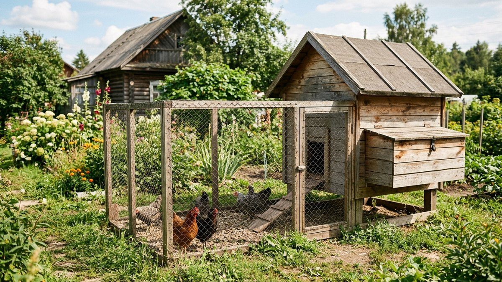
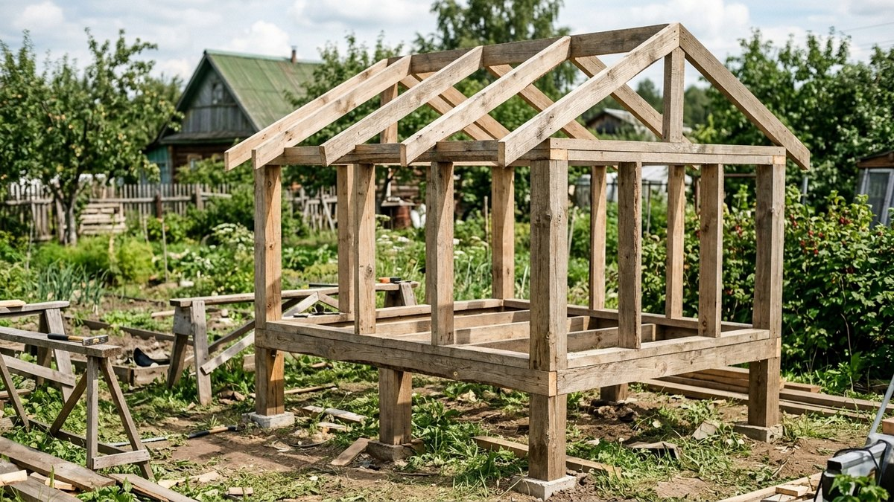
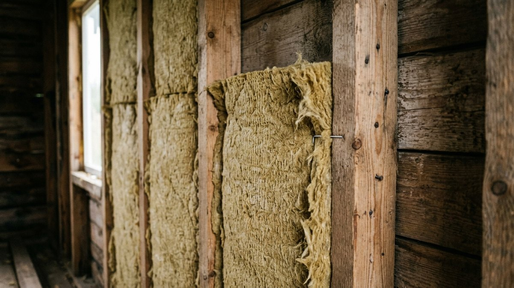
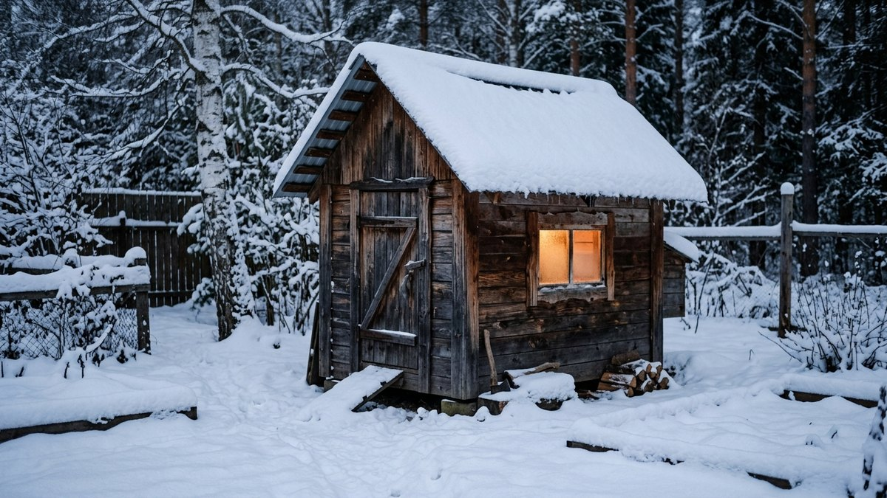
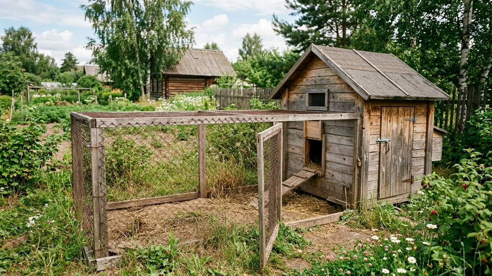
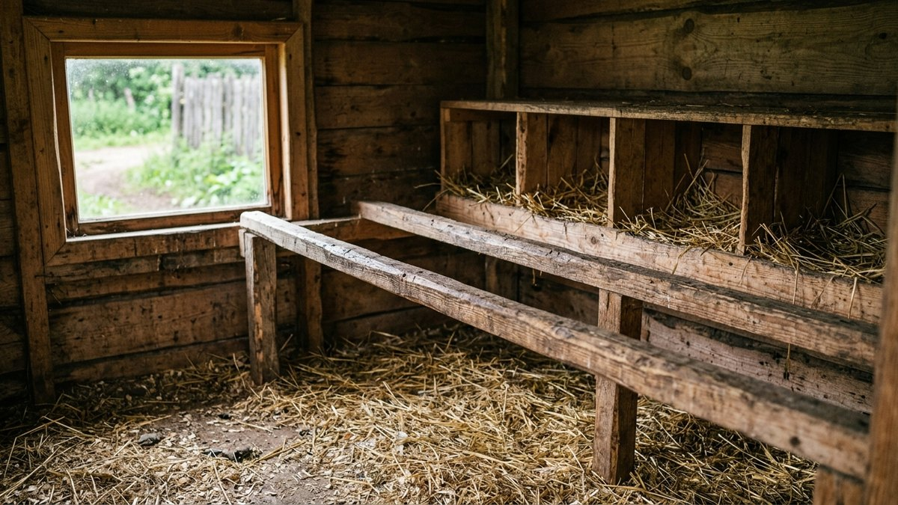

# Курятник своими руками: зимний, всесезонный, на 10 кур

Курятник, собранный «на глаз» по первой попавшейся картинке, обычно
подводит зимой: куры мёрзнут или, наоборот, задыхаются без вентиляции,
яйца замерзают в гнёздах, а вода в поилке превращается в лёд к обеду.
Разберём, как построить всесезонный курятник своими руками на 10 кур —
с расчётом площади, утеплением, вентиляцией без сквозняков и насестами
правильной высоты, — чтобы куры неслись и зимой, а не только с весны до
осени.

## Сколько места нужно на 10 кур

Норма для напольного содержания — 3–4 курицы на 1 м² площади пола. Для
10 кур это 2,5–3,3 м², но комфортнее строить с запасом: 3×2 м (6 м²) —
типовой размер, при котором курам не тесно даже в морозы, когда они почти
не выходят на выгул и весь день проводят внутри.

- **Высота** — 1,8–2 м, чтобы можно было заходить убирать не пригнувшись.
- **Насесты** — 20–25 см длины насеста на курицу, то есть на 10 кур
  достаточно 2–2,5 погонных метра. Высота от пола — 50–60 см, шаг между
  жердями (если насестов несколько) — не менее 35 см, иначе куры будут
  пачкать друг друга пометом.
- **Гнёзда** — одно гнездо 30×30×30 см на 4–5 кур, для 10 кур хватит
  2–3 гнёзд. Гнёзда ставят в затемнённом углу, ниже уровня насестов, —
  иначе куры будут спать в гнёздах, а не на насесте, и пачкать их.

## Фундамент и каркас

Курятник, в отличие от [сарая](https://mir-doma.pro/saray-svoimi-rukami/),
почти всегда ставят на невысоком свайном или столбчатом фундаменте с
подъёмом пола на 30–40 см от земли — это защита от грызунов снизу и от
сырости, которая для птицы опаснее холода.

1. **Опоры** — винтовые сваи или бетонные столбики по периметру и в
   середине длинных пролётов, шаг 1,5–2 м.
2. **Нижняя обвязка** — брус 100×100 или 150×150 мм по сваям, с
   гидроизоляцией (рубероид) между бетоном и деревом.
3. **Лаги и черновой пол** — брус 50×100 мм с шагом 50–60 см, сверху
   доска или влагостойкая фанера.
4. **Каркас стен** — брус или доска 50×100 мм, стойки с шагом 60 см под
   стандартный лист утеплителя.
5. **Стропильная система крыши** — односкатная крыша проще и дешевле, с
   уклоном в сторону от выгула, чтобы дождевая вода не лила на площадку
   у входа.

## Утепление для всесезонного содержания

Куры переносят холод лучше, чем сырость и сквозняк, — куриная порода,
рассчитанная на содержание в средней полосе, комфортно чувствует себя
при температуре до −10…−15°C, если в курятнике сухо и нет продувания.
Тем не менее для действительно всесезонного курятника стены стоит
утеплить:

- **Минеральная вата** 50–100 мм между стойками каркаса, закрытая
  пароизоляцией изнутри и ветрозащитой снаружи — тот же принцип
  «пирога», что и в стенах жилого дома.
- **Пол** — утепление особенно важно снизу, курица теряет тепло через
  лапы: слой утеплителя между лагами плюс толстая подстилка (опилки,
  солома) 10–15 см поверх пола.
- **Потолок** — утепляют в первую очередь, тёплый воздух уходит вверх:
  100–150 мм утеплителя по чердачному перекрытию.

Без электричества зимний курятник спасает **глубокая подстилка**: слой
соломы или опилок 20–30 см, который не меняют полностью всю зиму, а
только подсыпают сверху. Внутри такой подстилки идёт медленное
разложение с выделением тепла — естественный подогрев пола без
электроприборов.

## Вентиляция без сквозняков

Это главная ошибка большинства самодельных курятников: либо духота и
сырость от дыхания и помёта 10 птиц в закрытом объёме, либо сквозняк,
от которого куры простужаются вернее, чем от мороза. Решение — вытяжная
вентиляция без горизонтального продувания:

1. **Приточное отверстие** внизу одной стены, ближе к полу, с задвижкой
   для регулировки в сильный мороз.
2. **Вытяжная труба или отверстие** в верхней части противоположной
   стены или в коньке крыши, с обратным клапаном или задвижкой.
3. Воздух должен идти по диагонали снизу вверх через весь объём, а не
   напрямую от одного отверстия к другому на уровне насестов — иначе
   куры на насесте окажутся прямо на сквозняке.

Проверить работу вентиляции просто: если утром на стенах и потолке иней
или конденсат, а не только у самих птиц, — вытяжки не хватает, сечение
трубы нужно увеличить.

## Освещение и световой день зимой

Куры несутся хуже при световом дне короче 12–14 часов — зимой это
означает или снижение яйценоскости, или досветку. Простое решение —
светодиодная лампа на таймере, включающая свет рано утром и продлевающая
световой день до нужной продолжительности, без искусственного света
после заката (резкое отключение света хуже, чем его отсутствие: куры не
успевают зайти на насест в темноте).

## Выгул и защита от хищников

Даже зимний курятник строят с выгулом — огороженной площадкой, куда
куры выходят в морозные, но безветренные дни. Сетку выгула заглубляют в
землю на 20–30 см или отгибают наружу буквой Г — лисы и куницы легко
подкапываются под прямую сетку. Верх выгула тоже стоит затянуть сеткой:
без этого куры становятся лёгкой добычей для ястреба сверху.

## Частые ошибки

- **Курятник без вентиляции «для тепла».** Наглухо закрытый курятник
  быстро становится сырым — сырость выхолаживает сильнее, чем щель с
  правильной вытяжкой.
- **Насесты вплотную к стене без зазора.** Куры на насесте у самой
  стены мёрзнут от промерзающей поверхности стены даже при нормальной
  температуре воздуха — оставляйте 15–20 см от стены.
- **Гнёзда выше насестов.** Куры инстинктивно стремятся забраться повыше
  на ночь — если гнёзда выше насестов, там и будут ночевать, пачкая
  гнёзда пометом.
- **Пол без утепления при утеплённых стенах.** Половина теплопотерь зимой
  уходит через пол, если он не утеплён, — экономия на утеплении пола
  сводит на нет утепление стен.

## Частые вопросы

### Сколько кур можно держать в курятнике 3 на 2 метра

При норме 3–4 курицы на 1 м² в курятнике 3×2 м (6 м²) можно комфортно
держать 18–20 кур напольно. Для 10 кур такой размер даёт запас, который
пригодится, если поголовье вырастет.

### Нужно ли отопление в курятнике зимой

Для большинства пород средней полосы — нет, если курятник утеплён и
защищён от сквозняков: куры переносят до −10…−15°C сами. Отопление
нужно только в регионах с более суровыми морозами или для теплолюбивых
пород.

### Какой высоты делать насест в курятнике

50–60 см от пола — куры легко запрыгивают, не травмируя лапы, и насест
не продувается от щели под стеной, если она есть.

### Сколько гнёзд нужно на 10 кур

2–3 гнезда размером 30×30×30 см — одно гнездо используют по очереди
4–5 кур, они не несутся одновременно.

### Как защитить курятник от крыс и хищников

Поднять пол на сваях на 30–40 см от земли, зашить цоколь сеткой с мелкой
ячейкой, заглубить сетку выгула в грунт на 20–30 см. Дверь курятника
на ночь закрывать — большинство хищников охотятся именно ночью.

## Заключение

Всесезонный курятник на 10 кур держится на трёх вещах: приподнятом
утеплённом полу, вытяжной вентиляции без прямого сквозняка и насестах
на правильной высоте вдали от промерзающих стен. Материалы и каркас — те
же, что и у любой лёгкой хозпостройки на даче, разница только в
утеплении, вентиляции и внутренней планировке под птицу.
