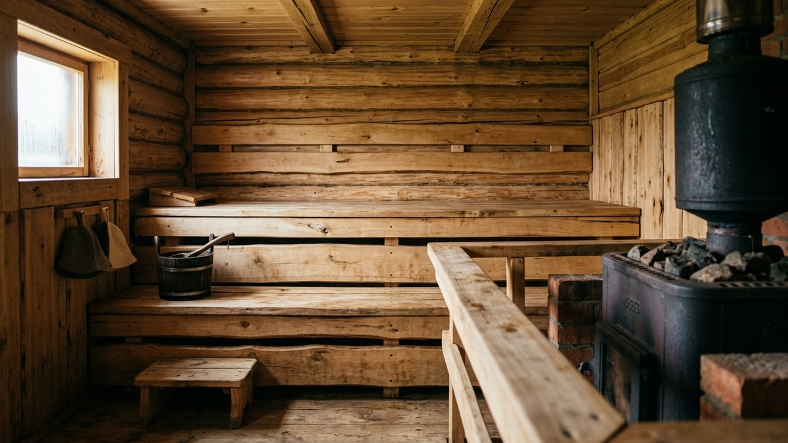
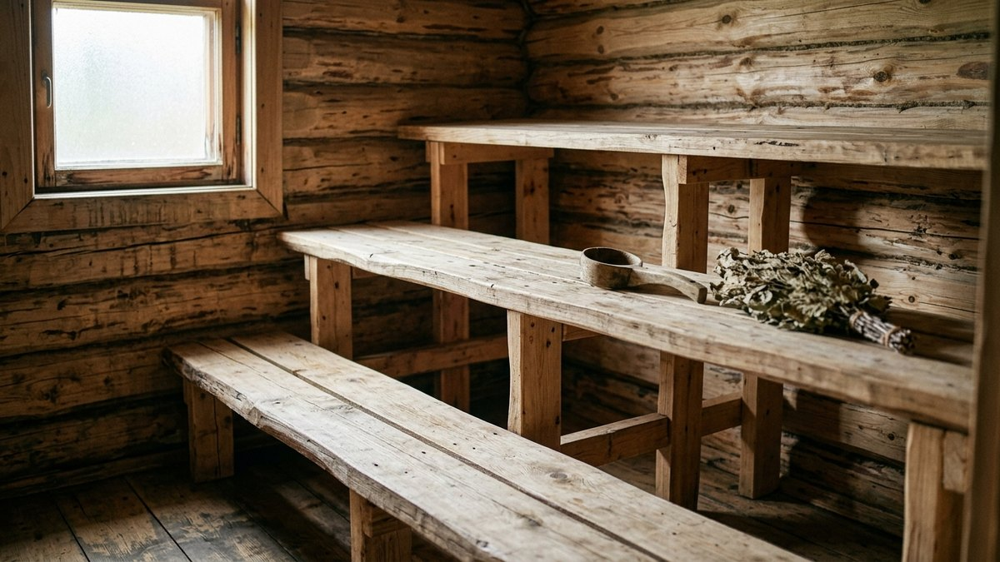
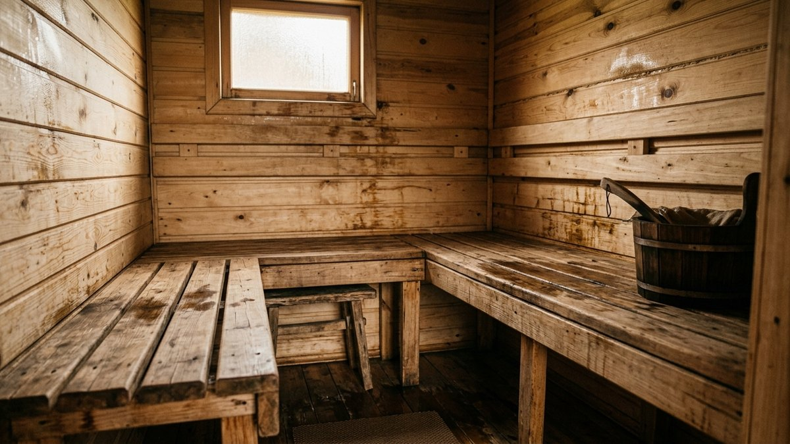
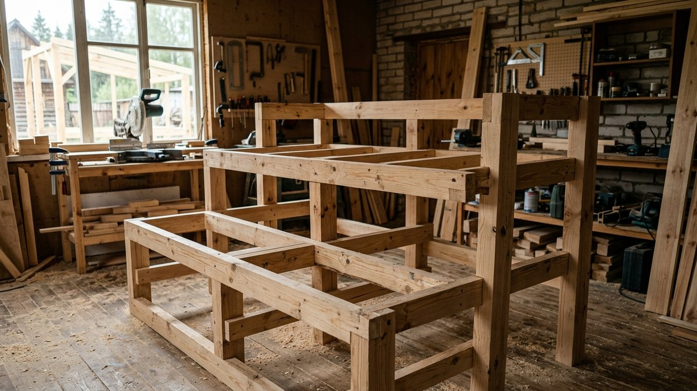
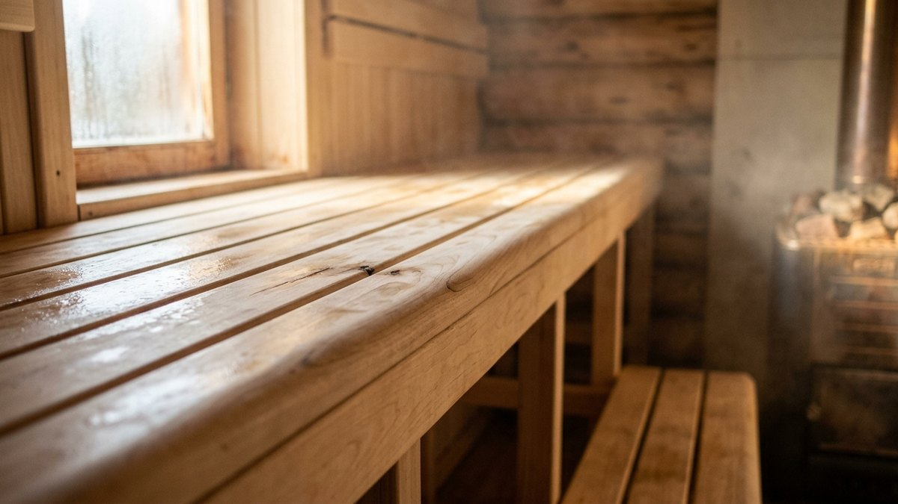
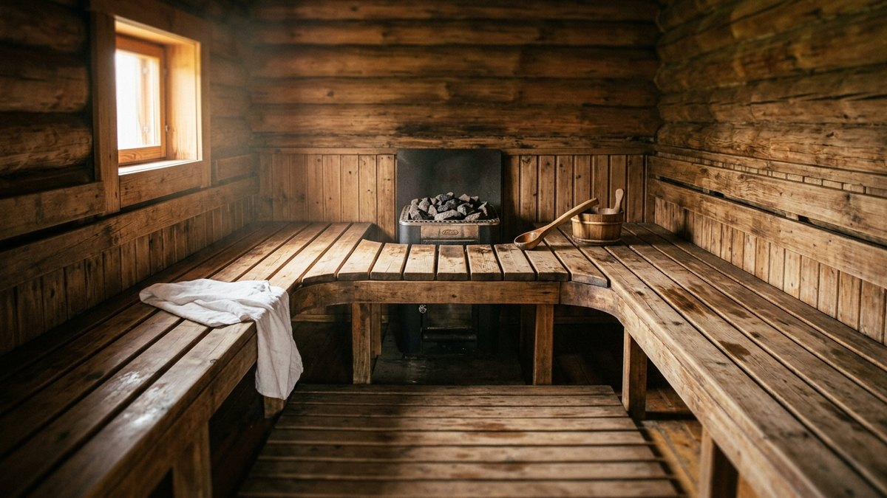

Сруб готов, печь стоит — и тут выясняется, что полки в парилке нельзя делать
из того же бруса, что стены. Дерево для полка соприкасается с голой кожей
при 60–90°C, и ошибка в породе оборачивается либо ожогом о раскалённый сучок
смолы, либо занозой на самом неудобном месте. В этой статье — какую древесину
брать и почему, размеры полков по ярусам, три рабочие схемы расстановки под
разный размер парилки и порядок сборки без единого видимого гвоздя.

## Почему для полка нельзя брать то же дерево, что для стен

Сруб бани почти всегда — хвоя: сосна или ель, дешевле и доступнее лиственных
пород. Для стен это нормально, а для полка — нет, по трём причинам.

Во-первых, смола. При нагреве до температуры парилки смоляные карманы в
сосне и ели начинают выделять смолу — она пачкает кожу и полотенца, а при
прямом контакте с раскалённым сучком можно получить настоящий ожог.
Во-вторых, теплоёмкость: хвоя нагревается быстрее лиственных пород и на
верхнем полке становится некомфортно горячей на ощупь уже через 10–15 минут
после захода. В-третьих, смола под воздействием пара и высокой температуры
годами оставляет на коже липкий след, который не смывается обычным душем.

Вывод простой: сруб — хвоя, полки и лежаки — только лиственные породы без
смолы. Это единственное на бане место, где экономить на материале не стоит.

## Какую породу дерева выбрать для полка

| Порода | Нагрев | Занозы | Цена | Особенность |
|---|---|---|---|---|
| Липа | Низкий, приятный на ощупь | Минимум при правильной шлифовке | Средняя | Классика для полка, лёгкая в обработке |
| Абаш (термоабаш) | Самый низкий из всех пород | Практически нет | Высокая | Не темнеет и не рассыхается, для верхнего полка — оптимум |
| Осина | Низкий | Требует тщательной шлифовки | Низкая | Бюджетная замена липе, чуть грубее на ощупь |
| Ольха | Средний | Минимум | Средняя | Розоватый оттенок, устойчива к влаге |
| Кедр | Средний | Минимум | Высокая | Хвойная порода, но смолы почти нет — компромисс, если хочется хвойный аромат |
| Дуб | Высокий | Нет | Высокая | Слишком нагревается, для полка не годится, разве что для нижней ступени |

Для верхнего, самого горячего полка берите абаш или липу — они остаются
тёплыми, но не обжигающими даже при температуре парилки под потолком 100°C
и выше. На нижние и средние ярусы, где температура на 15–20°C ниже, подойдёт
и осина — разница в бюджете на комплект полков ощутимая, особенно если
парилка большая.

Сосну и ель для полка не берите вообще, даже шлифованную и покрытую маслом:
смола всё равно проступит при первом же серьёзном прогреве.

## Размеры полков по ярусам

Классическая баня строится на трёх уровнях температуры и трёх ярусах полков:

- **Нижний полок (лежак-приступка)** — высота от пола 20–30 см, ширина
  40–50 см. Используется для захода в парилку и как ступень для верхних
  ярусов. Температура здесь на 25–30°C ниже, чем под потолком.
- **Средний полок** — высота 50–65 см, ширина 60–70 см. Основной рабочий
  уровень для сидения, самый универсальный по комфорту.
- **Верхний полок** — высота 90–110 см (расстояние до потолка должно
  оставаться не менее 110–120 см, чтобы не задевать головой при парении
  веником стоя на коленях). Ширина для лежания — от 90 см, чтобы вытянуться
  в полный рост подросток или невысокий взрослый; для полноценного
  взрослого лежака нужно 180–200 см в длину.

Глубина каждого яруса — от 40 см для сидения, от 90 см для положения лёжа.
Если парилка тесная и лечь негде, делайте хотя бы средний ярус глубиной
60–70 см с возможностью откинуться назад, обопершись на стену — это
частично компенсирует невозможность лечь.

Зазор между досками настила — 15–20 мм: без него вода и конденсат
скапливаются на поверхности, доски дольше сохнут и быстрее гниют изнутри.

## Три схемы расстановки под размер парилки

### П-образная — для парилки от 2,5×2,5 м

Полки идут вдоль трёх стен буквой П, свободна только стена с печью и
дверью. Схема вмещает максимум людей одновременно и подходит для семейной
бани, куда парятся компанией. Минус — на маленькой площади верхний ярус
получается коротким, лежать в полный рост не выйдет.

### Угловая — для парилки от 2×2 м

Полки занимают два смежных угла, оставляя свободной стену с печью и
проход. При том же метраже, что и П-образная схема, угловая даёт более
длинный полок по одной из сторон — можно лечь в полный рост хотя бы на
одном ярусе. Оптимальный вариант для бани на 1–2 человек за раз.

### Сплошная (островная) — для парилки от 3×3 м

Широкий помост вдоль одной длинной стены, часто в два яруса без нижней
ступени — площадь позволяет обойтись без неё. Подходит для бань, где
парятся по одному, лёжа, с веником в полный размах — для такого нужен
запас пространства над полком не меньше 130–140 см.

Если баня строится с нуля, размер парилки под полки стоит закладывать на
этапе проекта сруба — почитайте про планировку помещений в статье
[баня из бруса своими руками](https://mir-doma.pro/banya-iz-brusa-svoimi-rukami/),
там разбор того, как парилка вписывается в общий периметр. А если сруб уже
стоит на фундаменте и его размеры заданы заранее, свериться с реальными
допусками поможет статья [фундамент под баню своими руками](https://mir-doma.pro/fundament-pod-banyu-svoimi-rukami/) —
там же таблица минимальных площадей под разные форматы парилки.

## Как собрать полок своими руками: порядок работ

1. **Каркас.** Собирается из бруса 50×70 или 40×60 мм — хвоя тут допустима,
   каркас не касается тела напрямую. Крепится к стенам и полу саморезами
   в предварительно засверленные отверстия.
2. **Настил.** Доска-полок толщиной 28–35 мм, шлифованная минимум до
   Р120, а лучше до Р180 — чем выше зернистость, тем меньше риск занозы.
   Крепится к каркасу снизу через потайные пазы или деревянные нагели —
   ни один метиз не должен быть виден или доступен коже сверху.
3. **Обработка кромок.** Все видимые и контактные грани закругляются
   фрезером радиусом от 5 мм — острые углы на распаренной коже ощущаются
   гораздо болезненнее, чем кажется на сухую.
4. **Пропитка.** Только специализированное масло для бань на основе
   льняного или растительного воска, без синтетических лаков и морилок —
   любое покрытие с химией начинает пахнуть и выделять летучие вещества
   при нагреве. Пропитка наносится в 2 слоя с просушкой между ними.
5. **Съёмные щиты (опционально).** Верхний и средний ярусы удобно делать
   съёмными щитами на пазах — так проще просушивать баню после каждого
   захода и менять полки по мере износа без разборки каркаса.

Печь для парилки — отдельная и не менее важная тема: какой металл
выдержит регулярный нагрев и как он влияет на температуру у полков,
разобрано в статье [печь для бани из металла](https://mir-doma.pro/pech-dlya-bani-iz-metalla/).
От того, как печь установлена и куда идёт поток горячего воздуха, зависит и
приточная вентиляция парилки — без неё верхний полок будет душным даже при
правильно подобранном дереве, подробнее в статье
[вентиляция в бане своими руками](https://mir-doma.pro/ventilyaciya-v-bane-svoimi-rukami/).

## Частые ошибки

- **Металлический крепёж на видимых поверхностях.** Даже утопленный шуруп
  за месяц эксплуатации нагревается и оставляет ожог при случайном касании
  ладонью или спиной.
- **Экономия на шлифовке.** Занозы от полка — самая частая бытовая травма
  в бане, и почти всегда причина одна: сэкономили на финальной шлифовке.
- **Лак или морилка вместо масла.** Синтетическое покрытие при нагреве
  парилки начинает пахнуть и трескается уже через один сезон — снимать его
  придётся полной шлифовкой.
- **Полки впритык к стене без вентиляционного зазора.** Без зазора 10–15 мм
  между полком и стеной древесина не просыхает и начинает чернеть от
  плесени в течение года.
- **Неправильный расчёт высоты верхнего яруса.** Если не оставить 110–120 см
  до потолка, париться веником стоя на коленях станет физически неудобно —
  придётся либо снижать полок, либо мириться с неудобством.

## Частые вопросы

### Из какого дерева лучше делать полки в бане

Липа или абаш — минимальный нагрев и минимум смолы. Осина — бюджетнее и
почти не уступает по комфорту, если тщательно отшлифована. Хвойные породы
(сосна, ель) для полка не подходят из-за смолы.

### Какая высота должна быть у полков в бане

Три яруса: нижний 20–30 см, средний 50–65 см, верхний 90–110 см от пола.
До потолка над верхним ярусом нужно оставлять не менее 110–120 см свободного
пространства.

### Нужно ли покрывать полки в бане лаком

Нет. Лак и морилка при нагреве парилки начинают пахнуть и трескаются за
один сезон. Используется только специализированное масло для бань без
синтетических добавков.

### Можно ли делать полки из сосны, если хорошо просушить доску

Нет, просушка не убирает смоляные карманы — при нагреве парилки смола
всё равно выступит на поверхность, независимо от влажности древесины на
момент монтажа.

### Какое расстояние нужно между досками полка

15–20 мм — достаточно, чтобы вода и конденсат не задерживались на
поверхности, но недостаточно, чтобы доска проваливалась под весом
человека.
