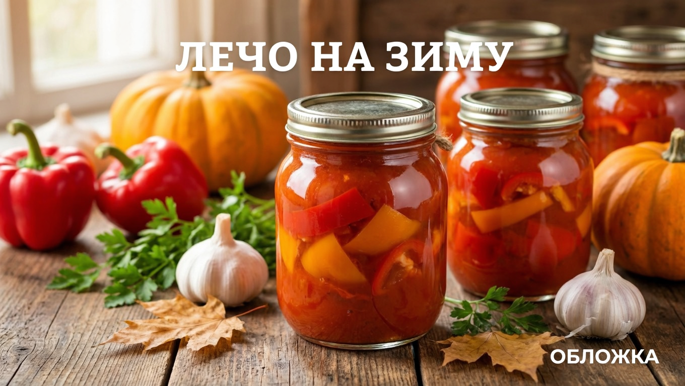
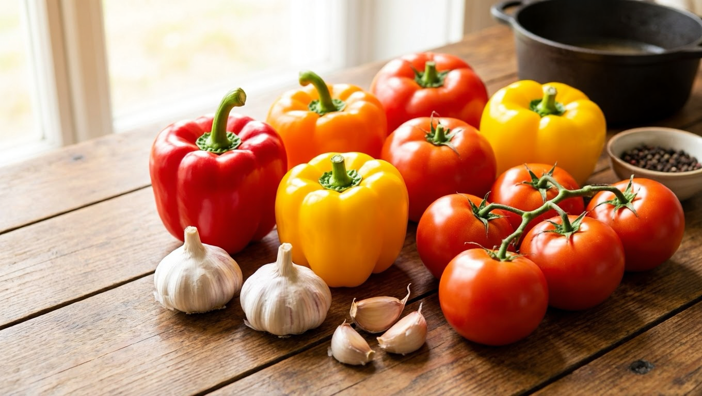
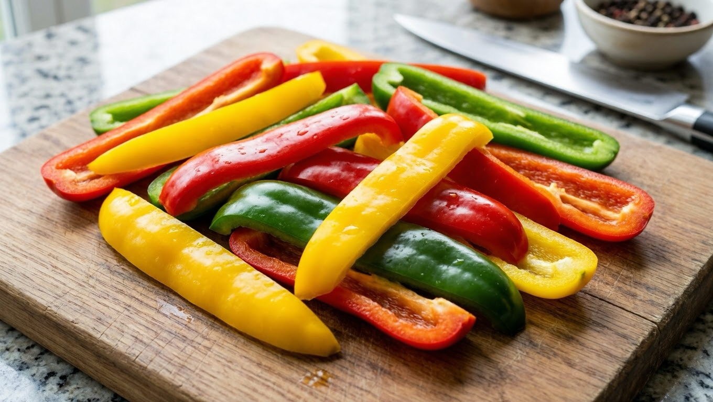
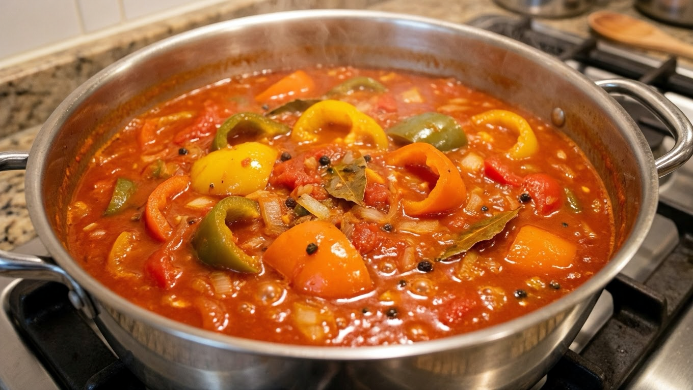
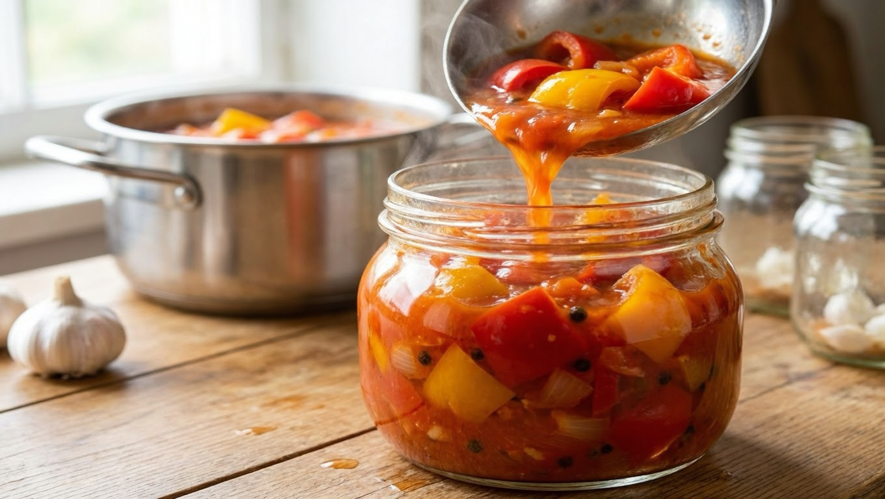
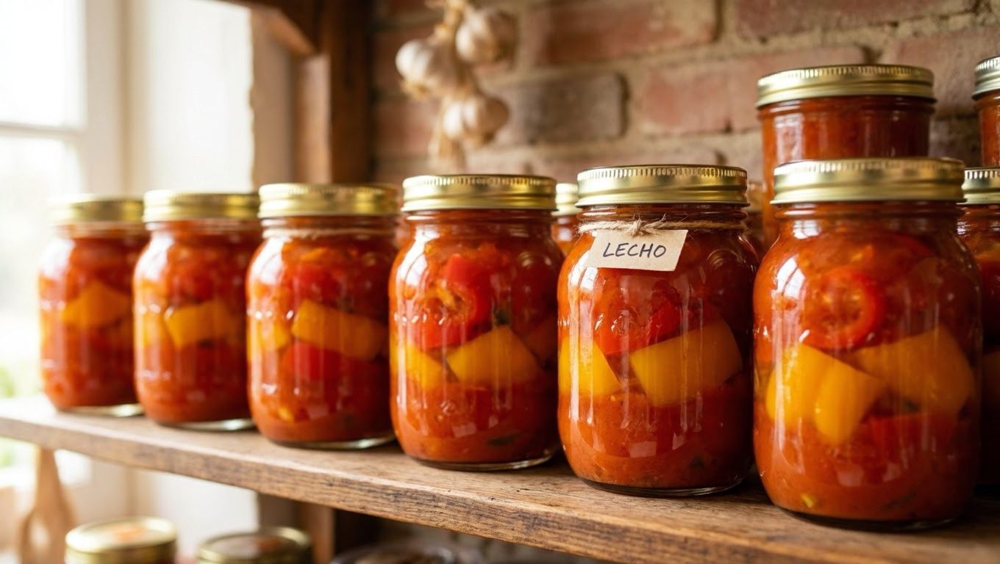

Лечо — одна из самых любимых овощных заготовок: сладкий болгарский перец в густой томатной заливке одинаково хорош и как закуска, и как основа для супов, рагу и соусов. Готовится оно просто, а осенью, когда перец и помидоры идут с грядки один за другим, лечо буквально просится в банки. Разберём классический рецепт лечо на зиму «пальчики оближешь», проверенные варианты и секреты густой ароматной заготовки.

## 🫑 Что такое лечо

Классическое лечо — это болгарский перец, тушённый в томатной заливке. В основе всего два главных овоща: **сладкий перец и помидоры**. Всё остальное — лук, морковь, специи, острота — вариативно и добавляется по вкусу.

Именно перец здесь главный: он должен остаться кусочками и слегка похрустывать, а не развариться в пюре. Помидоры же превращаются в густую ароматную заливку, которая связывает заготовку.

## 🥕 Ингредиенты

Классический набор на выход примерно 2–2,5 литра:

- сладкий болгарский перец — 2 кг (очищенный);
- помидоры — 2 кг (или 700 г томатной пасты + вода);
- сахар — 100 г (около 4–5 ст. ложек);
- соль — 1–1,5 ст. ложки;
- растительное масло — 100 мл;
- уксус 9% — 2–3 ст. ложки;
- чеснок — 4–5 зубчиков (по желанию);
- специи — чёрный перец, лавровый лист.

Берите **мясистый перец** разных цветов — заготовка будет и вкуснее, и красивее. Помидоры — спелые и мягкие, они лучше развариваются в соус.

## 🍲 Классический рецепт лечо на зиму

Пошагово — рецепт, который получается всегда:

1. **Подготовка.** Перец очистить от семян и нарезать крупными полосками или квадратами. Помидоры пропустить через мясорубку или блендер (можно предварительно снять кожицу).
2. **Основа.** Томатную массу вылить в казан или толстостенную кастрюлю, добавить сахар, соль, масло. Довести до кипения и проварить 10 минут.
3. **Тушение перца.** Заложить перец в кипящую томатную заливку, перемешать и тушить на слабом огне **20–25 минут** — перец должен стать мягким, но остаться кусочками.
4. **Финал.** За 5 минут до готовности добавить уксус, продавленный чеснок и специи, прогреть.
5. **Закатка.** Горячее лечо разложить в стерилизованные банки, закатать крышками, перевернуть и укутать до остывания.

## 🔀 Варианты приготовления

Один базовый рецепт легко превратить в несколько:

- **С луком и морковью.** Классический венгерский вариант: обжаренные лук и морковь делают лечо слаще и гуще.
- **С томатной пастой.** Быстрее и надёжнее по густоте: пасту разводят водой вместо свежих помидоров.
- **Острое лечо.** Добавьте острый перец чили или больше чеснока — получится пикантная закуска.
- **Лечо с рисом или фасолью.** Более сытный вариант — почти готовый гарнир в банке.
- **Без уксуса.** Со стерилизацией банок и лимонной кислотой вместо уксуса — для тех, кому он не подходит.

## 💡 Секреты вкусного лечо

Чтобы лечо получилось густым, ярким и хорошо хранилось:

- **Не переваривайте перец** — он должен остаться кусочками и чуть похрустывать, а не расползтись. 20–25 минут обычно достаточно.
- **Густоту даёт уваривание** томатной основы: если заливка жидковата, проварите её подольше до закладки перца.
- **Берите мясистый перец** разных цветов — толстостенные сорта держат форму и делают лечо красивым.
- **Уксус — для надёжного хранения**, не пропускайте его (или заменяйте лимонной кислотой при стерилизации).
- **Стерилизуйте банки и крышки** и закатывайте лечо горячим — тогда заготовка не вздуется.

## 🫙 Как и сколько хранить

Лечо с уксусом, закатанное в стерильные банки, спокойно стоит **до года** в тёмном прохладном месте — погребе, подвале или кладовке. Несколько правил:

- банки и крышки обязательно стерилизовать, лечо закатывать горячим;
- для долгого хранения не пропускать уксус или лимонную кислоту;
- вскрытую банку держать в холодильнике и съесть за несколько дней.

Общие правила хранения заготовок — в статье [как хранить овощи зимой](https://mir-doma.pro/kak-hranit-ovoshchi-zimoy/).

## 🍽️ С чем подавать и как использовать лечо

Лечо хорошо тем, что это не только закуска. Зимой одна банка выручает по-разному:

- **как самостоятельная закуска** — к мясу, картошке, кашам;
- **как заправка для супов** — ложка лечо делает борщ или овощной суп ярче и насыщеннее;
- **как основа для рагу и тушёных блюд** — добавляют к мясу, курице, овощам;
- **как соус** — к макаронам, рису, гречке;
- **как начинка** — в омлет, запеканку или на бутерброд.

По сути это концентрат летних овощей, который зимой заменяет свежие перец и помидоры во множестве блюд. Поэтому лечо заготавливают с запасом — расходится оно быстро.

**Как приготовить классическое лечо на зиму?**
Нарезать сладкий перец, помидоры пропустить через мясорубку, проварить томатную основу с солью, сахаром и маслом, заложить перец и тушить 20–25 минут, в конце добавить уксус и чеснок, разложить по стерильным банкам и закатать.

**Какие пропорции перца и помидоров в лечо?**
В классическом рецепте перца и помидоров берут поровну — примерно 1:1 (по 2 кг). Помидоры можно заменить томатной пастой, разведённой водой.

**Почему лечо получается жидким?**
Не уварилась томатная основа. Перед закладкой перца заливку проваривают до нужной густоты, а если лечо всё равно жидкое — тушат дольше. Паста даёт более густой результат, чем свежие помидоры.

**Нужно ли стерилизовать банки для лечо?**
Да, банки и крышки стерилизуют, а лечо раскладывают горячим и сразу закатывают. Это защита от вздутия и плесени.

**Сколько варить перец в лечо?**
Перец тушат в томатной заливке 20–25 минут — он должен стать мягким, но остаться кусочками. Если переварить, он расползётся в пюре.

**Можно ли сделать лечо без уксуса?**
Да — с лимонной кислотой вместо уксуса и обязательной стерилизацией банок. Без консерванта и стерилизации лечо хранят только в холодильнике и недолго.

**Сколько хранится лечо на зиму?**
Закатанное с уксусом в стерильные банки — до года в прохладном тёмном месте. Вскрытую банку хранят в холодильнике и съедают за несколько дней.

---

Лечо — тот случай, когда простые перец и помидоры превращаются в универсальную заготовку на все случаи: и закуска, и заправка для борща, и основа для рагу. Приготовьте классический вариант, а дальше подстраивайте под себя — с морковью, острое или сытное с фасолью. Другие сезонные заготовки — [помидоры на зиму](https://mir-doma.pro/pomidory-na-zimu-recepty/), [огурцы на зиму](https://mir-doma.pro/ogurtsy-na-zimu/) и [кабачковая икра](https://mir-doma.pro/kabachkovaya-ikra-na-zimu/).
