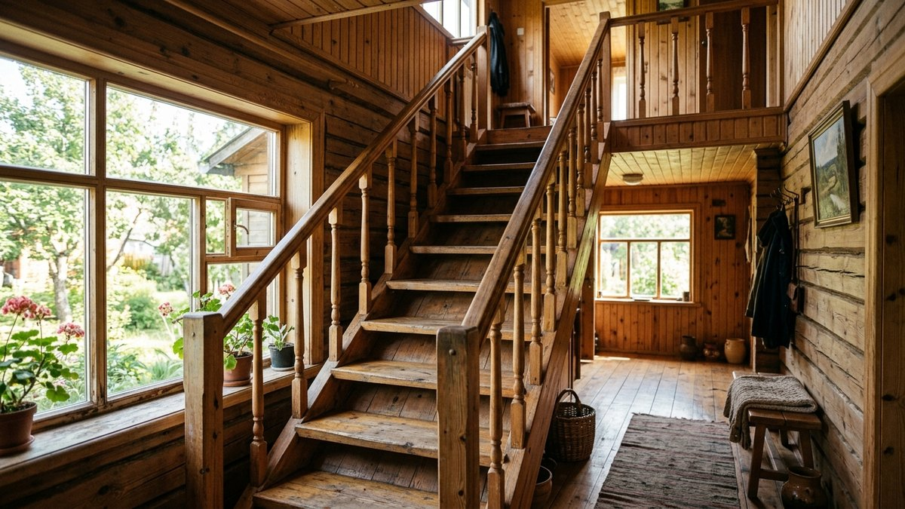
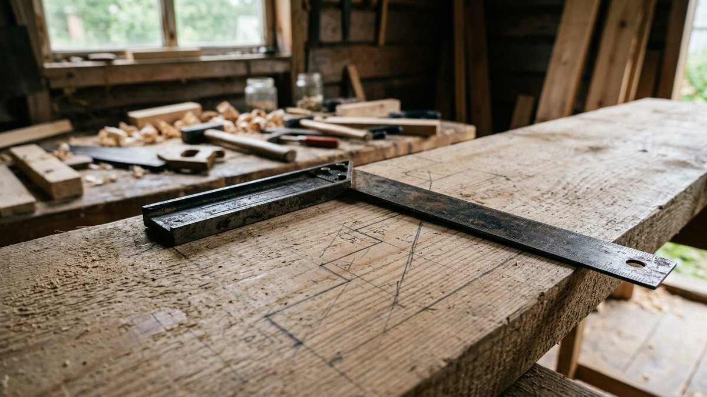
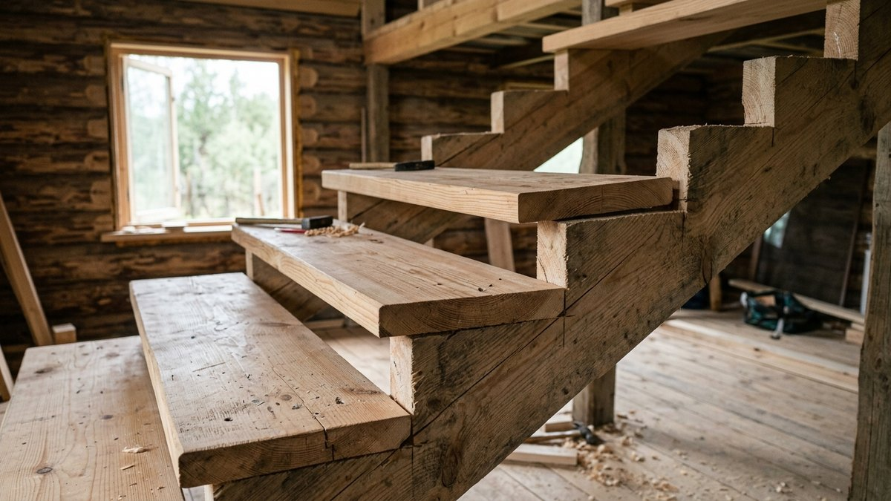
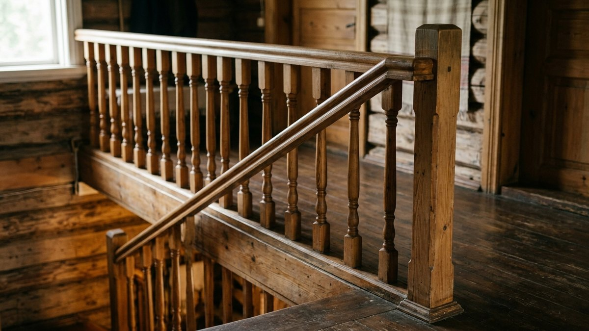
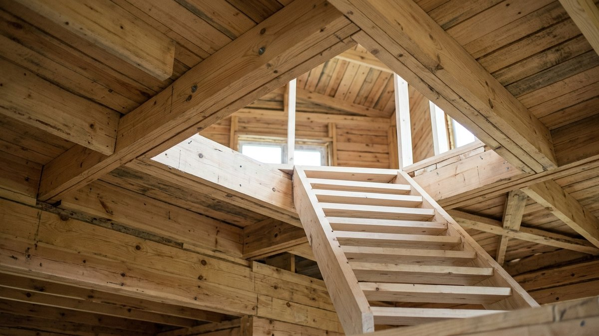
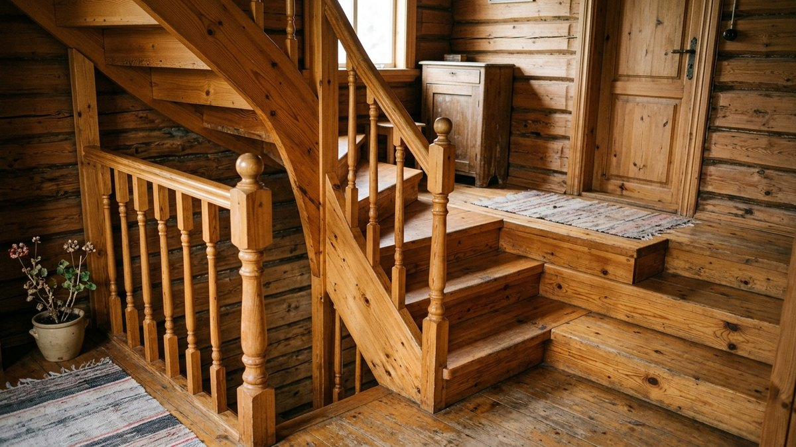

# Лестница на второй этаж своими руками: расчёт ступеней, косоуры и сборка

На даче лестницу на второй этаж или мансарду часто делают
«по месту» — и потом годами спотыкаются на ступенях разной высоты или
спускаются спиной вперёд, потому что лестница вышла слишком крутой.
Удобство лестницы определяется расчётом, а не красотой перил. Разберём,
как сделать лестницу на второй этаж своими руками: как посчитать
количество и размер ступеней под вашу высоту и проём, чем косоур
отличается от тетивы, какую древесину выбрать и как собрать прямую
лестницу на косоурах по шагам. В калькуляторе — полный расчёт под ваши
размеры.

## Какую лестницу выбрать

| Тип | Сколько места | Удобство | Сложность |
|---|---|---|---|
| Прямая одномаршевая | Больше всего по длине | Самая удобная и безопасная | Самая простая |
| С поворотом и площадкой | Меньше по длине, больше по ширине | Удобная, есть место для отдыха | Средняя |
| С забежными ступенями | Компактнее площадки | Менее удобная в зоне поворота | Средняя |
| Винтовая | Минимум | Неудобно носить вещи | Сложная без готового комплекта |
| «Гусиный шаг» | Очень мало | Только для мансарды и чердака | Средняя |

Для дачи со вторым этажом, куда ходят каждый день, лучший выбор —
**прямая лестница** или лестница с площадкой. Винтовую и «гусиный шаг»
оставляют для мансарды, куда поднимаются редко.

## Правила удобной лестницы

- **Высота ступени** — 15–20 см, оптимально 16–18.
- **Глубина проступи** — 25–32 см: на ступень должна вставать вся стопа.
- **Формула шага**: удвоенная высота ступени плюс глубина проступи
  равны 60–65 см — это средний шаг взрослого человека. Лестница, которая
  не укладывается в эту формулу, неудобна, даже если все ступени
  одинаковы.
- **Угол** — 30–40°. Круче 45° — уже лестница-трап.
- **Ширина марша** — от 80 см, удобно 90–100 см.
- **Высота над ступенями** до потолка или края проёма — не меньше
  1,9–2 м, иначе придётся пригибаться.
- **Все ступени одинаковой высоты.** Разница даже в 1–2 см — прямой
  путь к падению: нога «запоминает» шаг.

## Калькулятор ступеней

Введите высоту от чистого пола первого этажа до чистого пола второго и
длину, которую лестница может занять по полу. Калькулятор подберёт
число ступеней, их высоту и проступь, проверит формулу шага и угол и
посчитает длину косоура.

<!-- wp:html -->

  
Расчёт прямой лестницы на второй этаж

  <label class="md-calc__label" for="mdStH">Высота от пола до пола второго этажа, см</label>
  <input type="number" id="mdStH" class="md-calc__input" min="150" max="400" step="1" value="280">
  <label class="md-calc__label" for="mdStL">Длина лестницы по полу (горизонтальная проекция), см</label>
  <input type="number" id="mdStL" class="md-calc__input" min="100" max="700" step="5" value="400">
  
Заполните поля

<!-- /wp:html -->

Верхняя «ступень» — это сам пол второго этажа, поэтому проступей на
одну меньше, чем подъёмов. Это частая ошибка при расчёте «на глаз».

## Косоур или тетива

- **Косоур** — наклонная балка с вырезанными «зубьями», на которые сверху
  кладут ступени. Проще в изготовлении, ступени лежат на опоре.
  Для дачной лестницы это основной вариант.
- **Тетива** — наклонная балка без вырезов, ступени врезаются в её
  боковую поверхность в пазы или ставятся на опорные бруски. Смотрится
  аккуратнее, но требует точной работы.

Для марша шириной до 1 м хватает двух косоуров, для более широкого
ставят третий посередине.

## Материалы

- **Косоуры** — доска 50×250 или 50×300 мм без крупных сучков, после
  вырезки зубьев под ними должно остаться не меньше 10–12 см сплошного
  дерева.
- **Ступени** — доска 40 мм (сосна, лиственница) или щит 40 мм из берёзы
  или дуба. Сосна мягкая и со временем истирается, лиственница и
  берёза прочнее.
- **Подступенки** — доска или фанера 15–20 мм, если лестница закрытая.
- **Перила и балясины** — готовые или из бруса 50×50.
- **Крепёж** — анкеры для крепления косоуров к полу, металлические
  опоры или врубка в балку перекрытия наверху, конфирматы и шурупы для
  ступеней, столярный клей.

Древесина должна быть сухой, иначе лестница заскрипит и поведёт после
первого отопительного сезона.

## Сборка прямой лестницы на косоурах

1. **Разметьте косоур.** Проведите расчётные высоту и проступь
   строительным угольником по доске, от нижнего края. Нижний подъём
   сделайте ниже на толщину ступени: после укладки ступени все высоты
   сравняются.
2. **Вырежьте зубья** ручной или циркулярной пилой, не заходя за линию,
   углы дорежьте ножовкой.
3. **Примерьте первый косоур** по месту, проверьте горизонтальность
   площадок уровнем. Если всё верно, используйте его как шаблон для
   второго.
4. **Закрепите косоуры** внизу — анкерами к полу или к опорному
   брусу, вверху — к балке перекрытия через металлические опоры или
   врубку.
5. **Установите подступенки**, если лестница закрытая.
6. **Уложите ступени** на клей и шурупы снизу или скрытым крепежом.
   Ступень выступает над подступенком на 2–3 см.
7. **Установите опорные столбы и балясины**, затем поручень на высоте
   около 90 см.
8. **Отшлифуйте и покройте** ступени износостойким лаком или маслом с
   воском. Лучше матовым: глянцевые ступени скользят.

## Проём в перекрытии

Если проёма ещё нет, его прорезают по расчёту так, чтобы над любой
ступенью оставалось не меньше 1,9–2 м до края перекрытия. Перерезанные
балки перекрытия обязательно подхватывают поперечными ригелями, иначе
перекрытие начнёт прогибаться. Если вы делаете лестницу при ремонте
старого дома, проверьте состояние балок: как оценить, что старый дом
требует серьёзного ремонта, объяснено в статье
[как обновить старую дачу](https://mir-doma.pro/kak-obnovit-staruyu-dachu/).

Лестница часто ведёт на мансарду. Если мансарда ещё не утеплена,
займитесь этим до отделки лестничного проёма: как утеплить крышу и
мансарду, разобрано в статье
[утепление крыши и мансарды](https://mir-doma.pro/uteplenie-kryshi-i-mansardy/).

## Если лестница скрипит

Скрип почти всегда даёт трение ступени о косоур или подступенок.
Помогают клей в соединениях, дополнительные шурупы снизу и сухая
древесина. Та же логика, что и у скрипящего пола — подробнее в статье
[ремонт деревянного пола на даче](https://mir-doma.pro/remont-derevyannogo-pola/).

## Частые ошибки

- **Ступени разной высоты.** Самая опасная ошибка. Разметка по
  шаблону и проверка каждой площадки уровнем.
- **Не учли толщину ступени у нижнего подъёма.** Первая ступень
  выходит выше остальных.
- **Слишком крутая лестница.** Больше 45° — спускаться придётся лицом к
  ступеням.
- **Мало места над головой.** Край проёма бьёт по голове на средних
  ступенях.
- **Сырая древесина.** Скрип и щели после первой зимы с отоплением.
- **Глянцевый лак на ступенях.** Скользко, особенно в носках.

## Частые вопросы

### Как рассчитать лестницу на второй этаж

Разделите высоту от пола до пола на 17–18 см и округлите: получится
число подъёмов. Проступей на одну меньше. Глубину проступи подберите
так, чтобы удвоенная высота ступени плюс проступь давали 60–65 см. Всё
это считает калькулятор выше.

### Какой высоты должна быть ступень лестницы

15–20 см, оптимально 16–18 см. Все ступени одной лестницы — строго
одинаковой высоты.

### Какой угол наклона лестницы удобен

30–40°. Лестницы круче 45° подходят только для чердака или мансарды,
куда поднимаются редко.

### Какая ширина лестницы на второй этаж нужна

От 80 см, удобно 90–100 см. По узкой лестнице трудно поднимать мебель
и расходиться вдвоём.

### Из какого дерева лучше делать ступени

Из лиственницы, берёзы или дуба — они прочнее сосны и медленнее
истираются. Сосна подходит для косоуров и для бюджетной лестницы.

## Итог

Лестница на второй этаж своими руками начинается с расчёта: высота
ступени 16–18 см, формула шага 60–65 см, угол 30–40° и одинаковые
ступени. Для дачи проще всего прямая лестница на двух косоурах из доски
50×250–300 мм со ступенями из лиственницы или берёзы. Посчитайте свою
лестницу в калькуляторе, сделайте косоур-шаблон и только потом режьте
второй.
