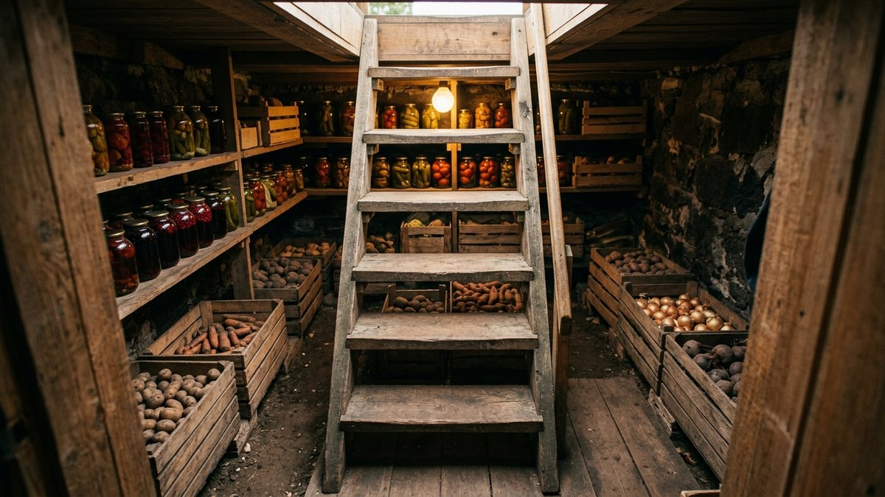
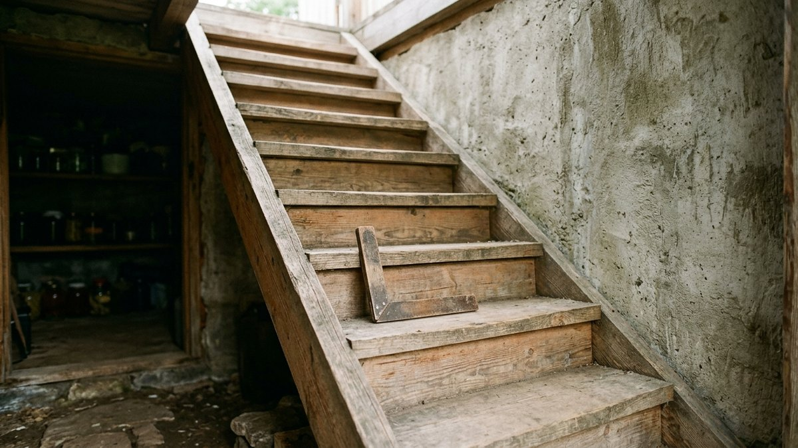
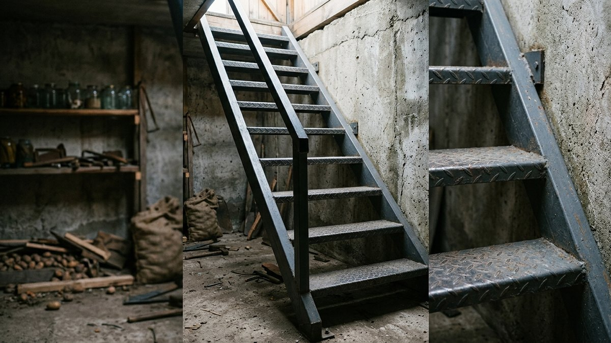
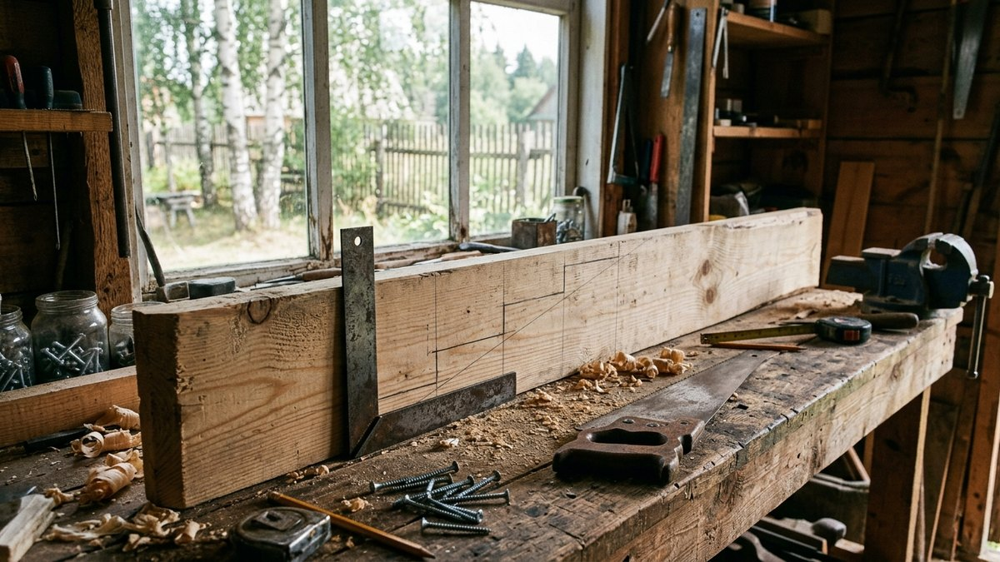
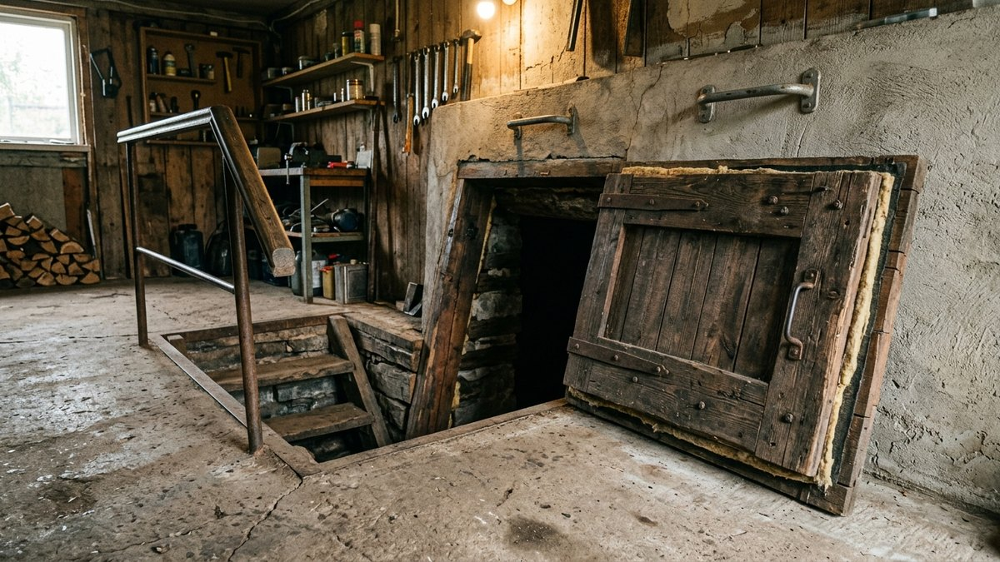
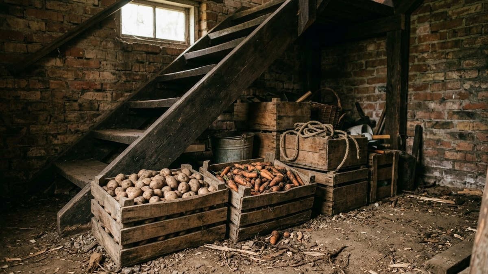

Лестница в погреб своими руками кажется мелочью после копки котлована
и гидроизоляции. Но именно по ней вы будете спускаться с ящиками картошки
и банками каждую неделю с октября по апрель. Слишком крутая — опасно
с грузом, слишком пологая — съедает половину погреба. Деревянная без
защиты сгниёт за 3–4 сезона, а металлическая без покраски заржавеет
ещё быстрее. Разберём, какой угол и шаг ступеней выбрать, чем дерево
отличается от металла в сыром погребе, как собрать лестницу на тетивах
по шагам. В статье есть калькулятор: по глубине погреба он посчитает длину
тетивы, число ступеней и сколько места лестница займёт на полу.

## Какая лестница подходит для погреба

| Тип | Угол | Место на полу при глубине 2,2 м | Когда выбирать |
|---|---|---|---|
| Приставная деревянная | 70–75° | 0,6–0,8 м | Овощная яма в гараже, маленький погреб, люк 60×80 см |
| Стационарная на тетивах | 55–65° | 1,1–1,5 м | Типовой погреб 2×2–2,5×3 м, спуск с ящиками |
| Металлическая сварная | 55–70° | 0,8–1,5 м | Погреб с высокой влажностью, где дерево гниёт |
| Бетонная или кирпичная | 40–45° | 2,2–2,6 м | Отдельный вход сбоку, большой погреб, строится вместе с ним |

Для обычного дачного погреба под домом или в гараже чаще всего правильный
выбор — стационарная лестница на двух тетивах с углом около 60°. Она
устойчивая, по ней спускаются лицом вперёд с одной свободной рукой,
и она ещё помещается в погреб шириной 2 м. Приставная хороша, только если
спускаться приходится редко и без груза.

Бетонные ступени делают на этапе строительства: если погреб уже готов,
врезать их некуда. Как устроены стены, перекрытие и люк при строительстве
погреба в гараже, разобрано в статье про
[погреб в гараже своими руками](https://mir-doma.pro/pogreb-v-garazhe-svoimi-rukami/).

## Размеры: угол, шаг и ширина

Правила для погреба отличаются от лестницы в доме: места меньше, поэтому
лестница круче, но по ней носят груз, поэтому ступени должны быть
надёжнее.

- **Угол наклона.** 55–65° — удобно спускаться лицом вперёд с ящиком.
  70–75° — уже лестница-стремянка, по ней спускаются лицом к ступеням.
  Круче 75° с грузом опасно.
- **Высота подъёма ступени.** 18–22 см для лестницы 55–65°, 22–25 см
  для приставной. Главное — одинаковая по всей высоте: разница больше
  1 см и нога «спотыкается» на неожиданной ступени.
- **Ширина доски ступени.** Не меньше 18–20 см на лестнице 60°: на неё
  должна встать вся стопа, иначе нога соскальзывает. На крутой лестнице
  горизонтальный шаг меньше доски, и ступени перекрывают друг друга —
  это нормально. У приставной достаточно 12–15 см.
- **Ширина марша.** 60 см — минимум, 70–80 см — чтобы пройти с ящиком.
- **Люк.** 60×80 см — минимум, 70×90 см — удобно с ящиками. Длинная
  сторона люка идёт вдоль лестницы.
- **Высота над головой.** Пока спускаетесь, край люка не должен оказаться
  на уровне лба: проём над лестницей — от 1,8–1,9 м по вертикали
  от ступени.

## Калькулятор лестницы в погреб

Введите глубину погреба — от пола погреба до уровня пола наверху, — угол
и ширину. Калькулятор подберёт число ступеней с одинаковым шагом, длину
тетивы и покажет, сколько лестница займёт по полу.

<!-- wp:html -->

  
Калькулятор лестницы в погреб

  <label class="md-calc__label" for="mdLpH">Глубина: от пола погреба до пола наверху, см</label>
  <input type="number" id="mdLpH" class="md-calc__input" min="80" step="1" value="220">
  <label class="md-calc__label" for="mdLpA">Угол наклона</label>
  <select id="mdLpA" class="md-calc__input">
    <option value="55">55° — спокойный спуск с грузом</option>
    <option value="60" selected>60° — обычный погреб</option>
    <option value="65">65° — тесный погреб</option>
    <option value="72">72° — приставная, лицом к ступеням</option>
  </select>
  <label class="md-calc__label" for="mdLpW">Ширина лестницы, см</label>
  <input type="number" id="mdLpW" class="md-calc__input" min="40" step="5" value="70">
  
Заполните поля

<!-- /wp:html -->

Пример: погреб глубиной 2,2 м, угол 60°. Получается 11 подъёмов по 20 см,
10 ступеней, тетива около 2,54 м, а по полу лестница займёт 1,27 м.
Горизонтальный шаг при таком угле всего 11–12 см, поэтому ступень из
доски 20 см перекрывает соседнюю почти наполовину — для крутой лестницы
это нормально, нога встаёт на всю ступень. Если
погреб 2×2 м, это больше половины длины: такую лестницу ставят вдоль
стены, а полки — по другим стенам.

## Дерево или металл в сыром погребе

В погребе влажность 85–95% круглый год, поэтому материал выбирают по
стойкости, а не по цене.

| | Дерево | Металл |
|---|---|---|
| Материал | Лиственница, сосна с антисептиком, доска 40–50 мм | Профтруба 60×40×2–3 мм или уголок 50×50 мм на тетивы |
| Ступени | Доска 30–40 мм, шириной 20–25 см | Рифлёный лист 3–4 мм, просечно-вытяжной лист или уголок с деревянным настилом |
| Срок службы | 7–10 лет с пропиткой и без контакта с полом, 3–4 года без защиты | 15–20 лет с покраской, 5–7 без неё |
| Плюсы | Тёплая на ощупь, не скользит, собирается без сварки | Не гниёт, прочнее, тоньше |
| Минусы | Боится сырости и плесени | Нужна сварка, ржавеет на стыках, холодная и скользкая |

Деревянную лестницу делают долговечной три вещи:

1. **Антисептик глубокого проникновения**, два слоя, по всем торцам.
   Торцы тянут влагу сильнее всего, а именно они стоят на полу.
2. **Нижние концы тетив не на земле и не на бетоне.** Подложите кирпич
   на рубероиде, резиновую пластину или поставьте тетивы на металлические
   уголки-«башмаки», закреплённые в полу.
3. **Зазор 3–5 см от стены**, чтобы дерево проветривалось со всех сторон.

Чем обработать дерево в погребе и когда это делать — осенью, до загрузки
урожая, — разобрано в статье про
[обработку погреба осенью](https://mir-doma.pro/obrabotka-pogreba-osenyu/).

Металлическую лестницу зачищают, грунтуют антикоррозийным грунтом и красят
в два слоя эмалью по металлу. Сварные швы — в первую очередь: ржавчина
начинается именно там.

## Как сделать деревянную лестницу в погреб: по шагам

Для лестницы на тетивах понадобятся: две доски 50×200 мм на тетивы,
доски 40×200–250 мм на ступени, брусок 40×40 мм на опорные планки,
оцинкованные саморезы 5×70–80 мм, антисептик.

1. **Замерьте глубину** от пола погреба до пола наверху и посчитайте
   лестницу в калькуляторе. Проверьте, что лестница по полу помещается
   и не упирается в стеллажи.
2. **Разметьте тетиву.** Положите доску под нужным углом от края люка
   до пола (можно прямо в погребе) и отчертите горизонталь пола и
   вертикаль верхнего упора. Отпилите по разметке.
3. **Разметьте ступени.** От нижнего среза вдоль тетивы откладывайте
   одинаковые шаги, на каждой отметке проводите горизонталь угольником
   или уровнем. Обе тетивы размечайте вместе, сложив их, чтобы ступени
   не перекосило.
4. **Закрепите опорные бруски** под каждую ступень по линиям разметки:
   на клей и 2–3 самореза. Для лестницы, по которой носят груз, надёжнее
   врезать ступени в тетиву на глубину 15–20 мм и дополнительно поставить
   брусок снизу.
5. **Пропитайте всё антисептиком** до сборки, особенно торцы.
6. **Соберите лестницу**: ступени на опоры, по 2 самореза с каждой
   стороны. Верхнюю и нижнюю ступени дополнительно стяните шпилькой М10
   через обе тетивы — так лестницу не «разведёт» в стороны.
7. **Закрепите вверху**: тетивы упираются в обвязку люка или балку
   перекрытия и крепятся уголками. Внизу — на «башмаки» или кирпич
   с гидроизоляцией.
8. **Поставьте поручень** хотя бы с одной стороны и ручку у люка, за
   которую можно взяться, выходя наверх.

## Безопасность: что нужно предусмотреть

- **Ручка или поручень у люка.** Самое опасное место — выход наверх:
  руки заняты, держаться не за что. Скоба на стене над люком или
  продолжение поручня выше пола на 0,8–1 м решает проблему.
- **Выключатель света наверху.** Спускаться в темноте по крутой лестнице
  с банками — частая причина травм.
- **Антискользящие накладки** на ступени металлической лестницы и на
  деревянные, если погреб сырой: резиновая лента или насечки.
- **Фиксатор открытой крышки люка.** Упавшая крышка на 20–30 кг — это
  травма головы.
- **Проверка газа.** Если погреб давно закрыт, а в нём хранились овощи,
  перед спуском проверьте, что свеча у пола не гаснет: углекислый газ
  тяжелее воздуха и копится внизу. Как устроить нормальную вентиляцию —
  в статье про [вентиляцию в погребе](https://mir-doma.pro/ventilyaciya-v-pogrebe/).

## Если места мало

- **Лестница вдоль стены**, а полки — напротив. Как разместить стеллажи,
  чтобы лестница им не мешала, разобрано в статье про
  [полки в погреб своими руками](https://mir-doma.pro/polki-v-pogreb-svoimi-rukami/).
- **Полки под лестницей**: под маршем 60° на глубине 2,2 м остаётся
  треугольник около 1,2 м — туда встают ящики с корнеплодами.
- **Откидная лестница**, которая поднимается к стене на петлях, если погреб
  совсем маленький.
- **Приставная лестница с крюками** за край люка: её убирают, когда
  погреб не нужен.

## Частые ошибки

- **Разная высота ступеней.** Из-за неровного пола или ошибки разметки
  нижний шаг выше остальных на 3–5 см. Пол замеряйте в точке, где встанет
  лестница.
- **Тетивы стоят прямо на земле или бетоне.** Нижние 20 см сгнивают за
  2–3 года.
- **Угол «на глаз» круче 70°** у стационарной лестницы. С ящиком по ней
  можно только пятиться.
- **Обычные чёрные саморезы.** Ржавеют за сезон, ступени начинают
  шататься. Нужны оцинкованные или нержавеющие.
- **Узкий люк.** 50×50 см хватает человеку, но не человеку с ящиком.
- **Нет поручня.** На выходе с грузом держаться не за что.

## Частые вопросы

### Какой угол наклона лестницы в погреб

Для стационарной лестницы 55–65°: по ней можно спускаться лицом вперёд
с ящиком. Приставную ставят под 70–75° и спускаются лицом к ступеням.
Круче 75° с грузом опасно.

### Из чего лучше сделать лестницу в погреб

В сухом погребе — из лиственницы или сосны с антисептиком, в сыром —
из металла с покраской. Дерево теплее и не скользит, металл не гниёт.
В любом случае нижние концы не должны стоять на земле.

### Какая должна быть ширина лестницы в погреб

Минимум 60 см, удобно 70–80 см, чтобы пройти с ящиком. Люк над
лестницей — не меньше 60×80 см.

### Как рассчитать лестницу в погреб

Разделите глубину погреба на 20 см (на 23 для приставной) и округлите —
это число подъёмов, ступеней на одну меньше. Длина тетивы — глубина,
делённая на синус угла: при 60° примерно 1,15 глубины. Калькулятор выше
делает это сам.

### Чем обработать деревянную лестницу в погребе

Антисептиком глубокого проникновения в два слоя, все торцы обязательно.
Сверху можно лак или масло для влажных помещений. Обработку повторяют
раз в 2–3 года осенью, перед загрузкой урожая.
