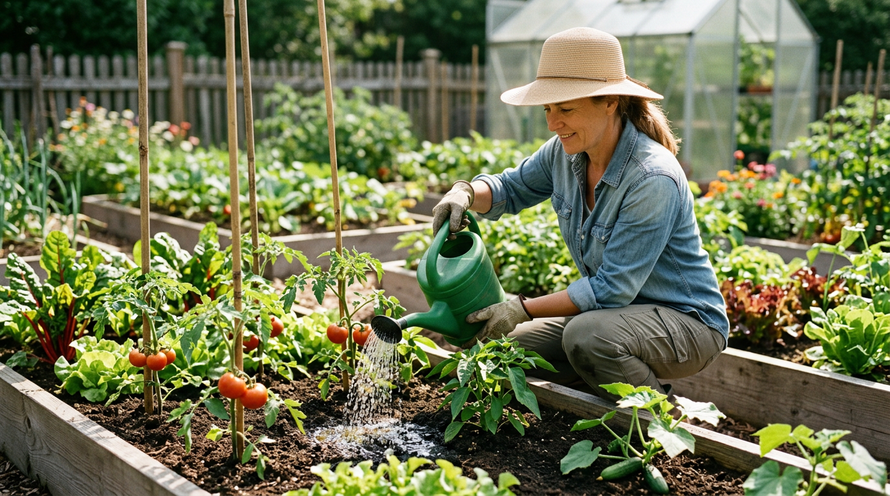
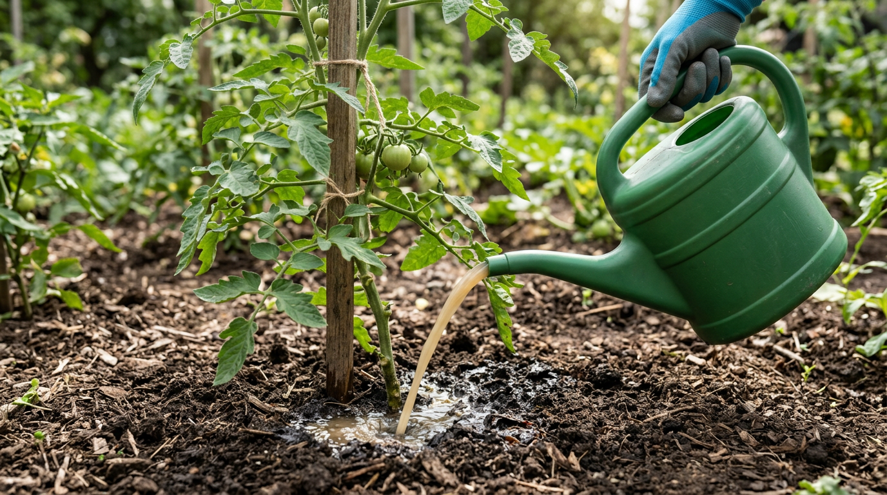
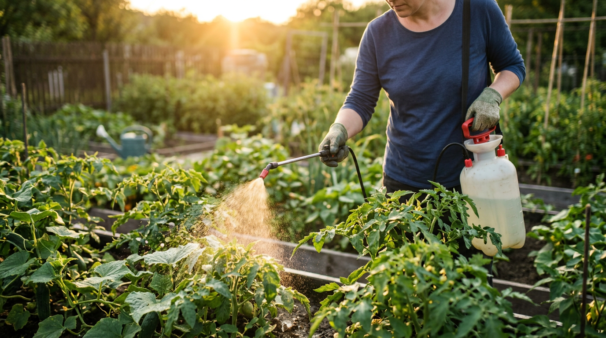
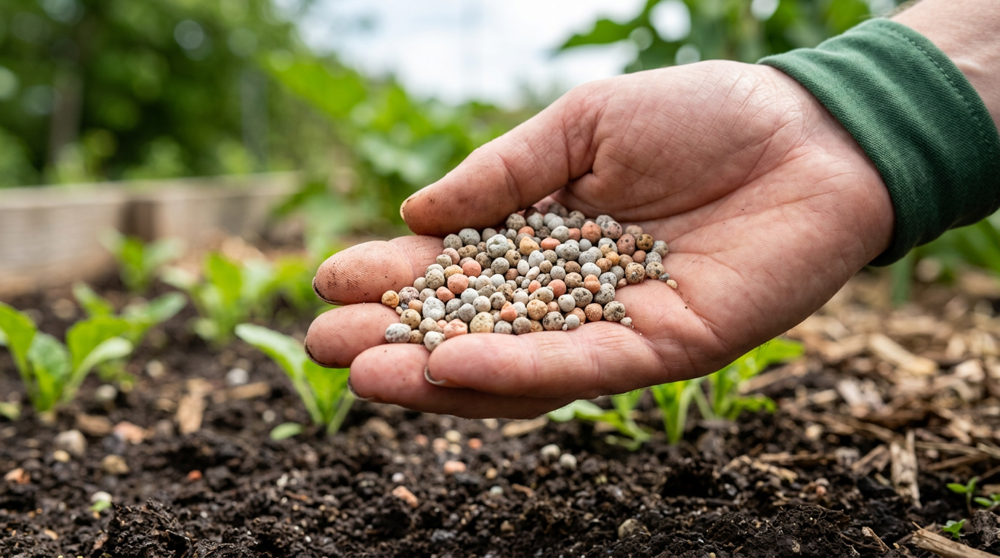
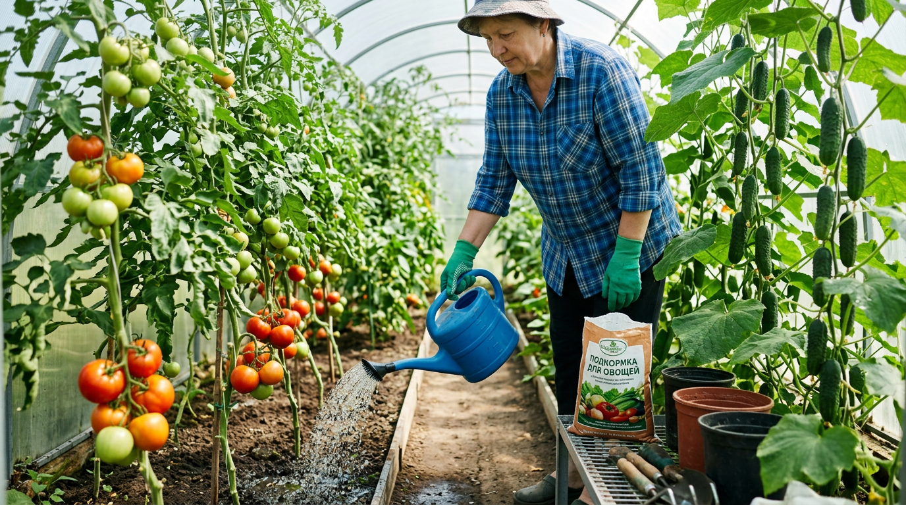
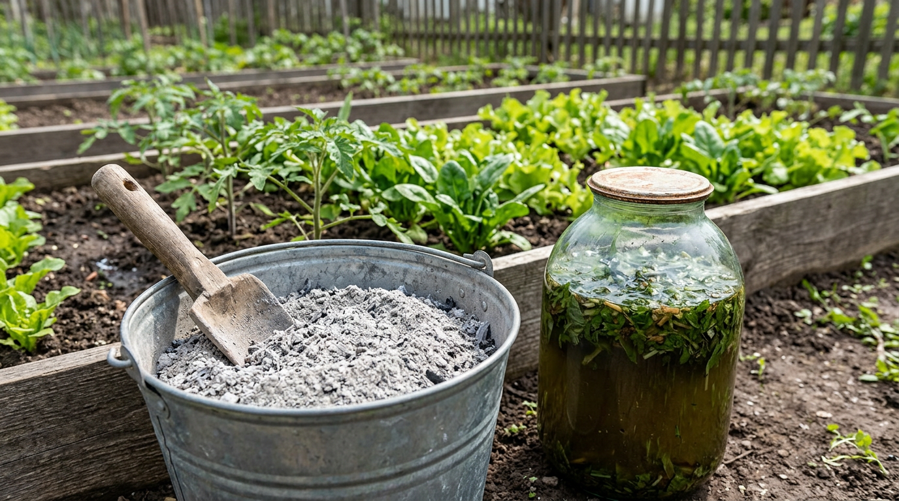

Лето — время, когда овощи активно цветут, завязывают и наливают плоды, а значит, тратят максимум сил и питания. Если в этот период растениям не хватает элементов, урожай мельчает, плоды плохо вызревают, а кусты слабеют и чаще болеют. Грамотные летние подкормки помогают восполнить дефицит и получить крупные, вкусные плоды. В этой статье разберём, чем и когда подкормить овощи в июне-июле: какие бывают подкормки, как работают азот, фосфор и калий, чем кормить помидоры, огурцы и перец, какие народные средства использовать и по какому графику всё это делать.

## 🌱 Зачем подкармливать овощи летом

Растениям, как и людям, в разные периоды жизни нужно разное «меню». Весной они наращивают корни и зелёную массу, а летом переключаются на цветение и плодоношение — и здесь их потребности меняются. Если в начале сезона им нужен в основном азот для роста ботвы, то с началом плодоношения на первый план выходят фосфор и калий, отвечающие за налив и вкус плодов.

Подкормки летом решают несколько задач:

- восполняют вынос питательных веществ, которые уходят в активно растущие плоды;
- поддерживают растение в период максимальной нагрузки;
- улучшают вкус, размер и лёжкость урожая;
- повышают устойчивость к болезням и стрессам (жаре, перепадам температур).

Важно понимать: летом избыток азота вреден. Он гонит ботву в ущерб плодам, делает ткани рыхлыми и провоцирует болезни. Поэтому летние подкормки смещают в сторону фосфора, калия и микроэлементов. Это особенно важно в теплице, где растения развиваются быстрее и активнее расходуют питание, чем в открытом грунте.

## 🧪 Какие бывают подкормки

Подкормки различают по способу внесения и по типу удобрения.

### Корневые и внекорневые

**Корневые** подкормки вносят под корень, поливая растворённым удобрением. Это основной способ: питание поступает через корни постепенно и в полном объёме. Главное правило — вносить только по **влажной почве**, после полива или дождя, иначе концентрированный раствор обожжёт корни. Раствор льют не на сам стебель, а в зону корней — по бороздке вокруг растения или в проделанные рядом лунки, чтобы питание дошло до всасывающих корешков.

**Внекорневые** подкормки — это опрыскивание растений по листу слабым раствором удобрения. Через листья элементы усваиваются быстро, поэтому внекорневые подкормки хороши как «скорая помощь» при явном дефиците или в стрессовых условиях, когда корни работают плохо. Раствор для опрыскивания делают в 2–3 раза слабее, чем для корневой подкормки, и проводят его вечером или в пасмурную погоду, чтобы листья не получили ожог. Опрыскивают мелким распылом, смачивая листья с обеих сторон — снизу элементы усваиваются даже лучше. Особенно отзывчивы на внекорневые подкормки огурцы, перец и капуста.

### Органические и минеральные

**Органические** подкормки — настои коровяка и птичьего помёта, зелёные настои трав, зола, компост. Они питают растения мягко и улучшают почву, но действуют медленнее и содержат элементы в «плавающих» концентрациях.

**Минеральные** удобрения — суперфосфат, сульфат калия, монофосфат калия, комплексные смеси. Они дают точную дозу нужного элемента и действуют быстрее.

Минеральные удобрения бывают простыми (содержат один элемент — например, сульфат калия) и комплексными (несколько элементов сразу, как нитроаммофоска). Летом удобны специальные комплексы «для томатов» или «для огурцов» с пониженным азотом и повышенным калием. Лучший же результат даёт **чередование** органики и минералки: так растение получает и быстрое доступное питание, и здоровую, живую почву.

## 📊 Чем подкармливать: азот, фосфор и калий

В основе любого питания — три главных элемента, которые обозначают буквами NPK. Понимание их роли помогает не ошибиться с летней подкормкой.

| Элемент | За что отвечает | Когда особенно нужен |
|---------|-----------------|----------------------|
| Азот (N) | Рост зелёной массы, ботвы | Весна, начало роста |
| Фосфор (P) | Корни, цветение, завязь плодов | Цветение, плодоношение |
| Калий (K) | Налив, вкус, устойчивость к болезням | Плодоношение, созревание |

Кроме них растениям нужны микроэлементы: бор (улучшает завязь), магний (отвечает за фотосинтез, его дефицит даёт пожелтение листьев), кальций (защищает от вершинной гнили у томатов). Летом упор делают на фосфорно-калийные подкормки с добавлением микроэлементов, а азот дают умеренно и только при явных признаках его нехватки (бледные мелкие листья, слабый рост). Микроэлементы удобно вносить через готовые комплексные удобрения или внекорневые подкормки — растениям они нужны в малых количествах, но без них не усваиваются и основные элементы.

## 🍅 Подкормка по культурам

У каждой культуры свои предпочтения, поэтому подкормки стоит подбирать индивидуально.

### Помидоры

В период плодоношения томатам нужны калий и фосфор — они отвечают за вкус и налив плодов. Хорошо работают зольный настой, сульфат калия, монофосфат калия. Полезен бор для лучшей завязи и кальций для профилактики вершинной гнили. А вот азот летом томатам дают по минимуму, иначе куст «жирует» — гонит ботву вместо плодов. Подкормки особенно эффективны в сочетании с правильным [пасынкованием и формированием куста](https://mir-doma.pro/pasynkovanie-pomidorov/), которое направляет силы растения в плоды. Сбалансированное питание заодно укрепляет растение и повышает его сопротивляемость болезням — хорошо накормленный куст легче противостоит [фитофторе](https://mir-doma.pro/fitoftora-na-pomidorah/) и стрессам. Если вы только планируете посадки, загляните в статью о [сроках посадки помидоров](https://mir-doma.pro/kogda-sazhat-pomidory-na-rassadu-v-2026/).

### Огурцы

Огурцы — настоящие обжоры: они плодоносят непрерывно и нуждаются в более частых подкормках, чем томаты. В период плодоношения им дают комплексные удобрения с упором на калий и азот (в отличие от помидоров, огурцам азот летом ещё нужен для постоянного нарастания плетей). Отлично подходят настой золы и травяные настои. Свежий навоз в высокой концентрации огурцам противопоказан — он обжигает корни. При нехватке питания у огурцов появляются характерные признаки: плоды-«крючки» и сужение к концу говорят о недостатке калия, а грушевидная форма с узкой «шейкой» — о нехватке азота. По форме плодов удобно понимать, чего не хватает кусту.

### Перец и баклажаны

Этим теплолюбивым культурам в период плодоношения нужны фосфор и калий, а также кальций и магний. Подкармливают их каждые 10–14 дней, чередуя органику и минералку. Перец особенно отзывчив на зольные подкормки и плохо переносит хлор, поэтому хлористый калий ему не дают — берут сульфат калия или золу. Баклажанам, как самым теплолюбивым, важно стабильное питание без резких скачков.

### Капуста и корнеплоды

Капуста любит азотно-калийное питание в период формирования кочана. Корнеплодам (моркови, свёкле) во второй половине лета особенно важен калий — он отвечает за налив и сахаристость, а вот избыток азота для них вреден, так как гонит ботву в ущерб корнеплоду. Морковь и свёкла хорошо отзываются на зольные подкормки и опрыскивание раствором с бором, который улучшает сахаристость и предотвращает растрескивание. Капусте же во второй половине лета, когда завязывается кочан, дают калий, а азот сокращают.

## 🌿 Народные подкормки

Натуральные подкормки безопасны, доступны и хорошо дополняют основное питание.

### Древесная зола

Зола — ценный источник калия, фосфора и микроэлементов. Её вносят сухой под рыхление (стакан на квадратный метр) или готовят настой: стакан золы на 10 л воды, настоять сутки и полить под корень. Зола особенно полезна томатам, перцу и огурцам. Важно: золу не вносят одновременно с азотными удобрениями и свежим навозом — они нейтрализуют друг друга, и азот улетучивается. Между зольной и азотной подкормкой выдерживают хотя бы неделю. Ещё зола слегка раскисляет почву, поэтому особенно полезна на кислых грунтах, но нежелательна под культуры, любящие кислую среду.

### Зелёный травяной настой

Настой из сброженной травы (крапивы, сорняков) — отличная азотная подкормка для первой половины лета. Бочку заполняют травой на две трети, заливают водой, настаивают 7–10 дней до брожения, затем разводят 1:10 и поливают под корень. Такой настой богат азотом и микроэлементами и хорошо подходит для огурцов и капусты. Запах у бродящей травы резкий, поэтому бочку лучше держать в дальнем углу участка и накрывать крышкой. В готовый настой полезно добавить горсть золы — это уравновесит его калием. Поскольку настой богат азотом, во второй половине лета его применяют осторожнее, особенно под томаты.

### Дрожжевая подкормка

Дрожжи стимулируют развитие полезной микрофлоры и рост растений. На 10 л тёплой воды берут 100 г живых дрожжей и пару ложек сахара, дают побродить несколько часов, затем разводят водой 1:5 и поливают. Дрожжевые подкормки работают только в тёплой почве и хорошо сочетаются с зольными (зола восполняет калий, который дрожжи «съедают»). Достаточно двух-трёх дрожжевых подкормок за сезон — это не основное питание, а стимулятор. В холодную погоду они бесполезны, потому что дрожжевые грибки в холодной земле не активны.

## 💧 Главные правила летних подкормок

Чтобы подкормки приносили только пользу, придерживайтесь нескольких простых правил:

- **Только по влажной почве.** Сначала полив или дождь, потом подкормка — иначе ожог корней.
- **В нежаркую погоду.** Утро или вечер для корневых, вечер или пасмурный день для внекорневых.
- **Соблюдайте дозы.** Лучше недокормить, чем перекормить: избыток солей вредит сильнее дефицита.
- **Чередуйте.** Органику с минералкой, корневые с внекорневыми — так питание сбалансировано.
- **Учитывайте культуру.** Помидорам летом меньше азота, огурцам он ещё нужен — универсального рецепта нет.
- **Не кормите больные и угнетённые растения.** Сначала разберитесь с причиной, потом подкармливайте.

Эти правила одинаково работают и в теплице, и в открытом грунте, и для органики, и для минеральных удобрений.

## 🔍 Как распознать нехватку элементов

Растения сами подсказывают, чего им не хватает, — нужно лишь научиться читать эти сигналы. Это помогает подкармливать прицельно, а не вслепую.

- **Азот.** Листья бледнеют, мельчают, нижние желтеют; рост замедляется. Куст выглядит слабым и худым.
- **Фосфор.** Листья и стебли приобретают фиолетовый или багровый оттенок, особенно с нижней стороны; цветение задерживается.
- **Калий.** Края листьев желтеют и засыхают, образуя «краевой ожог»; плоды наливаются плохо и неравномерно.
- **Магний.** Желтеют ткани между жилками, сами жилки остаются зелёными (мраморность) — чаще на нижних листьях.
- **Кальций.** У томатов и перца появляется вершинная гниль — тёмное пятно на верхушке плода.
- **Бор.** Плохо завязываются плоды, осыпаются цветки, деформируются верхушки.

Заметив такой признак, дают соответствующую подкормку — лучше внекорневую, она действует быстрее. Но не спешите винить питание: похожие симптомы дают жара, переувлажнение или болезни, поэтому сначала оцените условия, а уже потом кормите.

## 📅 График подкормок в июне-июле

Чтобы не запутаться, удобно ориентироваться на примерный график. Точные сроки зависят от культуры и региона, но общая логика такая.

| Период | Чем подкармливать | Цель |
|--------|-------------------|------|
| Начало июня | Травяной настой / комплексное | Поддержать рост и цветение |
| Середина июня | Зольный настой, бор по листу | Улучшить завязь плодов |
| Начало июля | Фосфорно-калийная (монофосфат, сульфат калия) | Налив плодов |
| Середина июля | Зольный настой / комплексное | Поддержать плодоношение |
| Конец июля | Калийная подкормка | Вкус и созревание |

Общее правило: подкармливают раз в 10–14 дней, чередуя органические и минеральные подкормки, всегда по влажной почве и в нежаркую погоду.

Этот график — ориентир, а не жёсткая инструкция. Подстраивайте его под погоду и состояние растений: в холодное дождливое лето подкормок нужно меньше, а в жаркое и на бедных почвах — чуть больше. Главное — наблюдать за растениями и реагировать на их сигналы, а не кормить «по календарю» вслепую.

## 🏠 Подкормки в теплице и открытом грунте

В теплице растения растут активнее и расходуют питание быстрее, поэтому подкормки там обычно чуть чаще, но в меньших дозах. При этом в замкнутом пространстве легко перекормить и накопить избыток солей в почве, поэтому важно не превышать нормы и время от времени проливать грядки чистой водой. Подробнее об обустройстве — в статье о [теплице из поликарбоната](https://mir-doma.pro/teplitsa-iz-polikarbonata-svoimi-rukami/).

В открытом грунте часть питания вымывается дождями, поэтому после сильных ливней растениям полезна дополнительная подкормка. Здесь больше работают и природные факторы: дождевая вода, мульча, которая постепенно перегнивает и питает почву. В любом случае подкармливают только по влажной земле и в нежаркую погоду.

## ⚠️ Частые ошибки при подкормках

Подкормки приносят пользу только при правильном применении. Вот типичные ошибки:

- **Перекорм азотом летом.** Растение «жирует»: мощная ботва, мало плодов, рыхлые ткани и склонность к болезням.
- **Подкормка по сухой почве.** Концентрированный раствор обжигает корни. Всегда сначала полейте, потом подкармливайте.
- **Превышение дозировки.** «Больше — лучше» здесь не работает: избыток солей вредит растению. Соблюдайте нормы.
- **Внекорневая подкормка по солнцу.** Капли работают как линзы, и листья получают ожог. Опрыскивайте вечером или в пасмурную погоду.
- **Однообразное питание.** Только минералка истощает почву, только органика не всегда покрывает потребности. Чередуйте.
- **Подкормка больных растений.** Сначала вылечите растение, потом кормите — ослабленный куст не усвоит питание.

## ❓ Частые вопросы

### Как часто подкармливать овощи летом?

В среднем раз в 10–14 дней в период активного плодоношения. Огурцы, которые плодоносят непрерывно, можно подкармливать чуть чаще, а медленнее растущие культуры — реже. Главное — не превышать дозы и чередовать виды подкормок.

### Чем подкормить помидоры во время плодоношения?

Калийно-фосфорными подкормками: зольным настоем, сульфатом или монофосфатом калия. Полезен бор для завязи и кальций против вершинной гнили. Азот в это время дают по минимуму, чтобы куст не гнал ботву в ущерб плодам.

### Можно ли подкармливать овощи в жару?

Корневые подкормки проводят по влажной почве в нежаркое время — утром или вечером. Внекорневые (по листу) в жару и по солнцу делать нельзя: листья получат ожог. Лучшее время для опрыскивания — вечер или пасмурный день.

### Что лучше — органические или минеральные удобрения?

Оба нужны. Органика мягко питает и улучшает почву, минералка даёт точную и быструю дозу элемента. Оптимально их чередовать: так растение получает и доступное питание, и здоровую почву.

### Чем подкормить огурцы для хорошего урожая?

В период плодоношения — комплексными удобрениями с калием и азотом, настоем золы и травяными настоями. Огурцы плодоносят непрерывно и любят частые умеренные подкормки. Свежий концентрированный навоз им противопоказан.

### Нужно ли подкармливать, если земля и так плодородная?

Даже на хорошей почве в период плодоношения растения выносят много питания, и его запас постепенно истощается. Лёгкие поддерживающие подкормки калием и фосфором всё равно полезны. А вот с азотом на плодородной земле стоит быть осторожнее, чтобы не вызвать жирование.

### Можно ли совмещать подкормку с поливом?

Да, и это самый правильный подход: подкормку растворяют в воде и вносят после основного полива, по уже влажной почве. Так питание распределяется равномерно и не обжигает корни. Лить концентрированный раствор по сухой земле нельзя.

### Как понять, какого элемента не хватает растению?

По внешним признакам: бледные мелкие листья и слабый рост — нехватка азота; фиолетовый оттенок листьев — дефицит фосфора; пожелтение и засыхание краёв листьев — недостаток калия; пожелтение между жилками — нехватка магния. По этим сигналам подбирают подкормку.

## Заключение

Летние подкормки — это то, что превращает обычный урожай в богатый. Главное правило сезона: меньше азота, больше фосфора и калия, ведь летом растения наливают плоды, а не наращивают ботву. Чередуйте корневые и внекорневые подкормки, органику и минералку, подбирайте питание под культуру и всегда вносите удобрения по влажной почве в нежаркую погоду. Такой подход даст вам крупные, вкусные и здоровые овощи — и порадует щедрым урожаем до самой осени. И помните: подкормки работают в связке с остальным уходом — поливом, проветриванием, формированием кустов и защитой от болезней. Только вместе они раскрывают потенциал растений.

А чем вы подкармливаете свои овощи летом — больше доверяете народным средствам или минеральным удобрениям? Делитесь рецептами в комментариях и подписывайтесь, чтобы не пропустить новые статьи об уходе за огородом.
