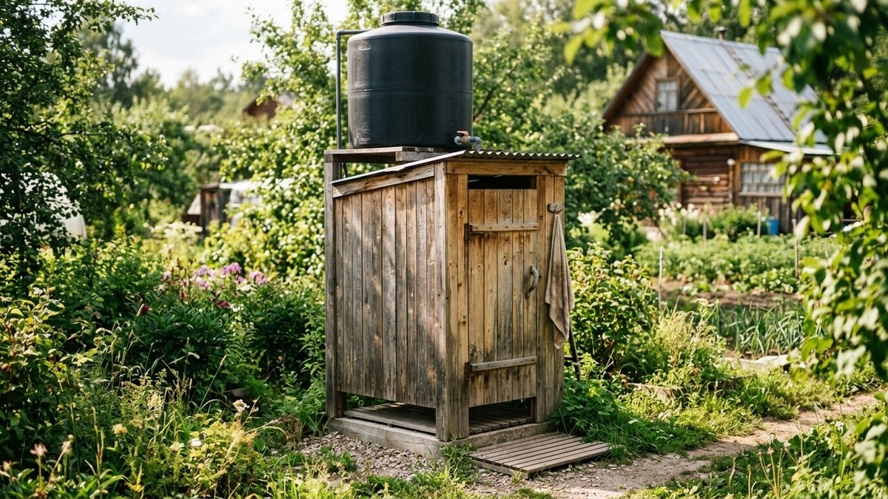
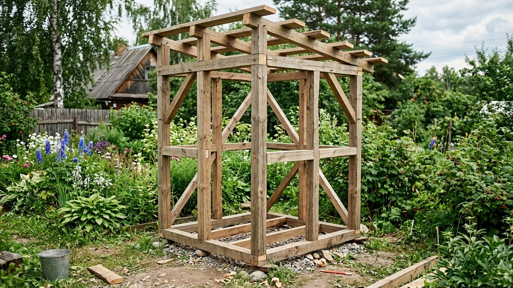
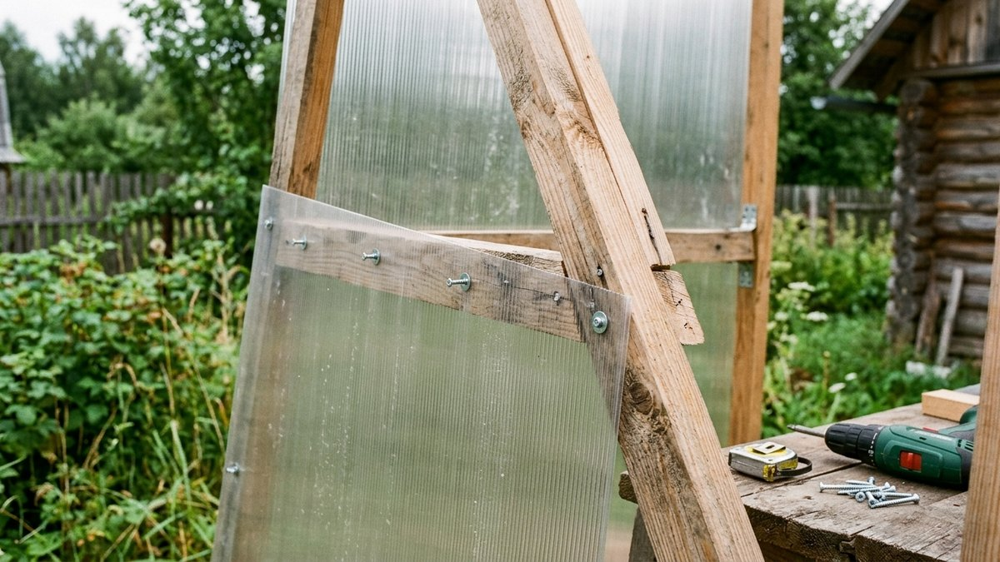
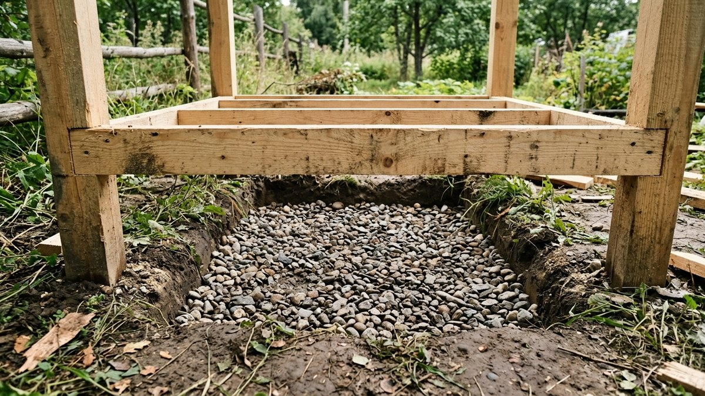
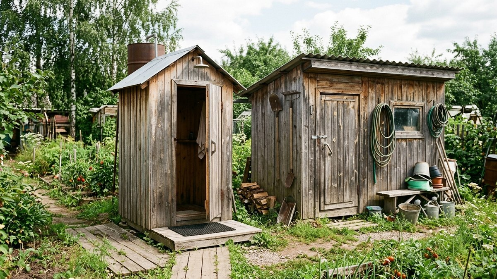
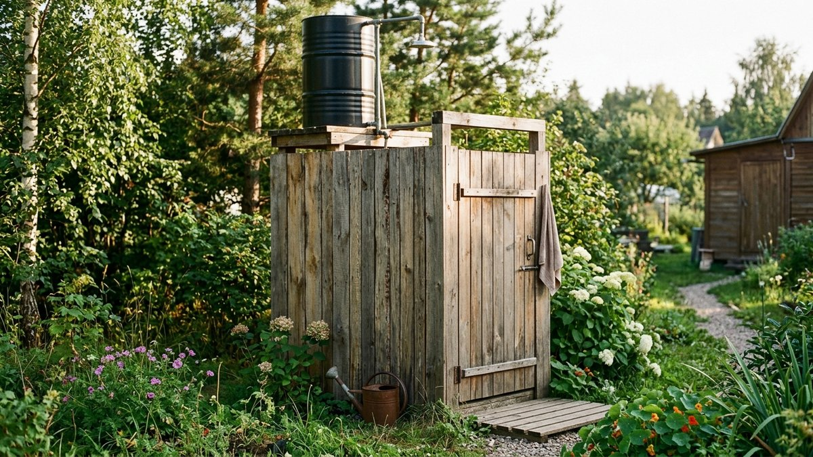

Летний душ — одна из первых построек, которые появляются на участке: вода в баке нагревается солнцем бесплатно, а конструкция намного проще и дешевле капитальной бани. Разберём, из чего состоит летний душ, какого размера делать кабинку и бак, куда девать сток и какие ошибки чаще всего портят удовольствие от такой постройки.

## Из чего состоит летний душ

Конструкция простая и состоит из трёх узлов:

- **Бак для воды** — устанавливается на крыше кабинки, нагревается солнцем за день.
- **Кабинка** — каркас с обшивкой, где человек моется.
- **Слив** — отведение использованной воды от постройки, от простого дренажного колодца до полноценного отвода в канализацию.

## Выбор места

Душ ставят на солнечной, открытой стороне участка — вода в баке нагревается за счёт прямых лучей, и в тени постройка теряет смысл. Учитывайте и уклон: сток должен уходить от дома и колодца/скважины, а не в их сторону. Расстояние от источника питьевой воды до места слива — минимум 8–10 м, чтобы стоки не попадали в воду.

## Размеры кабинки

Стандартная кабинка — 1×1 м в плане при высоте 2,2–2,3 м. Меньше делать не стоит: с мылом и мочалкой в руках в тесной кабинке неудобно разворачиваться. Если планируете совместить душ с переодеванием или добавить крючки для одежды и полку, лучше сразу заложить 1,2×1,2 м.

## Бак: объём, материал и подогрев

Объём бака рассчитывают по числу пользователей и расходу воды: на одного человека в среднем уходит 15–20 л на один душ. Для семьи из 3–4 человек достаточно бака на 100–150 л, для дачи с частыми гостями — 200 л.

Материал бака — оцинкованная сталь или пластик, рассчитанный на нагрев (не любая пластиковая бочка выдерживает нагрев на солнце без деформации — уточняйте у производителя). Чёрный или тёмно-зелёный цвет бака нагревается заметно быстрее, чем светлый: тёмная поверхность поглощает больше солнечного излучения. В пасмурную погоду и в начале сезона, когда солнца недостаточно, выручает электрический тэн, встроенный в бак, — вода нагревается за 1–2 часа независимо от погоды.

<!-- wp:html -->

<h3 class="md-ds__title">Калькулятор объёма бака для летнего душа</h3>

Норма расхода — 15–20 л на человека за один душ, по умолчанию взято среднее значение.

<label class="md-ds__f">Форма бака
<select id="dsShape">
<option value="rect" selected>Прямоугольный (Д×Ш×В)</option>
<option value="cyl">Цилиндрический (Ø×В)</option>
</select></label>
<label class="md-ds__f" id="dsRectWrap">Длина × ширина × высота, см
<input type="number" id="dsL" value="100" min="10" max="300" step="1"><input type="number" id="dsW" value="60" min="10" max="300" step="1"><input type="number" id="dsH" value="30" min="10" max="300" step="1"></label>
<label class="md-ds__f" id="dsCylWrap" hidden>Диаметр × высота, см
<input type="number" id="dsD" value="60" min="10" max="300" step="1"><input type="number" id="dsCh" value="80" min="10" max="300" step="1"></label>
<label class="md-ds__f">Человек в семье<input type="number" id="dsPeople" value="4" min="1" max="20" step="1"></label>
<label class="md-ds__f">Литров на человека за душ<input type="number" id="dsPerPerson" value="18" min="5" max="50" step="1"></label>

Объём бака<b id="dsVol">180 л</b>

Нужно на семью<b id="dsNeed">72 л</b>

Хватит на<b id="dsEnough">Да</b>

Расчёт объёма приблизительный — не учитывает толщину стенок бака.

<button type="button" id="dsCopy" class="md-ds__btn md-ds__btn--main">Скопировать результат</button>
<a id="dsVk" class="md-ds__btn md-ds__btn--vk" href="#" target="_blank" rel="noopener noreferrer">Поделиться ВКонтакте</a>
<a id="dsTg" class="md-ds__btn md-ds__btn--tg" href="#" target="_blank" rel="noopener noreferrer">Поделиться в Telegram</a>
<button type="button" id="dsShareNative" class="md-ds__btn" hidden>Поделиться…</button>
<button type="button" id="dsPrint" class="md-ds__btn">Печать</button>

<!-- /wp:html -->

## Каркас и обшивка

Каркас собирают из бруса 50×50 мм или металлического профиля — оба варианта равноценны по прочности для такой лёгкой постройки, разница только в трудоёмкости монтажа и цене. Высота стоек — на 20–30 см выше кабинки, чтобы наверху разместился бак и осталось место для его обслуживания.

Обшивка:

- **Вагонка** — недорого, привычный дачный вид, но требует пропитки от влаги и гниения.
- **Поликарбонат** — пропускает свет, кабинка не такая тёмная внутри, устойчив к влаге.
- **Профлист** — самый бюджетный и долговечный вариант, но кабинка получается тёмной без отдельного окна или зазора для света.

## Пол и слив

Внутри кабинки нужен уклон пола 2–3° к сливному отверстию, иначе вода будет застаиваться под ногами. Варианты организации стока:

1. **Дренажная яма** под полом, засыпанная щебнем — самый простой вариант для песчаных грунтов с хорошим впитыванием.
2. **Отвод по трубе** в дренажный колодец в стороне от кабинки — если грунт глинистый и не впитывает воду на месте.
3. **Подключение к общей канализации** участка — самый капитальный вариант, оправдан только при наличии септика с запасом по объёму.

Пол в кабинке делают из досок с зазорами, поддона или готовой пластиковой душевой основы — сплошной деревянный пол без зазоров и уклона быстро гниёт от постоянной влаги.

## Совмещение с другими постройками

Летний душ часто ставят рядом с другими хозпостройками единым блоком — так удобнее подводить воду и организовывать слив. Если по соседству уже есть или планируется туалет, стоит сразу продумать общую зону: как обустроить дачный туалет, разобрано в статье про [туалет на даче своими руками](https://mir-doma.pro/tualet-na-dache-svoimi-rukami/). А если для каркаса и обшивки не хватает материала, оставшегося от других построек, — рядом может пригодиться отдельный сарай для хранения инструмента и запасов, инструкция в статье про [сарай своими руками](https://mir-doma.pro/saray-svoimi-rukami/). Ту же зону отдыха логично дополнить беседкой для отдыха после купания — как её построить, разобрано в статье про [беседку своими руками](https://mir-doma.pro/besedka-svoimi-rukami/). А хозяйственную часть участка удобно завершить компостным коробом — устройство и сборка разобраны в статье [«Компостная яма своими руками»](https://mir-doma.pro/kompostnaya-yama-svoimi-rukami/).

## Частые ошибки

- **Поставили душ в тени.** Вода в баке греется намного медленнее или не греется вовсе даже в жаркий день.
- **Взяли бак слишком маленький.** На семью из 4 человек бака в 50 л хватает на одного-двух, остальным приходится ждать нагрева следующей порции.
- **Сделали пол без уклона и слива.** Вода застаивается, доски гниют, под кабинкой заводится грязь и комары.
- **Расположили слив рядом со скважиной или колодцем.** Стоки могут попасть в источник питьевой воды.
- **Использовали для бака обычную пластиковую бочку без проверки на нагрев.** Некоторые виды пластика деформируются или выделяют запах при долгом нагреве на солнце.

## Частые вопросы

### Сколько времени греется вода в баке летнего душа?

В солнечный день тёмный металлический бак на 150–200 л нагревается до комфортной температуры за 4–6 часов. В пасмурную погоду этого времени может не хватить, и вода останется прохладной — тут выручает бак со встроенным тэном.

### Нужен ли фундамент под летний душ?

Полноценный фундамент не нужен — вес небольшой кабинки с баком выдерживают точечные опоры: бетонные блоки, столбики или винтовые сваи в четырёх углах. Это быстрее и дешевле ленточного фундамента.

### Можно ли пользоваться летним душем без бака, от насоса?

Можно, если на участке есть скважина или колодец с насосом и давление в системе достаточное. Тогда вместо бака ставят просто смеситель или кран с гибким шлангом, но вода будет холодной без отдельного водонагревателя.

### Как утеплить летний душ, чтобы пользоваться им дольше сезона?

Летний душ — сезонная конструкция и капитально не утепляется; для использования весной и осенью в кабинку можно поставить электрический проточный водонагреватель, но при устойчивых заморозках систему нужно консервировать, сливая всю воду.

### Какой минимальный набор инструментов нужен для постройки?

Понадобятся: дрель или шуруповёрт, ножовка или электролобзик, уровень, рулетка, лопата для ямы под слив и опоры. Специальный инструмент не требуется — конструкция по силам без опыта в строительстве.

## Заключение

Летний душ — это каркас на точечных опорах, бак объёмом под число пользователей семьи, обшивка по вкусу и бюджету и обязательный уклон пола со сливом в сторону от источников воды. При таком наборе постройка служит весь тёплый сезон без ремонта и особого обслуживания.
