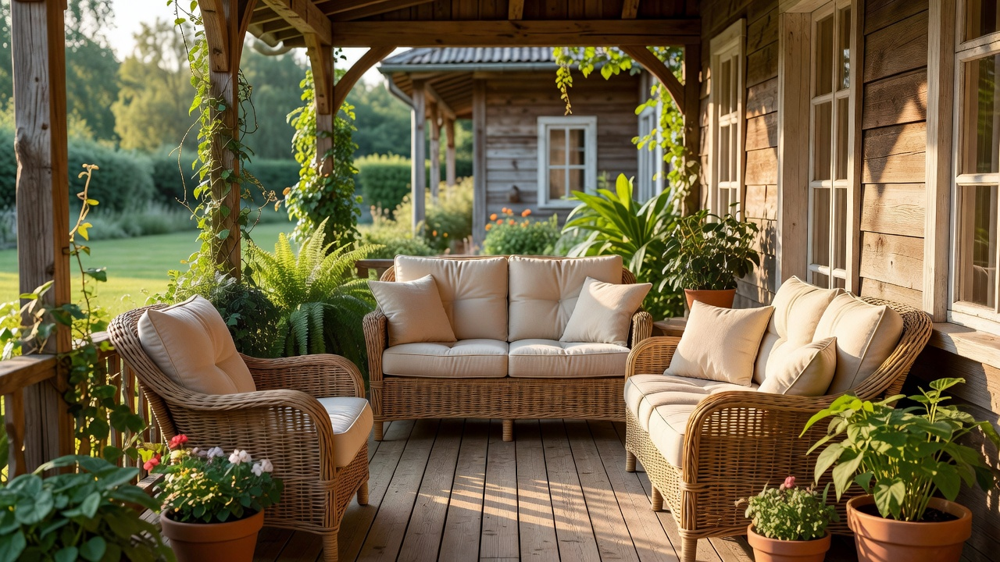
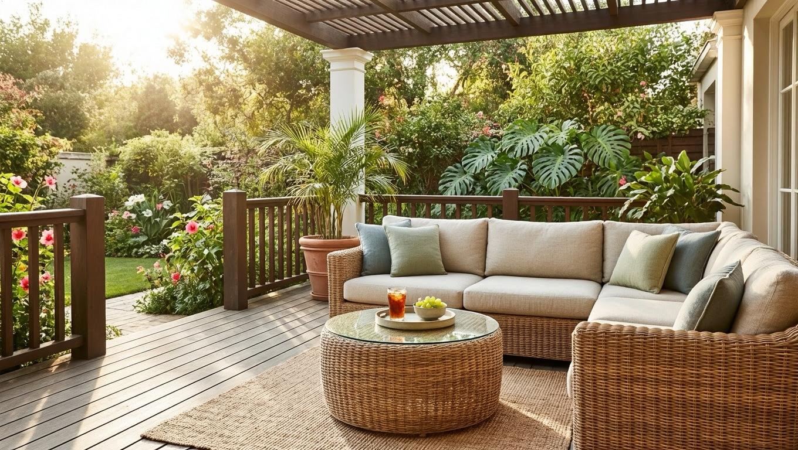
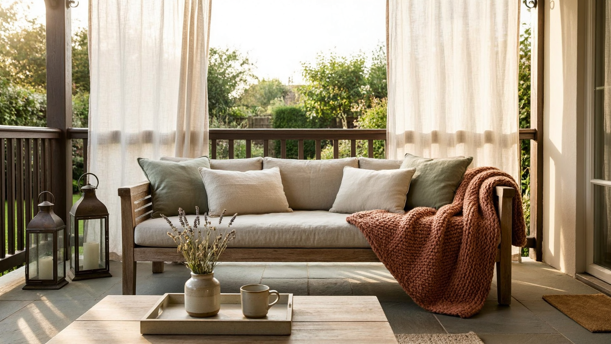
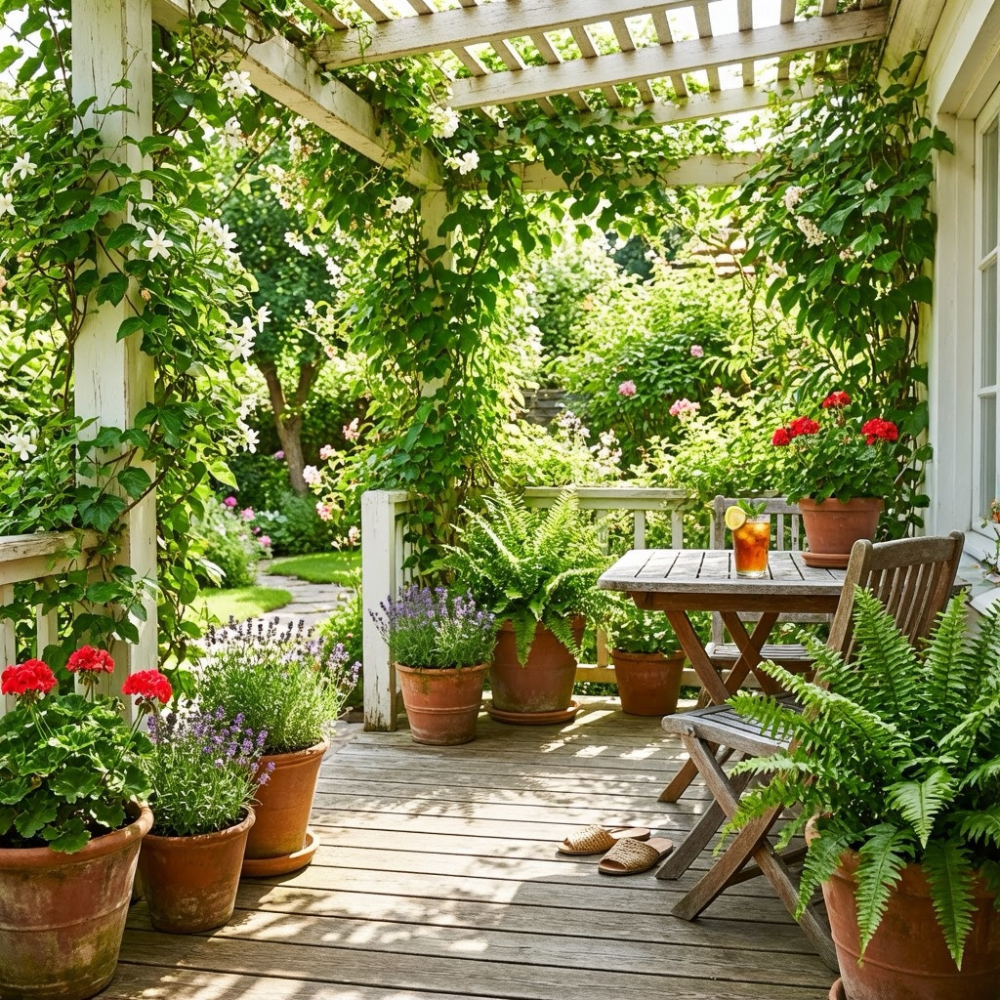
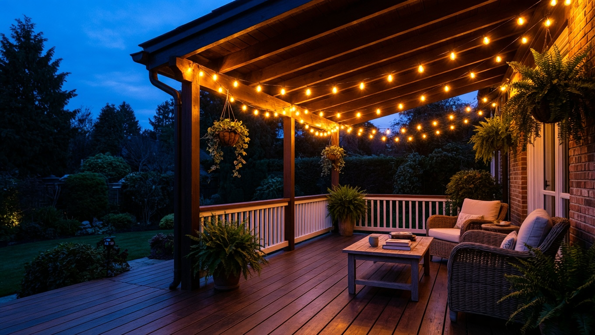
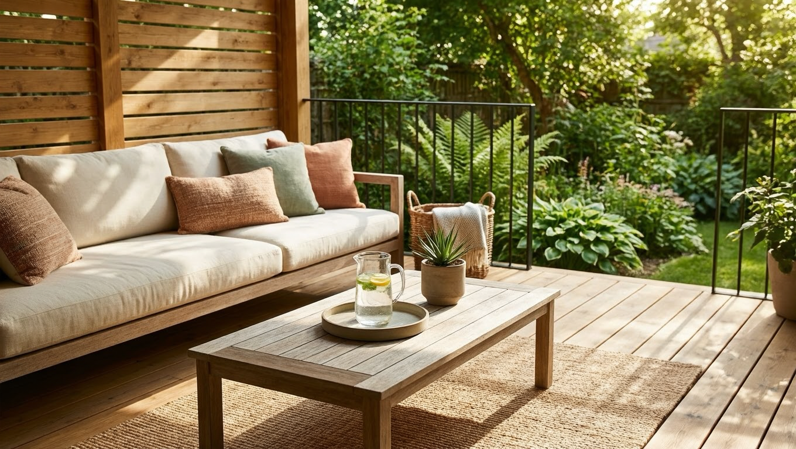

Летняя веранда — любимое место на даче в тёплый сезон: здесь пьют утренний кофе, обедают всей семьёй, читают в тени и встречают гостей. Чтобы веранда стала по-настоящему уютной, её нужно правильно оформить: подобрать мебель, текстиль, освещение и зелень. Причём сделать это можно без больших вложений и своими руками. В этой статье собрали идеи и советы, как оформить и обустроить летнюю веранду на даче, чтобы она радовала весь сезон.

Это статья из цикла о веранде. Общие принципы разобраны в основной статье — [как обустроить веранду](https://mir-doma.pro/kak-obustroit-verandu/), а здесь сосредоточимся именно на оформлении летней веранды.

## ☀️ Чем хороша летняя веранда

Летняя веранда — это продолжение дома на свежем воздухе, которое выполняет сразу несколько ролей:

- **зона отдыха** — с диваном, креслами и гамаком;
- **летняя столовая** — обеды и ужины на воздухе;
- **место для чаепитий и приёма гостей**;
- **уголок уединения** — почитать или подремать в тени;
- **рабочее место** — на свежем воздухе приятно и поработать за ноутбуком.

Главная задача при оформлении — сделать веранду комфортной и уютной, сохранив ощущение простора и связи с садом. Летняя веранда бывает открытой, застеклённой или полуоткрытой, но принципы оформления у всех схожи: свет, воздух, зелень и уютный текстиль.

## 🪑 Мебель для летней веранды

Мебель для веранды должна быть лёгкой, удобной и устойчивой к влаге:

- **Плетёная мебель** (ротанг или искусственный ротанг) — классика для веранды: лёгкая, красивая и практичная.
- **Диван или софа с подушками** — основа зоны отдыха.
- **Стол и стулья** — для обедов и чаепитий.
- **Кресло-качалка или гамак** — для отдыха и неспешного чтения.

Хорошо смотрится и деревянная мебель с защитным покрытием, в том числе [сделанная своими руками из поддонов](https://mir-doma.pro/sadovaya-mebel-iz-poddonov/) — это бюджетно и стильно. Не перегружайте веранду мебелью: несколько удобных предметов и свободное пространство смотрятся лучше, чем тесно заставленная площадка.

## 🎨 Стиль и цвет

Летняя веранда любит светлые, свежие тона — они зрительно расширяют пространство и создают ощущение лёгкости. Популярные стили для веранды:

- **[Прованс](https://mir-doma.pro/interer-dachi-v-stile-provans/)** — светлое крашеное дерево, лаванда, нежные оттенки.
- **Сканди** — простота, светлое дерево, минимум декора.
- **Эко и рустик** — натуральные материалы, зелень, дерево.
- **Средиземноморский** — белый, синий, керамика, растения.

Главное — выдержать единый стиль с домом и садом, чтобы веранда смотрелась гармонично, а не отдельно. Проще всего отталкиваться от 2–3 основных цветов и придерживаться их в мебели, текстиле и декоре — тогда веранда будет выглядеть цельно.

## 🧵 Текстиль и декор

Именно текстиль превращает веранду в уютное гнёздышко, и менять его легко:

- **Подушки и пледы** — добавляют уюта и цвета.
- **Лёгкие шторы** — защищают от солнца и создают атмосферу.
- **Скатерть и салфетки** — для обеденной зоны.
- **Ковёр или циновка** — обозначают зону отдыха и добавляют тепла.

Дополните всё декором: свечи, вазы, плетёные корзины, картины и милые мелочи сделают веранду обжитой. Текстиль удобен ещё и тем, что его легко менять — сменив чехлы подушек и шторы, можно освежить веранду за считаные минуты.

## 🌿 Озеленение веранды

Зелень — душа летней веранды. Растения оживляют пространство и связывают его с садом:

- **горшечные растения и кашпо** на полу, столах и полках;
- **вьющиеся растения** (девичий виноград, клематис, ипомея) на опорах и стенах;
- **цветы в ящиках** на перилах и подоконниках;
- **пряные травы** в горшках — красиво и полезно.

Красиво цветущие [многолетники](https://mir-doma.pro/mnogoletnie-tsvety-dlya-dachi/) в кадках станут украшением веранды на весь сезон. Вьющиеся растения к тому же дают приятную тень и естественную защиту от солнца, оплетая опоры и создавая зелёные «стены».

## 💡 Освещение

Правильный свет создаёт волшебную атмосферу для вечерних посиделок:

- **гирлянды с тёплыми лампочками** — самый уютный вариант;
- **садовые фонарики и лампы** — мягкий рассеянный свет;
- **свечи и подсвечники** — для романтики;
- **настенные или подвесные светильники** — для основного освещения.

Выбирайте тёплый мягкий свет — он делает веранду уютной, а не похожей на офис. Удобно сочетать несколько источников: общий свет для ужина и приглушённые гирлянды или свечи для вечернего отдыха. Для открытой веранды берите светильники с защитой от влаги.

## 🍽️ Зонирование и практичные советы

Даже небольшую веранду удобно разделить на зоны: уголок отдыха с диваном и обеденную зону со столом. А чтобы отдыхать было комфортно в любую погоду, продумайте защиту:

- **от солнца** — лёгкие шторы, маркизы или рулонные шторы;
- **от дождя** (для открытой веранды) — навес или прозрачные ПВХ-шторы;
- **от насекомых** — москитные сетки на проёмы или шторы;
- **практичный пол** — влагостойкая террасная доска или плитка, которые легко мыть.

Эти мелочи делают летнюю веранду удобной с утра до позднего вечера. Зоны можно обозначить ковриком, перегородкой из растений или лёгкой ширмой — так даже небольшая веранда станет функциональнее и уютнее.

## ❓ Частые вопросы

### Как оформить летнюю веранду на даче?

Подберите лёгкую влагостойкую мебель (плетёную или деревянную), добавьте уютный текстиль — подушки, пледы, лёгкие шторы, украсьте веранду растениями в горшках и кашпо и продумайте тёплое освещение (гирлянды, фонарики). Выдержите единый светлый стиль с домом — и веранда станет уютным местом отдыха.

### Какая мебель подходит для веранды?

Лучше всего лёгкая и устойчивая к влаге мебель: плетёная из ротанга или искусственного ротанга, деревянная с защитным покрытием, металлическая. Основа — диван или софа с подушками, стол со стульями и кресло-качалка или гамак. Мебель из поддонов — бюджетный вариант, который легко сделать самому.

### Как защитить летнюю веранду от солнца и дождя?

От солнца помогают лёгкие шторы, маркизы и рулонные шторы, от дождя на открытой веранде — навес или прозрачные ПВХ-шторы, а от насекомых — москитные сетки. Влагостойкий пол (террасная доска или плитка) делает веранду практичной в любую погоду.

### Какие растения поставить на веранду?

На веранде хорошо смотрятся горшечные растения и цветущие многолетники в кадках, вьющиеся растения на опорах и стенах, цветы в ящиках на перилах и пряные травы в горшках. Зелень оживляет веранду и связывает её с садом.

### В каком стиле оформить веранду на даче?

Для летней веранды хорошо подходят светлые уютные стили: прованс, скандинавский, эко и рустик, средиземноморский. Все они любят натуральные материалы, светлые тона и зелень. Главное — выдержать единый стиль с домом и садом, чтобы веранда выглядела продолжением дачи, а не отдельным элементом.

### Как сделать веранду уютной недорого?

Уют создают текстиль и детали, а не дорогая мебель: добавьте подушки, пледы, лёгкие шторы, поставьте растения, развесьте гирлянды и свечи. Мебель можно сделать своими руками из поддонов, а декор найти на блошиных рынках. Светлые тона и зелень довершат уютную атмосферу.

## Заключение

Оформить летнюю веранду на даче несложно и недорого: выберите лёгкую влагостойкую мебель, добавьте уютный текстиль, украсьте пространство зеленью и продумайте тёплое освещение. Выдержите единый светлый стиль, разделите веранду на зоны отдыха и столовую и защитите её от солнца, дождя и насекомых — и получите любимое место всей семьи на весь тёплый сезон. Такая веранда обойдётся недорого, а удовольствия будет приносить много — это одно из самых приятных мест на даче. Больше идей по обустройству — в основной статье о том, [как обустроить веранду](https://mir-doma.pro/kak-obustroit-verandu/).

А как оформлена летняя веранда на вашей даче? Делитесь идеями в комментариях и подписывайтесь, чтобы не пропустить новые статьи об уюте на даче.
