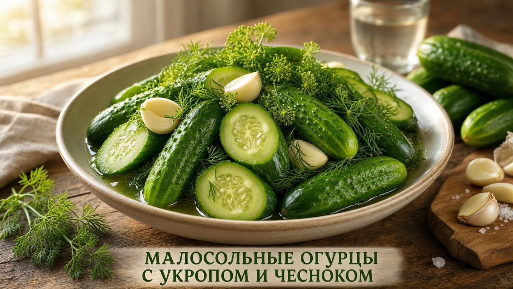
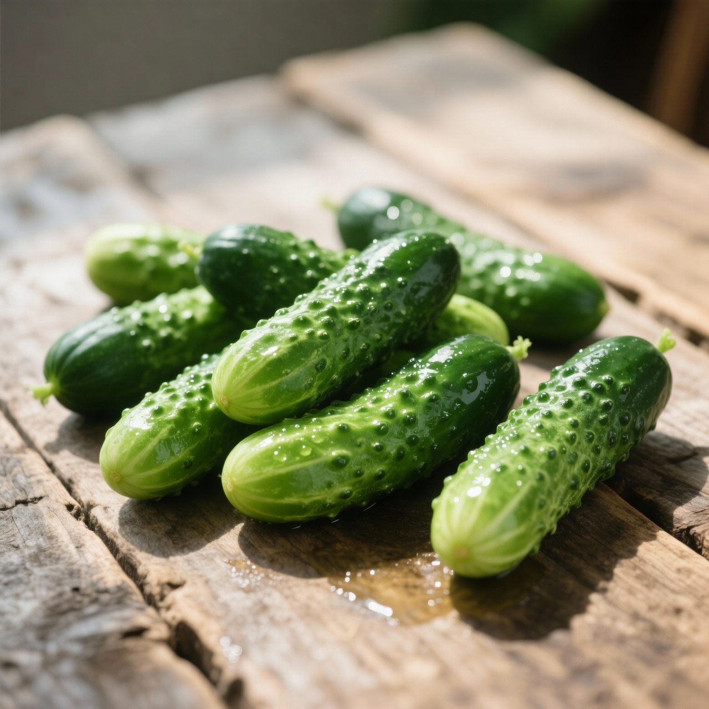
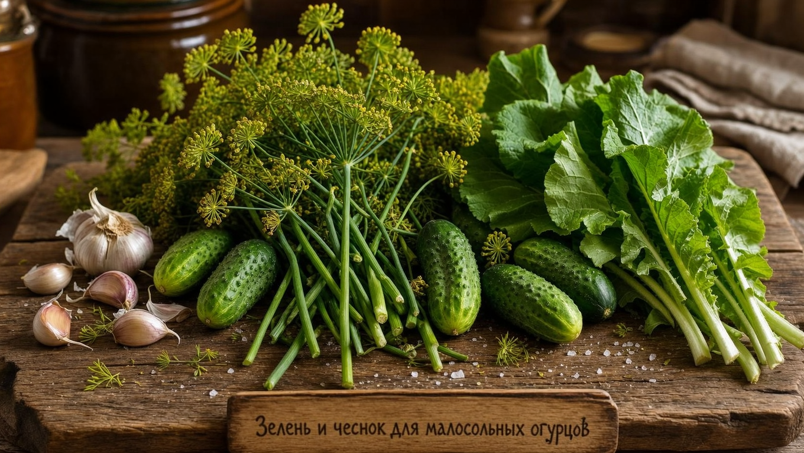
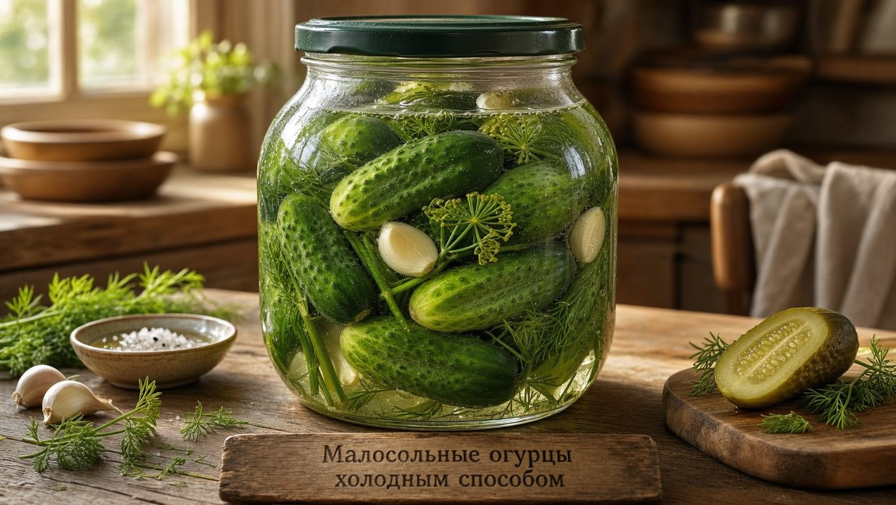
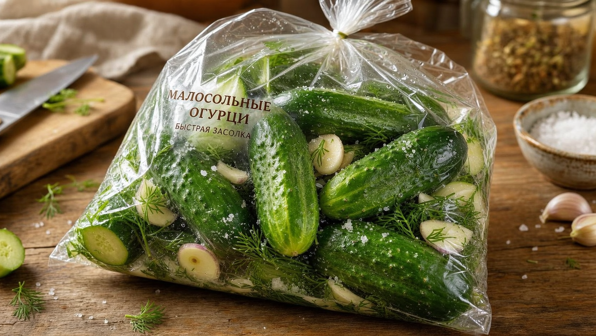
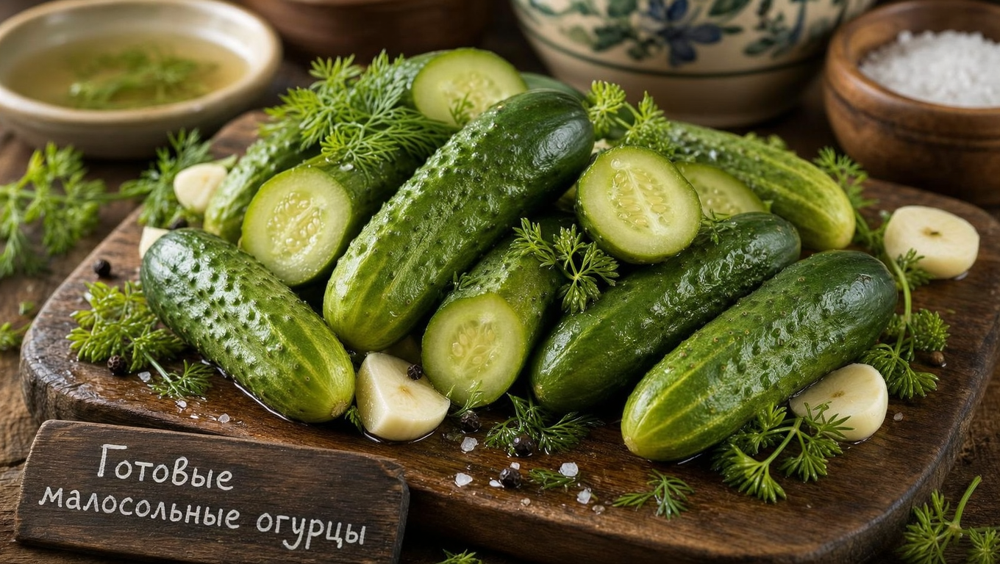

Малосольные огурцы — вкус лета: хрустящие, ароматные, в меру солёные, они хороши и как закуска, и к отварной картошечке. А главное — готовятся быстро: от пары часов до суток, в отличие от заготовок на зиму. Приготовить малосольные огурцы проще простого, если знать несколько секретов хруста и правильные пропорции рассола. В этой статье собрали лучшие быстрые рецепты малосольных огурцов — холодным и горячим способом и даже в пакете за час, — а также расскажем, как выбрать огурцы и не допустить ошибок.

## 🥒 Чем малосольные отличаются от солёных

Малосольные огурцы — это огурцы быстрого, лёгкого посола. В отличие от [маринованных](https://mir-doma.pro/marinovannye-ogurtsy-na-zimu/) и солёных заготовок на зиму, их:

- **готовят быстро** — от 1–2 часов до суток;
- **едят сразу**, а не хранят месяцами;
- **делают без уксуса** и стерилизации;
- **держат в холодильнике** и съедают за несколько дней.

Это идеальная летняя закуска «на сейчас», когда хочется солёненького, а ждать зиму нет никакого желания. Именно за скорость и свежий вкус малосольные огурцы так любят: молодые огурчики прямо с грядки превращаются в ароматную закуску буквально за день.

## 🥗 Какие огурцы выбрать

Хруст малосольных огурцов начинается с правильных плодов:

- **Засолочные сорта** — с тонкой кожицей, плотной мякотью и чёрными пупырышками.
- **Мелкие и средние** — они просаливаются быстрее и равномернее.
- **Свежие и упругие** — лучше всего прямо с грядки.

Салатные сорта (с гладкой кожицей и белыми шипами) для засолки не годятся — они получаются мягкими. Если огурцы горчат, малосольными их делать можно: при засолке горечь почти уходит. Подробнее о том, [почему огурцы горчат](https://mir-doma.pro/pochemu-ogurtsy-gorchat/), мы рассказывали в отдельной статье.

## 🌿 Ингредиенты и специи

Классический набор для малосольных огурцов:

- **Укроп** — зонтики и стебли дают главный аромат.
- **Чеснок** — несколько зубчиков, разрезанных пополам.
- **Лист и корень хрена** — для остроты и хруста.
- **Листья смородины, вишни или дуба** — для крепости и аромата.
- **Перец горошком, острый перец** — по желанию.

Для рассола нужны только вода и соль: примерно 2 столовые ложки соли (с небольшой горкой) на 1 литр воды. Соль лучше брать обычную каменную, а не мелкую йодированную — с ней огурцы получаются хрустящее и не мутнеют.

## 🧂 Классический рецепт холодным способом

Холодный способ даёт самые хрустящие огурцы.

1. Вымойте огурцы и замочите их в холодной воде на 1–2 часа — так они станут особенно хрустящими.
2. Обрежьте кончики с двух сторон, чтобы огурцы просолились быстрее.
3. На дно банки или кастрюли уложите часть зелени и специй, затем огурцы, сверху — оставшуюся зелень.
4. Растворите соль в холодной воде и залейте огурцы этим рассолом полностью.
5. Накройте и оставьте при комнатной температуре на сутки, затем уберите в холодильник.

Через сутки огурцы готовы — хрустящие и ароматные. В холодильнике посол замедляется, и они не перекисают. Чем крупнее огурцы, тем дольше они солятся, поэтому для холодного способа особенно хороши мелкие корнишоны — они будут готовы даже быстрее.

## 🔥 Быстрый способ горячей заливкой

Если хочется быстрее, огурцы заливают горячим рассолом:

1. Уложите огурцы со специями в банку.
2. Вскипятите воду с солью и залейте огурцы кипящим рассолом.
3. Оставьте при комнатной температуре.

Так огурцы просаливаются уже через несколько часов. Они получаются чуть менее хрустящими, чем при холодном способе, зато готовы гораздо быстрее. Чтобы вернуть хруст, некоторые хозяйки после горячей заливки быстро остужают банку под холодной водой.

## 🛍️ Малосольные огурцы в пакете за час

Самый быстрый, экспресс-способ — в пакете:

1. Нарежьте огурцы вдоль на четвертинки или сделайте надрезы.
2. Сложите в плотный пакет, добавьте соль, измельчённый чеснок и рубленый укроп.
3. Завяжите пакет и хорошо встряхните.
4. Оставьте при комнатной температуре на 1–2 часа, время от времени встряхивая.

Готово — малосольные огурцы к столу всего за час, без всякого рассола. Такой способ удобен на природе и на даче, когда хочется быстрой закуски: всё, что нужно, — пакет, соль и зелень.

## 🌿 Секреты хруста и вкуса

Чтобы огурцы получились по-настоящему хрустящими:

- **Замачивайте огурцы** в холодной воде перед засолкой — это возвращает упругость.
- **Добавляйте листья хрена, смородины или дуба** — их дубильные вещества дают хруст.
- **Используйте холодный способ** — он хрустче горячего.
- **Берите свежие плотные огурцы** — вялые хрустеть не будут.
- **Не передерживайте** — иначе огурцы станут слишком солёными и кислыми.
- **Кладите зелень и на дно, и сверху** — так аромат равномерно пропитывает все огурцы.

## ❄️ Как хранить малосольные огурцы

Малосольные огурцы не предназначены для долгого хранения. Их держат в холодильнике и съедают за несколько дней: чем дольше они стоят, тем солонее становятся и постепенно превращаются в солёные. Если хочется сохранить урожай надолго, лучше приготовить полноценные заготовки на зиму — [маринованные огурцы](https://mir-doma.pro/marinovannye-ogurtsy-na-zimu/) или [помидоры](https://mir-doma.pro/pomidory-na-zimu-recepty/).

## 🛡️ Частые ошибки

- **Салатные сорта.** Получаются мягкими. Берите засолочные с пупырышками.
- **Не замочили огурцы.** Без замачивания хруст хуже, особенно у подвявших плодов.
- **Тёплое хранение.** В тепле огурцы быстро перекисают. После посола убирайте их в холодильник.
- **Пересол.** Слишком много соли делает огурцы невкусными. Соблюдайте пропорции.
- **Крупные огурцы целиком.** Большие плоды долго солятся; их лучше разрезать или брать мелкие.

## ❓ Частые вопросы

### Сколько соли нужно на литр воды для малосольных огурцов?

Для рассола берут примерно 2 столовые ложки соли с небольшой горкой на 1 литр воды. Этого достаточно для лёгкого, приятного посола. Если хотите посолонее, немного увеличьте количество соли, но без фанатизма, чтобы огурцы не стали пересоленными.

### Как быстро засолить огурцы?

Самый быстрый способ — в пакете: нарежьте огурцы, добавьте соль, чеснок и укроп, встряхните в пакете и оставьте на 1–2 часа. Чуть дольше — горячая заливка рассолом (несколько часов). Холодный способ даёт самые хрустящие огурцы, но занимает около суток.

### Почему малосольные огурцы получаются мягкими?

Чаще всего из-за салатных сортов, которые не годятся для засолки, вялых огурцов или отсутствия замачивания и листьев для хруста. Берите свежие засолочные огурцы с пупырышками, замачивайте их в холодной воде и добавляйте листья хрена, смородины или дуба.

### Нужно ли обрезать кончики у огурцов?

Обрезать кончики не обязательно, но желательно: так огурцы просаливаются быстрее и равномернее. Особенно это помогает при быстрых способах засолки, когда важно ускорить процесс.

### Сколько хранятся малосольные огурцы?

В холодильнике малосольные огурцы хранятся несколько дней. Со временем они продолжают просаливаться и становятся всё более солёными, постепенно превращаясь в солёные огурцы. Поэтому их готовят небольшими порциями и съедают свежими.

### Чем малосольные огурцы отличаются от солёных?

Малосольные — это лёгкий быстрый посол: их едят уже через несколько часов или сутки и хранят в холодильнике всего несколько дней. Солёные огурцы просаливаются дольше, более солёные и предназначены для длительного хранения. По сути малосольные — это «недосолившиеся» огурцы на ранней стадии.

### В чём солить малосольные огурцы — в банке или кастрюле?

Подойдёт и то, и другое: небольшую порцию удобно солить в банке, а побольше — в кастрюле или эмалированном ведре. Главное, чтобы огурцы были полностью покрыты рассолом, а посуда была неокисляющейся (стекло, эмаль, пищевой пластик).

### Можно ли сделать малосольные огурцы без укропа?

Можно, но укроп даёт тот самый классический аромат малосольных огурцов, поэтому его обычно кладут обязательно. Если укропа нет, вкус дополнят чеснок, листья хрена и смородины, перец — огурцы всё равно получатся вкусными, хоть и с другим ароматом.

## Заключение

Малосольные огурцы — быстрая и вкусная летняя закуска, которую легко приготовить любым способом: холодным рассолом для максимального хруста, горячей заливкой для скорости или прямо в пакете всего за час. Выбирайте свежие засолочные огурцы, замачивайте их, добавляйте укроп, чеснок и листья для хруста и не передерживайте — тогда огурчики получатся ароматными и хрустящими. Приготовьте по любому из рецептов, и малосольные огурцы станут любимой закуской всего сезона. А когда наедитесь свежих — тот же урожай легко пустить и на зимние заготовки, чтобы вкус лета остался с вами до холодов.

А по какому рецепту готовите малосольные огурцы вы? Делитесь секретами в комментариях и подписывайтесь, чтобы не пропустить новые рецепты и заготовки.
