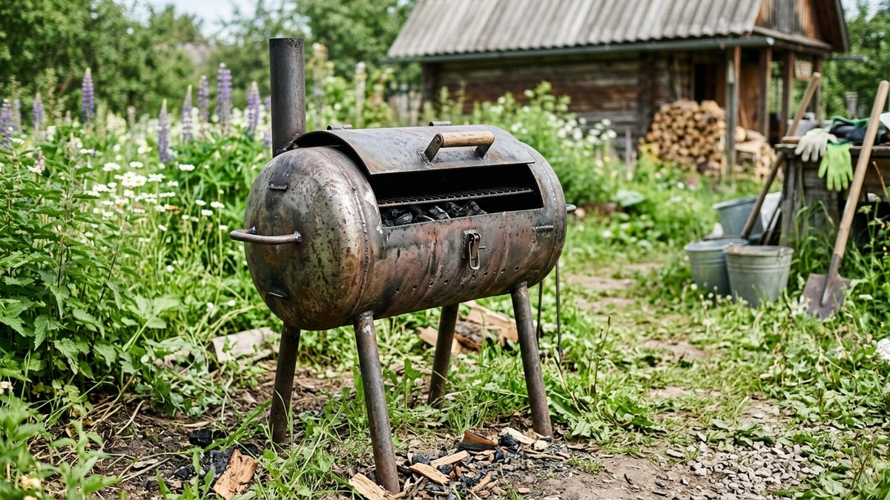
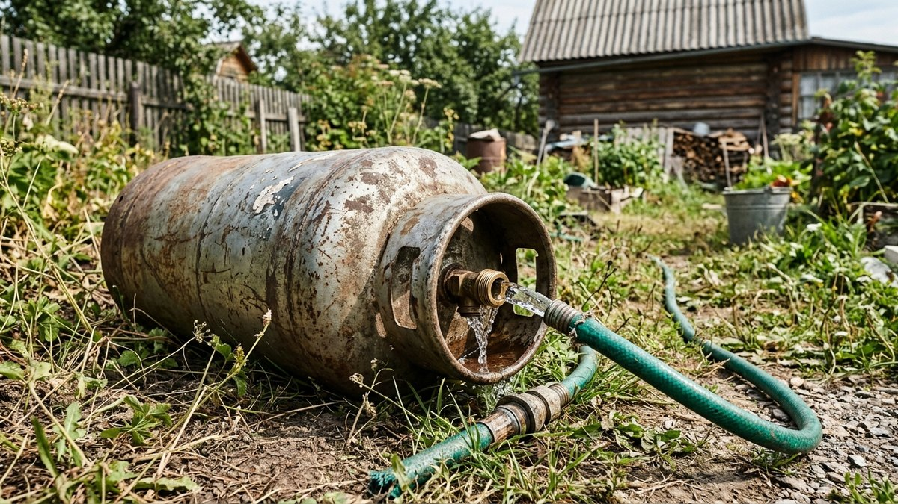
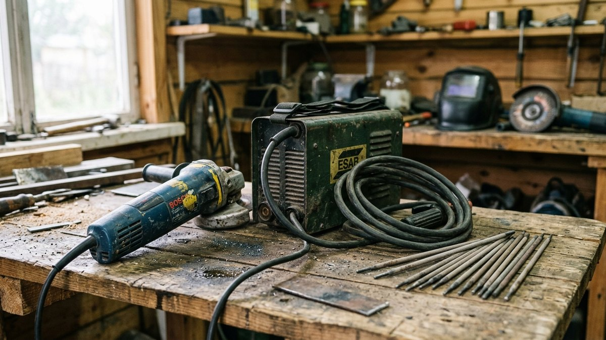
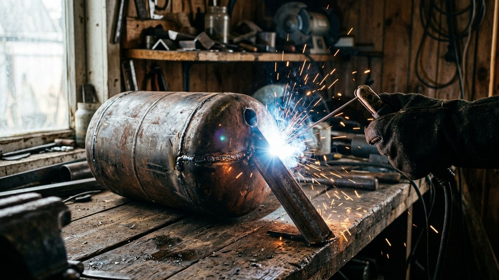
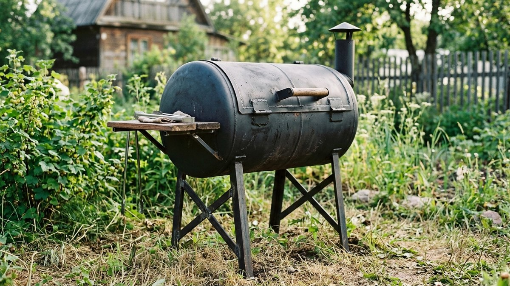
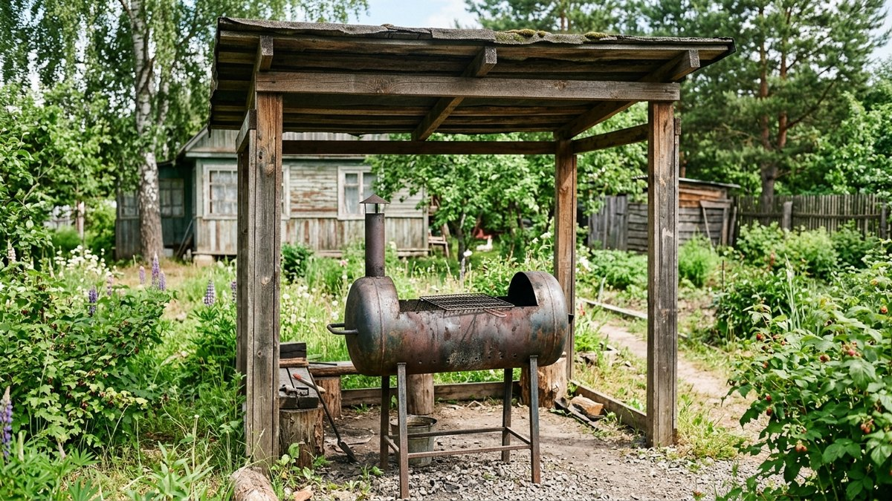

В отличие от кирпичного мангала (разбор кладки — [в отдельной статье](https://mir-doma.pro/mangal-iz-kirpicha-svoimi-rukami/)), мангал из газового баллона варят за один день, не нужен фундамент, а готовую конструкцию при желании можно переносить или даже возить с собой. Толстостенный металл баллона служит намного дольше обычного листового железа. Но здесь есть один этап, где ошибка в буквальном смысле опасна для жизни, — подготовка баллона перед резкой. Разберём всё по порядку.

## Безопасность прежде всего: подготовка баллона

Резать газовый баллон болгаркой или сваривать рядом с ним, пока внутри остаются пары газа, — это реальный риск взрыва: искра от инструмента воспламеняет газовоздушную смесь. Пропускать этот этап нельзя ни при каких обстоятельствах.

Порядок подготовки:

1. **Полностью стравить газ.** Откройте вентиль на открытом воздухе, вдали от построек и источников огня, и дайте остаткам газа выйти — лучше оставить баллон в таком положении на сутки.
2. **Заполнить баллон водой доверху** через вентиль или срезанный клапан. Вода вытесняет из баллона воздух и остатки паров газа, исключая образование взрывоопасной смеси при контакте с искрами.
3. **Резать и варить только полностью заполненный водой баллон.** По мере резки вода будет выливаться через прорезь — это нормально и даже полезно: она продолжает охлаждать зону реза.

Если баллон когда-либо использовался под кислород или ацетилен (а не под бытовой сжиженный газ для плиты или отопления) — за него новичку лучше вообще не браться: там своя специфика подготовки и более высокие риски.

## Какой баллон использовать

Оптимальный вариант — стандартный бытовой пропановый баллон объёмом 50 л: его диаметр и длина дают удобные внутренние размеры под шампуры без лишней доработки. Баллоны меньшего объёма (5, 12, 27 л) тоже подходят, но получившаяся жаровня будет заметно теснее.

## Инструмент и материалы

- Болгарка с отрезным и зачистным кругом по металлу;
- сварочный аппарат и электроды;
- рулетка, мел или маркер для разметки;
- металлический уголок или пруток на ножки;
- петли и ручка для крышки;
- термостойкая краска для наружной отделки.

## Порядок работы

1. **Подготовить баллон** по описанной выше процедуре — слить газ, заполнить водой, выдержать.
2. **Разметить продольный рез.** Чаще всего баллон разрезают не полностью пополам, а так, чтобы меньшая часть (примерно треть окружности) стала откидной крышкой на петлях, а большая — корпусом жаровни.
3. **Разрезать болгаркой** по разметке, не торопясь, — вода внутри охлаждает металл и минимизирует риск деформации от нагрева.
4. **Зачистить кромки** от заусенцев и окалины — острые края реза опасны при эксплуатации и мешают плотному прилеганию крышки.
5. **Приварить ножки** на комфортную рабочую высоту — 70–80 см до уровня решётки, чтобы не наклоняться при готовке.
6. **Приварить петли** для крышки и ручку, чтобы открывать её, не обжигаясь.
7. **Сделать отверстия для тяги** в нижней части корпуса — несколько отверстий диаметром 1,5–2 см для притока воздуха к углям, иначе огонь будет плохо гореть и постоянно гаснуть.
8. **Приварить упоры или решётку** для шампуров вдоль верхнего края жаровни.

## Первая протопка и покраска

Перед первым использованием мангал стоит протопить пустым в течение 20–30 минут на сильном огне — это выжигает остаточный запах металла и заводское покрытие изнутри. Красят мангал только снаружи термостойкой краской, рассчитанной на высокие температуры, — обычная краска на жаре быстро вздувается и облезает. Красить изнутри жаровню не нужно: краска всё равно выгорит при первой же протопке и может дать неприятный запах готовящейся еде.

## Частые ошибки

- **Резать баллон без слива газа и заполнения водой.** Самая опасная ошибка раздела — риск взрыва при контакте искры с остатками газа.
- **Забыть про отверстия для тяги.** Без притока воздуха снизу угли плохо разгораются и часто гаснут.
- **Не зачистить острые кромки после резки.** Травмоопасно при повседневном использовании.
- **Красить термостойкой краской изнутри жаровни.** Выгорает при первой протопке и портит вкус еды дымом от краски.
- **Сразу готовить на свежесваренном мангале без протопки.** Заводское покрытие и запах металла испортят первое приготовление.

Если кроме жарки на углях интересно ещё и копчение, тот же баллон можно переделать под другую конструкцию — устройство и сборка коптильни горячего копчения разобраны в статье [«Коптильня горячего копчения своими руками»](https://mir-doma.pro/koptilnya-goryachego-kopcheniya-svoimi-rukami/). А чтобы защитить готовый мангал от дождя, есть смысл поставить над ним навес — разбор конструкции в статье [«Навес для мангала своими руками»](https://mir-doma.pro/naves-dlya-mangala-svoimi-rukami/).

## Частые вопросы

### Можно ли резать газовый баллон без подготовки?

Нет, категорически нельзя — искра от болгарки или сварки может воспламенить остатки газа внутри и вызвать взрыв. Баллон обязательно сначала освобождают от газа, а затем полностью заполняют водой перед резкой.

### Какой газовый баллон лучше взять для мангала?

Стандартный бытовой пропановый баллон объёмом 50 л — его размеры дают удобную жаровню под шампуры без лишней доработки конструкции.

### Нужен ли фундамент под мангал из баллона?

Нет, в отличие от кирпичного мангала. Металлическая конструкция на приваренных ножках устанавливается прямо на подготовленную негорючую площадку без отдельного основания.

### Как избавиться от запаха металла в новом мангале?

Протопить его пустым на сильном огне 20–30 минут перед первым использованием — это выжигает заводское покрытие и остаточный запах.

### Можно ли использовать баллон из-под кислорода для мангала?

Новичку лучше не браться за такие баллоны — кислородные и ацетиленовые баллоны требуют другой, более сложной процедуры подготовки и несут повышенный риск при работе с ними.
