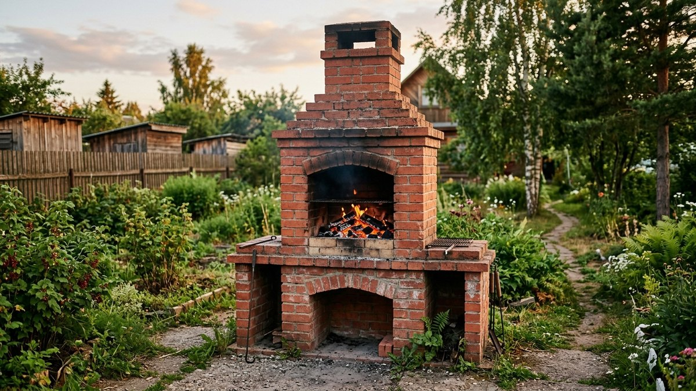
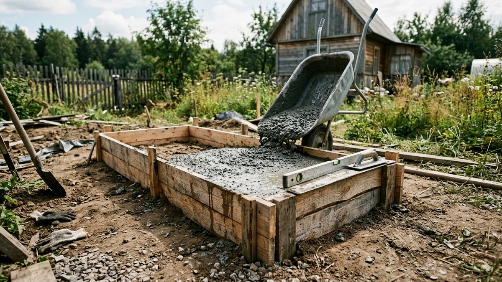
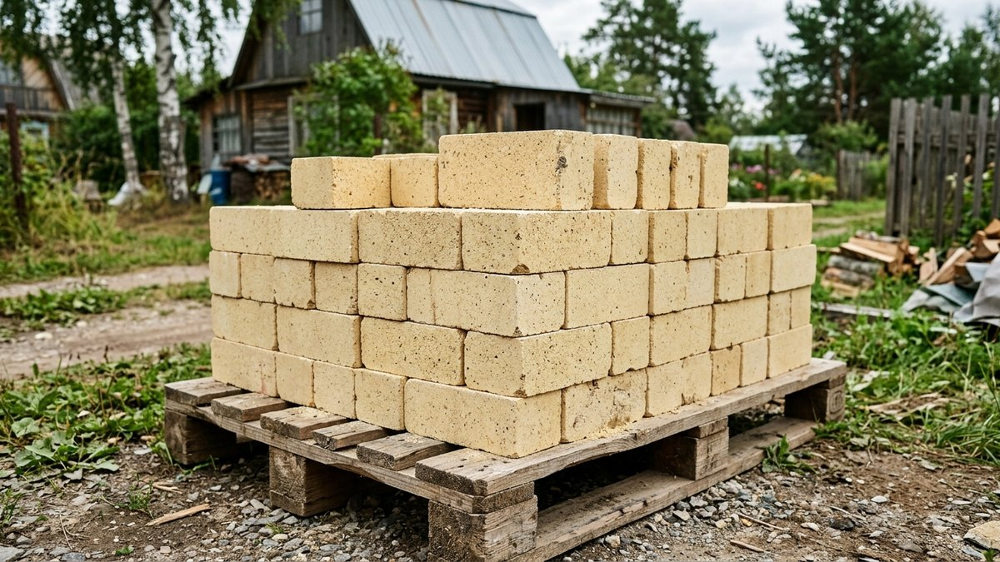
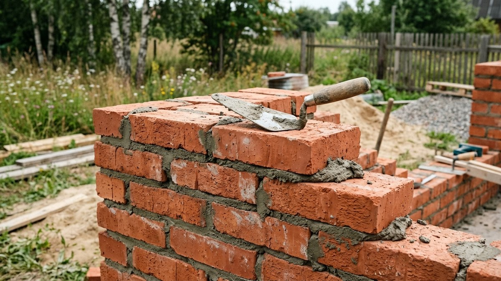
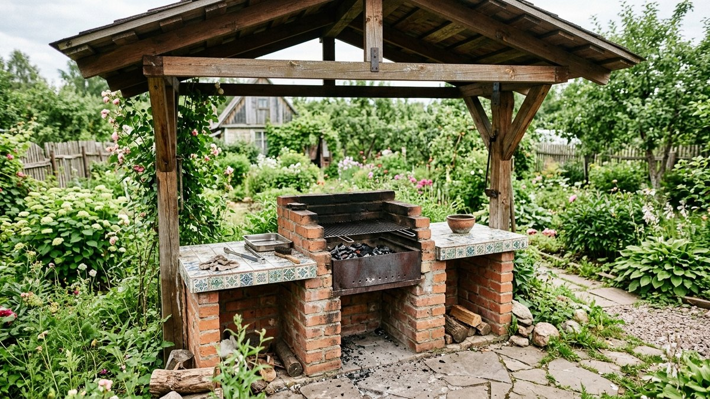
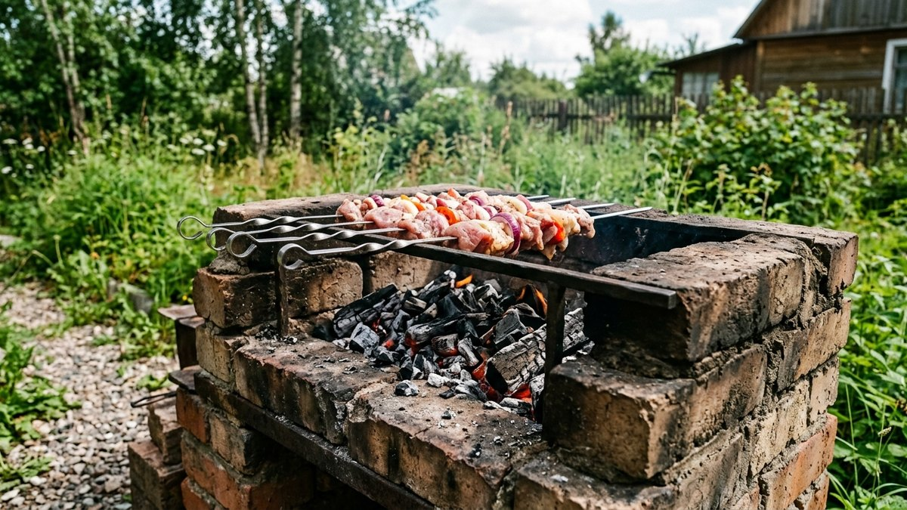

В отличие от переносного металлического мангала, кирпичный — это стационарное сооружение на десятилетия: он требует фундамента, правильного кирпича под жар и аккуратной кладки, но взамен даёт мангал, который не ржавеет, не прогорает и становится частью зоны отдыха на участке. Разберём, из чего его строить и в каком порядке класть, чтобы топка не растрескалась через один сезон.

## Из чего состоит кирпичный мангал

- **Фундамент** — держит вес конструкции и не даёт кладке потрескаться от пучения грунта.
- **Цоколь** — нижняя часть корпуса, обычная кладка из керамического кирпича, часто с нишей для дров или хранения угля.
- **Топка (жаровня)** — сама камера, где горит огонь и лежат угли; здесь и только здесь нужен огнеупорный кирпич.
- **Столешницы по бокам** — рабочие поверхности для подготовки продуктов и инструмента, не обязательный, но практичный элемент.

## Нужен ли фундамент

Да, обязательно — готовый кирпичный мангал весит несколько сотен килограммов, и без опоры кладка со временем даёт трещины от смещения и пучения грунта при промерзании. Для отдельно стоящего мангала достаточно небольшого монолитного фундамента — бетонной плиты толщиной 15–20 см на слое утрамбованного песка и щебня, с заглублением ниже уровня промерзания необязательно, если участок сухой и грунт не пучинистый. На пучинистых глинистых грунтах лучше делать более основательный фундамент — принципы выбора те же, что для лёгких построек: разбор в статье [«Какой фундамент выбрать для дома»](https://mir-doma.pro/kakoy-fundament-vybrat-dlya-doma/), только применительно к небольшой и лёгкой конструкции.

## Какой кирпич использовать

Это самая частая ошибка новичков — брать один и тот же кирпич на весь мангал:

- **Топка** — только огнеупорный шамотный кирпич. Он выдерживает прямой контакт с открытым огнём и температуру свыше 1000 °C без растрескивания.
- **Корпус и облицовка** — обычный керамический полнотелый кирпич. Он не соприкасается напрямую с огнём и не требует огнеупорных свойств.
- **Что нельзя использовать вообще** — силикатный кирпич. От прямого жара он трескается и разрушается уже в первый сезон, независимо от того, в какой части мангала его положили.

Шамотный кирпич кладут на жаростойкий раствор (глиняно-песчаная смесь или готовый огнеупорный состав), обычный кирпич корпуса — на стандартный цементно-песчаный раствор.

## Размеры топки

Ориентировочные рабочие размеры, проверенные практикой:

- **Глубина топки** — 25–30 см: достаточно для углей и хорошей тяги, но не настолько глубоко, чтобы жар не доставал до решётки.
- **Ширина** — под длину стандартного шампура, обычно 50–60 см.
- **Высота решётки от земли** — 70–80 см, комфортная рабочая высота, чтобы не наклоняться и не перегибаться через мангал.
- **Толщина стенок топки** — не менее половины кирпича, для основательных конструкций — в кирпич.

## Порядок кладки

1. Залить и выдержать фундамент — минимум неделю до набора прочности, прежде чем нагружать его кладкой.
2. Уложить гидроизоляцию (рубероид или аналог) между фундаментом и первым рядом кладки — иначе цоколь тянет влагу из земли.
3. Выложить цоколь обычным кирпичом с перевязкой швов — каждый следующий ряд смещён относительно предыдущего, иначе кладка не держит нагрузку равномерно.
4. На уровне будущей топки перейти на шамотный кирпич, оставив проём нужной глубины и ширины.
5. Установить металлические уголки или закладные под будущую решётку и шампура на нужной высоте — до, а не после кладки, иначе придётся штробить готовую стену.
6. Выложить топку по размеру, оставив зазор для тяги снизу (поддувало) — без него угли будут гаснуть.
7. Дать кладке полностью просохнуть (минимум неделю) прежде чем разжигать первый огонь — быстрая протопка свежей кладки создаёт трещины от резкого испарения влаги из раствора.

## Столешница и завершение

Боковые столешницы обычно делают из той же кладки кирпича, плитки поверх стяжки или деревянной столешницы на кирпичном основании — дерево при этом должно быть на безопасном расстоянии от топки, не менее 15–20 см с термоизоляционной прокладкой. Готовый мангал имеет смысл накрыть отдельным навесом от дождя — под открытым небом кладка со временем намокает и быстрее разрушается от циклов замерзания-оттаивания влаги в порах кирпича; как выбрать и построить навес, разобрано в статье [«Навес для мангала своими руками»](https://mir-doma.pro/naves-dlya-mangala-svoimi-rukami/). Если кроме жарки на углях интересует ещё и копчение, это уже отдельная конструкция со своим устройством — разбор сборки коптильни горячего копчения в статье [«Коптильня горячего копчения своими руками»](https://mir-doma.pro/koptilnya-goryachego-kopcheniya-svoimi-rukami/).

## Частые ошибки

- **Класть топку из обычного или силикатного кирпича.** Трескается от прямого жара уже в первый сезон — экономия оборачивается переделкой.
- **Строить без фундамента.** Тяжёлая кладка без опоры со временем идёт трещинами от смещения грунта.
- **Разжигать мангал сразу после кладки.** Свежий раствор должен просохнуть минимум неделю, иначе резкое испарение влаги трескает швы.
- **Забыть про поддувало.** Без притока воздуха снизу угли плохо горят и быстро гаснут.
- **Класть без перевязки швов.** Прямые вертикальные швы одного ряда над другим ослабляют всю конструкцию.

## Частые вопросы

### Нужен ли фундамент под кирпичный мангал?

Да, обязательно — без него тяжёлая кладка со временем растрескивается от смещения и пучения грунта. Для лёгкого мангала достаточно небольшой монолитной бетонной плиты.

### Какой кирпич нужен для топки мангала?

Только огнеупорный шамотный кирпич — он выдерживает прямой контакт с огнём и высокую температуру. Обычный или тем более силикатный кирпич в топке быстро трескается.

### Через сколько после кладки можно разжигать мангал?

Не раньше чем через неделю после завершения кладки — раствор должен полностью просохнуть. Разжигание сырой кладки создаёт трещины из-за резкого испарения влаги.

### Какой раствор использовать для кладки мангала?

Для топки — жаростойкий глиняно-песчаный раствор или готовая огнеупорная смесь. Для корпуса и облицовки ниже уровня топки подходит обычный цементно-песчаный раствор.

### Нужен ли навес над кирпичным мангалом?

Желательно — без укрытия кладка намокает от дождя и быстрее разрушается от циклов замерзания-оттаивания. Как построить навес, разобрано в отдельной статье про навес для мангала.
