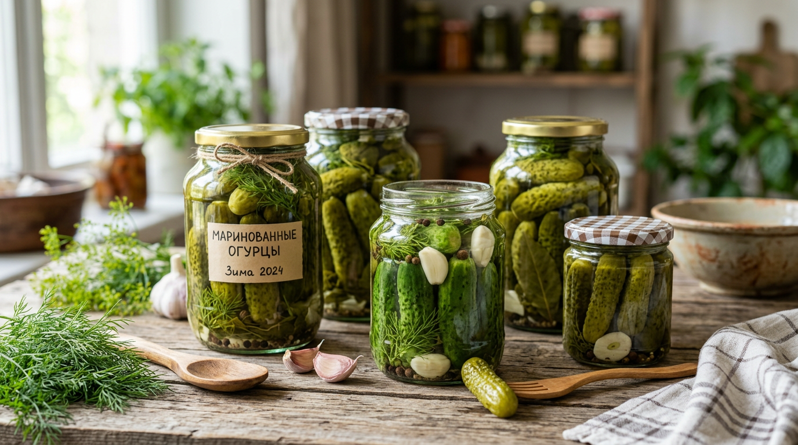
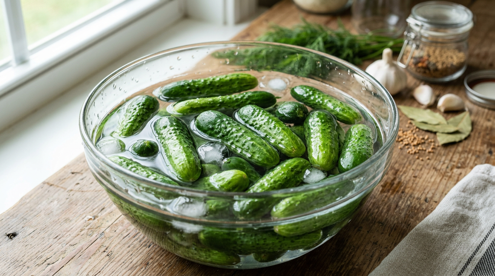
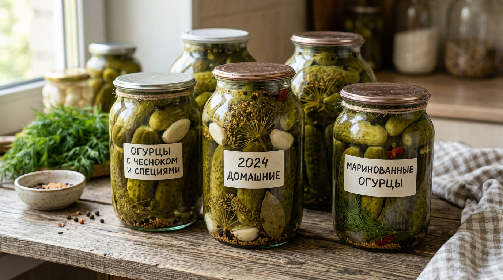
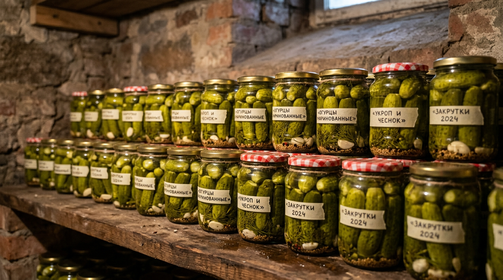

Маринованные хрустящие огурцы — главная заготовка лета и непременное украшение зимнего стола. Открыть банку ароматных, упругих, кисло-сладких огурчиков посреди зимы — что может быть приятнее? Но у многих хозяек огурцы то размякнут, то рассол помутнеет, то крышка вздуется. На самом деле всё дело в нескольких простых правилах — правильные огурцы, верные пропорции маринада и стерильность. Освоив их один раз, вы будете закрывать огурцы легко и без осечек каждый сезон. В этой статье разберём проверенный рецепт маринованных огурцов на зиму, расскажем, как выбрать огурцы и специи, как добиться того самого хруста и каких ошибок избегать.

## 🥒 Какие огурцы выбрать для маринования

Хруст начинается с правильных огурцов. Для маринования подходят далеко не все:

- **Засолочные и корнишонные сорта** — с тонкой кожицей, плотной мякотью и чёрными пупырышками. Именно они дают хруст.
- **Мелкие плоды** — длиной 7–12 см, ровные, без пустот внутри.
- **Свежие и упругие** — лучше всего огурцы прямо с грядки, собранные в день засолки.
- **Одного размера** — в одну банку подбирайте огурцы примерно одинаковой величины, чтобы они равномерно просолились.

А вот **салатные сорта** (с белыми шипами и гладкой кожицей) для маринования не годятся: они мягкие и в банке раскисают. Если огурцы слегка горчат, в маринаде горечь почти полностью уходит, так что использовать их можно. Кстати, о том, почему огурцы горчат и как этого избежать, мы рассказывали в [отдельной статье](https://mir-doma.pro/pochemu-ogurtsy-gorchat/).

## 🫙 Подготовка огурцов, банок и специй

Хорошая подготовка — половина успеха заготовки.

**Огурцы.** Замочите их в холодной воде на 2–4 часа (можно на ночь) — они напитаются влагой и будут хрустящими, а также станут плотнее. Затем хорошо вымойте каждый огурец, особенно у пупырышков, где скапливается грязь; кончики по желанию обрежьте — так огурцы быстрее и равномернее пропитываются маринадом. Если воду для замачивания за это время поменять пару раз, огурцы получатся ещё свежее.

**Банки и крышки.** Тщательно вымойте с содой и простерилизуйте — над паром, в духовке или микроволновке. Крышки прокипятите. Нестерильная тара — главная причина помутневшего рассола и вздувшихся крышек.

**Специи и зелень.** Классический набор на литровую банку: зонтик укропа, 2–3 зубчика чеснока, несколько горошин чёрного и душистого перца, лавровый лист. Для хруста и аромата добавляют листья хрена, чёрной смородины, вишни или дуба — содержащиеся в них дубильные вещества и делают огурцы упругими. По желанию кладут зёрна горчицы, гвоздику, корень или листья хрена, веточку эстрагона. Главное — не переборщить: 2–3 вида специй на банку достаточно, иначе они перебьют вкус самих огурцов.

## 🧂 Классический рецепт хрустящих огурцов

Это базовый проверенный рецепт маринованных огурцов на зиму без стерилизации — методом тройной заливки.

**Ингредиенты на 1-литровую банку:** огурцы (сколько войдёт), зонтик укропа, 2–3 зубчика чеснока, листья хрена и смородины, 5–6 горошин перца, лавровый лист.

**Маринад (на 1 л воды):** 2 столовые ложки соли, 2–3 столовые ложки сахара, 60–70 мл 9%-го уксуса.

**Как приготовить:**

1. На дно стерильной банки уложите зелень и специи, затем плотно — вымоченные огурцы. Крупные ставьте вертикально вниз, мелкими заполняйте промежутки сверху: чем плотнее уложены огурцы, тем меньше они всплывают и тем больше входит в банку.
2. Залейте огурцы крутым кипятком, накройте крышкой и оставьте на 15 минут.
3. Слейте воду, снова вскипятите её и залейте огурцы второй раз ещё на 15 минут.
4. Слейте воду в кастрюлю, добавьте соль и сахар, доведите до кипения, в конце влейте уксус.
5. Залейте огурцы кипящим маринадом до самого верха и сразу же закатайте стерильными крышками.

После закатки банки переверните вверх дном, укутайте одеялом и оставьте до полного остывания — это дополнительная «самостерилизация».

## 🌶️ Варианты маринованных огурцов

На базе классического рецепта легко сделать разные варианты на любой вкус:

- **Острые огурцы.** Добавьте в банку кусочек острого перца чили и побольше чеснока — получится пикантная закуска для любителей поострее.
- **Сладкие (по-болгарски).** Увеличьте количество сахара в маринаде в полтора-два раза — огурцы выйдут кисло-сладкими, такие особенно любят дети.
- **Ассорти.** К огурцам в банку добавьте помидоры черри, кусочки болгарского перца, морковь и лук — яркая и красивая заготовка.
- **С горчицей.** Зёрна горчицы в маринаде придают огурцам пряный вкус и дополнительно защищают от помутнения рассола.

Пропорции маринада при этом остаются теми же — меняются только добавки и количество сахара.

## 🌿 Секреты хруста и аромата

Чтобы огурцы получились по-настоящему хрустящими и ароматными, помните о нескольких хитростях:

- **Листья дуба, хрена, смородины или вишни** — главный секрет хруста за счёт дубильных веществ. Хотя бы один вид добавляйте обязательно.
- **Замачивание в холодной воде** перед закаткой возвращает огурцам упругость.
- **Не переваривайте.** Заливка кипятком прогревает огурцы ровно настолько, чтобы они остались плотными; долгая стерилизация делает их мягкими.
- **Хрен (корень или лист)** не только добавляет хруст, но и защищает заготовку от плесени.
- **Чеснок и острый перец** дают пикантность, но чеснока в меру — его избыток размягчает огурцы.
- **Холодное хранение** сохраняет хруст надолго.

## ❄️ Как и где хранить заготовку

Маринованные огурцы, закатанные по всем правилам, прекрасно хранятся при комнатной температуре, но дольше и надёжнее всего — в прохладном тёмном месте: погребе, подвале или кладовке. Идеальная температура хранения — от 0 до 15 °C. После вскрытия банку держат в холодильнике и съедают в течение пары недель. Не храните заготовки рядом с отопительными приборами и под прямым солнцем — в тепле и на свету огурцы быстрее теряют хруст и могут «забродить». Если погреба нет, банки убирают в самое прохладное место квартиры — например, в кладовку или на застеклённый балкон осенью.

Первые недели после закатки приглядывайте за банками: если рассол помутнел или крышка вздулась, такую заготовку в пищу не употребляют. Правильно приготовленные огурцы стоят всю зиму и дольше.

## 🛡️ Частые ошибки

Разберём, почему заготовка иногда не удаётся:

- **Огурцы мягкие.** Использованы салатные сорта, плоды не замочили, переварили или не добавили листья для хруста. Берите засолочные сорта и не злоупотребляйте нагревом.
- **Рассол помутнел.** Плохо вымыты огурцы или нестерильная тара, попал воздух. Тщательно мойте всё и стерилизуйте банки.
- **Крышки вздуваются и «взрываются».** Не хватило кислоты или соли, плохая стерилизация. Соблюдайте пропорции маринада и стерильность.
- **Огурцы пустотелые.** Использованы переросшие или несвежие плоды. Берите мелкие свежие огурцы прямо с грядки.
- **Слишком кислые или пресные.** Нарушены пропорции — отмеряйте соль, сахар и уксус точно по рецепту.
- **Появилась плесень.** Не хватило кислоты, грязная тара или огурцы плохо покрыты рассолом. Заливайте маринад до самого верха банки и добавляйте лист хрена, который защищает от плесени.

## ❓ Частые вопросы

### Почему маринованные огурцы получаются мягкими?

Чаще всего из-за салатных сортов, которые не годятся для засолки, отсутствия листьев хрена или смородины и слишком долгого нагрева. Используйте засолочные сорта с пупырышками, добавляйте листья для хруста и не переваривайте огурцы.

### Зачем замачивать огурцы перед маринованием?

Замачивание в холодной воде на несколько часов наполняет огурцы влагой, возвращает упругость подвявшим плодам и делает их более плотными и хрустящими в готовой заготовке. Это особенно важно, если огурцы собраны не в день засолки.

### Сколько соли и уксуса класть в маринад?

На 1 литр воды берут примерно 2 столовые ложки соли, 2–3 ложки сахара и 60–70 мл 9%-го уксуса. Это сбалансированные пропорции для кисло-сладкого маринада. Точно отмеряйте ингредиенты — от этого зависит и вкус, и сохранность заготовки.

### Можно ли мариновать огурцы без стерилизации?

Да, метод тройной заливки кипятком позволяет обойтись без стерилизации банок с огурцами: огурцы дважды прогревают кипятком, а третий раз заливают кипящим маринадом с уксусом и сразу закатывают. Главное — использовать стерильные банки и крышки.

### Что добавить, чтобы огурцы были хрустящими?

Листья дуба, хрена, чёрной смородины или вишни — в них есть дубильные вещества, которые и дают хруст. Достаточно добавить хотя бы один вид листьев. Также помогают замачивание перед закаткой и холодное хранение.

### В чём разница между маринованными и солёными огурцами?

В маринованных огурцах кислоту даёт уксус, добавленный в маринад, — они получаются кисло-сладкими и дольше хранятся. Солёные (квашеные) огурцы заквашиваются естественным образом за счёт молочнокислого брожения без уксуса, и вкус у них более «бочковой». Эта статья — о маринованных, с уксусом.

### Можно ли мариновать огурцы вместе с помидорами?

Да, ассорти из огурцов и помидоров — популярная и красивая заготовка. Маринад используют тот же. Учтите только, что помидоры нежнее, поэтому их кладут сверху и не заливают слишком крутым кипятком, чтобы не лопнули.

### Где хранить маринованные огурцы?

Лучше всего в прохладном тёмном месте — погребе, подвале или кладовке при температуре 0–15 °C. Правильно закатанные банки могут стоять и при комнатной температуре, но в прохладе заготовка дольше сохраняет хруст и вкус.

## Заключение

Маринованные хрустящие огурцы на зиму приготовить совсем несложно, если знать несколько секретов: выбрать засолочные сорта, замочить огурцы, добавить листья хрена или смородины для хруста, точно отмерить маринад и закатать в стерильные банки. Метод тройной заливки избавляет от возни со стерилизацией, а результат радует всю зиму — упругие, ароматные огурчики к любому столу. Приготовьте по этому рецепту, и баночка хрустящих огурцов станет вашей гордостью и любимой заготовкой семьи.

А когда наедитесь свежих огурцов и кабачков, не забудьте про другие [рецепты из урожая](https://mir-doma.pro/blyuda-iz-kabachkov-recepty/) — на сайте их будет всё больше. А по какому рецепту маринуете огурцы вы? Делитесь секретами хруста в комментариях и подписывайтесь, чтобы не пропустить новые рецепты и заготовки из урожая.
