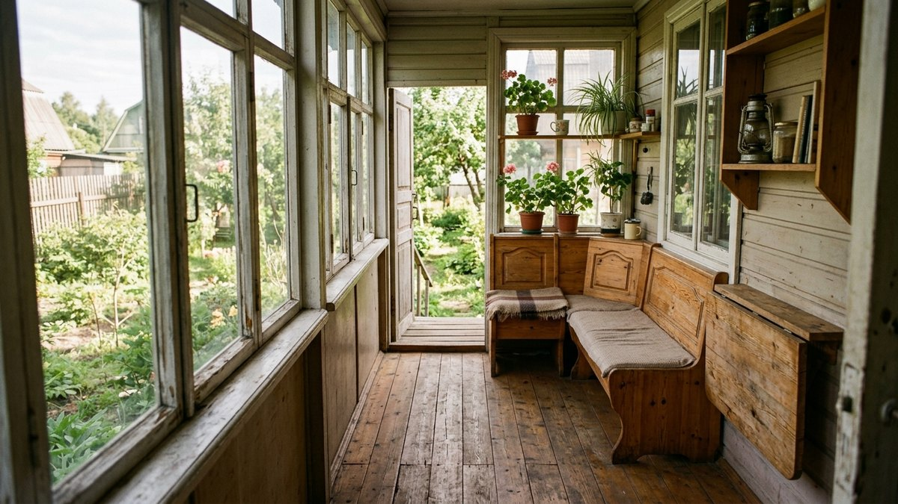
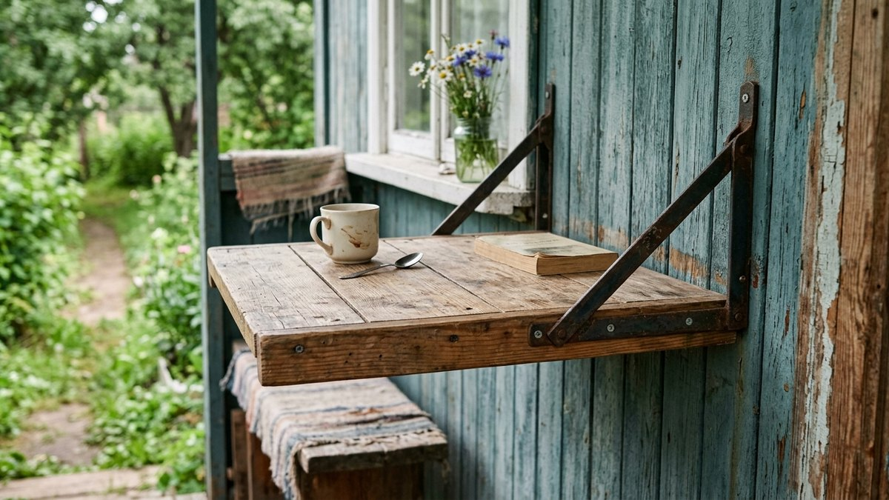
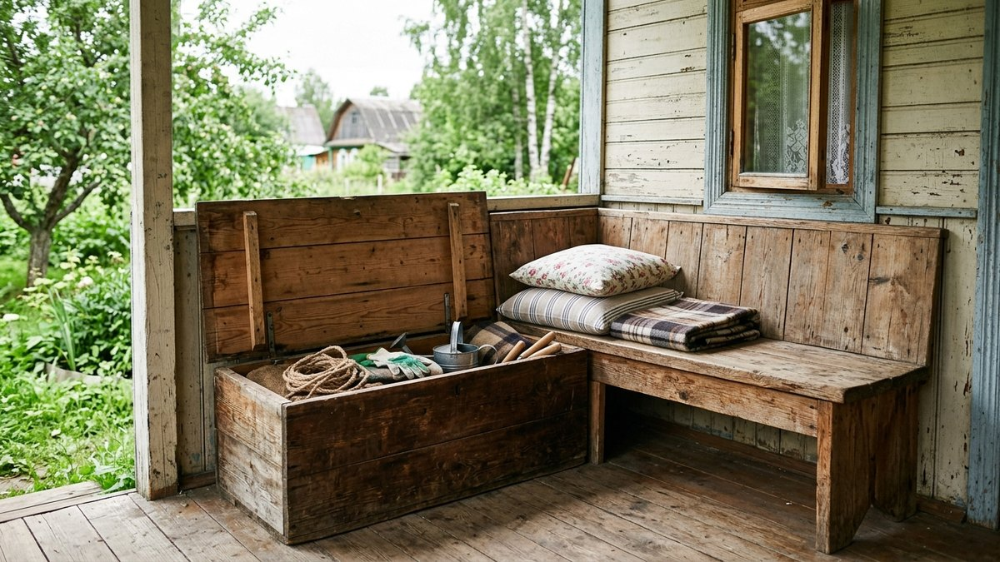
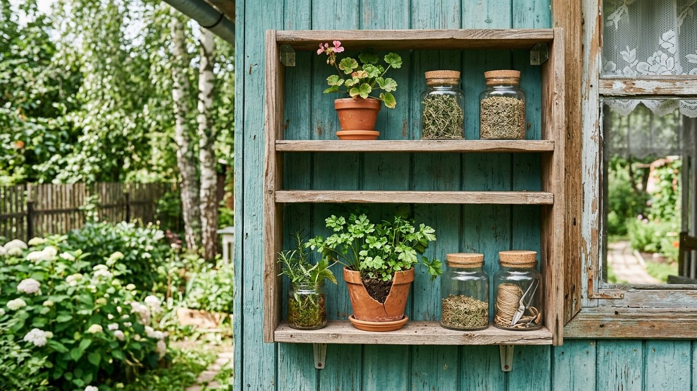
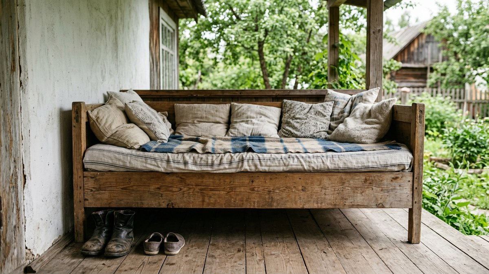
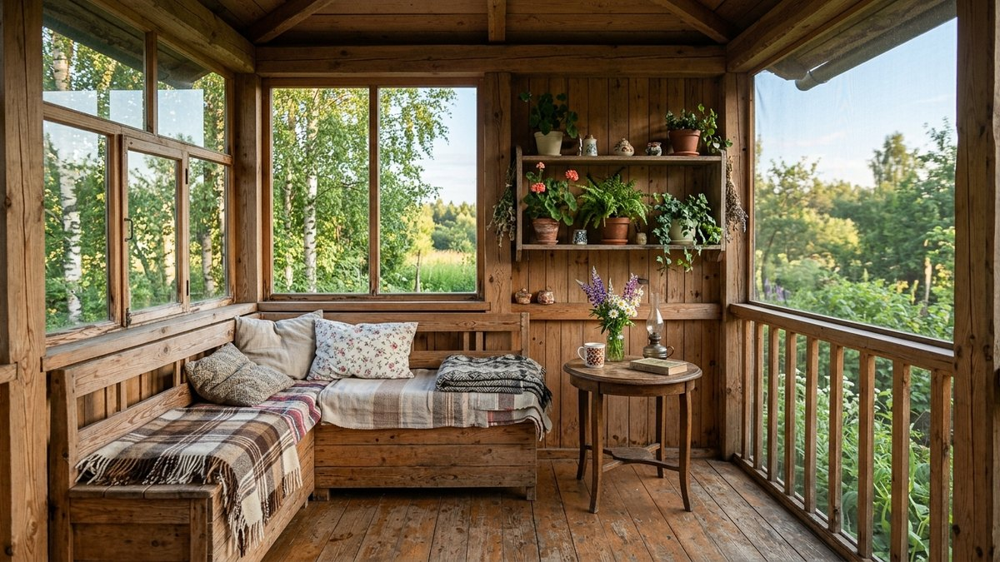

# Мебель для веранды своими руками: 5 проектов с размерами

Обычный дачный стол или скамейка на веранде часто не подходят — мешают
проходу, не встают вплотную к стене или парапету, а зимой на неотапливаемой
веранде отсыревают, если сделаны без запаса на температурные подвижки. Мебель
для веранды — это в первую очередь мебель под конкретные размеры помещения:
компактная, встроенная в стену или парапет, с местом для хранения там, где
обычный столик или скамья просто заняли бы весь проход. Ниже — пять проектов
с размерами и один расчёт материала, который пригодится для любого из них.

## Три правила мебели для веранды

- **Компактность важнее вместимости.** Ширина типовой веранды — 1,8–2,5 м,
  и мебель, рассчитанная на середину участка, здесь съедает весь проход.
  Откидные, встроенные и приставные конструкции решают это без ущерба
  функции.
- **Материал — под условия конкретной веранды.** На неотапливаемой веранде
  без остекления мебель мокнет и мёрзнет так же, как отделка стен: подойдут
  та же лиственница, термодерево или ДПК, что и для обшивки. Разбор
  материалов под открытые условия — в статье
  [отделка открытой террасы](https://mir-doma.pro/otdelka-otkrytoy-terrasy/),
  под закрытую холодную веранду — в статье
  [отделка холодной веранды внутри](https://mir-doma.pro/otdelka-holodnoy-verandy/).
- **Крепление к стене или парапету экономит площадь пола.** Откидные и
  встроенные конструкции на петлях и кронштейнах занимают место только в
  разложенном виде — на узкой веранде это часто единственный рабочий
  вариант.

## Проект 1. Откидной стол на кронштейнах

Столешница из доски 30 мм крепится к стене на рояльной петле, снизу — две
складные металлические опоры-кронштейны (продаются готовыми, рассчитаны на
20–40 кг). В сложенном виде стол занимает 5–7 см у стены, в разложенном —
столешница 60×80 см на высоте 75 см от пола.

- Доска или мебельный щит 30 мм, 600×800 мм.
- Рояльная петля длиной в ширину столешницы.
- 2 складные опоры-кронштейна с фиксатором.
- Кромка ПВХ или масло по срезу торцов, если веранда открытая.

Если на веранде уже стоит обычный дачный стол и хочется просто мебель для
другого места на участке — сравнение форм и материалов разобрано в статье
[стол для дачи своими руками](https://mir-doma.pro/stol-dlya-dachi-svoimi-rukami/).

## Проект 2. Угловая скамья с ящиком для хранения

Скамья вдоль двух смежных стен угла веранды с откидной или съёмной крышкой
сиденья — под ней ящик для подушек, инструмента или садового инвентаря.
Каркас — брус 40×40 мм, сиденье и обвязка — доска 20–25 мм с зазором 3–5 мм
между досками для стока воды на открытой веранде.

Типовые размеры одной стороны угловой скамьи: длина 120–180 см, глубина
сиденья 40 см, высота от пола 42–45 см.

### Калькулятор материала для скамьи

<!-- wp:html -->

<h3 class="md-mv__title">Калькулятор досок для скамьи с ящиком</h3>

Считает погонные метры и число досок на сиденье и обвязку по длине скамьи.

<label class="md-mv__f">Длина скамьи, м<input type="number" id="mvLen" value="1.5" min="0.4" max="6" step="0.1"></label>
<label class="md-mv__f">Глубина сиденья, м<input type="number" id="mvDepth" value="0.4" min="0.2" max="1" step="0.01"></label>
<label class="md-mv__f">Ширина доски, мм<input type="number" id="mvWid" value="90" min="30" max="300" step="1"></label>
<label class="md-mv__f">Зазор между досками, мм<input type="number" id="mvGap" value="4" min="0" max="20" step="1"></label>
<label class="md-mv__f">Длина одной доски в продаже, м<input type="number" id="mvBoardLen" value="3" min="0.5" max="6" step="0.1"></label>
<label class="md-mv__f">Цена за 1 доску, ₽ (необязательно)<input type="number" id="mvPrice" value="" min="0" max="20000" step="1" placeholder="0"></label>

Досок на сиденье<b id="mvBoards">4 шт</b>

Погонных метров<b id="mvRunning">6,0 м</b>

Стоимость досок<b id="mvCost">—</b>

Расчёт только на полотно сиденья. Каркас (брус обвязки и ножки) и крепёж считайте отдельно по чертежу.

<button type="button" id="mvCopy" class="md-mv__btn md-mv__btn--main">Скопировать результат</button>
<a id="mvVk" class="md-mv__btn md-mv__btn--vk" href="#" target="_blank" rel="noopener noreferrer">Поделиться ВКонтакте</a>
<a id="mvTg" class="md-mv__btn md-mv__btn--tg" href="#" target="_blank" rel="noopener noreferrer">Поделиться в Telegram</a>
<button type="button" id="mvShareNative" class="md-mv__btn" hidden>Поделиться…</button>
<button type="button" id="mvPrint" class="md-mv__btn">Печать</button>

<!-- /wp:html -->

Если на веранде уже есть отдельная скамья и не хватает именно места для
хранения — крышку-ящик можно добавить к готовой скамейке, разбор конструкций
без встройки в угол — в статье
[скамейка для дачи своими руками](https://mir-doma.pro/skameyka-dlya-dachi-svoimi-rukami/).

## Проект 3. Открытый стеллаж вдоль глухой стены

Лёгкий стеллаж из бруса 20×40 мм и доски-полки 18–20 мм, глубина 25–30 см,
высота под подоконник или до потолка — под цветы, банки заготовок с веранды,
инвентарь. На узкой веранде стеллаж съедает меньше места, чем шкаф с
дверцами, и не мешает открывать окна.

- Стойки — брус 20×40 мм, по 2 на каждую полку.
- Полки — доска 18–20 мм, глубина 25–30 см.
- Крепление к стене уголками — стеллаж не должен опрокидываться при
  задевании.

## Проект 4. Приставной столик-табурет

Компактный кубический табурет-столик 35×35×40 см из четырёх ножек-брусков
40×40 мм и столешницы из доски или мебельного щита — переставляется куда
нужно, а на ночь задвигается под скамью или стол. Хорошее решение для узких
проходов, где откидной стол не поставить из-за формы веранды.

## Проект 5. Скамья-лежанка вдоль глухой стены

Широкая скамья глубиной 55–60 см вместо обычных 35–40 см — на ней можно
сидеть боком, поджав ноги, или лечь. Каркас тот же, что у угловой скамьи из
проекта 2, но без угла — вдоль одной длинной глухой стены, где нет ни окон,
ни двери.

Общий подбор мебели и материалов для интерьера веранды целиком, если
пять проектов выше — только часть задачи, разобран в статье
[дизайн веранды на даче](https://mir-doma.pro/dizayn-verandy-na-dache/).

## Чем покрыть мебель на веранде

На открытой веранде без остекления — то же масло для террас, что и для
обшивки: лиственница и термодерево держат влагу без пропитки, но темнеют без
неё быстрее. На закрытой холодной веранде подойдёт обычный акриловый лак или
масло для внутренних работ — конденсата там меньше, чем прямых осадков.
Крепёж — только оцинкованный или нержавеющий, обычный сталь ржавеет от
влажности за один сезон и оставляет пятна на светлом дереве.

## Частые ошибки

- **Мебель, рассчитанная на площадь участка, а не на ширину веранды.**
  Стандартный садовый стол 70×120 см на веранде 2 м перекрывает весь проход.
- **Обычная фанера или ДСП для открытой веранды.** Материалы без защиты от
  прямой влаги разбухают за один сезон дождей.
- **Крепление к стене без учёта нагрузки.** Откидной стол и полки держатся
  на дюбелях, рассчитанных на вес человека, облокотившегося на столешницу,
  а не только на вес самой конструкции.
- **Сплошные ящики без вентиляции.** Ящик под сиденьем скамьи на открытой
  веранде должен иметь зазоры или отверстия снизу — иначе внутри скапливается
  влага и подушки или инвентарь отсыревают.

## Частые вопросы

### Какой высоты делать скамью для веранды

Стандартная высота сиденья от пола — 42–45 см, как у обычного стула. Ниже
делают только лежанки, где садятся боком или ложатся, а не сидят прямо.

### Можно ли использовать паллеты для мебели веранды

Да, для стеллажа или низкой скамьи паллетная доска подходит, но требует
обработки антисептиком и шлифовки — необработанное паллетное дерево часто
занозистое и не рассчитано на постоянную влажность открытой веранды.

### Как закрепить откидной стол, чтобы он не шатался

Складные опоры-кронштейны выбирайте с фиксатором в разложенном положении —
без него столешница проседает при нагрузке сбоку. Дополнительно можно
поставить одну съёмную ножку под свободный край для тяжёлых нагрузок.

### Нужно ли обрабатывать мебель для веранды антисептиком, если веранда закрытая

Да, антисептик защищает от плесени и грибка в любом случае — остекление
защищает от прямого дождя, но не от перепадов влажности воздуха на
неотапливаемой веранде.

