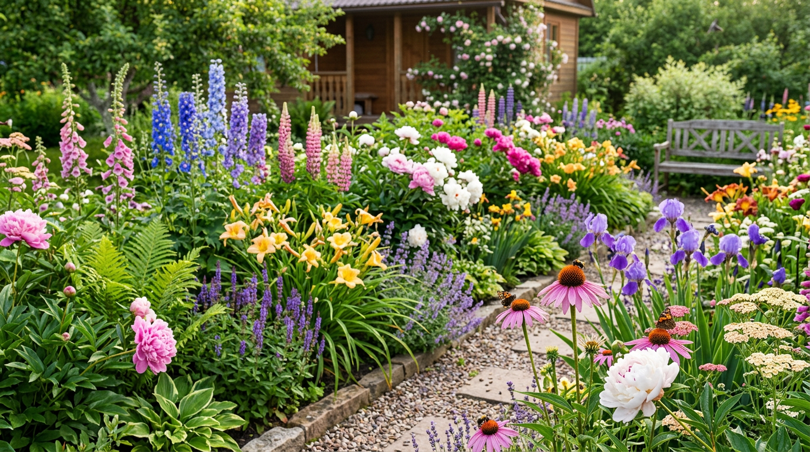
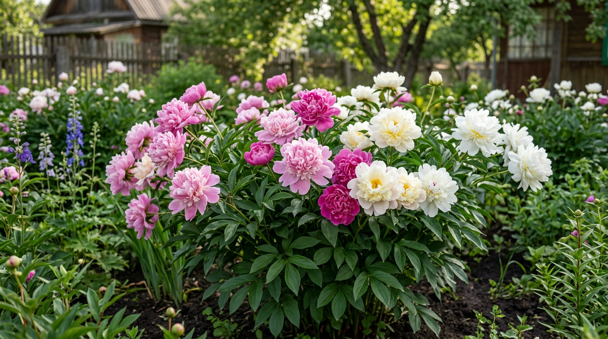
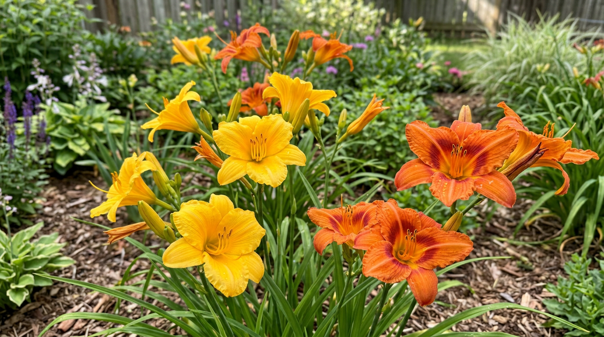
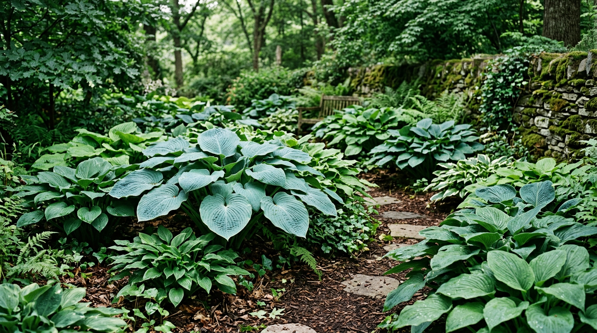
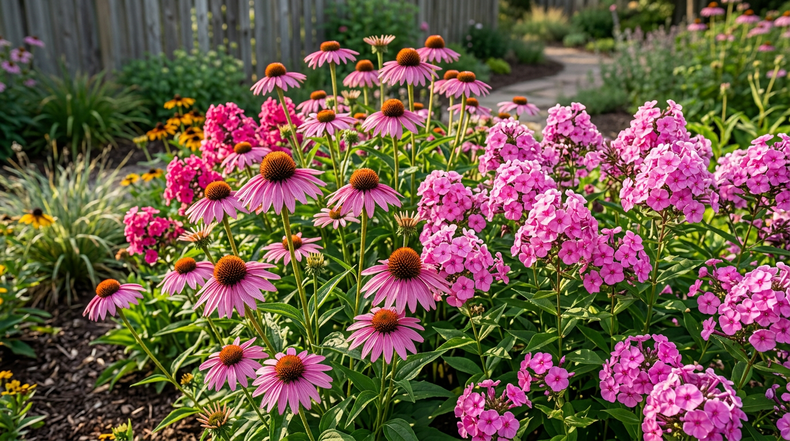
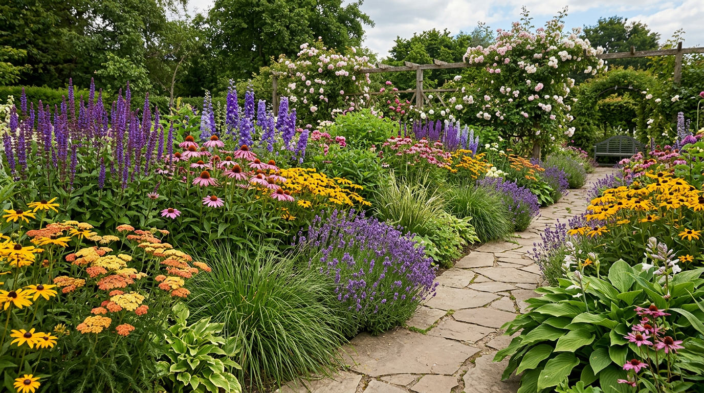

Многолетние цветы — мечта любого дачника, у которого нет времени на постоянную возню с клумбами. Посадил однажды — и растение радует цветением много лет, год от года разрастаясь и становясь только пышнее. Не нужно каждую весну покупать рассаду и высаживать всё заново. В этой статье собрали неприхотливые многолетние цветы для дачи, которые растут на солнце и в тени, цветут всё лето и почти не требуют ухода, а также расскажем, как составить из них красивую клумбу.

## 🌸 Чем хороши многолетники

Многолетние цветы заслуженно любят дачники, и вот почему:

- **Сажают один раз** — растение живёт и цветёт много лет.
- **Не требуют рассады** — не нужно каждую весну сеять и высаживать заново.
- **Разрастаются** — со временем образуют пышные куртины, которые можно делить и рассаживать.
- **Зимуют в открытом грунте** — большинство видов морозостойки.
- **Неприхотливы** — многим достаточно минимального ухода.

Главное — правильно подобрать растения под освещённость участка и сочетать их по срокам цветения, чтобы клумба радовала с весны до осени. К тому же многолетники со временем экономят и деньги: один куст за несколько лет можно поделить на множество новых растений и засадить ими весь участок бесплатно.

## ☀️ Многолетники для солнечных мест

Большинство садовых многолетников любят солнце — на открытых, хорошо освещённых клумбах они цветут пышнее всего. Вот самые неприхотливые из них:

- **Пионы** — роскошное пышное цветение в начале лета, живут на одном месте десятилетиями.
- **Флоксы** — ароматные плотные шапки цветов всё лето, множество расцветок, прекрасно стоят в срезке.
- **Лилейник** — один из самых неприхотливых многолетников, цветёт обильно и долго.

- **Эхинацея** — цветёт с середины лета до осени, привлекает бабочек и полезна как лекарственное растение.
- **Рудбекия (золотые шары)** — яркие жёлтые цветы, очень выносливая.
- **Очиток (седум)** — засухоустойчивый суккулент, украшает клумбу осенью.
- **Лаванда** — ароматные сиреневые колоски, любит солнце и сухость.
- **Нивяник (садовая ромашка)** — простые и милые белые ромашки, цветут всё лето.
- **Тысячелистник** — неприхотлив, засухоустойчив, разных расцветок.

## 🌳 Многолетники для тени и полутени

Тень — не приговор для цветника. Тенистые уголки под деревьями и у северных стен тоже можно превратить в нарядный зелёный сад с помощью теневыносливых растений:

- **Хоста** — главное теневое растение: эффектная декоративная листва от голубой до золотистой, разрастается в пышные кусты и почти не требует ухода.
- **Астильба** — пышные ажурные метёлки, любит влажную тень.
- **Бруннера** — нежные голубые цветы, как незабудки, и красивые листья.
- **Папоротники** — создают пышную зелень в тени, не требуют ухода.
- **Дицентра (разбитое сердце)** — изящные сердцевидные цветки на дугах.
- **Аквилегия (водосбор)** — ажурные цветки, хорошо растёт в полутени.

## 🌿 Почвопокровные и бордюрные многолетники

Эти растения стелются по земле живым ковром, закрывают пустые места, подавляют сорняки и красиво обрамляют дорожки и клумбы:

- **Барвинок** — вечнозелёный ковёр с голубыми цветками, растёт даже в тени.
- **Живучка (аюга)** — быстро образует плотный декоративный коврик.
- **Гвоздика-травянка** — низкие подушки с яркими цветками, любит солнце.
- **Флокс шиловидный** — весной превращается в цветущий ковёр, идеален для альпийских горок.
- **Манжетка** — мягкая зелень и воздушные жёлто-зелёные соцветия.

Почвопокровные особенно хороши вдоль [садовых дорожек](https://mir-doma.pro/sadovye-dorozhki-svoimi-rukami/) и по краям клумб.

## 🌷 Луковичные многолетники

Отдельно стоит упомянуть луковичные — они зимуют в земле и из года в год радуют ранним цветением:

- **Тюльпаны и нарциссы** — первые яркие цветы весны, очень неприхотливы.
- **Крокусы и мускари** — самые ранние, расцветают почти из-под снега.
- **Лилии** — роскошное летнее цветение, множество сортов.
- **Гладиолусы** — эффектные, но луковицы на зиму выкапывают (в отличие от остальных).

Луковичные удобно сажать группами среди других многолетников — они отцветают первыми, а их увядающую листву прикрывают разрастающиеся соседи.

## 🗓️ Чтобы клумба цвела всё лето

Главный секрет непрерывно цветущей клумбы прост — подобрать растения с разными сроками цветения, чтобы, отцветая, одни передавали эстафету другим:

- **Весна:** примулы, дицентра, бруннера, ирисы.
- **Начало лета:** пионы, нивяник, аквилегия.
- **Середина лета:** лилейник, флоксы, эхинацея, лаванда.
- **Осень:** очиток, многолетние астры, рудбекия, гелениум.

Скомбинировав растения по сезонам, вы получите клумбу, которая цветёт без перерыва с весны до самых заморозков.

## 🌱 Как ухаживать за многолетниками

Многолетники неприхотливы, но минимальный уход продлевает и улучшает цветение:

- **Полив** — в засуху, особенно молодым растениям; взрослые многолетники засухоустойчивее.
- **Мульчирование** — слой мульчи удерживает влагу, сдерживает сорняки и защищает корни.
- **Подкормка** — весной для роста и после цветения для закладки бутонов на следующий год. О питании растений — в статье о [летних подкормках](https://mir-doma.pro/letnie-podkormki-ovoshchey/).
- **Обрезка** — удаление отцветших соцветий продлевает цветение и сохраняет опрятный вид.
- **Деление** — раз в 3–5 лет разросшиеся кусты делят и рассаживают; это омолаживает растение, улучшает цветение и даёт бесплатный посадочный материал для новых клумб или для обмена с соседями.
- **Подготовка к зиме** — осенью обрезают надземную часть, теплолюбивые виды (например, некоторые сорта) укрывают.

## 💡 Как составить клумбу из многолетников

Чтобы клумба смотрелась гармонично, придерживайтесь нескольких правил:

- **По высоте.** Высокие растения (пионы, дельфиниум) — на задний план, средние — в центр, низкие и почвопокровные — на передний край.
- **По свету.** Группируйте растения по требованиям к освещённости: солнечные — на открытых местах, теневые — в тени.
- **Группами.** Сажайте растения группами по 3–5 штук одного вида — так они смотрятся эффектнее, чем поодиночке.
- **По цвету.** Сочетайте 2–3 основных оттенка, чтобы клумба не выглядела пёстрой.

Расположение клумб удобно продумать ещё на этапе [планировки участка](https://mir-doma.pro/planirovka-uchastka-10-sotok/) — так они впишутся в общий замысел.

## 🛡️ Частые ошибки

Чтобы многолетники радовали, избегайте типичных промахов:

- **Не учли освещённость.** Солнцелюбивые растения в тени не цветут, а теневые на солнце выгорают. Подбирайте по месту.
- **Загущение.** Многолетники разрастаются, поэтому при посадке оставляйте между ними запас места.
- **Не делят кусты.** Без деления многие многолетники со временем мельчают и хуже цветут.
- **Не учли высоту и сроки.** Без планирования высокие растения закрывают низкие, а клумба цветёт «рывками».

## ❓ Частые вопросы

### Какие многолетники самые неприхотливые?

Лилейник, хоста, флоксы, рудбекия, очиток, нивяник, барвинок и тысячелистник — одни из самых выносливых и неприхотливых. Они хорошо зимуют, разрастаются и почти не требуют ухода, поэтому идеальны для начинающих и для дачи, которую посещают нечасто.

### Какие многолетние цветы цветут всё лето?

Долгим цветением отличаются лилейник, флоксы, эхинацея, рудбекия и нивяник. А чтобы клумба цвела непрерывно, комбинируют растения с разными сроками — весенние, летние и осенние, сменяющие друг друга.

### Какие цветы посадить в тени на даче?

Для тени и полутени подойдут хоста, астильба, бруннера, папоротники, дицентра и аквилегия. Они прекрасно растут под деревьями и у северных стен, где другие цветы цвести не будут, и украшают сад декоративной листвой и цветами.

### Когда сажать многолетники?

Большинство многолетников сажают весной или в конце лета — начале осени, чтобы они успели укорениться до холодов. Растения с открытой корневой системой лучше высаживать в прохладную погоду, а саженцы в контейнерах — в любое время сезона.

### Нужно ли укрывать многолетники на зиму?

Большинство неприхотливых многолетников зимостойки и в укрытии не нуждаются — достаточно осенью обрезать надземную часть. Укрывают лишь теплолюбивые виды и некоторые сорта, а также молодые растения первого года, замульчировав их или прикрыв лапником.

### Какие многолетники цветут уже в первый год?

Многие многолетники в первый год наращивают корни и листву, а зацветают на второй. Но лилейник, эхинацея, нивяник, рудбекия и некоторые другие при посадке весной нередко цветут уже в первое лето. Луковичные (тюльпаны, нарциссы) тоже цветут в первый сезон.

### Можно ли сажать многолетники рядом с овощами?

Да, цветы-многолетники часто сажают по краям грядок и вдоль дорожек огорода — они украшают участок и привлекают опылителей и полезных насекомых. Главное — выбирать растения со схожими требованиями к свету и поливу и не давать им затенять овощи.

### Как часто делить многолетники?

В среднем раз в 3–5 лет, когда куст сильно разрастается и середина начинает оголяться или цветение слабеет. Деление омолаживает растение, улучшает цветение и даёт бесплатный посадочный материал для новых клумб.

## Заключение

Многолетние цветы — лучший выбор для красивой и не отнимающей много времени дачи: посадил однажды — и любуешься цветением годами. Подберите неприхотливые виды под освещённость участка: для солнца — пионы, лилейник, флоксы и эхинацею, для тени — хосту, астильбу и папоротники, а края клумб украсьте почвопокровными. Скомбинируйте растения по срокам цветения — и сад будет цвести с весны до осени, требуя лишь минимального ухода. Создайте такую клумбу однажды, и она долгие годы будет радовать вас яркими красками, требуя взамен лишь немного внимания весной и осенью. Это идеальный выбор для тех, кто хочет красивый сад без ежегодных хлопот и лишних затрат на рассаду.

А какие многолетники растут на вашей даче? Делитесь любимыми цветами в комментариях и подписывайтесь, чтобы не пропустить новые статьи о саде и цветах.
