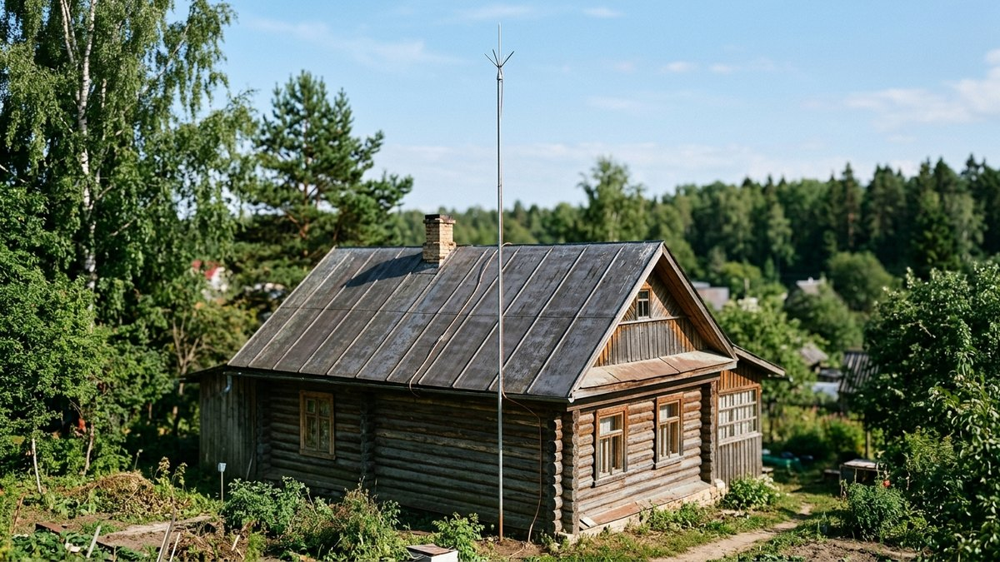
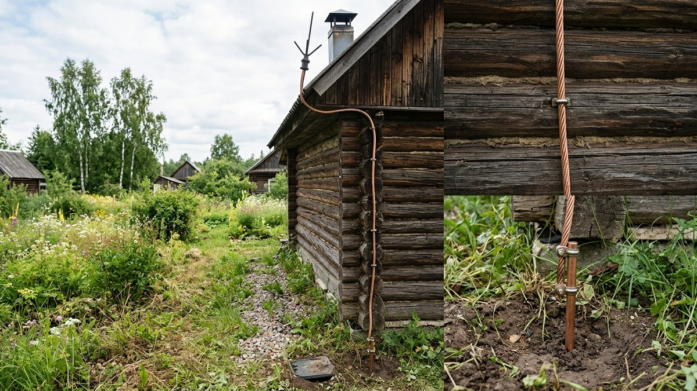
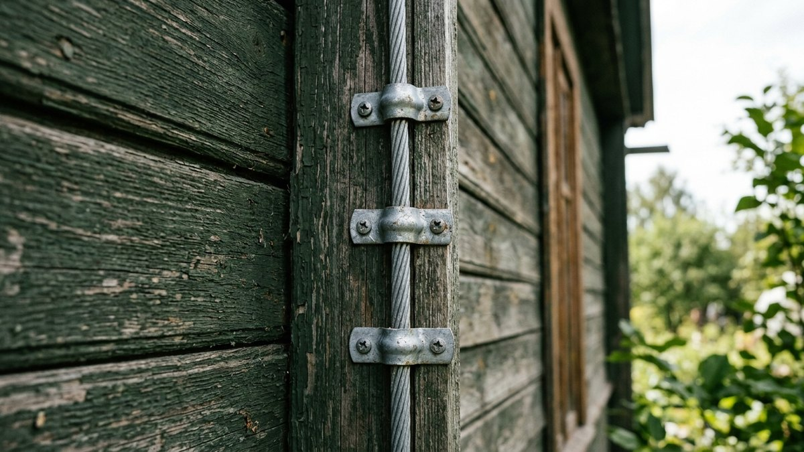
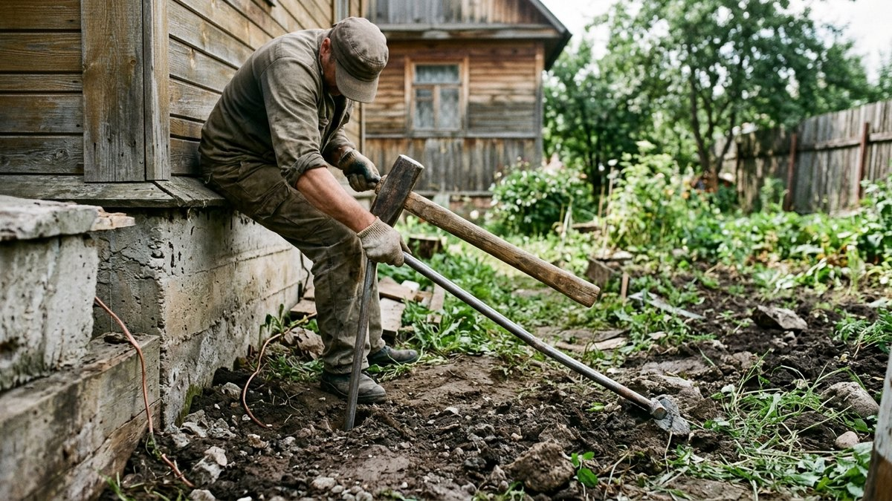
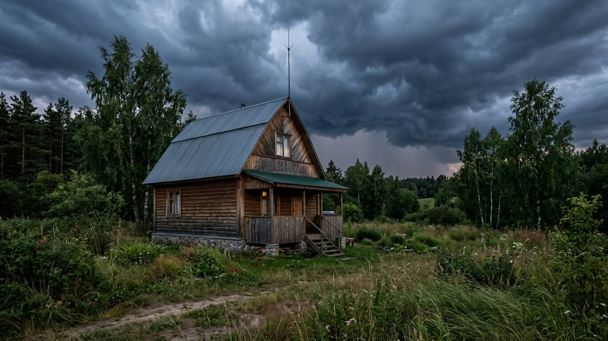
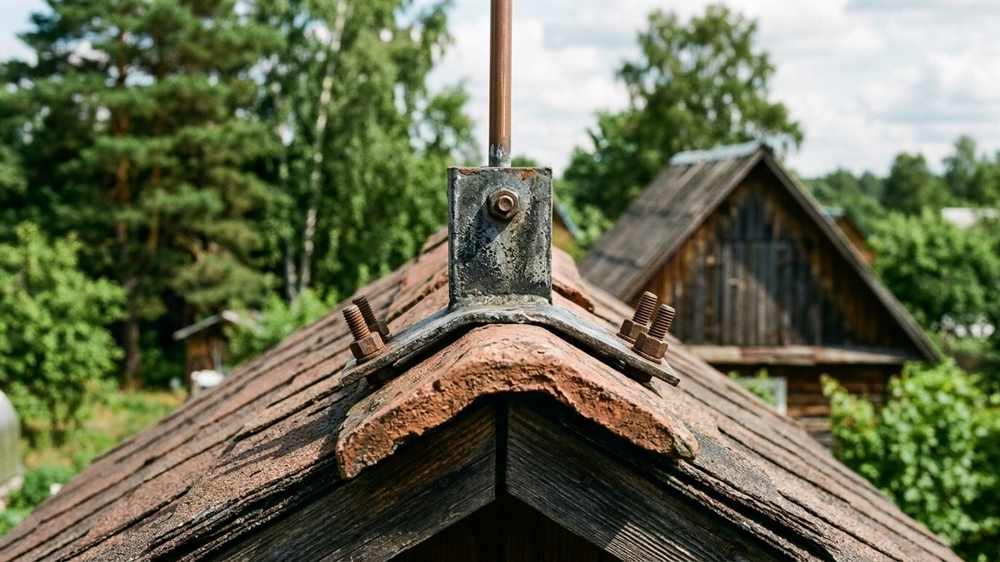

# Как сделать молниезащиту в частном доме: из чего состоит система

Молниезащита и заземление электропроводки — разные системы с разными
задачами, хотя их часто путают. Заземление проводки защищает от удара
током при пробое изоляции внутри дома. Молниезащита — отдельная система,
которая перехватывает прямой удар молнии и безопасно отводит его в землю,
не давая ему пройти через конструкцию дома или электропроводку. Разберём,
кому она точно нужна и из каких трёх элементов состоит.

## Кому молниезащита нужна точно

- **Дом стоит на открытом месте** — на возвышенности, посреди поля или
  среди построек заметно ниже него. Молния бьёт в самую высокую точку
  поблизости.
- **Металлическая кровля** большой площади без изоляции от несущих
  конструкций — хороший проводник, повышающий вероятность прямого удара.
- **Рядом нет высоких деревьев**, которые в норме принимают удар молнии на
  себя вместо построек.
- **Грозовая активность в регионе выше средней** — для средней полосы и
  юга России риск заметно выше, чем для северных регионов.

Если хотя бы два из этих пунктов совпадают, молниезащиту стоит
устанавливать не откладывая, а не рассчитывать на удачу.

## Три элемента системы молниезащиты

1. **Молниеприёмник** — принимает удар молнии на себя. Устанавливается
   выше самой высокой точки кровли: штырь на коньке, трос вдоль конька для
   протяжённых крыш или сетка для больших плоских кровель.
2. **Токоотвод** — проводник, который ведёт ток молнии от приёмника вниз
   по фасаду к заземлителю. На дом ставят не менее двух токоотводов с
   разных сторон здания — при одном отводе весь импульсный ток идёт по
   единственному пути, и его отказ оставляет дом без защиты.
3. **Заземлитель** — контур в земле, куда токоотвод сбрасывает ток молнии,
   рассеивая его в грунте. Для молниезащиты часто делают отдельный контур,
   не совмещённый с рабочим заземлением электропроводки, — импульсный ток
   молнии на порядки больше рабочих токов и создаёт кратковременный скачок
   потенциала, который может повредить бытовую технику через общий контур
   без специального устройства выравнивания потенциалов между ними.

## Молниеприёмник: какой тип под какую крышу

- **Штыревой** — один или несколько металлических штырей на коньке или
  печной трубе, для домов с обычной скатной кровлей.
- **Тросовый** — стальной трос, натянутый вдоль конька между двумя
  опорами, для длинных протяжённых крыш, где одного штыря недостаточно.
- **Сетчатый** — сетка из проводника с шагом ячейки 6×6 или 10×10 м,
  уложенная по всей площади кровли, для больших плоских крыш, где нет
  явной высшей точки под штырь.

## Токоотвод: материал и монтаж

Токоотвод делают из оцинкованной стали или меди сечением от 6 мм² —
крепят к фасаду скобами с шагом около 1–1,5 м, по кратчайшему прямому пути
от приёмника к заземлителю, избегая острых углов и петель: резкий изгиб
токоотвода создаёт индуктивное сопротивление и повышает риск пробоя тока
молнии через стену дома в обход проводника. Металлическую водосточную
трубу как токоотвод не используют — если водосток изолирован от кровли,
он не рассчитан на такой ток.

## Заземлитель: где и как

Заземлитель молниезащиты выносят на расстояние от здания — не менее 5 м от
входов и мест, где ходят люди, и по возможности отдельно от контура
рабочего заземления электропроводки, о котором подробно рассказано в
статье [как провести электричество на
даче](https://mir-doma.pro/elektrichestvo-na-dache-svoimi-rukami/).
Заглубляют штыри ниже глубины промерзания грунта в вашем регионе — на
промёрзшем грунте сопротивление растеканию тока резко растёт, и заземлитель
хуже справляется со своей задачей именно зимой, когда часть гроз в году
всё ещё возможна в переходные сезоны.

## Порядок монтажа

1. Определить самую высокую точку кровли и тип молниеприёмника под
   конфигурацию крыши.
2. Установить молниеприёмник с запасом высоты над коньком или трубой.
3. Проложить не менее двух токоотводов по кратчайшему прямому пути с
   разных сторон здания, закрепить скобами по фасаду.
4. Устроить заземлитель на нужном расстоянии от дома, заглубив ниже
   промерзания грунта.
5. Соединить все элементы сваркой или специальными зажимами — обжимные
   соединения без сварки со временем окисляются и повышают сопротивление
   контакта.
6. Проверить целостность цепи и сопротивление заземления — расчёт под
   конкретный дом и грунт лучше доверить специалисту, самостоятельно
   собранная система без проверки сопротивления не даёт гарантии защиты.

## Частые ошибки

- **Один токоотвод вместо двух.** При повреждении единственного проводника
  дом остаётся без защиты в разгар грозы.
- **Общий контур заземления для молниезащиты и электропроводки без
  разделительного устройства.** Импульсный ток молнии может повредить
  бытовую технику через общий контур.
- **Металлическая водосточная труба вместо отдельного токоотвода.**
  Не рассчитана на такой ток и не имеет надёжного соединения с
  молниеприёмником.
- **Заземлитель слишком близко к дому или входу.** При ударе молнии
  вокруг заземлителя возникает опасное напряжение шага — людям находиться
  рядом в момент разряда небезопасно.

## Частые вопросы

### Чем молниезащита отличается от заземления электропроводки

Молниезащита перехватывает прямой удар молнии и отводит его в землю,
минуя конструкцию дома. Заземление проводки защищает от удара током при
пробое изоляции внутри дома — это разные системы с разными задачами и
чаще всего с разными контурами в земле.

### Нужна ли молниезащита, если в доме уже есть заземление проводки

Да, если дом стоит на открытом месте, имеет металлическую кровлю большой
площади или рядом нет высоких деревьев — заземление проводки не заменяет
молниезащиту, они решают разные задачи.

### Можно ли сделать молниезащиту полностью своими руками

Монтаж элементов — да, при наличии материалов и инструмента. Расчёт зоны
защиты под конкретную высоту дома и параметры грунта, а также проверку
сопротивления заземления лучше доверить специалисту — ошибка в расчёте
снижает надёжность защиты именно в момент, когда она нужна.

### Как часто нужно проверять систему молниезащиты

Ежегодно перед началом грозового сезона — визуально проверяют целостность
токоотводов и надёжность соединений, а раз в несколько лет стоит измерить
сопротивление заземлителя приборами, так как оно может меняться со временем.

