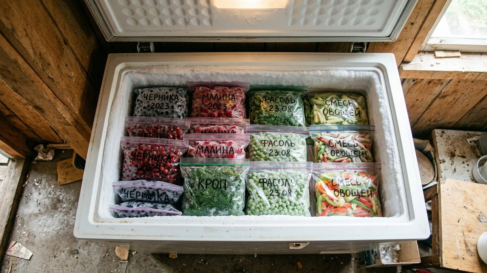
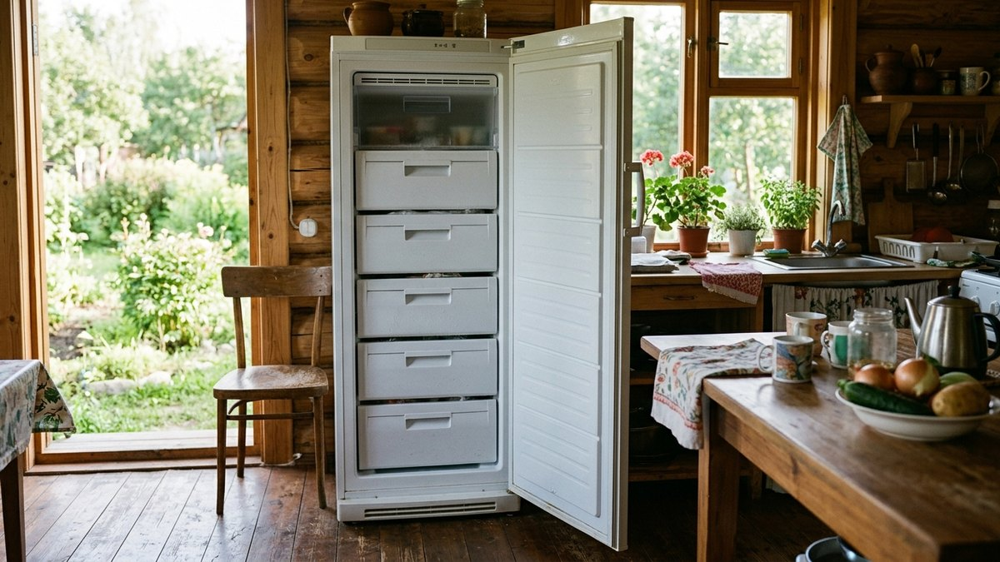
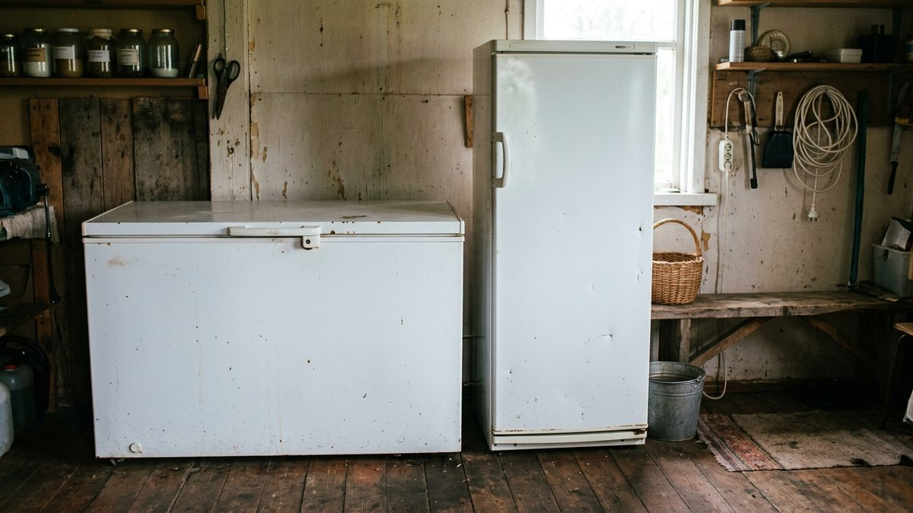
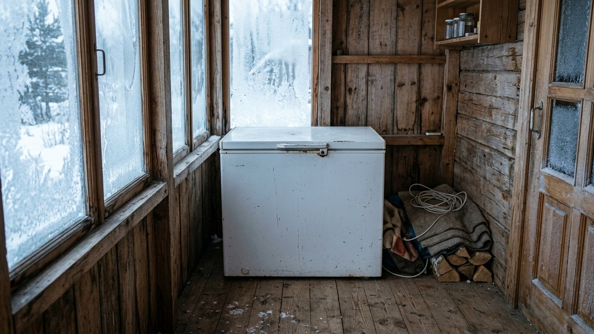
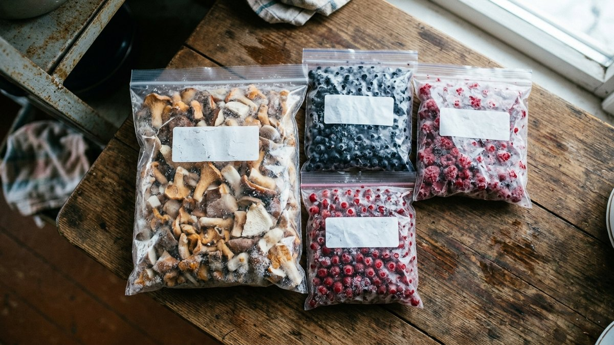
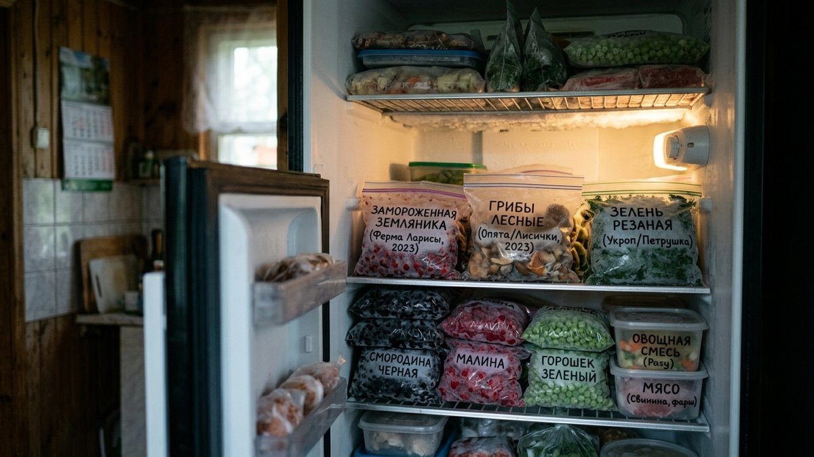

Заморозка — самый простой способ сохранить урожай без варки и стерилизации, но у неё есть узкое место: всё это нужно куда-то складывать. Обычного морозильного отделения холодильника хватает на пару пакетов ягод, а не на урожай с шести соток. Разберём, что выгоднее — морозильный ларь или морозильная камера — по объёму, цене, электричеству и месту, а заодно посчитаем, сколько литров реально нужно под ваш урожай.

## Морозильный ларь: плюсы и минусы

**Плюсы.** Больше полезного объёма на те же деньги — у ларя нет вертикальной дверцы с уплотнителем по всей высоте, а холодный воздух при открытии крышки сверху почти не выходит наружу (он тяжелее тёплого и остаётся внизу). Отсюда два следствия: цена за литр обычно ниже, чем у камеры, и при отключении электричества ларь дольше держит температуру — открытая сверху крышка теряет холод медленнее, чем боковая дверца.

**Минусы.** Занимает много площади пола — это горизонтальный ящик, а не шкаф. Искать что-то на дне неудобно, если не разложить продукты по корзинам или мешкам с подписями, — без организации ларь быстро превращается в «морозильную яму», где нижний слой годами лежит нетронутым. В тесном помещении крышку неудобно поднимать, если сверху что-то стоит.

## Морозильная камера: плюсы и минусы

**Плюсы.** Компактнее по площади пола — стоит как узкий шкаф, а не занимает половину кладовой. Полки и выдвижные ящики позволяют разложить продукты по категориям и сразу видеть, что где лежит, без перекапывания. Многие модели с No Frost не покрываются инеем и не требуют ручной разморозки раз в полгода.

**Минусы.** Меньше полезного объёма на тот же внешний размер и обычно дороже за литр, чем ларь. Боковая дверца при каждом открытии выпускает больше холодного воздуха, а при отключении электричества камера теряет температуру быстрее ларя — при долгом отключении в отсутствие хозяев риск разморозки выше.

## Сравнение по параметрам

| Параметр | Морозильный ларь | Морозильная камера |
|---|---|---|
| Цена за литр объёма | Ниже | Выше |
| Площадь под установку | Больше (горизонтальный) | Меньше (вертикальный) |
| Удобство поиска продуктов | Хуже без организации | Лучше — полки и ящики |
| Потери холода при отключении света | Медленнее | Быстрее |
| Разморозка/обслуживание | Обычно вручную | Часто No Frost |
| Хорош для | Больших объёмов урожая | Ограниченной площади |

## Сколько литров нужно под урожай

<!-- wp:html -->

  
Калькулятор нужного объёма морозильника

  <label class="md-calc__label" for="mdFcBerry">Ягоды и фрукты, кг за сезон</label>
  <input type="number" id="mdFcBerry" class="md-calc__input" min="0" step="1" placeholder="например, 30">
  <label class="md-calc__label" for="mdFcVeg">Овощи и зелень, кг за сезон</label>
  <input type="number" id="mdFcVeg" class="md-calc__input" min="0" step="1" placeholder="например, 40">
  <label class="md-calc__label" for="mdFcMush">Грибы, кг за сезон</label>
  <input type="number" id="mdFcMush" class="md-calc__input" min="0" step="1" placeholder="например, 10">
  <label class="md-calc__label" for="mdFcMeat">Мясо, рыба, готовые блюда, кг за сезон</label>
  <input type="number" id="mdFcMeat" class="md-calc__input" min="0" step="1" placeholder="например, 15">
  
Заполните хотя бы одно поле

<!-- /wp:html -->

Что и как замораживать по каждому виду продукта — отдельная тема, полный разбор в статье [«Что заморозить на зиму: полный гид»](https://mir-doma.pro/chto-zamorozit-na-zimu/): что бланшировать, в какой таре хранить и сколько всё это лежит.

## Что решает выбор в конкретном случае

- **Много урожая с большого участка.** Ларь почти всегда выгоднее по цене за литр и вмещает больше при той же занимаемой площади (если она есть).
- **Мало свободного места — веранда, угол кладовой.** Камера компактнее по площади пола, даже если проигрывает по объёму на литр.
- **Частые отключения электричества в СНТ.** Ларь дольше держит холод без света. Если сеть на участке в принципе слабая и с просадками напряжения, для любого крупного бытового прибора стоит отдельно продумать защиту — разбор в статье [«Какой стабилизатор напряжения выбрать»](https://mir-doma.pro/kakoy-stabilizator-napryazheniya-vybrat/).
- **Морозильник — не единственный мощный прибор на участке.** Если вместе с ним планируете насос, электропечь для бани или отопление, стоит заранее проверить, что выделенной мощности хватает на одновременную работу — как это узнать и при необходимости увеличить, разобрано в статье [«Как увеличить мощность электричества на участке»](https://mir-doma.pro/kak-uvelichit-moshchnost-elektrichestva-na-uchastke/).
- **Морозильник стоит на неотапливаемой веранде или в сарае зимой.** Проверьте климатический класс в паспорте (N, SN, ST или T) — не все модели рассчитаны на работу при отрицательной температуре окружающего воздуха, а не только внутри камеры.

## Частые ошибки

- **Покупать без учёта климатического класса при установке на холодную веранду.** Обычный бытовой морозильник для отапливаемого помещения может некорректно работать при минусовой температуре снаружи.
- **Экономить на объёме, а через сезон докупать второй морозильник.** Дешевле сразу взять с запасом, чем платить за доставку и место под второй прибор.
- **Ставить ларь в проходном тесном месте.** Крышку нужно поднимать полностью — если сверху полка или стеллаж, пользоваться ларём будет неудобно каждый раз.
- **Не подписывать пакеты и не организовывать ларь по зонам.** Без корзин-разделителей нижний слой продуктов может пролежать нетронутым не один сезон.

## Частые вопросы

### Что выгоднее по деньгам — морозильный ларь или камера?

Ларь обычно выгоднее в пересчёте на литр объёма — конструкция без вертикальной дверцы с уплотнителем по всей высоте дешевле в производстве. Разница особенно заметна на больших объёмах, от 200 литров и выше.

### Сколько электричества потребляет морозильный ларь в месяц?

Зависит от объёма, класса энергопотребления и температуры в помещении, где он стоит, — у современных моделей класса A+ и выше расход обычно в пределах 25–45 кВт·ч в месяц для ларя на 200–300 литров. Точную цифру указывает производитель на наклейке энергоэффективности.

### Можно ли ставить морозильник на неотапливаемую веранду зимой?

Только модели с климатическим классом SN, ST или T, рассчитанные на работу при пониженной температуре воздуха вокруг корпуса, — обычный класс N для этого не подходит. Класс указан в паспорте изделия.

### Сколько хранится замороженный урожай в морозильнике?

Большинство овощей, ягод и грибов сохраняют качество от 8 до 12 месяцев при стабильной температуре −18 °C, мясо и рыба — обычно меньше, от 3 до 6 месяцев. Подробные сроки по каждому продукту — в статье [«Что заморозить на зиму»](https://mir-doma.pro/chto-zamorozit-na-zimu/).

### Что делать при отключении электричества, чтобы не разморозить запасы?

Не открывать крышку или дверцу без необходимости — полностью заполненный ларь держит температуру до суток, наполовину пустой заметно меньше. Если отключения на участке частые, для крупных приборов имеет смысл продумать резервное питание — какой генератор подойдёт, разобрано в статье [«Какой генератор нужен для дачи»](https://mir-doma.pro/kakoy-generator-nuzhen-dlya-dachi/).
