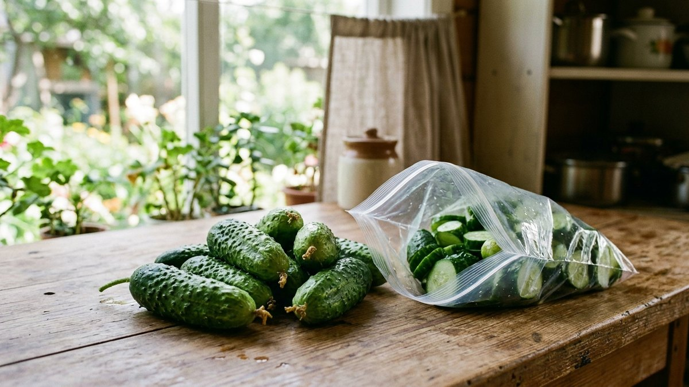
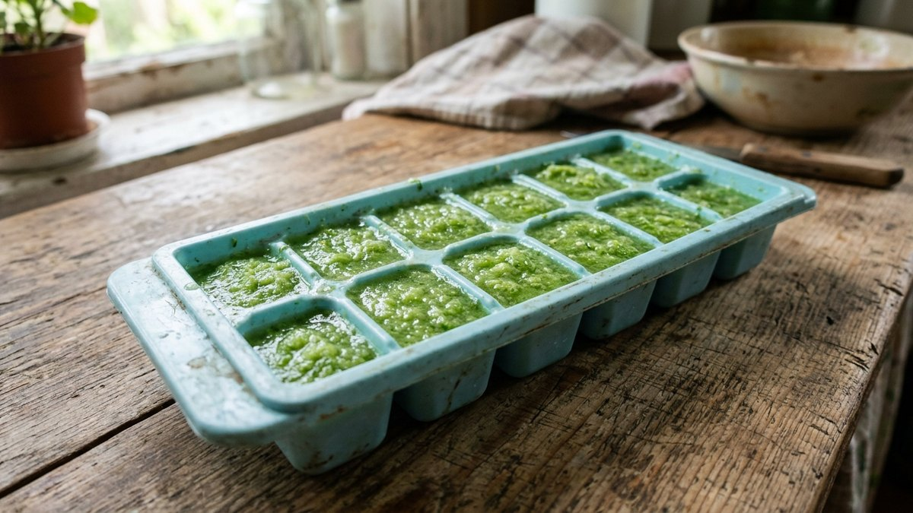
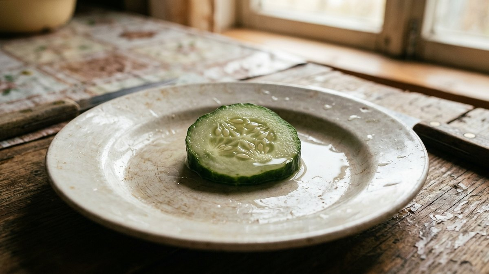
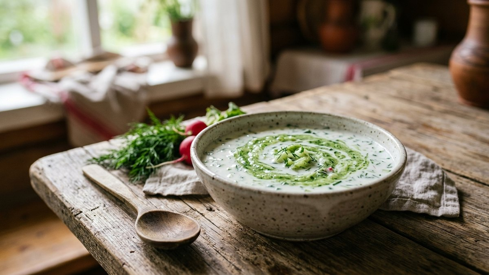
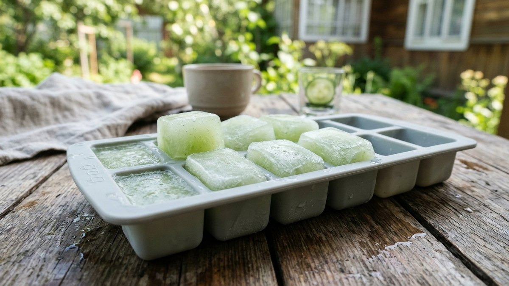
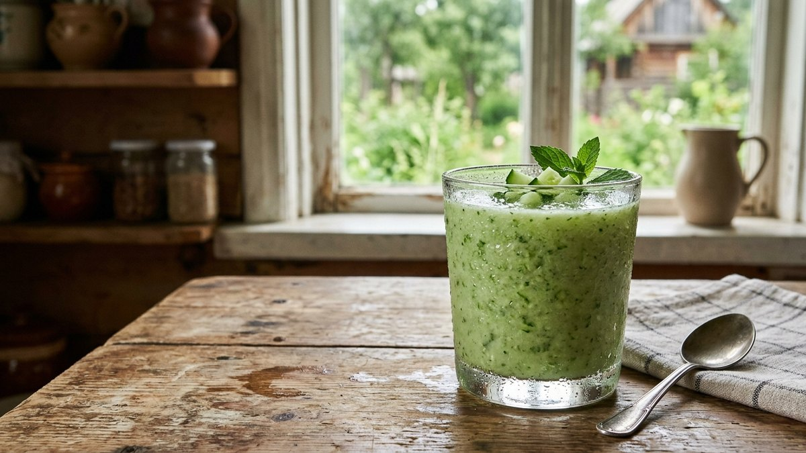

# Можно ли замораживать огурцы на зиму и что с ними делать потом

Коротко: да, замораживать можно, но результат разочарует, если ждать от него
свежего хрустящего огурца зимой. Огурец на 95–96% состоит из воды, и после
заморозки клеточная структура разрушается — оттаявший огурец становится
мягким, водянистым и совершенно не подходит для салата. Именно поэтому
многие уверены, что огурцы «нельзя» замораживать: на деле можно, просто не
для тех целей, для которых огурец обычно нужен свежим. Разберём, для чего
заморозка огурцов действительно работает, а для чего — точно нет.

## Почему огурец не переживает заморозку как кабачок или перец

У большинства овощей, которые хорошо переносят заморозку, — кабачков,
перца, моркови — доля воды ниже, а клеточные стенки прочнее. У огурца почти
нет ничего, кроме воды, заключённой в тонкие клетки. При замерзании вода
расширяется и разрывает эти клетки изнутри — размораживаясь, огурец теряет
структуру безвозвратно. Это не брак заморозки и не ошибка в процессе, а
физическое свойство самого овоща.

## Способ 1: пюре или тёртые огурцы для холодных супов

Единственный формат, в котором потеря структуры не мешает, — блюда, где
огурец и так измельчается в жидкую массу:

1. Натрите огурцы на тёрке или пробейте блендером до состояния пюре.
2. Разлейте по формочкам для льда или небольшим пакетам порциями на одно
   блюдо.
3. Заморозьте, а зимой используйте прямо замороженным как основу для
   холодного супа — свекольника или окрошки на кефире, добавляя остальные
   ингредиенты свежими.

## Способ 2: кубики огуречного сока для напитков и косметики

Огуречный сок, отжатый через марлю или сито, замораживают в формочках для
льда — зимой такие кубики идут в детокс-воду, смузи или как основа для
домашних косметических масок. Вкусовая нагрузка здесь минимальна, а лёгкая
потеря текстуры не имеет значения вовсе.

## Чего точно не получится

- **Огурец кусочками для салата.** После разморозки кусочек становится
  мягким и водянистым — хруст, ради которого и берут свежий огурец,
  теряется полностью и безвозвратно.
- **Огурец для окрошки кусочками.** По той же причине: окрошка держится на
  хрусте овощей, и размороженный огурец разваливается в каше, а не режется
  кубиками.
- **Целый огурец про запас «на всякий случай».** Целиком огурцы не
  замораживают вовсе — слишком много воды разрушает структуру ещё сильнее,
  чем в измельчённом виде.

## Если нужен хруст зимой — не заморозка, а консервация

Если цель — именно хрустящий огурец на столе зимой, заморозка для этого не
инструмент в принципе, вне зависимости от способа нарезки. Здесь работает
только консервация: классические [маринованные огурцы на
зиму](https://mir-doma.pro/marinovannye-ogurtsy-na-zimu/) или другие рецепты
из подборки [огурцы на зиму](https://mir-doma.pro/ogurtsy-na-zimu/) дают тот
самый хруст, которого не будет ни при каком способе заморозки.

## Частые ошибки

- **Замораживать огурцы кусочками ради экономии времени**, рассчитывая на
  салат зимой — результат разочарует гарантированно, лучше сразу
  ориентироваться на консервацию.
- **Замораживать перезревшие огурцы с крупными семенами** — в пюре они дают
  ещё больше горечи и водянистости, чем молодые.
- **Не отжимать пюре перед заморозкой**, если важна концентрация вкуса —
  лишняя вода растягивает объём и разбавляет вкус в готовом блюде.
- **Ждать от размороженных огурцов вкуса и текстуры свежих** — это разные
  продукты по консистенции, и сравнивать их бессмысленно.

## Частые вопросы

### Можно ли использовать замороженные огурцы для окрошки

Формально можно, если протереть их в пюре и добавить в жидкую основу
окрошки, но для нарезки кубиками, как принято в классическом рецепте, они
не подходят — потеряют форму и хруст.

### Сколько хранятся замороженные огурцы

Огуречное пюре или сок в морозилке хранятся до 6 месяцев. Дальше вкус
заметно ухудшается, хотя есть заготовку по-прежнему безопасно.

### Нужно ли солить огурцы перед заморозкой

Нет, соль перед заморозкой не добавляют — она вытягивает ещё больше влаги
из и без того водянистого овоща, ускоряя разрушение структуры. Соль и
специи добавляют уже в готовое блюдо после разморозки.

### Почему после разморозки огурец становится горьким

Горечь появляется не от самой заморозки, а от исходного огурца: если плод
уже был горьковатым до заморозки (из-за жары или недостатка полива при
выращивании), после разморозки горечь только сильнее ощущается на фоне
потерявшей структуру мякоти.

### Есть ли смысл замораживать огурцы для смузи

Да, это один из немногих случаев, где заморозка огурца оправдана: в смузи
он всё равно измельчается блендером, а лёгкая заморозка добавляет напитку
приятную прохладу без разбавления льдом.

## Заключение

Заморозка огурцов — не универсальный способ сохранить урожай, а узкий
инструмент для конкретных задач: пюре для холодных супов, кубики сока для
напитков и смузи. Если цель — хрустящий огурец к столу зимой, эту задачу
решает только консервация. Разница в подходе к заморозке разных овощей
разобрана в общем гиде [что заморозить на зиму](https://mir-doma.pro/chto-zamorozit-na-zimu/),
а если кроме огурцов на зиму заготавливаются и помидоры, для них есть
отдельный разбор способов — [как заморозить
помидоры](https://mir-doma.pro/kak-zamorozit-pomidory/).
