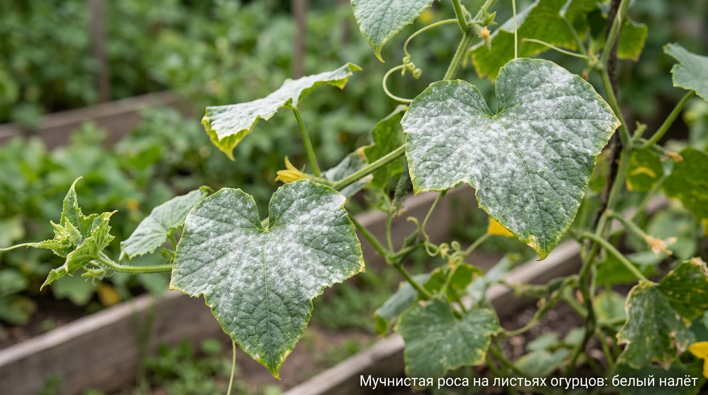
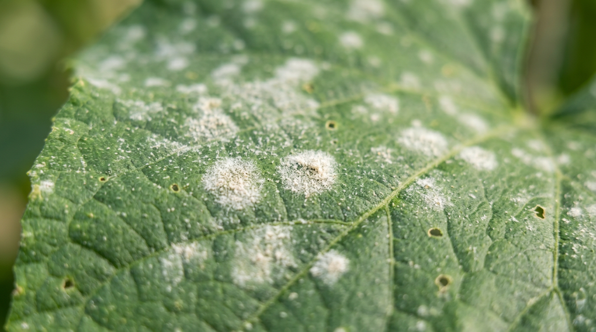
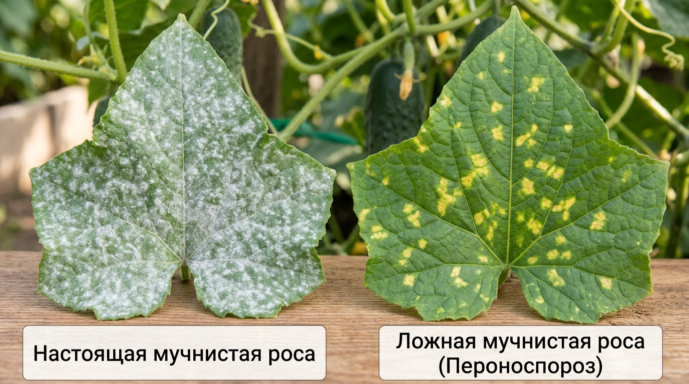
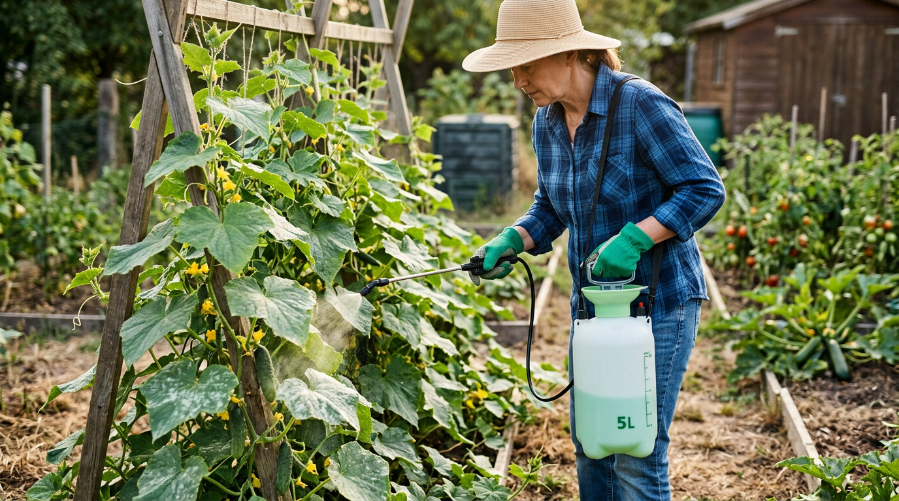
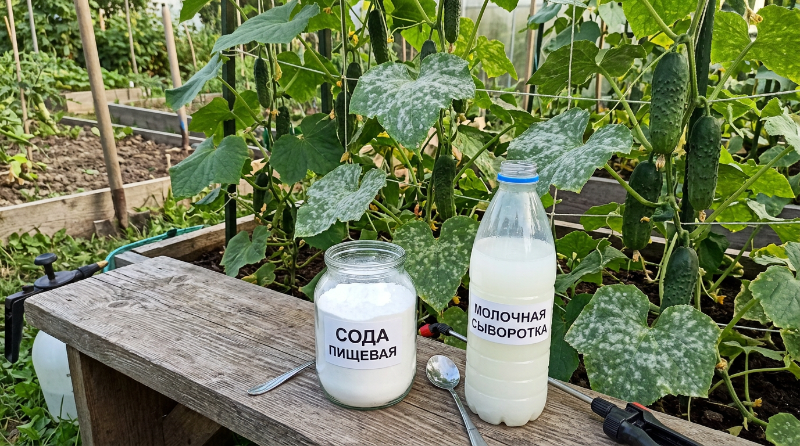
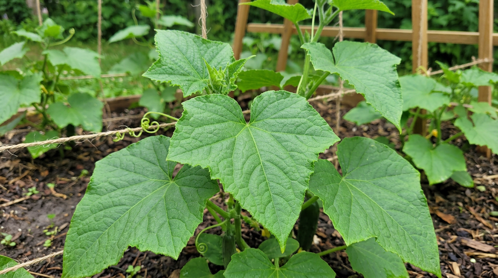

Белый мучнистый налёт на листьях огурцов знаком, наверное, каждому дачнику. Это мучнистая роса — одна из самых распространённых грибковых болезней, которая способна за пару недель ослабить и погубить даже мощные кусты. Если упустить момент, листья засыхают, плодоношение прекращается, а урожай резко падает. Но при своевременных мерах болезнь вполне поддаётся контролю. В этой статье разберём, как распознать мучнистую росу на огурцах, чем её отличить от ложной мучнистой росы, чем обработать растения и как не допустить болезнь в будущем.

## 🍄 Что такое мучнистая роса и чем она опасна

Мучнистая роса — это грибковое заболевание, которое проявляется белым или сероватым мучнистым налётом на листьях и стеблях. Возбудитель развивается на поверхности растения, питаясь его соками, и быстро распространяется по всей грядке.

Опасность болезни в том, что налёт закрывает листовую пластину и нарушает фотосинтез. Лист перестаёт «дышать» и работать, желтеет, буреет и засыхает. Растение слабеет, тратит силы на борьбу вместо плодоношения, и урожай резко сокращается. Плоды на больном кусте мельчают, могут горчить и деформироваться, а сами кусты теряют морозо- и засухоустойчивость. При сильном поражении куст может погибнуть полностью. Особенно быстро болезнь развивается в теплице, где тепло и нет движения воздуха. Возбудитель — микроскопический гриб, который зимует на растительных остатках и в почве, а с приходом тепла прорастает и заражает молодые листья. От первых одиночных пятен до сплошного поражения куста может пройти всего одна-две недели, поэтому медлить с мерами нельзя.

## 🔍 Как распознать мучнистую росу

Чем раньше вы заметите болезнь, тем легче с ней справиться. Основные признаки:

- на верхней стороне листьев появляются отдельные белые мучнистые пятна, как будто их присыпали мукой;
- пятна разрастаются и сливаются, покрывая лист целиком, налёт переходит на стебли и черешки;
- поражённые листья желтеют, скручиваются, буреют и засыхают;
- рост куста замедляется, новые плоды мельчают и плохо завязываются.

Налёт сначала легко стирается пальцем, но быстро появляется снова. Болезнь обычно начинается с нижних и старых листьев, постепенно поднимаясь вверх по кусту. Если потрогать поражённый лист, на пальцах останется белый «мучной» след — это характерный признак именно настоящей мучнистой росы. На поздних стадиях налёт сереет и на нём появляются мелкие тёмные точки — это плодовые тела гриба, в которых он готовится зимовать.

## ⚖️ Мучнистая роса и ложная: в чём разница

Огородники часто путают настоящую мучнистую росу с ложной (пероноспорозом), а лечатся они по-разному. Важно научиться их различать.

| Признак | Мучнистая роса | Ложная мучнистая роса (пероноспороз) |
|---------|----------------|--------------------------------------|
| Налёт | Белый, мучнистый, сверху листа | Серо-фиолетовый, снизу листа |
| Пятна | Белые, расплывчатые | Жёлтые угловатые сверху |
| Погода | Тёплая, сухая, с перепадами | Сырая, прохладная |
| Где начинается | С нижних листьев | С пятен по всему листу |

Главное отличие: при настоящей мучнистой росе белый налёт лежит на **верхней** стороне листа, а при ложной — серый налёт появляется **снизу**, а сверху видны жёлтые пятна. Ложная мучнистая роса развивается в сырую прохладную погоду, тогда как настоящая любит тепло. Если перепутать болезни, обработка может не подействовать, поэтому присмотритесь внимательно.

## 🌦️ Почему появляется мучнистая роса

Мучнистая роса появляется не на пустом месте — у неё есть конкретные провоцирующие условия. Понимание причин помогает не только лечить, но и предотвращать болезнь. Её провоцируют:

- **Перепады температур** — резкая смена тёплых дней и холодных ночей ослабляет растения.
- **Загущённые посадки** — в гуще плохо циркулирует воздух, дольше держится влага, и грибок легко перебирается с листа на лист.
- **Высокая влажность и духота**, особенно в непроветриваемой теплице.
- **Полив холодной водой** и попадание воды на листья.
- **Избыток азота** — перекормленные азотом кусты с рыхлыми тканями болеют чаще.
- **Растительные остатки**, в которых зимует возбудитель.

Споры грибка переносятся ветром, водой и насекомыми, поэтому болезнь быстро перекидывается с растения на растение.

## 🧪 Чем обработать огурцы от мучнистой росы

Подход зависит от стадии болезни: на ранней помогают биопрепараты и народные средства, а при сильном поражении уже не обойтись без фунгицидов. Перед любой обработкой полезно удалить самые поражённые листья — так средство подействует эффективнее, а спор станет меньше.

### Биопрепараты

На ранней стадии и для профилактики хорошо работают биологические препараты на основе полезных бактерий и грибов — Фитоспорин, Бактофит, Алирин. Они безопасны, не накапливаются в плодах и подходят для применения в любой период, в том числе во время плодоношения. Обрабатывать ими нужно регулярно, каждые 7–10 дней. Биопрепараты работают мягче химии и не дают мгновенного эффекта, зато ими можно опрыскивать кусты хоть каждую неделю без вреда для урожая. Лучше всего они действуют для профилактики и в самом начале болезни, поэтому применять их стоит, не дожидаясь сплошного налёта.

### Фунгициды

При сильном поражении применяют химические фунгициды: препараты на основе коллоидной серы (Тиовит Джет), а также Топаз, Скор. Сера особенно эффективна в тёплую погоду. Используя химию, строго соблюдайте дозировку и сроки ожидания до сбора урожая, указанные на упаковке, и не обрабатывайте растения в жару, чтобы не обжечь листья. Опрыскивают в сухую безветренную погоду, вечером, смачивая листья с обеих сторон. Если болезнь возвращается, чередуйте препараты с разным действующим веществом — грибок быстро привыкает к одному и тому же средству.

## 🌿 Народные средства от мучнистой росы

На ранней стадии и для профилактики хорошо помогают безопасные народные средства. Обрабатывают ими в сухую погоду, опрыскивая листья с обеих сторон, и повторяют после дождя.

- **Содовый раствор.** Столовая ложка пищевой (или кальцинированной) соды и немного жидкого мыла на 5 л воды — самое популярное и действенное средство на ранней стадии. Сода создаёт на листе щелочную среду, в которой грибок не развивается, а мыло помогает раствору задержаться на листьях.
- **Молочная сыворотка.** Разводят водой 1:3 и опрыскивают — молочнокислые бактерии и тонкая плёнка на листе подавляют грибок и не дают спорам прорастать. Подходит и обычное молоко, разведённое водой.
- **Молоко с йодом.** Литр молока и несколько капель йода на 10 л воды — укрепляет листья и сдерживает болезнь.
- **Настой коровяка (сенной палочки).** Настоянный перепревший навоз содержит бактерии, подавляющие грибок; настой процеживают и опрыскивают.
- **Зольный раствор.** Стакан золы на 5 л горячей воды, настоять, процедить, добавить мыло и опрыскать.
- **Раствор марганцовки.** Слабо-розовый раствор (около 1,5 г на 10 л) сдерживает развитие болезни.

Народные средства хорошо работают на старте болезни и как профилактика, но при сильном поражении не заменят биопрепаратов и фунгицидов.

## 🥒 Мучнистая роса на кабачках, тыкве и других культурах

Огурцы — не единственная жертва мучнистой росы. Той же болезнью поражаются кабачки, патиссоны, тыквы, дыни и арбузы — все тыквенные культуры. Признаки и меры борьбы у них одинаковые: тот же белый налёт, те же народные средства, биопрепараты и фунгициды. Важно помнить, что болезнь легко перекидывается между этими культурами, поэтому если мучнистая роса появилась на огурцах, осмотрите и соседние кабачки с тыквами. Болеют мучнистой росой и многие другие растения — от роз и флоксов до крыжовника и яблони, но возбудители у них разные, и «огуречная» мучнистая роса на них обычно не переходит.

## ✅ Пошаговый план борьбы

Если болезнь уже появилась, действуйте последовательно:

1. **Удалите поражённые листья.** Сильно покрытые налётом листья обрывают и уничтожают (не в компост), чтобы убрать источник спор.
2. **Обработайте растения.** На ранней стадии — народным средством или биопрепаратом, при сильном поражении — фунгицидом.
3. **Наладьте проветривание.** Откройте форточки в теплице, проредите загущённые посадки.
4. **Скорректируйте полив.** Поливайте только тёплой водой под корень, не смачивая листья.
5. **Повторите обработку.** Через 7–10 дней проведите повторное опрыскивание, чтобы закрепить результат: одна обработка редко уничтожает грибок полностью, и без повтора болезнь возвращается.
6. **Уберите остатки.** Осенью соберите и уничтожьте все растительные остатки, где зимует грибок.

Чем раньше начата борьба, тем выше шанс сохранить куст и урожай. На запущенной стадии спасти растение сложно.

## 🛡️ Профилактика мучнистой росы

Предупредить болезнь куда проще, чем лечить. Снизить риск помогают простые меры:

- выбирайте устойчивые к мучнистой росе сорта и гибриды (это указано на упаковке семян);
- не загущайте посадки — соблюдайте рекомендованное расстояние между растениями;
- регулярно проветривайте теплицу, не допуская духоты и конденсата;
- поливайте только тёплой водой под корень, не по листьям;
- не перекармливайте азотом, поддерживайте баланс с калием и фосфором;
- убирайте растительные остатки и проводите профилактические обработки биопрепаратами;
- следите за общим состоянием кустов — здоровые растения болеют реже;
- весной и осенью обеззараживайте теплицу и меняйте или проливайте верхний слой почвы, где зимует грибок.

Профилактику начинают заранее, ещё до появления первых признаков: если в прошлом сезоне мучнистая роса была, в этом она почти наверняка вернётся, поэтому кусты из группы риска полезно профилактически опрыскивать биопрепаратами с начала лета.

Стоит помнить, что мучнистая роса — частая, но не единственная причина проблем с листьями. Если листья желтеют без характерного белого налёта, причина может быть другой — об этом подробно в статье о том, [почему желтеют листья у огурцов](https://mir-doma.pro/zhelteyut-listya-u-ogurtsov/). А крепкому иммунитету растений помогают сбалансированные [летние подкормки](https://mir-doma.pro/letnie-podkormki-ovoshchey/). Ослабляют огурцы и вредители, поэтому держите под контролем и их — например, [тлю](https://mir-doma.pro/kak-izbavitsya-ot-tli/), которая высасывает соки и делает кусты более уязвимыми к болезням.

## 🧭 Все болезни и вредители огурцов: навигатор

Мучнистая роса — самая частая, но далеко не единственная проблема огурцов. Вот полный разбор по каждой — чтобы точно поставить «диагноз» и не лечить не от того:

**Болезни:**

- [Пероноспороз (ложная мучнистая роса)](https://mir-doma.pro/peronosporoz-ogurtsov/) — жёлтые угловатые пятна сверху и серо-фиолетовый налёт снизу листа.
- [Бактериоз (угловатая пятнистость)](https://mir-doma.pro/bakterioz-ogurtsov/) — маслянистые угловатые пятна, дырки в листьях, мутные капли снизу.
- [Антракноз (медянка)](https://mir-doma.pro/antraknoz-ogurtsov/) — округлые бурые пятна и вдавленные язвы на плодах с розовым налётом.

**Вредители:**

- [Паутинный клещ](https://mir-doma.pro/pautinnyy-kleshch-na-ogurtsah/) — тонкая паутина и мелкие светлые точки на листьях.
- [Белокрылка](https://mir-doma.pro/belokrylka-v-teplitse/) — белые мошки, взлетающие облачком при касании куста.

**Проблемы ухода (без болезней):**

- [Желтеют листья у огурцов](https://mir-doma.pro/zhelteyut-listya-u-ogurtsov/) — полив, питание, температура.
- [Пустоцвет: нет завязей](https://mir-doma.pro/pustotsvet-na-ogurtsah/) — почему цветки есть, а огурцов нет.
- [Огурцы горчат](https://mir-doma.pro/pochemu-ogurtsy-gorchat/) — стресс, полив, сорт.
- [Огурцы вырастают кривыми](https://mir-doma.pro/pochemu-ogurtsy-krivye/) — питание и опыление.

Проще всего ориентироваться по налёту: **белый сверху — мучнистая роса**, серо-фиолетовый снизу — пероноспороз, розовый в язвах на плодах — антракноз, мутные капли снизу — бактериоз.

## ❓ Частые вопросы

### Чем быстро обработать огурцы от мучнистой росы?

На ранней стадии быстрее всего помогает содовый раствор (ложка соды и немного мыла на 5 л воды) или биопрепарат вроде Фитоспорина. При сильном поражении применяют фунгициды на основе коллоидной серы или препараты Топаз, Скор. Обработку повторяют через 7–10 дней.

### Можно ли есть огурцы после обработки от мучнистой росы?

После народных средств и биопрепаратов — да, плоды достаточно вымыть. После химических фунгицидов нужно выдержать срок ожидания, указанный на упаковке (обычно несколько дней), и только потом собирать и есть огурцы.

### Чем отличается мучнистая роса от ложной?

При настоящей мучнистой росе белый мучнистый налёт лежит на верхней стороне листа, болезнь любит тёплую сухую погоду. При ложной (пероноспорозе) сверху появляются жёлтые пятна, а снизу — серо-фиолетовый налёт, и развивается она в сырую прохладную погоду. Лечатся они по-разному, поэтому важно различать.

### Появляется ли мучнистая роса в теплице чаще?

Да, в теплице болезнь развивается быстрее из-за тепла, духоты и застоя воздуха. Поэтому в теплице особенно важны регулярное проветривание, умеренная влажность и незагущённые посадки.

### В какую погоду чаще появляется мучнистая роса?

Настоящая мучнистая роса любит тёплую сухую погоду с резкими перепадами дневной и ночной температуры и повышенной влажностью воздуха без дождя. Именно поэтому в теплице она особенно активна. Это отличает её от ложной мучнистой росы, которая развивается в сырую прохладную погоду.

### Поможет ли сода от мучнистой росы?

Да, содовый раствор — одно из самых эффективных народных средств на ранней стадии и для профилактики. Ложку соды растворяют в 5 л воды с добавлением мыла для прилипания и опрыскивают листья. Обработку повторяют регулярно.

### Как часто обрабатывать огурцы от мучнистой росы?

Биопрепаратами и народными средствами обрабатывают каждые 7–10 дней, особенно после дождя, который смывает защиту. Фунгицидами — по инструкции, обычно с интервалом 10–14 дней, чередуя препараты. Профилактические обработки начинают ещё до появления болезни, в группе риска.

### Можно ли вылечить запущенную мучнистую росу?

На поздней стадии, когда налётом покрыта большая часть куста, полностью вылечить растение сложно — сильно поражённые листья уже не восстановятся. Но можно остановить распространение: удалить поражённые листья, обработать фунгицидом и спасти здоровую часть куста с молодыми листьями.

### Какие сорта огурцов устойчивы к мучнистой росе?

Многие современные гибриды (на упаковке обычно стоит пометка F1) выведены устойчивыми к мучнистой росе — это указывают в описании сорта. Они не дают стопроцентной гарантии, но болеют заметно реже и слабее. Если на вашем участке мучнистая роса — частый гость, выбор устойчивых гибридов сильно облегчает жизнь.

### Передаётся ли мучнистая роса другим растениям?

Да, споры легко переносятся ветром, водой и насекомыми на соседние огурцы, кабачки, тыквы и другие культуры. Поэтому при первых признаках болезни важно сразу принять меры и убрать поражённые листья, чтобы не заразить всю грядку.

## Заключение

Мучнистая роса на огурцах — болезнь распространённая, но управляемая. Главное — вовремя заметить белый налёт, правильно отличить настоящую мучнистую росу от ложной и сразу начать борьбу: удалить поражённые листья, обработать народным средством, биопрепаратом или фунгицидом и наладить проветривание с правильным поливом. А лучшая стратегия — профилактика: устойчивые сорта, незагущённые посадки, тёплый полив под корень и хорошее проветривание. Тогда листья останутся зелёными, а кусты будут радовать урожаем хрустящих огурцов до самой осени. И помните: при мучнистой росе побеждает тот, кто действует на опережение, — болезнь гораздо легче не допустить, чем вывести с запущенного куста.

А как вы боретесь с мучнистой росой на своём участке? Делитесь проверенными средствами в комментариях и подписывайтесь, чтобы не пропустить новые статьи о защите огорода.
