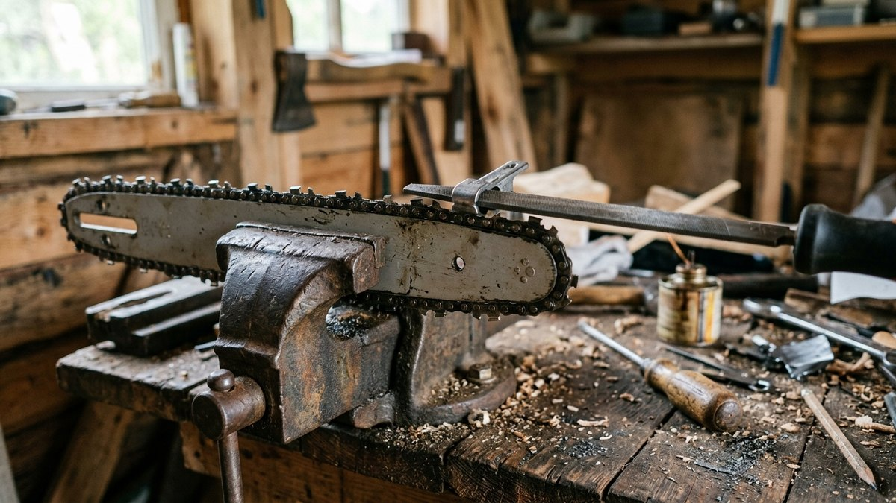
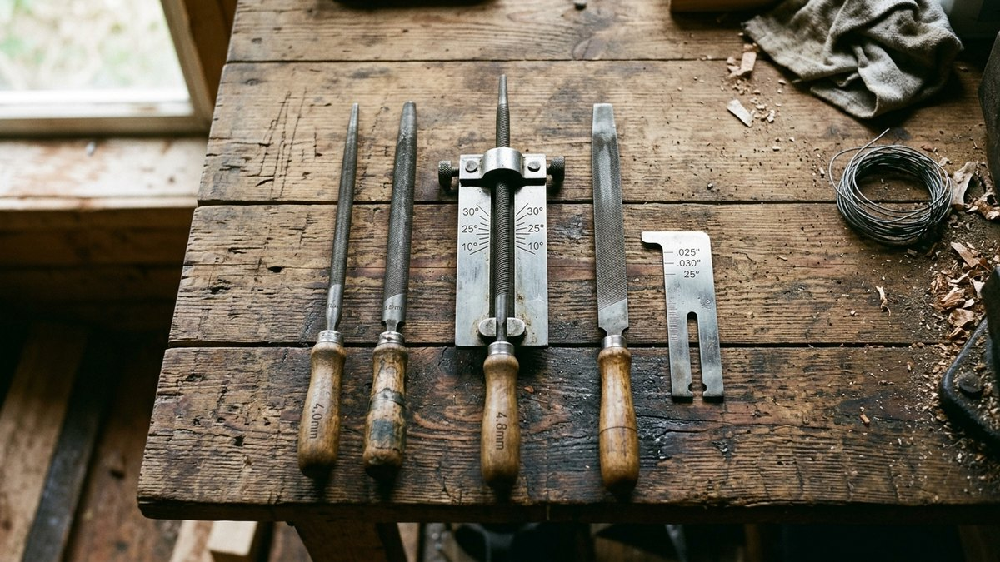
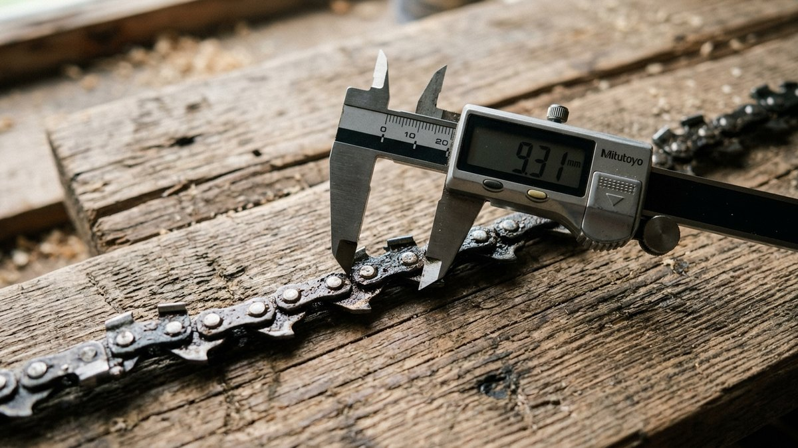
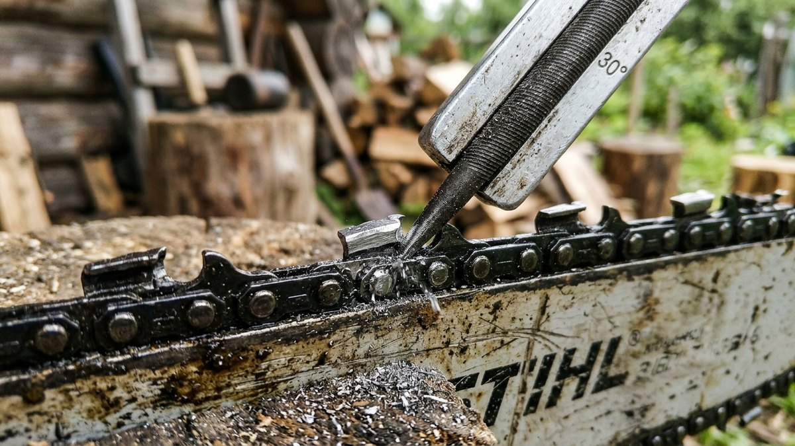
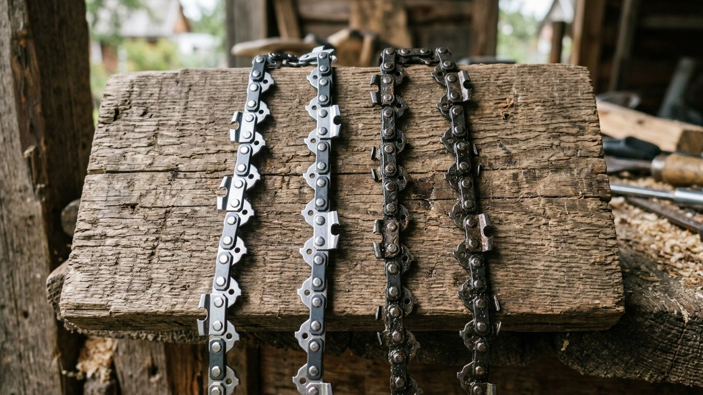
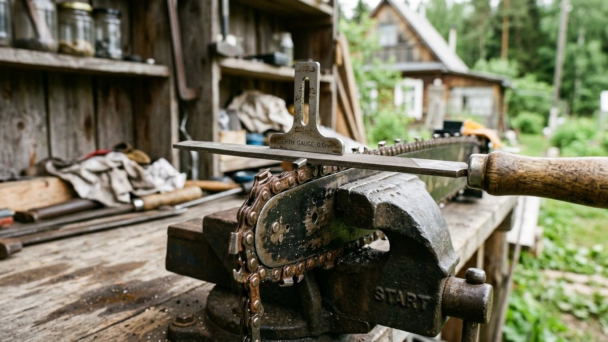

# Какой напильник нужен для заточки цепи бензопилы: таблица по шагу цепи и как точить

Напильник для заточки цепи бензопилы подбирают не «на глаз», а по
шагу цепи. Слишком тонкий напильник выточит зуб крючком, и цепь будет
рвать древесину и затягиваться в пропил. Слишком толстый скруглит
режущую кромку, и цепь перестанет резать совсем. Ниже — таблица
диаметров по шагу цепи, три способа узнать шаг своей цепи, подборщик
по замеру линейкой и порядок заточки. Набор, подобранный по этой
статье, обычно стоит дешевле одной новой цепи и окупается за пару
заточек.

## Что понадобится для заточки

- **Круглый напильник** нужного диаметра — точит режущий зуб.
- **Держатель (оправка) с разметкой углов.** Он держит напильник на
  правильной высоте: примерно на пятую часть диаметра над верхней
  гранью зуба. Без держателя эту высоту руками не выдержать.
- **Плоский напильник и шаблон ограничителя глубины** — сточить
  «зубчик» перед режущим зубом, когда он начинает мешать.
- **Тиски или струбцина**, чтобы зажать шину. Пилу можно закрепить и
  на пне, вбив шину в пропил.
- **Перчатки**: зубья острые даже у тупой цепи.

Часто всё это продаётся одним набором под конкретный шаг цепи. Это
самый простой способ не ошибиться: на упаковке набора указан шаг, к
которому он подходит.

## Таблица: диаметр напильника по шагу цепи

| Шаг цепи | Где встречается | Круглый напильник | Ограничитель глубины |
|---|---|---|---|
| 1/4" | Высотные сучкорезы, мини-пилы | 4,0 мм (5/32"), для 1/4" P — 3,2 мм | 0,45–0,65 мм |
| 3/8" низкопрофильная (3/8" P, LP) | Электропилы, лёгкие бензопилы для дачи | 4,0 мм (5/32") | 0,45–0,65 мм |
| 0,325" | Бензопилы средней мощности | 4,8 мм (3/16") | 0,65 мм |
| 3/8" | Мощные бензопилы | 5,2–5,5 мм (13/64"–7/32") | 0,65 мм |
| 0,404" | Профессиональные пилы для валки | 5,5 мм (7/32") | 0,8 мм |

Значения в таблице — типичные. Точный диаметр зависит от профиля зуба
и производителя цепи. Например, для цепей с шагом 3/8" одни
производители рекомендуют 5,2 мм, другие — 5,5 мм. Самое надёжное —
смотреть на упаковку цепи или в инструкцию к пиле: там всегда указаны
диаметр напильника и высота ограничителя.

**Если сомневаетесь между двумя диаметрами**, берите меньший из
рекомендованных для изношенной цепи и больший — для новой. Режущий зуб
к концу службы становится ниже, и тонкий напильник точнее повторяет его
профиль.

## Как узнать шаг своей цепи

**1. По маркировке на шине или упаковке.** Шаг, толщина ведущего звена
и число звеньев выбиты на хвостовике шины у крепления к пиле. Например,
«3/8" 1.3 50» — это шаг 3/8", звено 1,3 мм, 50 звеньев.

**2. По номеру на ведущих звеньях.** Многие производители выбивают на
хвостовиках звеньев номер серии цепи. По этому номеру шаг ищут в
каталоге производителя.

**3. Замером линейкой.** Измерьте расстояние между центрами трёх
заклёпок подряд и разделите пополам. Это и есть шаг:

- 1/4" — около 6,4 мм;
- 3/8" низкопрофильная — около 9,5 мм, зуб низкий;
- 0,325" — около 8,3 мм;
- 3/8" — около 9,5 мм, зуб высокий;
- 0,404" — около 10,3 мм.

Низкопрофильная и обычная цепь 3/8" имеют одинаковый шаг, но
отличаются высотой зуба и толщиной звена. На лёгких дачных пилах почти
всегда стоит низкопрофильная. Обычная 3/8" — на мощных пилах с
двигателем от 3 кВт.

## Подборщик напильника по замеру

Измерьте расстояние между центрами трёх заклёпок подряд и выберите тип
пилы. Подборщик определит шаг цепи и подскажет диаметр напильника и
высоту ограничителя.

<!-- wp:html -->

  
Подбор напильника по шагу цепи

  <label class="md-calc__label" for="mdNpD">Расстояние между центрами трёх заклёпок подряд, мм</label>
  <input type="number" id="mdNpD" class="md-calc__input" min="10" max="25" step="0.1" value="19">
  <label class="md-calc__label" for="mdNpS">Пила</label>
  <select id="mdNpS" class="md-calc__input">
    <option value="light" selected>Электропила или лёгкая бензопила (до 2,5 кВт)</option>
    <option value="heavy">Мощная бензопила (от 3 кВт)</option>
  </select>
  
Введите замер

<!-- /wp:html -->

## Как точить цепь напильником: пошагово

1. **Зажмите шину** в тисках за середину, цепь должна свободно
   проворачиваться. Натяните цепь чуть сильнее обычного, чтобы она не
   болталась под напильником.
2. **Найдите самый короткий зуб.** Все зубья точат до его длины, иначе
   цепь поведёт в сторону. Отметьте его маркером, от него и начинайте.
3. **Поставьте держатель** на зуб стрелкой в сторону движения цепи,
   угол — по разметке, обычно 30° к поперечной линии шины.
4. **Точите движением от себя**, плавно, с лёгким нажимом. Обратно
   напильник ведите без нажима, приподняв. Поворачивайте его в
   держателе после нескольких проходов, чтобы он изнашивался равномерно.
5. **Сделайте одинаковое число движений на каждом зубе**: обычно 3–5.
   Так зубья останутся одной длины.
6. **Сначала все зубья одной стороны**, потом переходите на другую
   сторону шины и точите зубья, смотрящие в противоположную сторону.
7. **Проверьте ограничители глубины.** Положите шаблон на цепь: если
   «зубчик» выступает над шаблоном, сточите его плоским напильником
   вровень и слегка скруглите передний край.

Заточенный зуб блестит по всей режущей кромке, без светлых бликов на
углу. Блик на углу означает, что кромка там скруглена и её нужно
довести.

## Когда точить и когда пора менять цепь

**Точить пора, если:**

- вместо крупной стружки летит мелкая пыль, как от ножовки;
- пилу приходится давить, сама она в дерево не идёт;
- пропил уходит в сторону или дымит;
- пила стала сильнее вибрировать.

Если пилить на даче дрова, цепь подтачивают после каждой заправки
бака, по 2–3 движения на зуб. Это быстрее, чем каждый раз точить
полностью затупившуюся цепь. Тупая цепь не только медленнее пилит, но
и чаще даёт обратный удар. Сколько дров нужно заготовить на зиму и как
быстро уходит цепь на таком объёме, можно оценить по статье [сколько
дров нужно на зиму](https://mir-doma.pro/skolko-drov-nuzhno-na-zimu/). Если дрова колете сами, чурки лучше
пилить одной длины под дровокол: как сделать его и под какую длину
чурок, описано в статье [дровокол своими
руками](https://mir-doma.pro/drovokol-svoimi-rukami/).

**Цепь пора менять, если:**

- от верхней грани зуба осталось 3–4 мм — у большинства зубьев есть
  метка минимальной длины;
- зубья сколоты или треснули;
- цепь сильно вытянулась и провисает даже после натяжки до конца
  регулировки;
- хвостовики звеньев сточены, и цепь болтается в пазу шины.

Если цепь тупится за несколько минут, проверьте, не попадает ли она в
землю и гвозди и не пилите ли вы гнилую древесину с песком. Камень и
металл тупят цепь за одно касание.

## Напильник или станок

| | Напильник с держателем | Электрический станок |
|---|---|---|
| Цена | Набор дешевле одной цепи | Как 5–10 цепей |
| Где точить | Прямо на шине, в лесу и на участке | Только снятую цепь, в мастерской |
| Точность | Зависит от аккуратности | Одинаковые зубья, ровный угол |
| Съём металла | Минимальный, цепь служит дольше | Больше, легко перегреть зуб |
| Кому подходит | Дачникам и тем, кто пилит дрова для дома | Кто пилит много или точит цепи на заказ |

На даче почти всегда достаточно напильника. Станок окупается, только
если цепей много или они сильно затуплены. Что ещё взять вместе с
бензопилой и какую пилу выбрать под объём работ, разобрано в статье
[как выбрать бензопилу](https://mir-doma.pro/kak-vybrat-benzopilu/).

## Частые ошибки

- **Напильник не того диаметра.** Тонкий даёт зуб-крючок, цепь рвёт
  дерево и затягивается. Толстый скругляет кромку, цепь не режет.
- **Точат без держателя.** Напильник уходит вниз или вверх, угол
  гуляет, зубья получаются разные.
- **Возвратное движение с нажимом.** Кромка заваливается, а напильник
  быстро тупится.
- **Зубья разной длины.** Пила уводит пропил в сторону, шина
  изнашивается с одной стороны.
- **Забывают про ограничители.** Зуб с каждой заточкой становится ниже,
  и через несколько заточек «зубчик» не даёт ему врезаться. Проверяйте
  ограничители шаблоном каждые 3–5 заточек.
- **Стачивают ограничители слишком низко.** Цепь хватает слишком
  глубоко, растёт риск обратного удара.

## Частые вопросы

### Как подобрать напильник для заточки цепи бензопилы

По шагу цепи: 4,0 мм для 1/4" и низкопрофильной 3/8", 4,8 мм для
0,325", 5,2–5,5 мм для обычной 3/8", 5,5 мм для 0,404". Шаг выбит на
шине у крепления. Его можно и измерить: расстояние между тремя
заклёпками пополам.

### Какой напильник нужен для цепи 3/8

Для низкопрофильной цепи 3/8" (3/8 P, LP) на лёгких пилах — 4,0 мм.
Для обычной 3/8" на мощных пилах — 5,2 или 5,5 мм, в зависимости от
производителя цепи. Точное значение — на упаковке цепи.

### Какой напильник нужен для цепи 0,325

Круглый 4,8 мм (3/16"). Ограничитель глубины для такой цепи обычно
стачивают на 0,65 мм ниже режущей кромки.

### Под каким углом точить цепь бензопилы

Для большинства цепей — 30° по верхней грани зуба, по разметке на
держателе. Некоторые цепи точат под 25° или 35°, а цепи для продольного
пиления — под 10°. Угол указан на упаковке цепи.

### Сколько раз можно точить цепь

Обычно не меньше 10 полных заточек, а при регулярной подточке на 2–3
движения — заметно больше. Цепь меняют, когда верхняя грань зуба доходит
до метки минимальной длины, около 3–4 мм.
