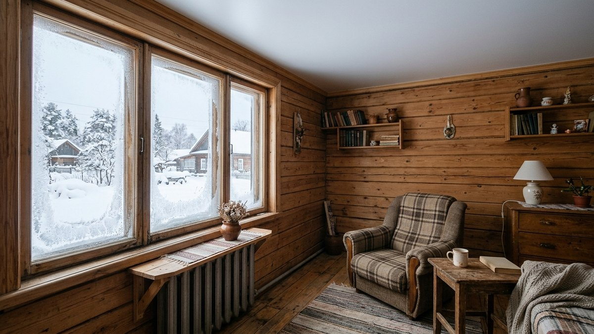
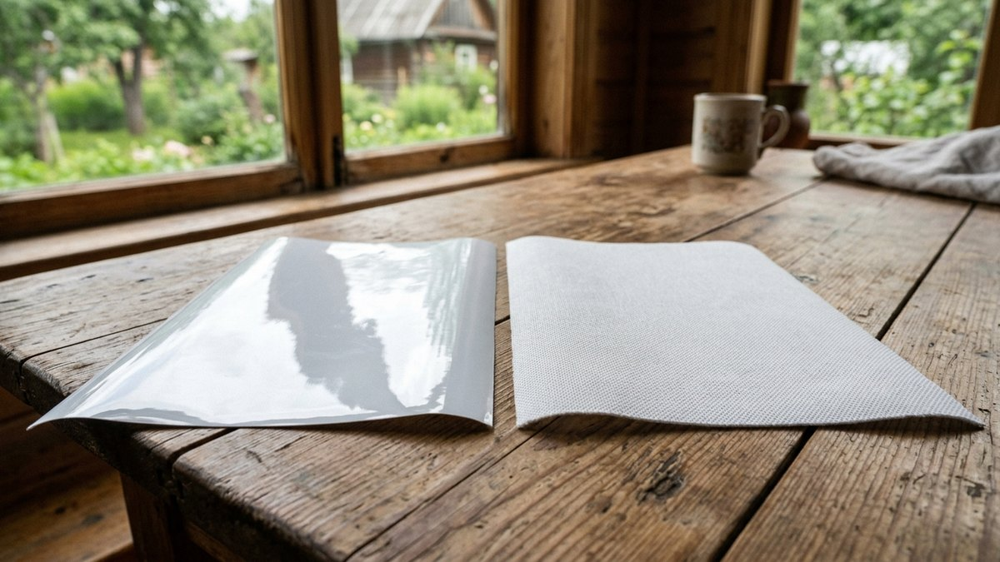
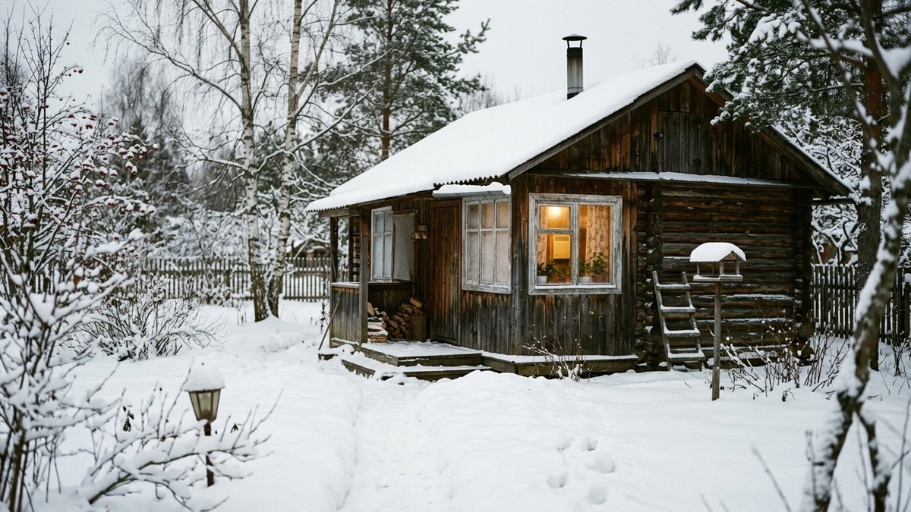
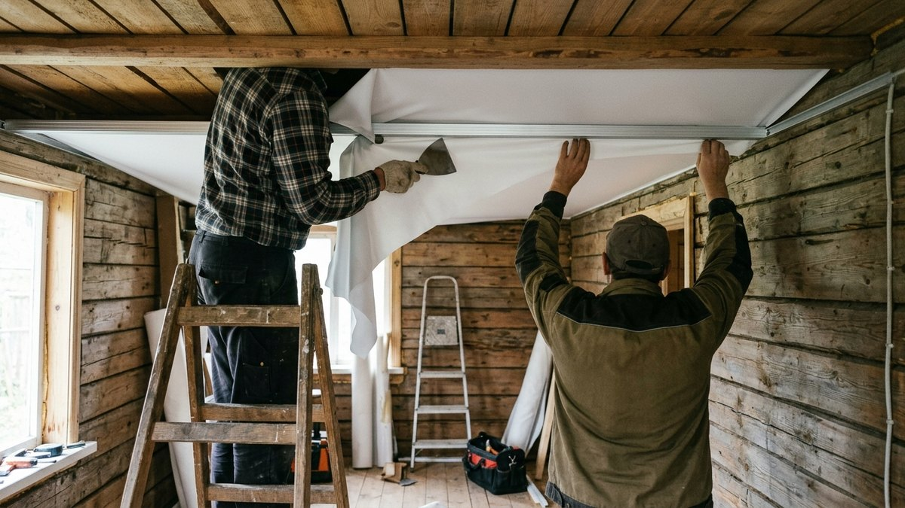
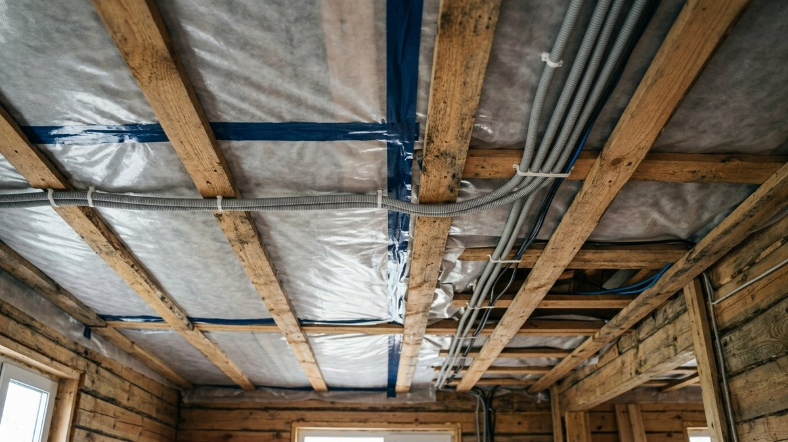
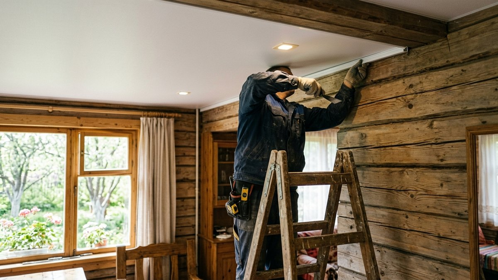

# Натяжной потолок на неотапливаемой даче: можно ли и какой выбрать

Натяжной потолок на неотапливаемой даче ставить можно, но не любой. Обычная ПВХ-плёнка рассчитана на комнатную температуру и на морозе становится жёсткой и хрупкой, а тканевое полотно спокойно переносит зиму без отопления. Решает не столько материал, сколько режим, в котором дом проводит зиму: стоит пустым, протапливается наездами или держит дежурные +5 °C. Ниже разберём все три сценария, что на самом деле происходит с плёнкой в холоде, о чём молчат при продаже (конденсат над полотном и протечки кровли) и как подготовить потолок к первой зиме. В середине статьи есть подборщик: он по вашим условиям подскажет тип полотна и посчитает площадь и периметр комнаты для сметы.

## ❄️ Что происходит с натяжным потолком на морозе

Натяжные потолки бывают двух типов, и в холоде они ведут себя совсем по-разному.

**ПВХ-плёнка.** Её монтируют «на горячую»: помещение прогревают тепловой пушкой примерно до +60 °C, размягчённую плёнку заводят в профиль, а при остывании она сжимается и натягивается в ровную плоскость. Монтажники и продавцы указывают для ПВХ рабочий диапазон примерно от +5 до +40…+50 °C. Ниже нуля плёнка продолжает сжиматься и теряет эластичность. Натяжение на профиль и углы растёт, а сама плёнка становится хрупкой, как застывший пластик. Сама по себе она в мороз обычно не рвётся. Трескается она от того, что в тёплом помещении прошло бы бесследно: от удара, от задевшей стремянки, от вибрации, от струи горячего воздуха при резком прогреве. Начавшаяся трещина под натяжением быстро расходится.

**Тканевое полотно** — это полиэстеровая сетка с полиуретановой пропиткой. Её натягивают без нагрева, и для неё заявляют диапазон примерно от −40 до +60 °C. Ткань на морозе не дубеет и не лопается, поэтому её и ставят на верандах, лоджиях и в домах без отопления.

Важная оговорка: цифры выше взяты из описаний производителей и монтажных компаний. Единого обязательного стандарта с температурами для натяжных потолков нет. Поэтому перед заказом спросите у монтажника, какой диапазон указан в паспорте конкретного полотна, и проверьте, что сказано в договоре о гарантии при эксплуатации в неотапливаемом доме. Если в паспорте ПВХ стоит «от +5 °C», а дом зимой промерзает, гарантия на такой случай, скорее всего, не распространится.

## 🏠 Три сценария зимовки: что ставить в каждом

Первым делом честно ответьте себе, что происходит с домом с ноября по март. От этого зависит выбор, а не от того, что «у соседей висит и ничего».

| Режим зимой | ПВХ-плёнка | Тканевое полотно | Обычная подшивка (вагонка, панели) |
|---|---|---|---|
| Дом стоит пустым, температура внутри как на улице | Риск трещин, гарантии нет | ✅ Подходит | ✅ Подходит |
| Приезжаем на выходные, топим с мороза до +20 °C | Риск: хрупкость на холоде и резкий прогрев | ✅ Подходит | ✅ Подходит |
| Дежурное отопление, внутри всю зиму не ниже +5 °C | ✅ Подходит | ✅ Подходит | ✅ Подходит |
| Веранда, терраса, летняя кухня без отопления | Не ставить | ✅ Подходит | ✅ Подходит |

**Дом стоит пустым всю зиму.** ПВХ здесь — лотерея. Кто-то годами живёт с плёнкой в холодном доме без проблем, у кого-то она лопается в первую же весну, когда приезжают и включают пушку. Предсказать заранее нельзя, поэтому для пустующего дома берите ткань или обычную подшивку.

**Наезды зимой с протапливанием.** Самый тяжёлый режим для плёнки: она проводит неделю в морозе, а потом за пару часов прогревается. Ткань переносит такие качели спокойно. Если всё же ставите ПВХ, прогревайте дом постепенно, печью или конвекторами, и не направляйте поток тепловой пушки на потолок.

**Дежурное отопление.** Если в доме всю зиму держится не ниже +5 °C, по температуре ПВХ подходит. Обычно это конвекторы на минимальной мощности или котёл в режиме «антизамерзания». Дежурный режим удобно держать с телефона: как это сделать недорого, мы разобрали в статье про [удалённое управление отоплением на даче](https://mir-doma.pro/udalennoe-upravlenie-otopleniem-na-dache/), там же есть расчёт расхода на поддержание плюсовой температуры. Заодно такой режим спасает трубы, мебель и отделку. Подумайте, нужен ли он вам не только ради потолка.

## 🧮 Подборщик полотна и расчёт для сметы

Укажите режим зимовки и размеры комнаты. Подборщик подскажет тип полотна и посчитает площадь, периметр профиля и то, нужен ли шов.

<!-- wp:html -->

  
Какое полотно подойдёт и сколько его нужно

  <label class="md-calc__label" for="mdNpdMode">Что с домом зимой</label>
  <select id="mdNpdMode" class="md-calc__input">
    <option value="empty" selected>Стоит пустым, без отопления</option>
    <option value="visits">Приезжаем и протапливаем наездами</option>
    <option value="duty">Дежурное отопление, не ниже +5 °C</option>
    <option value="veranda">Веранда или терраса без отопления</option>
  </select>
  <label class="md-calc__label" for="mdNpdRoof">Кровля над этой комнатой</label>
  <select id="mdNpdRoof" class="md-calc__input">
    <option value="ok" selected>Не течёт, проверена</option>
    <option value="doubt">Старая или были протечки</option>
  </select>
  <label class="md-calc__label" for="mdNpdL">Длина комнаты, м</label>
  <input type="number" id="mdNpdL" class="md-calc__input" min="0.5" max="30" step="0.1" value="5">
  <label class="md-calc__label" for="mdNpdW">Ширина комнаты, м</label>
  <input type="number" id="mdNpdW" class="md-calc__input" min="0.5" max="30" step="0.1" value="4">
  
Введите размеры

<!-- /wp:html -->

Цены здесь не считаем: стоимость метра у монтажных компаний сильно отличается по регионам и обычно включает профиль, углы и выезд. Площадь и периметр из подборщика позволят сравнить сметы честно, по одним и тем же цифрам.

## ⚖️ ПВХ или ткань для дачи: сравнение

| Что сравниваем | ПВХ-плёнка | Тканевое полотно |
|---|---|---|
| Мороз | Хрупкая ниже нуля, рабочий диапазон обычно от +5 °C | Заявлено примерно до −40 °C |
| Монтаж | С нагревом помещения до ~60 °C, нужна тепловая пушка и газ или мощная сеть | Без нагрева |
| Протечка сверху | Держит воду «пузырём», после слива полотно обычно восстанавливается | Пропускает воду, остаются пятна |
| Цена | Дешевле | Заметно дороже |
| Ширина без шва | Зависит от производителя, рулоны обычно до 5 м | Обычно до 5 м |
| Ремонт прокола | Сложно, место видно | Сложно, место видно |

Если дом зимой пустует, протечка и мороз совпадают по времени, и минус ПВХ перевешивает плюс. Протечку в холодном доме всё равно некому вовремя слить, а вода в «пузыре» замёрзнет и вытянет плёнку. Поэтому для неотапливаемого дома главное правило другое: **сначала надёжная кровля, потом любой потолок**.

## 💧 О чём не говорят при продаже: конденсат над полотном

Пространство между перекрытием и натяжным полотном — замкнутый карман. В тёплой квартире это неважно, а на даче в нём возникает конденсат.

Механизм простой. Зимой вы приезжаете и протапливаете дом. Тёплый воздух с влагой от дыхания, готовки и сушки одежды проходит в карман над полотном через отверстия светильников и щели у профиля. Там он встречается с холодным перекрытием, и влага оседает каплями. Капли стекают на полотно, сохнут разводами, а на нижней стороне досок перекрытия появляется плесень, которую снизу не видно.

Что с этим делать:

1. **Пароизоляция со стороны комнаты.** Перед монтажом полотна закройте потолок пароизоляционной плёнкой с проклеенными стыками, особенно если сверху холодный чердак с утеплителем.
2. **Утеплённое перекрытие.** Чем теплее перекрытие, тем меньше разница температур и конденсата. Пирог для перекрытия под холодным чердаком разобран в статье про [утепление крыши и мансарды](https://mir-doma.pro/uteplenie-kryshi-i-mansardy/).
3. **Герметичные закладные под светильники.** Чем меньше дыр в полотне, тем меньше влажного воздуха уходит наверх.
4. **Проветривание после протопки.** Перед отъездом откройте окна на 10–15 минут, чтобы выпустить влажный воздух, а не запирать его в холодном доме.

Про то, как вообще подготовить дом к пустой зиме и что ещё страдает от конденсата и перепадов, подробно написано в статье о [консервации дачи на зиму](https://mir-doma.pro/konservaciya-dachi-na-zimu/).

## 💡 Светильники и проводка в холодном доме

- **Только светодиодные лампы.** Лампы накаливания и галогенки сильно греют плёнку вокруг себя. Для ПВХ это опасно и в тёплом доме, а в холодном добавляется резкий локальный перепад температуры. Под любые точечные светильники ставят термокольца.
- **Проводка над полотном — в гофре**, с запасом длины у каждого светильника, чтобы потом можно было снять светильник и не дёргать провод.
- **Никаких тяжёлых люстр на полотне.** Люстру крепят к перекрытию через закладную, полотно её не держит.
- **Распределительные коробки — не над полотном.** Если коробку замурует потолок, при неисправности придётся снимать полотно.

## 🛠️ Как подготовить натяжной потолок к первой зиме

1. Проверьте кровлю над комнатой перед заморозками. Это главное условие, особенно для ткани.
2. Перед отъездом проветрите дом и уберите источники влаги: мокрые вещи, открытые ёмкости с водой.
3. Отключите электричество на линии освещения, если в доме не остаётся дежурного отопления.
4. Ничего не храните на шкафах впритык к потолку: на морозе ПВХ трескается от касаний и ударов.
5. Зимой прогревайте дом постепенно и не направляйте горячий воздух на потолок.
6. Весной осмотрите полотно у углов и вокруг светильников. Трещина в ПВХ начинается именно там.

Если натяжной потолок для вашего режима не подходит, ничего страшного: на даче деревянная или панельная подшивка часто практичнее. Материалы для холодного помещения и как их крепить с вентиляционным зазором, разобраны в статье про [потолок на веранде](https://mir-doma.pro/potolok-na-verande/). А общие правила, что выдерживает холод, а что нет, собраны в обзоре [отделки холодной веранды](https://mir-doma.pro/otdelka-holodnoy-verandy/).

## ⚠️ Частые ошибки

- **Поставить ПВХ в пустующий дом «потому что дешевле».** Экономия пропадает при первой трещине: заплатку на натяжном потолке не поставить, полотно меняют целиком.
- **Прогревать дом с мороза тепловой пушкой, направленной вверх.** Резкий перепад на хрупкой плёнке — самая частая причина весенних трещин.
- **Ставить ткань под протекающую кровлю.** Ткань пропускает воду, и разводы остаются навсегда.
- **Не делать пароизоляцию.** Конденсат над полотном снизу не виден, пока на досках перекрытия не появится плесень или пятна на самом полотне.
- **Галогенные точечные светильники без термоколец.** Плёнка вокруг желтеет и деформируется.

## ❓ Частые вопросы

### Можно ли делать натяжной потолок в неотапливаемом доме?

Можно, если это тканевое полотно: оно рассчитано на мороз примерно до −40 °C. ПВХ-плёнку в доме, который зимой промерзает, ставить не рекомендуют: на холоде она теряет эластичность и может треснуть от удара или резкого прогрева. Если в доме держится дежурное отопление не ниже +5 °C, подойдёт и ПВХ.

### Что будет с натяжным потолком на даче зимой без отопления?

Ткань перезимует без изменений. ПВХ-плёнка станет жёсткой и сильнее натянется. Сама по себе она обычно не рвётся, но любое касание, вибрация или быстрый прогрев могут дать трещину, которая под натяжением разойдётся. Гарантия на такой случай, как правило, не распространяется.

### Какой натяжной потолок лучше для дачи?

Для дома без отопления и для веранды — тканевый. Для дома с дежурным отоплением или для зимнего проживания — ПВХ: он дешевле и удерживает воду при протечке. Выбор удобно сделать в подборщике выше.

### Можно ли натяжной потолок на веранде?

На неотапливаемой веранде — только тканевый, и с зазором для проветривания над полотном. Для открытой террасы натяжной потолок вообще не лучший вариант: ветер, снег и влажность там сильнее, чем в доме. Обычно практичнее вагонка или морозостойкие панели.

### Провисает ли натяжной потолок от холода?

Нет, на холоде ПВХ-плёнка, наоборот, сжимается и натягивается сильнее. Провисает она от перегрева: летом под горячей крышей, у мощной лампы или под водой при протечке. Тканевое полотно от температуры практически не меняет натяжения.
