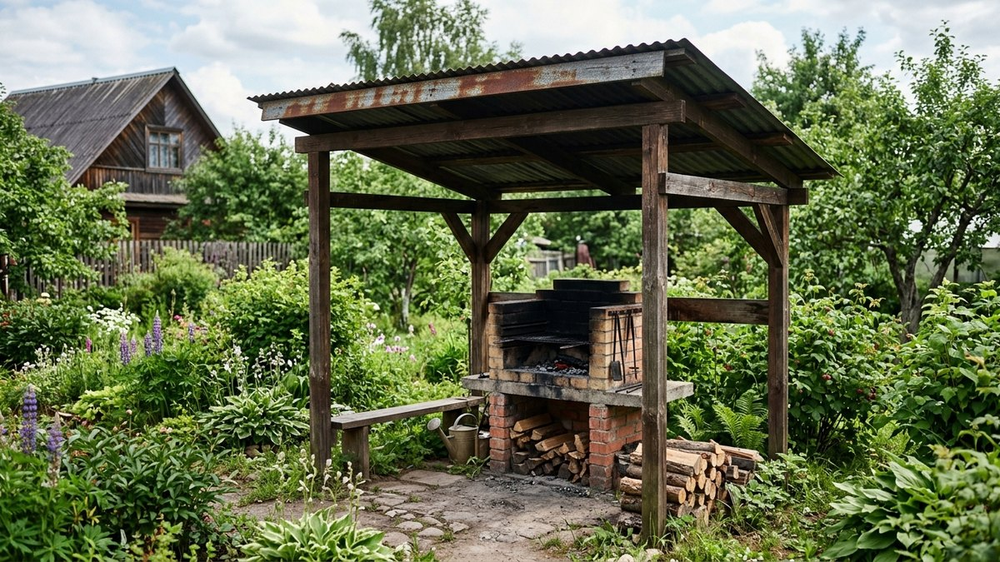
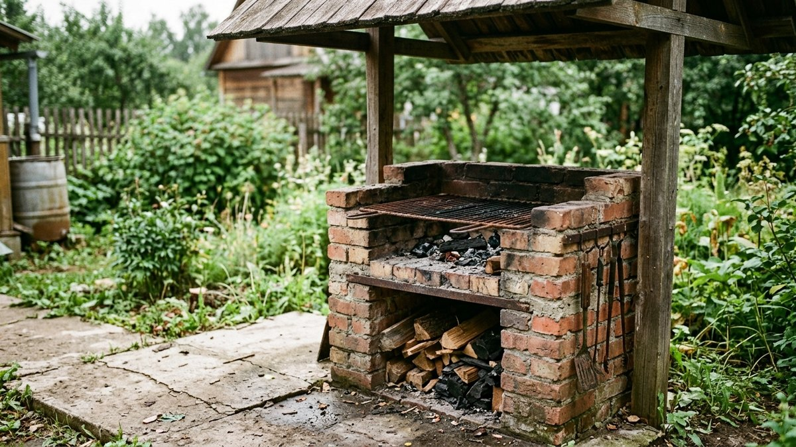
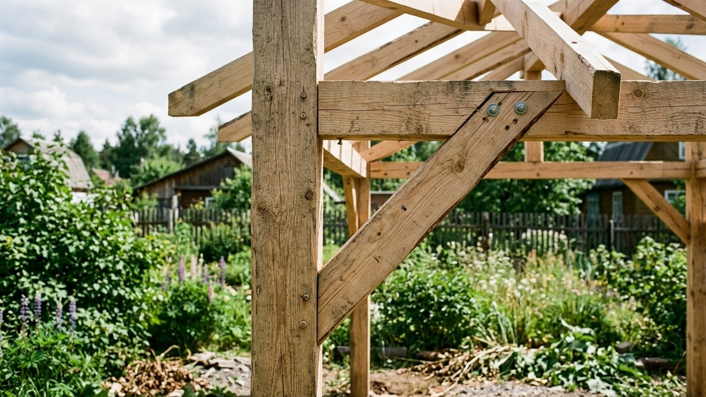
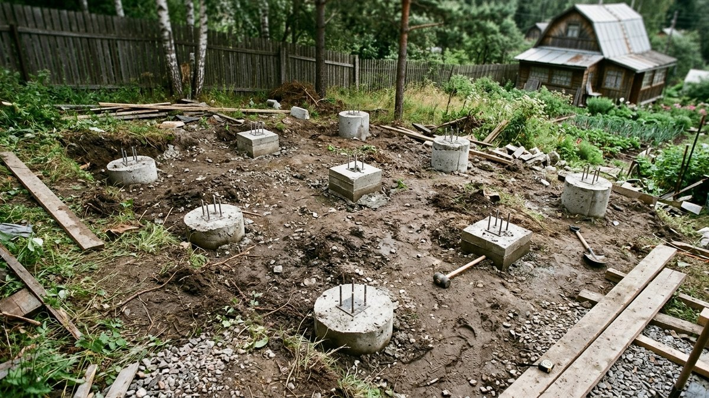
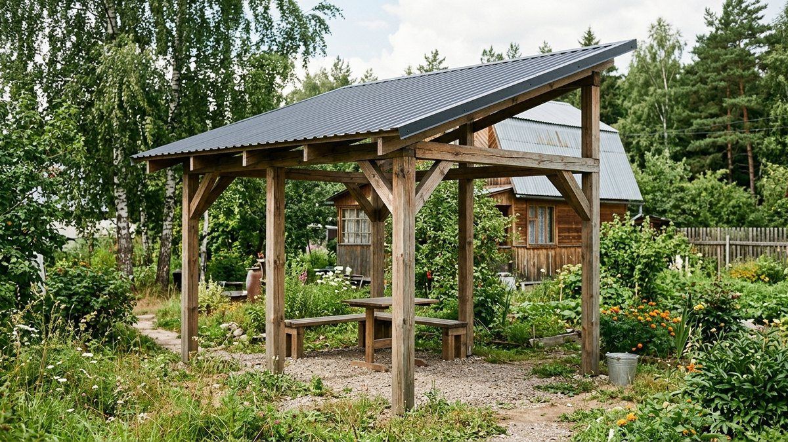
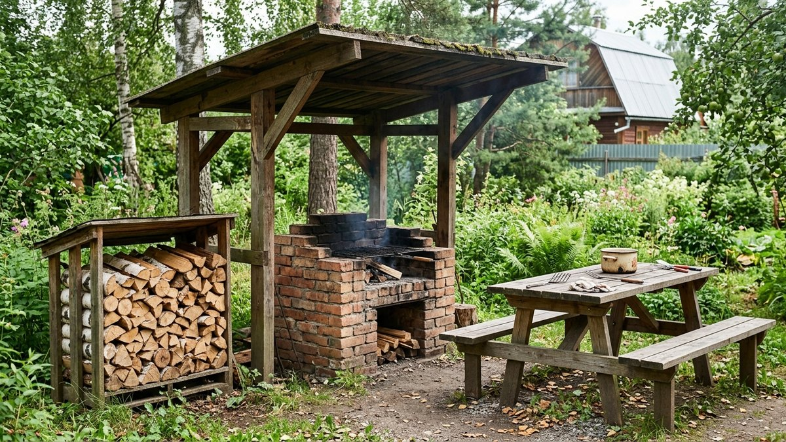

# Навес для мангала своими руками: чертежи и монтаж

Если нужна не полноценная беседка со стенами и полом, а просто крыша над
мангалом, чтобы готовить в дождь и не щуриться от солнца, — это навес, а не
беседка. Разница в деньгах и времени в разы: навес для мангала своими руками
можно поставить за выходные из бруса и профнастила, без фундаментной плиты
и остекления. Разберём, какую конструкцию выбрать, что обязательно по
пожарной безопасности рядом с открытым огнём и как смонтировать каркас
и крышу по шагам.

## Навес или беседка: что нужно на самом деле

Если хочется готовить у мангала в любую погоду, а вечером ещё и посидеть
закрытой компанией — это уже беседка с зоной готовки, и там свои требования
к вытяжке и негорючей стене за очагом, подробно разобранные в статье
[беседка своими руками](https://mir-doma.pro/besedka-svoimi-rukami/). Навес
проще: это крыша на стойках без стен и пола, которая закрывает мангал и
готовящего от дождя, снега и солнца. Задачи разные — навес не заменяет
беседку, если нужна закрытая зона отдыха, но обходится в 3–4 раза дешевле
и строится за один-два выходных силами одного человека.

## Какой навес выбрать

- **Отдельно стоящий** — ставится там, где удобно готовить, не привязан
  к дому. Не боится расстояния до дома, но требует собственного фундамента
  под все опоры.
- **Пристроенный к дому или бане** — одна сторона крепится к стене
  капитального строения, экономия на опорах и материале. Требует крепления
  через закладные, чтобы не повредить стену и не завести влагу под обшивку.
- **По форме крыши**: односкатный проще и дешевле, справится новичок за
  один заход; двускатный сложнее по стропильной системе, зато лучше
  сбрасывает снег и не парусит при сильном ветре сбоку.

Для одиночного мангала хватает 2×2–2,5×2,5 м под крышей. Если добавляете
стол на 4–6 человек — закладывайте 3×4 м и больше.

## Пожарная безопасность: обязательные требования

Открытый огонь рядом с деревянной конструкцией — не место для компромиссов:

- **Основание под мангал — только негорючее**: бетонная плитка, тротуарная
  плитка на песчаной подушке или монолитная площадка. Деревянный настил
  или газон под мангалом не допускаются.
- **Расстояние от построек**: не менее 5 метров до жилого дома и хозблоков,
  не менее 1 метра до забора — по требованиям пожарной безопасности для
  открытого очага на участке.
- **Огнезащитная обработка каркаса**: деревянные стойки и стропила в
  радиусе 1,5–2 м от мангала обрабатывают антипиреном, а не только
  декоративной пропиткой.
- **Вытяжка дыма**: если навес невысокий или с трёх сторон появятся хотя бы
  частичные стенки — дым будет скапливаться под крышей. Для низких навесов
  предусматривайте зазор между кровлей и верхней обвязкой или простую
  вытяжную трубу над зоной готовки.
- **Класс горючести кровли**: профнастил и металлочерепица не поддерживают
  горение и безопаснее поликарбоната или битумной черепицы прямо над
  открытым огнём.

## Материалы каркаса и кровли

| Элемент | Вариант | Когда выбирать |
|---|---|---|
| Каркас | Брус 100×100 мм | Стандартный выбор, легко обрабатывается антипиреном |
| Каркас | Металлическая труба/профиль | Долговечнее, не боится огня рядом, но нужна сварка |
| Кровля | Профнастил | Дешёвый, негорючий, быстрый монтаж — основной выбор для навеса над мангалом |
| Кровля | Металлочерепица | Дороже, декоративнее, тоже негорючая |
| Кровля | Поликарбонат | Даёт рассеянный свет, но нужно уводить подальше от прямого пламени и искр |

Материалы обшивки боковин (если делаете частичные стенки для защиты от
ветра) должны выдерживать открытую эксплуатацию — те же принципы разбора
подходящих и неподходящих материалов, что и для стенового навеса, собраны
в статье [чем обшить навес изнутри](https://mir-doma.pro/chem-obshit-naves-iznutri/).
Порядок монтажа профнастила на кровлю — в статье
[крыша из профнастила своими руками](https://mir-doma.pro/krysha-iz-profnastila-svoimi-rukami/).

## Фундамент и опоры

Лёгкому навесу капитальный ленточный фундамент не нужен — хватает точечных
опор под каждую стойку:

1. **Столбчатый фундамент** — бетонирование стоек в лунках 40–50 см с
   песчаной подушкой. Дольше сохнет (набор прочности бетона — минимум
   неделя до нагрузки), но самый устойчивый вариант для двускатной крыши.
2. **Винтовые сваи** — быстрее (монтаж за один день), не требуют
   выжидания на схватывание бетона, подходят для лёгкого одностоечного
   навеса.
3. **Опорные площадки на щебне** — самый бюджетный вариант для временного
   лёгкого навеса, но менее устойчив при сильном ветре.

Для основного дачного дома и построек с более серьёзной нагрузкой типы
фундаментов и их выбор разобраны подробнее в статье
[сарай своими руками](https://mir-doma.pro/saray-svoimi-rukami/) — там же
пошагово показан столбчатый фундамент под лёгкий каркас.

## Монтаж навеса пошагово

1. **Разметка и лунки под стойки** — по углам и по центру длинной стороны,
   если пролёт больше 3 м.
2. **Установка и выравнивание стоек** — строго по уровню, стойки
   временно раскрепляют укосинами до застывания бетона или до финальной
   фиксации свай.
3. **Нижняя и верхняя обвязка** — брус по периметру поверху стоек,
   соединения на металлические уголки и болты, а не только на гвозди.
4. **Стропильная система** — шаг стропил 60–80 см под профнастил, больше
   для металлочерепицы не делают из-за увеличения прогиба.
5. **Обрешётка** — сплошная или разреженная в зависимости от материала
   кровли, крепится перпендикулярно стропилам.
6. **Монтаж кровли** — с нахлёстом по уклону, с карнизным свесом не менее
   30–40 см в сторону мангала, чтобы дождь не задувало на очаг сбоку.
7. **Финишная обработка дерева** — антипирен в зоне у мангала, антисептик
   и защитная пропитка по всей конструкции.

## Частые ошибки

- **Деревянный настил или газон под мангалом.** Даже разовое возгорание
  травы или щепы у самого очага — частая причина пожаров на участке.
- **Слишком низкая крыша без зазора.** Дым и жар от мангала скапливаются
  под кровлей, коробят и коптят материал изнутри.
- **Экономия на антипирене.** Обычная лаковая пропитка не защищает от
  возгорания — рядом с открытым огнём нужен именно антипирен.
- **Навес впритык к забору соседей.** Кроме нарушения отступов, это риск
  конфликта при первой же искре, отлетевшей за границу участка.

## Частые вопросы

**Нужно ли разрешение на строительство навеса для мангала?**
Лёгкий навес без фундаментной плиты и капитальных стен обычно не требует
разрешения на строительство, но отступы от соседского забора и дома
регламентируются местными нормами — их стоит уточнить до начала стройки.

**Какой навес для мангала самый дешёвый?**
Односкатный навес на деревянных стойках с профнастилом и опорами на щебне —
самый бюджетный вариант, но и наименее долговечный при сильном ветре.

**Можно ли поставить навес для мангала без фундамента?**
Да, для лёгкой односкатной конструкции достаточно винтовых свай или опорных
площадок на щебне — заливка бетоном нужна в основном для двускатной крыши
с большей парусностью.

**На каком расстоянии от дома можно ставить навес с мангалом?**
Не менее 5 метров до жилого дома и хозяйственных построек — это требование
пожарной безопасности для открытого очага, а не рекомендация.

**Чем крыть навес для мангала: профнастилом или поликарбонатом?**
Профнастил безопаснее прямо над открытым огнём — он не поддерживает
горение. Поликарбонат применим, только если мангал стоит в стороне от
кровли, а не прямо под ней.

**Нужна ли вытяжка на навесе для мангала?**
Для открытого навеса без стенок обычно достаточно естественного
проветривания. Вытяжка нужна, если появляются хотя бы частичные боковые
стенки — тогда дым перестаёт уходить сам.
