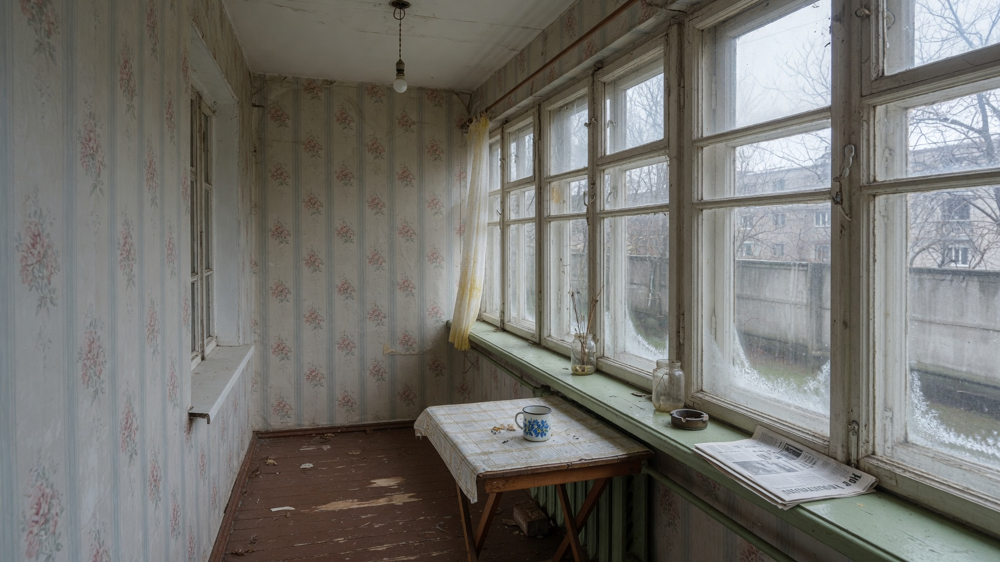
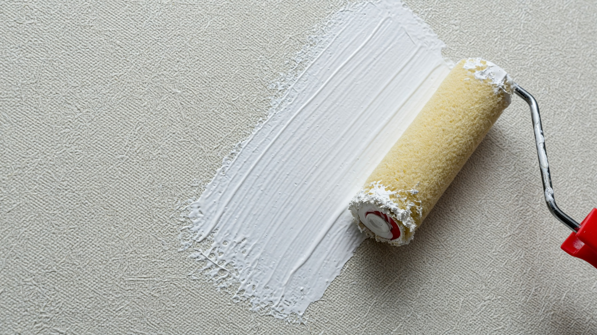
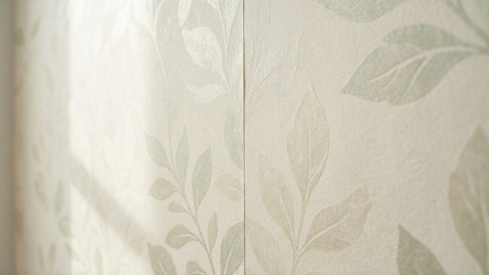
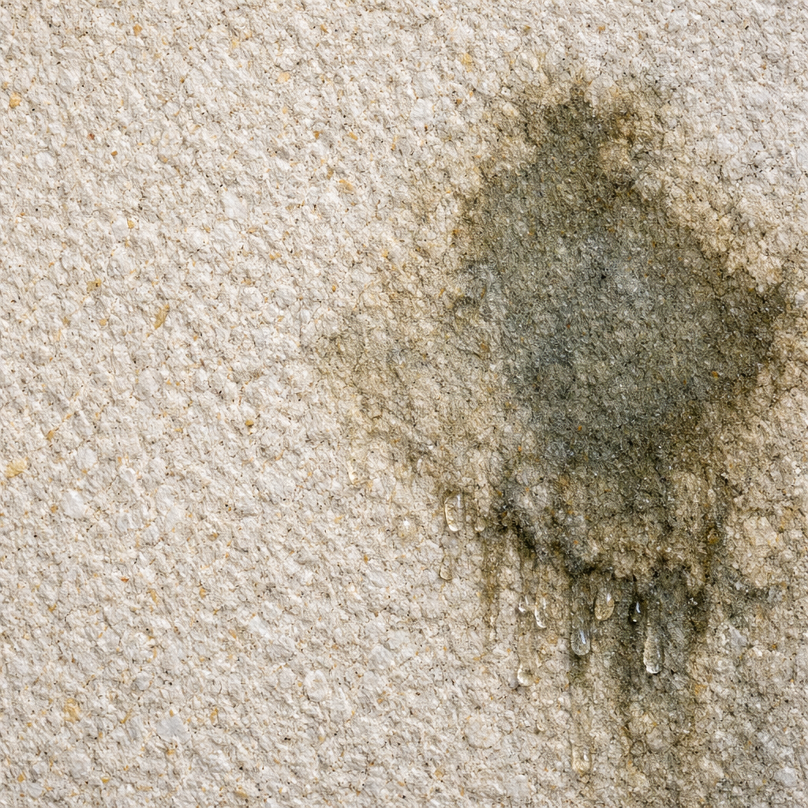
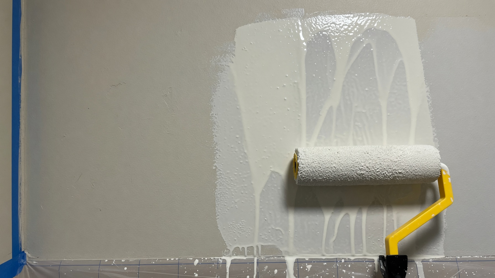
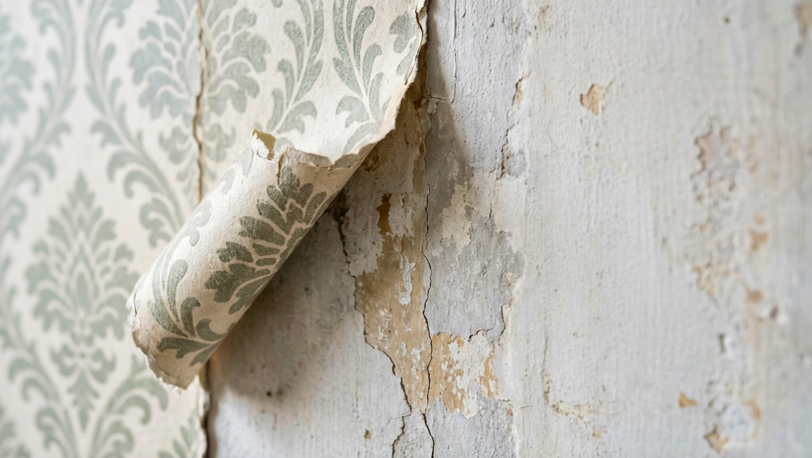

Короткий ответ: **клеить обои на холодной веранде можно, но не любые и не в любых условиях**. Бумажные и жидкие отойдут к первой же весне, а стеклообои под покраску простоят годами. Разница не в цене, а в том, из чего сделано полотно и что происходит с ним при переходе через ноль. Разберём по типам обоев, какой нужен клей, как подготовить стены и когда работы вообще бессмысленны.

## 🌡️ Что происходит с обоями на морозе

Прежде чем выбирать, полезно понять, почему полотна вообще отходят. Причин четыре, и работают они одновременно.

**Конденсат.** На неотапливаемой веранде стены холодные, а воздух периодически тёплый — когда пригрело солнце или открыли дверь из дома. Влага из воздуха оседает на стене каплями, в том числе под обоями. Клеевой слой размокает.

**Замерзание влаги в клее.** Впитавшаяся вода при минусе превращается в кристаллы льда, которые разрушают сцепление клея с основанием. Каждый цикл замерзания-оттаивания ослабляет его ещё немного — а за зиму таких циклов десятки.

**Подвижки основания.** Дерево на веранде «дышит»: летом расширяется, зимой сжимается. Каркасные стены слегка играют от ветра. Жёсткое полотно на подвижном основании рвётся по стыкам.

**Гигроскопичность материала.** Бумага и целлюлоза впитывают влагу и деформируются — идут волнами, пузырятся, теряют прочность.

**Практический вывод:** выживает то, что не впитывает воду, не боится мороза и умеет тянуться вместе с основанием. По этим трём признакам и выбирают.

## 📊 Какие обои подойдут: сравнение

| Тип обоев | Выдержит мороз | Влагостойкость | Держит подвижки | Вердикт для холодной веранды |
|---|---|---|---|---|
| **Стеклообои под покраску** | Да | Высокая | **Да, армируют** | ✅ Лучший выбор |
| **Флизелиновые под покраску** | Условно | Средняя | Средне | ⚠️ Можно, с оговорками |
| **Виниловые на флизелине** | Условно | Высокая | Средне | ⚠️ Только при вентиляции |
| **Флизелиновые обычные** | Условно | Средняя | Средне | ⚠️ Риск расхождения стыков |
| **Жидкие обои** | Нет | **Низкая** | Да | ❌ Отсыреют |
| **Бумажные** | Нет | Низкая | Нет | ❌ Отойдут за сезон |
| **Виниловые на бумажной основе** | Нет | Средняя | Нет | ❌ Основа подведёт |

## 🟢 Стеклообои: лучший вариант

**Стеклообои (стеклохолст под покраску)** — единственный тип, который для неотапливаемого помещения подходит без оговорок.

Полотно сделано из стекловолокна, то есть из того же материала, что и стекло. Отсюда свойства:

- **не впитывают влагу** — воде просто нечего размачивать;
- **не боятся мороза** — стекловолокно инертно к перепадам температуры;
- **не гниют и не плесневеют** — грибку не на чем расти;
- **армируют поверхность** — держат микротрещины основания, а не рвутся вместе с ним;
- **перекрашиваются** — обновить цвет можно хоть каждый сезон, до 8–10 раз за срок службы;
- **прочные механически** — не порвутся, если задеть.

**Как красить:** составами для наружных или влажных помещений — акриловыми фасадными или латексными. Обычная интерьерная краска для сухих комнат на веранде растрескается вместе с идеей.

**Минусы честно:** стеклообои дороже бумажных, полотно жёсткое и колючее в работе (нужны перчатки, очки и респиратор — стеклянная пыль раздражает кожу и слизистые), а снять их потом сложно.

## 🟡 Флизелиновые: можно, но с оговорками

**Флизелин** — нетканый материал из целлюлозных и текстильных волокон со связующим. Он заметно прочнее бумаги и не размокает так быстро, а клей при поклейке наносится на стену, а не на полотно — обои меньше набирают влагу в процессе.

**Что это даёт на холодной веранде:**

- держатся ощутимо лучше бумажных;
- переносят умеренную сырость;
- флизелин слегка тянется, компенсируя небольшие подвижки.

**Где слабое место:** при сильном промерзании и высокой влажности **начинают расходиться стыки**. Полотно остаётся целым, но по швам появляются щели, и с них начинается отслоение.

**Вывод:** флизелиновые обои — компромисс. Подходят для веранды, которая **зимой не промерзает глубоко** (застеклённая, защищённая от ветра, примыкающая к тёплому дому). Для продуваемой веранды в северном регионе — рискованно.

**Флизелиновые под покраску** предпочтительнее обычных с рисунком: плотнее и ремонтопригоднее.

## 🟡 Виниловые: вопрос вентиляции

**Виниловые обои на флизелиновой основе** влагостойкие и моющиеся — сам винил это ПВХ, воды он не боится вовсе.

Но есть встречная проблема: **винил паронепроницаем**. Влага, которая проходит сквозь стену или конденсируется под полотном, наружу выйти не может. В сырой веранде под виниловыми обоями копится конденсат, а за ним появляется плесень.

**Когда виниловые уместны:** если веранда хорошо проветривается и в ней нет постоянной сырости. Тогда влагостойкость работает в плюс.

**Когда нет:** если стены отсыревают, вентиляции нет, а на окнах зимой конденсат. В этом случае обои превратятся в паровую ловушку.

⚠️ **Виниловые на бумажной основе для холодной веранды не годятся** независимо от качества винила — подведёт основа.

## 🔴 Жидкие обои: почему не выдержат

Вопрос «будут ли жидкие обои держаться в холодной веранде» задают часто, и ответ отрицательный.

Жидкие обои — это по сути декоративная штукатурка на **целлюлозной основе** с добавлением волокон и связующего. Целлюлоза — это бумага, и ведёт она себя соответственно:

- **впитывает влагу как губка** — на сырой веранде набухает;
- при высокой влажности **темнеет, покрывается пятнами** и может пойти плесенью;
- при промерзании влажный слой **отслаивается от основания** кусками;
- восстановить участок можно, но делать это придётся каждую весну.

**Единственный вариант, при котором есть шанс:** покрыть готовое покрытие акриловым лаком в 2–3 слоя. Лак закроет целлюлозу от влаги. Но при этом теряется главное достоинство жидких обоев — ремонтопригодность (размочить и переделать участок уже не выйдет), а гарантий на морозе всё равно никто не даёт.

**Честная рекомендация:** для неотапливаемой веранды выберите стеклообои. Жидкие оставьте для отапливаемых помещений.

## 🧴 Клей: половина успеха

Даже правильные обои отойдут на неправильном клее — это самая частая причина неудачи.

**Что нужно:**

- **клей под конкретный тип обоев** — для стеклообоев свой (густой, с усиленной адгезией), для флизелиновых свой;
- **влагостойкий состав** — обычный бумажный клей на основе крахмала отсыревает и теряет сцепление;
- **с антигрибковыми добавками** — на веранде это не роскошь;
- готовые дисперсионные клеи в вёдрах обычно надёжнее сухих смесей для таких условий.

**Чего избегать:** дешёвого универсального клея «для всех типов обоев» — в холодном сыром помещении он не работает.

## 🧱 Подготовка стен: без этого бессмысленно

Обои держатся не за воздух, а за основание. На холодной веранде требования к нему жёстче обычных.

**На что можно клеить:**

- **оштукатуренную стену** (кирпич, блок) — после грунтовки;
- **влагостойкую фанеру ФСФ или ОСП-3** — закреплённые листы с проклеенными и зашпаклёванными стыками;
- **выровненную стабильную поверхность** без подвижек.

**На что клеить нельзя:**

- **прямо на бревно, брус или вагонку** — дерево играет, полотно порвётся;
- **на гипсокартон**, даже влагостойкий — в неотапливаемом помещении он разбухает и крошится;
- **на осыпающуюся штукатурку** — отойдёт вместе с ней;
- **на сырую стену** — влага останется под обоями.

**Порядок подготовки:**

1. Убрать старое покрытие и всё, что отслаивается.
2. Проверить стену на сырость и устранить причину (протечка, конденсат, отсутствие вентиляции).
3. Заделать трещины влагостойкой шпаклёвкой, выровнять.
4. **Обработать антисептиком** — на веранде это обязательно.
5. **Грунтовать глубокого проникновения**, в два слоя, с полным высыханием.
6. Дать стене полностью просохнуть перед поклейкой.

## 📅 Когда клеить: сезон решает

Ещё один фактор, который упускают: **обои на холодной веранде клеят только в тёплый сухой сезон**.

- **оптимально — с конца мая по август**, при температуре от +15 °C и сухой погоде;
- клею нужно **полностью высохнуть и набрать прочность** — на это уходит несколько суток, а не «до вечера»;
- **нельзя клеить осенью перед морозами**: недосохший клей замёрзнет, и полотно отойдёт зимой;
- **нельзя в дождь и сырость** — влажный воздух не даст просохнуть;
- во время работ и после — **закрыть окна и двери**, чтобы не было сквозняка: он сушит полотно неравномерно и рвёт стыки.

Если веранду отделывают осенью и ждать до лета не хочется — логичнее выбрать обшивку панелями или вагонкой, для неё погода не критична.

## 🔄 Альтернативы обоям

Если условия на веранде тяжёлые — стены промерзают, есть сырость, нет вентиляции — обои будут проблемой каждый сезон. Что работает надёжнее:

- **деревянная вагонка** — классика для веранды, переносит и мороз, и сырость;
- **ПВХ-панели** — самый бюджетный и неприхотливый вариант, моются;
- **влагостойкая фанера или ОСП под покраску** — быстро и современно;
- **краска по подготовленной стене** — без полотна отслаиваться нечему; берут фасадную или для влажных помещений;
- **декоративная штукатурка для наружных работ** — дороже, но переносит перепады.

Сравнение материалов обшивки по цене, влагостойкости и монтажу — в статье про то, [чем обшить стены веранды изнутри](https://mir-doma.pro/chem-obshit-verandu-vnutri/).

## ❌ Частые ошибки

- **Поклеили бумажные или жидкие обои** — отошли за первую зиму.
- **Клеили прямо на вагонку или бревно** — основание играет, полотно порвалось.
- **Обычный обойный клей** — отсырел, полотно отошло от стены.
- **Клеили осенью перед холодами** — клей не успел набрать прочность.
- **Не устранили причину сырости** — обои отходят снова и снова независимо от типа.
- **Виниловые обои в сырой веранде без вентиляции** — конденсат и плесень под полотном.
- **Гипсокартон как основание** — разбух и потянул за собой обои.
- **Интерьерная краска по стеклообоям** — растрескалась на перепадах.

## ❓ Частые вопросы

**Можно ли клеить обои на холодной веранде?**
Можно, но подойдут не все. Надёжнее всего стеклообои под покраску — они не боятся ни мороза, ни влаги. Флизелиновые и виниловые на флизелине держатся при условии, что веранда не промерзает глубоко и хорошо проветривается. Бумажные и жидкие отойдут за первый же сезон.

**Будет ли держаться обои в холодной веранде?**
Будут, если совпали три условия: правильный тип полотна (стеклообои или флизелин), влагостойкий клей под этот тип и стабильное подготовленное основание. При нарушении любого из трёх полотно отойдёт по стыкам уже к весне.

**Можно ли клеить стеклообои в неотапливаемой веранде?**
Да, это лучший выбор для такого помещения. Стекловолокно не впитывает влагу, не гниёт и не боится перепадов температуры, а само полотно армирует поверхность. Красить нужно фасадной или латексной краской, а не интерьерной.

**Выдержат ли флизелиновые обои мороз на веранде?**
При умеренном промерзании — да, они заметно прочнее бумажных. Но при сильных морозах и высокой влажности у них начинают расходиться стыки. Для продуваемой веранды в холодном регионе это рискованный вариант.

**Будут ли жидкие обои держаться в холодной веранде?**
Нет. Жидкие обои сделаны на целлюлозной основе, впитывают влагу, темнеют и отслаиваются при промерзании. Покрытие акриловым лаком в 2–3 слоя немного улучшает ситуацию, но лишает их главного плюса — возможности переделать участок.

**Какие обои подойдут на веранду холодную?**
По убыванию надёжности: стеклообои под покраску, флизелиновые под покраску, виниловые на флизелиновой основе при хорошей вентиляции. Бумажные, жидкие и виниловые на бумажной основе не подходят.

**Каким клеем клеить обои на холодной веранде?**
Влагостойким клеем под конкретный тип обоев и обязательно с антигрибковыми добавками. Универсальный дешёвый клей в холодном помещении отсыревает и не держит. Готовые дисперсионные составы обычно надёжнее сухих смесей.

**Когда лучше клеить обои на веранде?**
С конца мая по август, при температуре от +15 °C и сухой погоде, чтобы клей успел полностью высохнуть за несколько суток до холодов. Осенью перед морозами клеить нельзя — недосохший клей замёрзнет и полотно отойдёт.

---

Обои на холодной веранде — это не вопрос «можно или нельзя», а вопрос совпадения трёх условий: стеклообои или качественный флизелин, влагостойкий клей и стабильное сухое основание. Уберите одно — и весной будете переклеивать. Если условия тяжёлые, а возиться не хочется, обшивка вагонкой или панелями решает задачу надёжнее.

**Куда идти дальше:**

- Обои — только один из вариантов отделки стен: сравнение вагонки, панелей, фанеры и других материалов по цене и монтажу в статье про то, [чем обшить стены веранды изнутри](https://mir-doma.pro/chem-obshit-verandu-vnutri/).
- Если обои отходят снова и снова, причина обычно в конденсате — а это вопрос пароизоляции и вентиляции: [отделка холодной веранды внутри](https://mir-doma.pro/otdelka-holodnoy-verandy/).
- Собираетесь отделывать веранду целиком — общий разбор по стенам, полу и потолку: [внутренняя отделка веранды](https://mir-doma.pro/vnutrennyaya-otdelka-verandy/).
- А если веранду решили сделать тёплой, требования к отделке меняются полностью: [чем утеплить веранду изнутри](https://mir-doma.pro/chem-uteplit-verandu-iznutri/).
