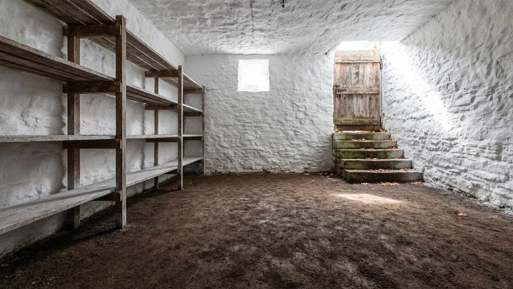
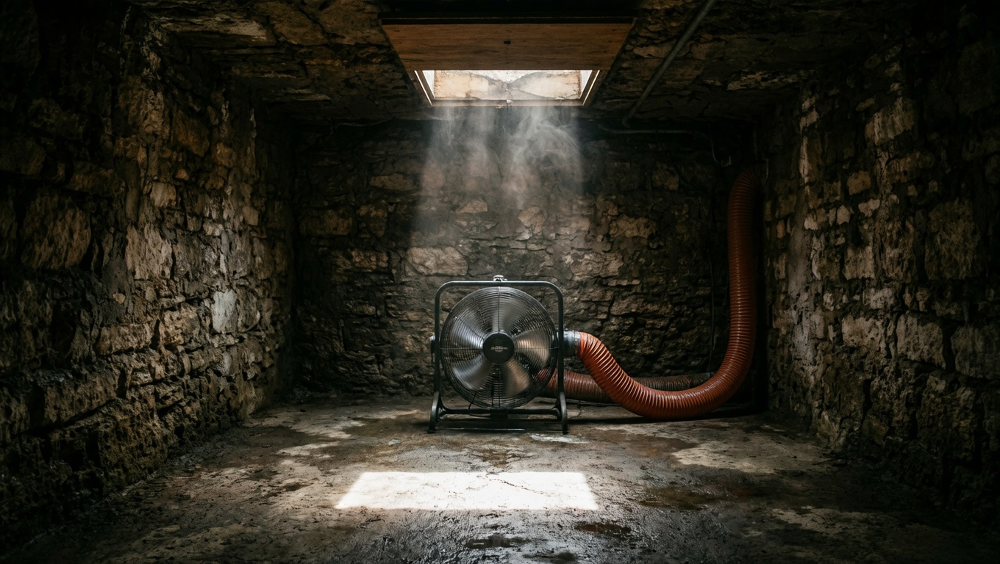
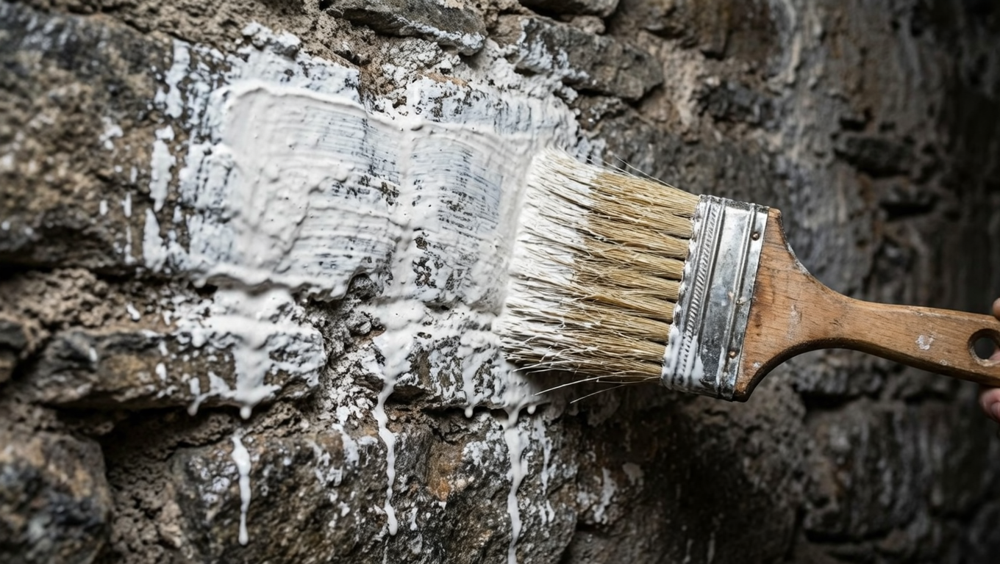
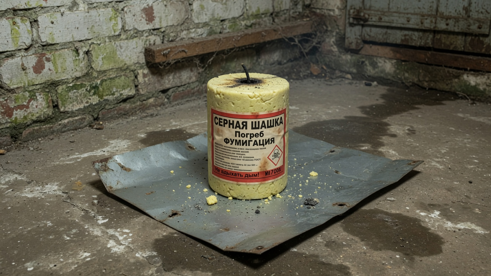
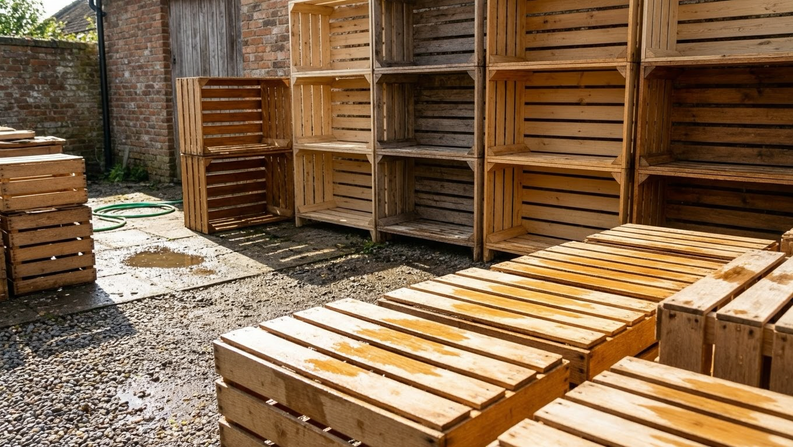
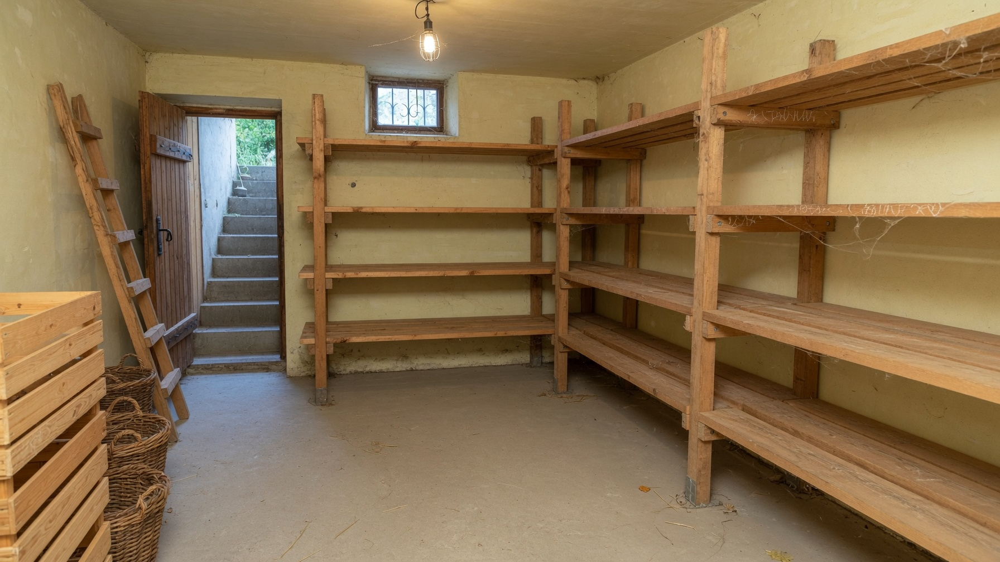

Урожай в погребе гниёт не потому, что «год такой», а потому, что закладывают его в помещение со спорами плесени на стенах и вредителями в щелях. Осенняя обработка погреба занимает пару выходных, стоит копейки и решает проблему на весь сезон хранения. Главное — начать вовремя: **все работы нужно закончить за 2–3 недели до закладки**, иначе овощи отправятся в сырой, непроветренный погреб с остатками химии. Разберём порядок работ по неделям, чем обрабатывать и как не отравиться серной шашкой.

## ⚠️ Сначала о безопасности: погреб — замкнутое пространство

Прежде чем спускаться в погреб после зимы или после любой обработки, проверьте воздух. В подземном помещении скапливается углекислый газ, который тяжелее воздуха и не имеет запаха — случаи удушья в погребах происходят каждый год.

**Проверка свечой:** опустите зажжённую свечу на верёвке вниз, к полу.

- **пламя горит ровно** — воздух нормальный, спускаться можно;
- **пламя тускнеет или гаснет** — кислорода мало, спускаться **нельзя**. Открыть люк, проветрить несколько часов и проверить снова.

**Второе правило:** никогда не работайте в погребе в одиночку. Наверху должен оставаться человек, который видит вас и сможет помочь.

Если воздухообмен в погребе слабый — это отдельная проблема, которую надо решить до всякой обработки: как рассчитать и сделать [вентиляцию в погребе](https://mir-doma.pro/ventilyaciya-v-pogrebe/), разобрано в отдельной статье.

## 📅 Календарь работ: за сколько недель что делать

Главная ошибка — начинать обработку за пару дней до закладки урожая. Химия не выветрилась, стены сырые, и весь эффект уходит в минус. Правильный график:

| Когда | Что делать |
|---|---|
| **За 4–5 недель** | Полностью освободить погреб, вынести старые запасы, тару и стеллажи наверх |
| **За 3–4 недели** | Просушить помещение, вымыть и просушить стеллажи и ящики на улице |
| **За 3 недели** | Ремонт: заделать щели, проверить гидроизоляцию и вентиляцию |
| **За 2–3 недели** | Основная обработка: побелка или окуривание |
| **За 1–2 недели** | Проветривание после обработки, при необходимости повторная просушка |
| **За 3–5 дней** | Занести просохшие стеллажи и тару, проверить температуру |
| **День закладки** | Погреб сухой, без запаха химии, температура стабильная |

В средней полосе это означает: **начинать в конце августа — начале сентября**, чтобы к октябрьской закладке всё было готово.

## 🧹 Шаг 1. Освободить и вымыть

1. **Вынести всё** — остатки прошлогоднего урожая, пустые банки, ящики, стеллажи. Погреб должен быть пустым: обрабатывать «вокруг» вещей бессмысленно.
2. **Убрать мусор и растительные остатки** — именно в них зимуют возбудители гнилей.
3. **Смести паутину и налёт** со стен и потолка щёткой.
4. **Вымыть стены и пол**, если позволяет отделка: мыльный раствор или слабый раствор марганцовки.
5. **Осмотреть конструкции** — трещины в стенах, следы подтопления, повреждённые ступени, ржавчина на металле.

Отдельно проверьте **следы грызунов**: погрызенные ящики, помёт, ходы. Если они есть, заделайте щели и продумайте защиту до закладки — иначе урожай будет кормить мышей.

## ☀️ Шаг 2. Просушить — самое важное

Сырость сводит на нет любую обработку: плесень вернётся в сыром погребе за считанные недели. Просушка — не формальность, а основа всей подготовки.

**Как сушить:**

- **открыть люк и продухи** на несколько дней, в сухую тёплую погоду;
- **вынести деревянные элементы наверх** — на солнце они сохнут в разы быстрее;
- **поставить обогреватель или тепловую пушку**, если есть электричество (следите за пожарной безопасностью, не оставляйте без присмотра);
- **старый дачный способ** — жаровня или ведро с углями, но только при работающей вентиляции и никогда без присмотра;
- **влагопоглотители** — негашёная известь, соль или силикагель в открытых ёмкостях подсушивают воздух.

**Признак готовности:** стены сухие на ощупь, нет запаха сырости, положенный на пол лист бумаги за сутки не отсырел.

**Если погреб не успевает просохнуть** — а это частая ситуация в дождливую осень:

- продлите просушку с принудительной вентиляцией (вентилятор в вытяжной трубе);
- откажитесь от «мокрых» обработок (побелки) в пользу сухих методов;
- разберитесь с причиной сырости: чаще всего это плохая вентиляция или отсутствие гидроизоляции — оба вопроса разобраны в статье про [обустройство погреба](https://mir-doma.pro/obustroystvo-pogreba/);
- в крайнем случае перенесите закладку урожая или часть его разместите иначе — сырой погреб испортит овощи быстрее, чем балкон.

## 🧪 Шаг 3. Чем обработать погреб: таблица средств

Универсального средства нет — выбирают под задачу. Дозировки указаны ориентировочно: **всегда сверяйтесь с инструкцией на упаковке**, у разных производителей концентрация отличается.

| Средство | Против чего | Как применяют | Выдержка | Когда можно заходить |
|---|---|---|---|---|
| **Побелка гашёной известью** | Плесень, грибок, бактерии | Раствор наносят кистью или распылителем на стены и потолок | До полного высыхания, 1–2 суток | После высыхания и проветривания |
| **Известь + медный купорос** | Усиленный вариант против плесени | Купорос добавляют в известковый раствор | 1–2 суток | После высыхания |
| **Медный купорос (раствор)** | Грибок, плесень на стенах | Опрыскивание или промазывание | Сутки | После высыхания |
| **Серная шашка** | Комплексно: плесень, насекомые, грызуны | Окуривание закрытого помещения | **2–3 суток закрыто** | Только после 2–3 дней проветривания |
| **Биопрепараты** (фитоспорин и аналоги) | Мягкая профилактика плесени | Опрыскивание стен и стеллажей | Несколько часов | Сразу, безопасны |
| **Марганцовка, хлорные средства** | Местная дезинфекция | Мытьё поверхностей | — | После проветривания |

**Как выбрать:**

- **профилактика, всё в порядке** → побелка известью, при желании с биопрепаратами;
- **была плесень на стенах** → известь с медным купоросом;
- **были насекомые, грызуны, сильная плесень** → серная шашка (со всеми оговорками ниже);
- **погреб под жилым домом** → **только побелка и биопрепараты**, шашка исключена (см. ниже).

⚠️ **Химию и биопрепараты не применяют в один день.** Известь и сера убивают полезную микрофлору, и биологическая обработка окажется бесполезной. Сначала химическая обработка и проветривание, биопрепараты — позже.

## 🔥 Серная шашка: только с соблюдением всех правил

Окуривание серой — самый мощный способ обработки, но и самый опасный. Сернистый газ токсичен, а погреб — замкнутое подземное помещение, откуда газ уходит медленно.

**Когда серную шашку применять НЕЛЬЗЯ:**

- **погреб находится под жилым домом или гаражом** — газ проникает через перекрытие, щели и вентиляцию в жилые помещения. Это главное противопоказание, и его чаще всего игнорируют;
- в погребе **хранятся продукты или заготовки**;
- в доме находятся **люди или животные**, особенно если погреб связан с домом;
- **нет возможности герметично закрыть** помещение и потом полноценно его проветрить;
- в погребе **много металла** — сернистый газ вызывает коррозию оцинковки, стеллажей и труб (либо металл нужно защитить).

**Если противопоказаний нет — порядок работ:**

1. Погреб полностью **освободить и просушить**.
2. Закрыть продухи и вентиляционные трубы.
3. Поставить шашку **на негорючее основание** (металлический лист, кирпич), подальше от горючего.
4. Надеть **респиратор и защитные очки**, работать в одежде с длинным рукавом.
5. Поджечь фитиль и **немедленно покинуть погреб**, плотно закрыв люк.
6. Оставить закрытым на **2–3 суток**.
7. Открыть, **полностью проветрить** — открытые продухи и люк на 2–3 дня, лучше с принудительной вытяжкой.
8. Перед спуском **проверить воздух свечой** (см. начало статьи).
9. Только после этого заносить стеллажи и урожай.

**Ни при каких условиях** не спускайтесь в погреб сразу после окуривания и не проверяйте «как там дела» в первые сутки. Запах серы, который держится после проветривания, — сигнал, что процесс не закончен, и закладывать урожай рано.

## 🪵 Шаг 4. Стеллажи, ящики и тара

Деревянные конструкции — главный рассадник плесени в погребе, потому что дерево впитывает влагу и споры.

- **вынести всё наверх** и вымыть на улице;
- **просушить на солнце** — ультрафиолет сам по себе обеззараживает;
- **обработать антисептиком** для дерева либо раствором медного купороса, дать полностью высохнуть;
- **выбросить прогнившие ящики** — реставрировать труху бессмысленно, она заразит новый урожай;
- **металлические стеллажи** очистить от ржавчины и покрасить;
- **ставить стеллажи с зазором от стен** (3–5 см) — иначе за ними скапливается конденсат;
- **тару для овощей** (ящики, сетки, корзины) вымыть и просушить так же тщательно.

Заносить всё это обратно нужно **только в сухой погреб и после того, как выветрится химия**.

## ✅ Шаг 5. Проверка перед закладкой

За несколько дней до закладки убедитесь, что погреб действительно готов:

- **сухо** — стены не влажные, нет капель на потолке;
- **нет запаха** сырости, плесени и химии;
- **вентиляция работает** — проверьте тягу листом бумаги у вытяжной трубы;
- **температура стабильная**, в идеале около 0…+4 °C для овощей;
- **щели заделаны**, продухи закрыты сеткой от грызунов;
- **стеллажи сухие**, стоят с зазором от стен;
- **воздух нормальный** — свеча горит ровно.

Только после этого начинают закладку. Какие овощи при какой температуре хранить и что с чем нельзя класть рядом — в статье про то, [как хранить овощи зимой](https://mir-doma.pro/kak-hranit-ovoshchi-zimoy/), а сроки для банок с заготовками собраны в материале про [сроки хранения заготовок](https://mir-doma.pro/skolko-hranyatsya-zagotovki/).

## ❌ Частые ошибки

- **Обработали за пару дней до закладки** — химия не выветрилась, стены сырые.
- **Обрабатывали, не просушив погреб** — плесень вернётся через месяц.
- **Жгли серную шашку в погребе под жилым домом** — опасно для здоровья, газ идёт в дом.
- **Спустились в погреб слишком рано после окуривания** — риск отравления.
- **Не вынесли стеллажи** — обработали стены, а споры остались в дереве.
- **Оставили прошлогодние овощи** «доесть потом» — они источник гнили для нового урожая.
- **Смешали химию и биопрепараты** в один день — биология погибла, толку нет.
- **Не заделали щели** — мыши придут к урожаю по готовым ходам.
- **Работали в погребе в одиночку** — самая опасная ошибка из всех.

## ❓ Частые вопросы

**Когда обрабатывать погреб перед закладкой урожая?**
Все работы нужно закончить за 2–3 недели до закладки. В средней полосе это значит начинать в конце августа — начале сентября: освобождение и просушка занимают 3–4 недели, обработка и проветривание — ещё около двух.

**Чем обработать погреб от плесени?**
Побелкой гашёной известью, при сильном поражении — известью с добавлением медного купороса или раствором медного купороса. Для мягкой профилактики подойдут биопрепараты. Но главное условие — сначала полностью просушить погреб, иначе плесень вернётся.

**Можно ли жечь серную шашку в погребе под домом?**
Нет. Сернистый газ проникает через перекрытие, щели и вентиляцию в жилые помещения. Для погреба под домом или гаражом используют побелку известью и биопрепараты, а не окуривание.

**Сколько проветривать погреб после серной шашки?**
Погреб держат закрытым 2–3 суток, затем проветривают ещё 2–3 дня с открытыми люком и продухами, лучше с принудительной вытяжкой. Перед спуском обязательно проверяют воздух горящей свечой.

**Как понять, что погреб просох?**
Стены сухие на ощупь, нет запаха сырости, на потолке нет капель, а лист бумаги, оставленный на полу на сутки, не отсырел. Если сырость держится, проблема обычно в вентиляции или гидроизоляции.

**Что делать, если погреб не успевает просохнуть?**
Продлить просушку с принудительной вентиляцией, отказаться от побелки в пользу сухих методов обработки и разобраться с причиной сырости. Закладывать урожай в сырой погреб не стоит — овощи сгниют быстрее, чем на балконе.

**Нужно ли обрабатывать погреб каждый год?**
Да, обработку повторяют перед каждым сезоном хранения. Иначе плесень, споры и вредители накапливаются из года в год, и рано или поздно урожай начнёт пропадать.

---

Осенняя обработка погреба — это не разовая генеральная уборка, а сезонный регламент: освободить, просушить, обработать, проветрить и только потом закладывать. Запомните два срока — **закончить за 2–3 недели до закладки** и **проветривать после серной шашки не меньше двух-трёх дней** — и урожай долежит до весны.

**Куда идти дальше:**

- Если в погребе сыро постоянно, обработка будет бесполезной — проблема в воздухообмене: как рассчитать и сделать [вентиляцию в погребе](https://mir-doma.pro/ventilyaciya-v-pogrebe/).
- Погреб требует ремонта или обустраивается с нуля — гидроизоляция, стеллажи, температурный режим: [обустройство погреба](https://mir-doma.pro/obustroystvo-pogreba/).
- Погреб готов — осталось правильно заложить урожай: какие овощи при какой температуре и что с чем не соседствует: [как хранить овощи зимой](https://mir-doma.pro/kak-hranit-ovoshchi-zimoy/).
- Заодно с погребом осенью обрабатывают и теплицу — по тем же принципам и почти теми же средствами: [обработка теплицы осенью](https://mir-doma.pro/obrabotka-teplicy-osenyu/).
