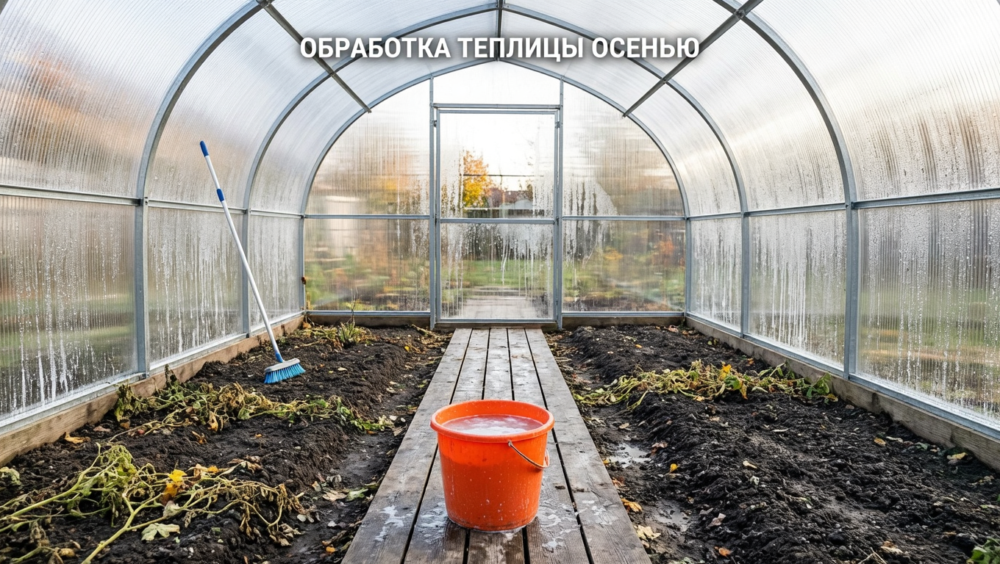
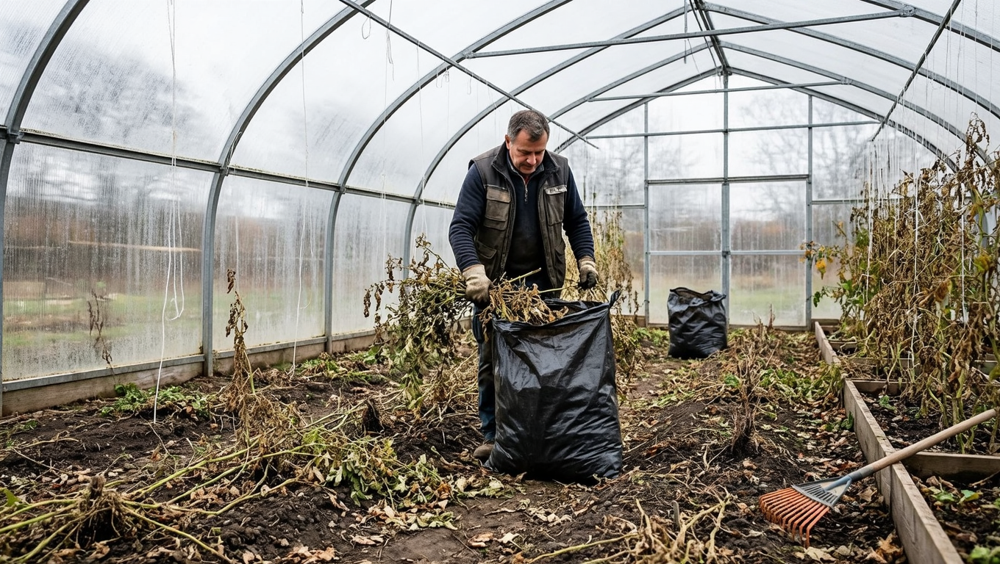
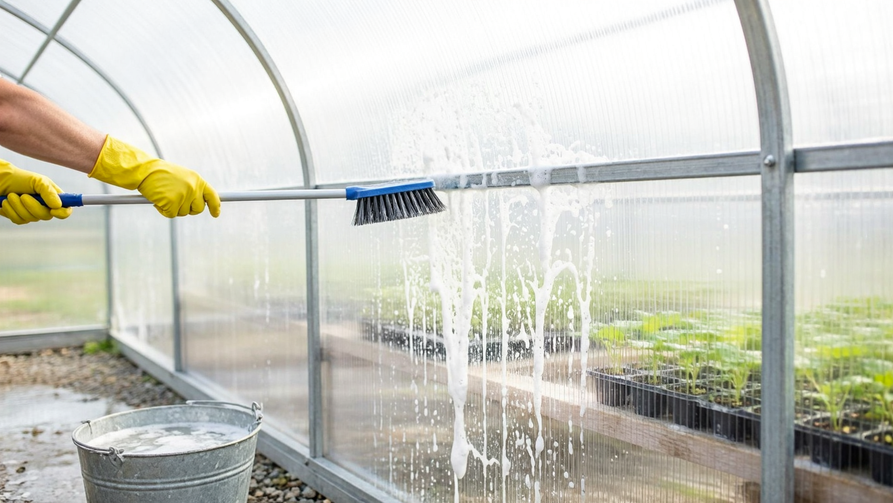
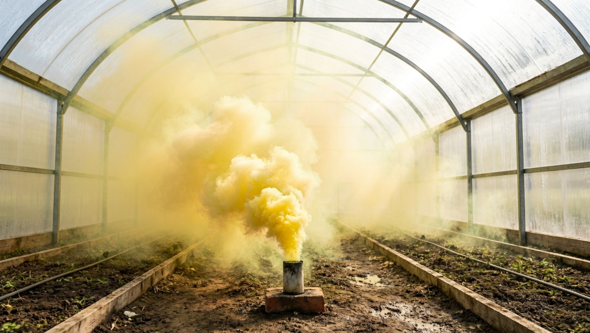
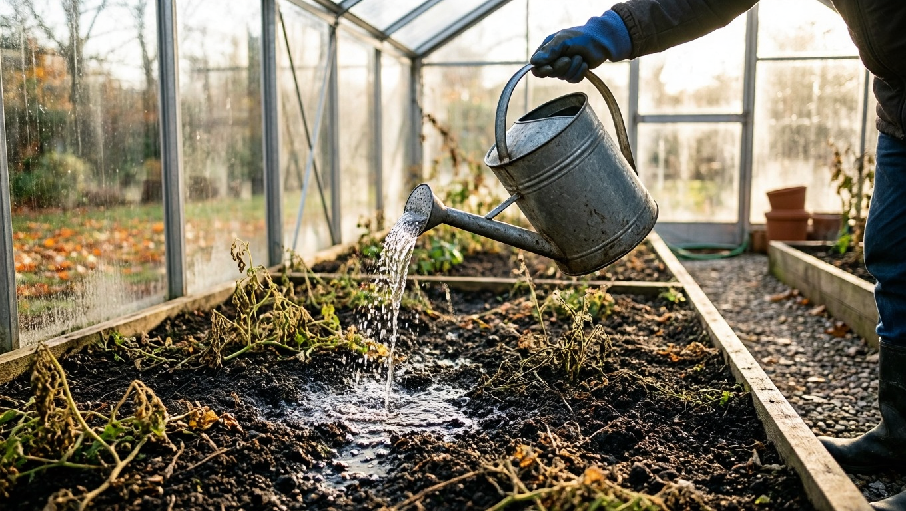
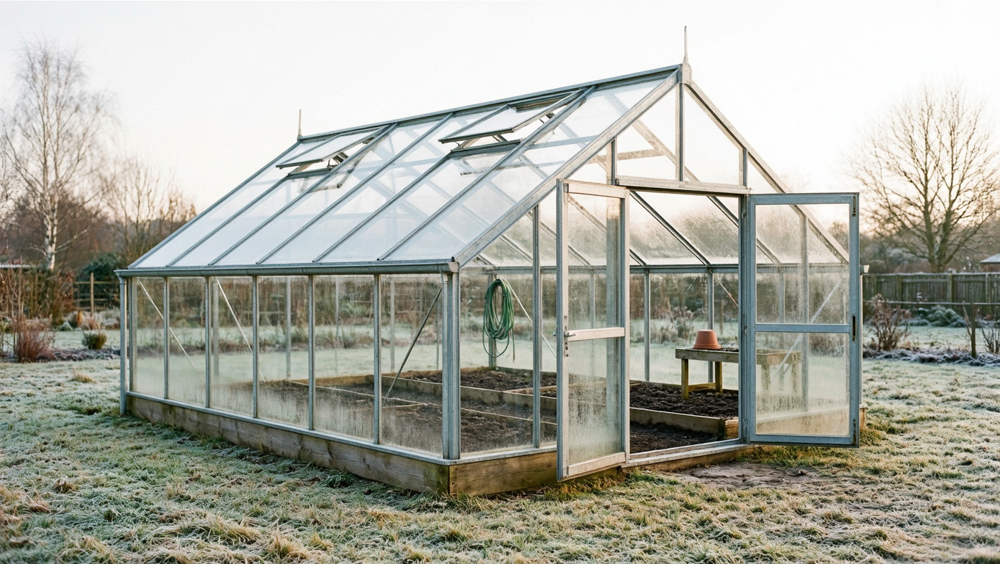

После сбора урожая теплица кажется пустой и безобидной, но на самом деле это рассадник инфекции: возбудители болезней и личинки вредителей спокойно зимуют в почве, на растительных остатках и в стыках конструкций. Если оставить всё как есть, весной проблемы вернутся к молодой рассаде. Осенняя обработка — самый надёжный способ разорвать этот круг и получить здоровый урожай на будущий год. Разберём по шагам, чем обработать теплицу осенью после сбора урожая и как правильно подготовить её к зиме.

## 🍂 Зачем обрабатывать теплицу осенью

Главная причина — зимовка возбудителей. В закрытом грунте из года в год накапливаются одни и те же болезни и вредители:

- споры грибков — [фитофтора](https://mir-doma.pro/fitoftora-na-pomidorah/), [мучнистая роса](https://mir-doma.pro/muchnistaya-rosa-na-ogurtsah/), кладоспориоз;
- вредители, зимующие в почве и щелях — [паутинный клещ](https://mir-doma.pro/pautinnyy-kleshch-na-ogurtsah/) и [белокрылка](https://mir-doma.pro/belokrylka-v-teplitse/).

В теплице им особенно комфортно: тепло, влажно, нет естественных врагов. Поэтому осенняя дезинфекция — не формальность, а профилактика, которая экономит вам весь следующий сезон.

## 🧹 Шаг 1. Убрать растительные остатки

С этого начинается любая обработка. Из теплицы выносят всё:

- ботву, корни, опавшие листья и плоды;
- подвязочный шпагат и колышки (или дезинфицируют, если используете повторно);
- сорняки и мусор из проходов.

Больные растения (особенно с фитофторой) **нельзя класть в компост** — их сжигают или выносят с участка. Возбудители в компосте выживают и вернутся с перегноем.

## 🧴 Шаг 2. Вымыть и продезинфицировать конструкции

Поликарбонат и каркас за сезон покрываются налётом, пылью и спорами. Их моют мягкой щёткой или тряпкой:

- мыльным или содовым раствором для общего мытья;
- с добавлением марганцовки, фитоспорина или хлоргексидина для дезинфекции.

Изнутри промывают и стены, и потолок, и стыки — именно в щелях прячутся вредители. Металлический каркас протирают аккуратно и осматривают на ржавчину, подкрашивают повреждённые места.

## 🔥 Шаг 3. Обеззаразить объём теплицы

Чтобы обработать воздух и труднодоступные места, теплицу окуривают или опрыскивают.

**Серная шашка** — эффективна против грибков и вредителей, дым проникает всюду. Но у неё есть важное ограничение: **сера вызывает коррозию металла**, поэтому для теплиц с оцинкованным или стальным каркасом её либо не применяют, либо тщательно окрашивают все металлические части заранее. Для деревянного каркаса серная шашка подходит. После окуривания теплицу держат закрытой сутки-двое, затем хорошо проветривают.

**Альтернативы для металлокаркаса:**

- опрыскивание раствором медного купороса (от грибковых болезней);
- биопрепараты (фитоспорин, триходерма) — безопасны для конструкций и почвы;
- обработка всех поверхностей дезинфицирующим раствором вручную.

## 🧪 Обзор средств: чем обеззаразить теплицу

Чтобы не путаться, вот основные средства и когда что выбрать:

- **Серная шашка** — сильное окуривание от грибков и вредителей разом, проникает всюду. Минус — коррозия металла, подходит для деревянного каркаса или после окраски металла.
- **Медный купорос** — классика против грибковых болезней (фитофтора, мучнистая роса). Раствором проливают почву и обрабатывают конструкции. Не чаще раза в год.
- **Марганцовка** — лёгкая дезинфекция для мытья поверхностей и пролива почвы, безопасна для каркаса.
- **Биопрепараты (фитоспорин, триходерма)** — заселяют почву полезной микрофлорой, подавляющей патогены. Самый мягкий и экологичный вариант, безопасен для металла и грунта.
- **Хлорсодержащие растворы** — жёсткая дезинфекция конструкций и щелей при серьёзных вспышках болезней; для почвы не применяют.

Универсального средства нет: конструкции моют дезинфицирующим раствором, объём окуривают или опрыскивают, а почву оздоравливают медным купоросом либо биопрепаратами. Химию и биопрепараты не смешивают в один день — сначала обеззараживание, биологию заселяют позже.

## 🌱 Шаг 4. Обработать и оздоровить почву

Почва — главный рассадник инфекции, поэтому ей уделяют больше всего внимания. Варианты в порядке усиления:

- **Пролив обеззараживающим раствором** — медный купорос, марганцовка или фунгицид проливают по поверхности грядок.
- **Биопрепараты** — фитоспорин или триходерма заселяют почву полезными микроорганизмами, подавляющими патогены. Мягкий и экологичный способ.
- **Замена верхнего слоя** — при сильном заражении снимают 5–10 см верхнего грунта, где скапливается основная масса спор и личинок, и заменяют свежим.
- **Сидераты** — после обработки грядки засевают горчицей, рожью или фацелией. Они оздоравливают почву, подавляют патогены и структурируют грунт к весне.

Менять всю землю целиком каждый год не нужно — достаточно чередовать пролив, биопрепараты и сидераты, а полную замену делать раз в несколько лет или при вспышке болезней.

## ❄️ Шаг 5. Подготовить теплицу к зиме

Последний этап — сама зимовка конструкции:

- **Проморозить.** Двери и форточки на зиму оставляют открытыми — мороз добивает вредителей и болезни, а снег внутри весной даёт запас влаги. (Если каркас слабый — см. следующий пункт.)
- **Снеговая нагрузка.** Тяжёлый мокрый снег ломает каркас и продавливает поликарбонат. Ставят подпорки под коньком или, наоборот, оставляют теплицу открытой, чтобы снег попадал внутрь и не давил на крышу. Слабые арочные теплицы иногда даже разбирают на зиму.
- **Крепёж.** Проверяют и подтягивают саморезы, ремонтируют повреждённый поликарбонат — щели зимой рвёт ветром.

О том, как устроена сама теплица и её каркас, подробно — в статье про [теплицу из поликарбоната своими руками](https://mir-doma.pro/teplitsa-iz-polikarbonata-svoimi-rukami/).

## 🎯 Чем обработать по конкретной проблеме

Если летом теплица болела, осенью бьют прицельно:

| Проблема летом | Чем обработать осенью |
|---|---|
| Фитофтора | Убрать всю ботву (сжечь), пролив медным купоросом, замена верхнего слоя почвы |
| Мучнистая роса | Дезинфекция конструкций, серная шашка (для дерева) или медный купорос, фитоспорин в почву |
| Паутинный клещ | Тщательное мытьё щелей, окуривание/акарицид, проморозка теплицы зимой |
| Белокрылка | Уборка остатков, дезинфекция, проморозка (личинки боятся мороза) |

## ❓ Частые вопросы

**Когда обрабатывать теплицу осенью?**
Сразу после уборки последнего урожая, пока стоит плюсовая температура — обычно сентябрь-октябрь. Мытьё и опрыскивание делают по теплу, а проветривание и проморозку оставляют на зиму.

**Нужно ли жечь серную шашку каждый год?**
Не обязательно. Её применяют при заметных проблемах с болезнями или вредителями. В спокойные годы достаточно мытья, дезинфекции и обработки почвы биопрепаратами.

**Можно ли использовать серную шашку в теплице с металлическим каркасом?**
Нежелательно: сера вызывает коррозию металла. Для оцинкованного или стального каркаса либо заранее окрашивают все металлические части, либо выбирают альтернативу — медный купорос или биопрепараты.

**Чем обработать теплицу от паутинного клеща осенью?**
Тщательно вымыть все щели и стыки, окурить теплицу или обработать акарицидом, а зимой оставить открытой для промораживания — клещ не переносит мороза. Подробнее о самом вредителе — в статье про [паутинного клеща](https://mir-doma.pro/pautinnyy-kleshch-na-ogurtsah/).

**Надо ли менять землю в теплице каждый год?**
Полностью — нет. Достаточно чередовать пролив обеззараживающими растворами, биопрепараты и посев сидератов. Верхний слой (5–10 см) заменяют при сильном заражении, полную замену делают раз в несколько лет.

**Чем обработать теплицу от фитофторы?**
Убрать и сжечь всю ботву, пролить почву медным купоросом или фунгицидом, продезинфицировать конструкции и по возможности заменить верхний слой грунта, где зимуют споры.

---

Осенняя обработка теплицы занимает один-два дня, но именно она определяет, каким будет следующий урожай. Уберите остатки, вымойте и обеззаразьте конструкции и почву, подготовьте каркас к зиме — и весной рассада въедет в чистую, здоровую теплицу. А как бороться с конкретными болезнями и вредителями в сезон — в статьях про [мучнистую росу](https://mir-doma.pro/muchnistaya-rosa-na-ogurtsah/), [фитофтору](https://mir-doma.pro/fitoftora-na-pomidorah/) и [белокрылку](https://mir-doma.pro/belokrylka-v-teplitse/).
