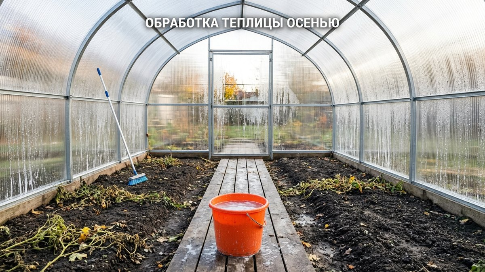
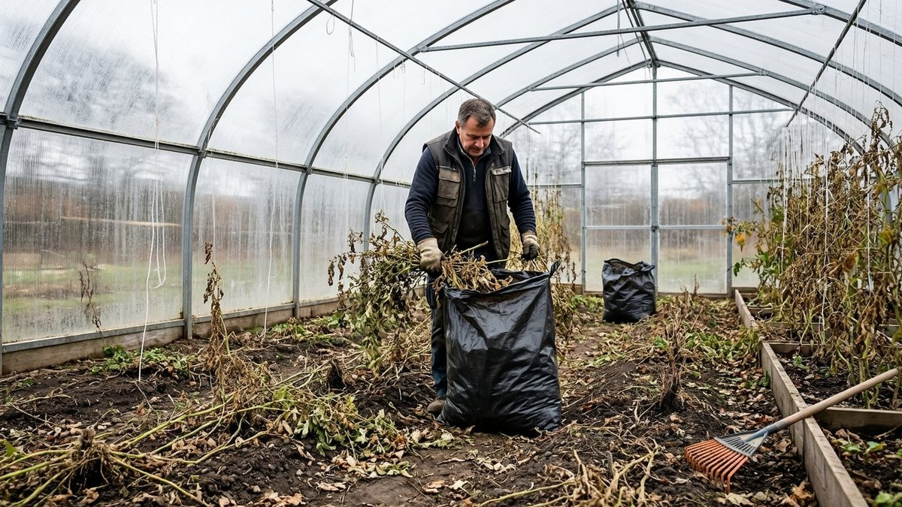
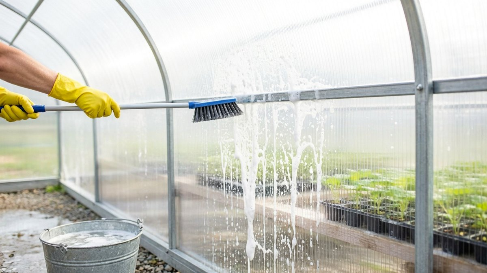
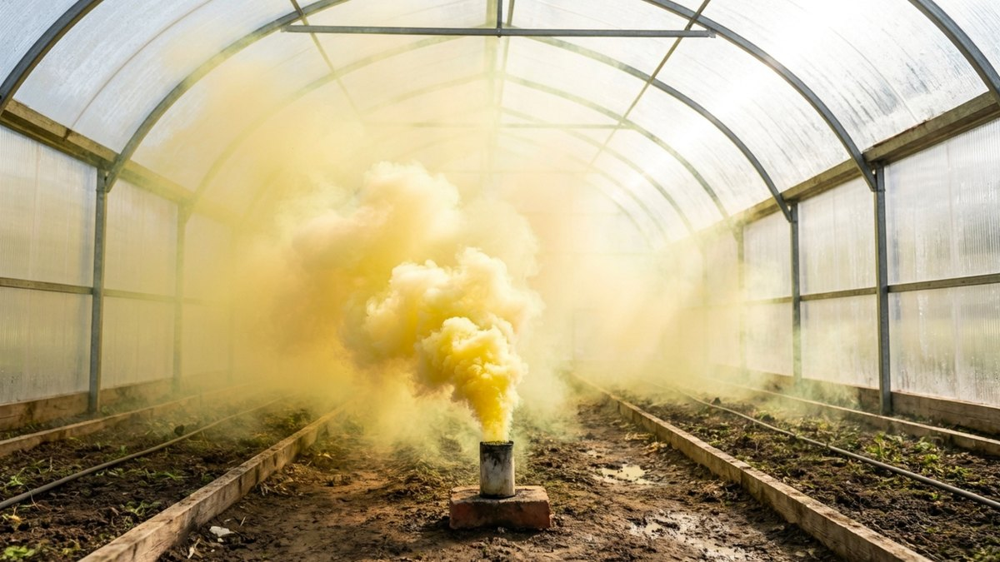
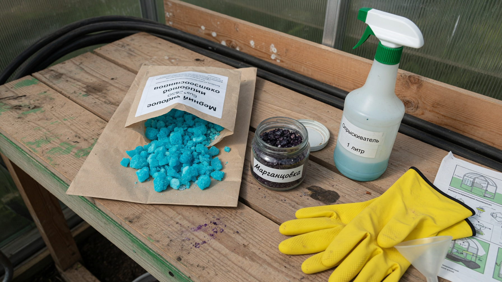
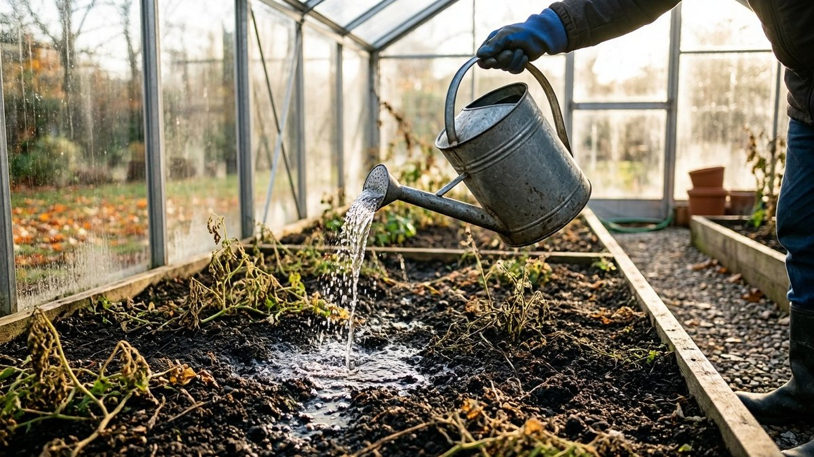
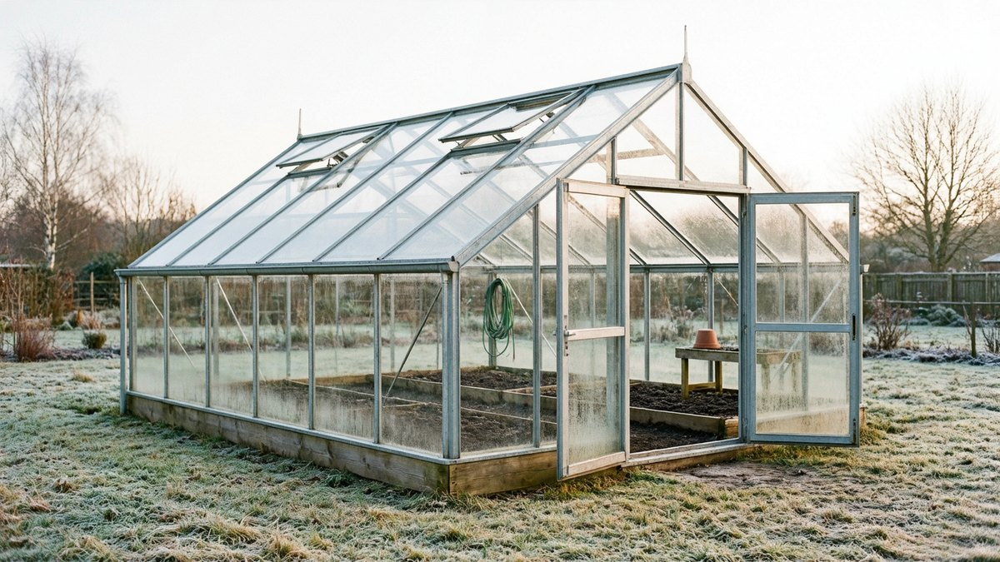

После сбора урожая теплица кажется пустой и безобидной, но на самом деле это рассадник инфекции: возбудители болезней и личинки вредителей спокойно зимуют в почве, на растительных остатках и в стыках конструкций. Если оставить всё как есть, весной проблемы вернутся к молодой рассаде. Осенняя обработка — самый надёжный способ разорвать этот круг и получить здоровый урожай на будущий год. Разберём по шагам, чем обработать теплицу осенью после сбора урожая и как правильно подготовить её к зиме.

## 🍂 Зачем обрабатывать теплицу осенью

Главная причина — зимовка возбудителей. В закрытом грунте из года в год накапливаются одни и те же болезни и вредители:

- споры грибков — [фитофтора](https://mir-doma.pro/fitoftora-na-pomidorah/), [мучнистая роса](https://mir-doma.pro/muchnistaya-rosa-na-ogurtsah/), кладоспориоз;
- вредители, зимующие в почве и щелях — [паутинный клещ](https://mir-doma.pro/pautinnyy-kleshch-na-ogurtsah/) и [белокрылка](https://mir-doma.pro/belokrylka-v-teplitse/).

В теплице им особенно комфортно: тепло, влажно, нет естественных врагов. Поэтому осенняя дезинфекция — не формальность, а профилактика, которая экономит вам весь следующий сезон.

## 🧹 Шаг 1. Убрать растительные остатки

С этого начинается любая обработка. Из теплицы выносят всё:

- ботву, корни, опавшие листья и плоды;
- подвязочный шпагат и колышки (или дезинфицируют, если используете повторно);
- сорняки и мусор из проходов.

Больные растения (особенно с фитофторой) **нельзя класть в компост** — их сжигают или выносят с участка. Возбудители в компосте выживают и вернутся с перегноем.

## 🧴 Шаг 2. Вымыть и продезинфицировать конструкции

Поликарбонат и каркас за сезон покрываются налётом, пылью и спорами. Их моют мягкой щёткой или тряпкой:

- мыльным или содовым раствором для общего мытья;
- с добавлением марганцовки, фитоспорина или хлоргексидина для дезинфекции.

Изнутри промывают и стены, и потолок, и стыки — именно в щелях прячутся вредители. Металлический каркас протирают аккуратно и осматривают на ржавчину, подкрашивают повреждённые места.

## 🔥 Шаг 3. Обеззаразить объём теплицы

Чтобы обработать воздух и труднодоступные места, теплицу окуривают или опрыскивают.

**Серная шашка** — эффективна против грибков и вредителей, дым проникает всюду. Но у неё есть важное ограничение: **сера вызывает коррозию металла**, поэтому для теплиц с оцинкованным или стальным каркасом её либо не применяют, либо тщательно окрашивают все металлические части заранее. Для деревянного каркаса серная шашка подходит. После окуривания теплицу держат закрытой сутки-двое, затем хорошо проветривают.

**Альтернативы для металлокаркаса:**

- опрыскивание раствором медного купороса (от грибковых болезней);
- биопрепараты (фитоспорин, триходерма) — безопасны для конструкций и почвы;
- обработка всех поверхностей дезинфицирующим раствором вручную.

## 🧪 Чем обработать теплицу: таблица средств и дозировок

Средств несколько, и у каждого своя задача. Дозировки — ориентировочные, всегда сверяйтесь с инструкцией на упаковке: концентрация у разных производителей отличается.

| Средство | Дозировка | Против чего | Для чего применяют | Ограничения |
|---|---|---|---|---|
| **Медный купорос** | 100 г на 10 л воды | Грибковые болезни: фитофтора, мучнистая роса, кладоспориоз | Пролив почвы, обработка конструкций | Не чаще 1 раза в год, накапливается в почве |
| **Бордоская жидкость** | 1% раствор | Грибковые болезни | Опрыскивание конструкций и грунта | Готовить непосредственно перед применением |
| **Марганцовка** | 5 г на 10 л (розовый раствор) | Лёгкая дезинфекция | Мытьё поверхностей, пролив почвы | Слабое действие, только как дополнение |
| **Серная шашка** | 50–80 г серы на 1 м³ теплицы | Грибки, вредители, зимующие стадии — всё разом | Окуривание закрытого объёма | **Вызывает коррозию металла**, каркас нужно защитить |
| **Хлорная известь** | 400 г на 10 л, настоять 4 часа | Жёсткая дезинфекция при вспышках | Обработка конструкций и щелей | Для почвы не применяют |
| **Фитоспорин** | по инструкции (обычно 5–10 г на 10 л) | Профилактика грибков, оздоровление почвы | Пролив грунта после химобработки | Живые бактерии: не смешивать с химией |
| **Триходерма** | по инструкции | Подавление патогенов в почве | Внесение в грунт | Работает при плюсовой температуре |

**Как это сочетать правильно:**

1. Сначала **механическая уборка** — остатки, верхний слой грунта.
2. Затем **мытьё и дезинфекция конструкций** (марганцовка, хлорный раствор или мыльный раствор).
3. Потом **обеззараживание объёма** — окуривание серной шашкой или опрыскивание.
4. И только **через 2–3 недели** — заселение биопрепаратами.

⚠️ **Химию и биопрепараты нельзя применять в один день:** медный купорос и сера убивают в том числе полезные бактерии фитоспорина, и биологическая обработка окажется бесполезной. Сначала обеззараживание, биология — позже.

⚠️ **Серная шашка и металлический каркас.** Сернистый газ в присутствии влаги вызывает коррозию оцинковки. Если каркас металлический, либо откажитесь от шашки в пользу опрыскивания, либо предварительно покройте металл защитным составом. Для деревянного каркаса шашка безопасна.

**Техника безопасности:** работайте в перчатках, респираторе и очках. После поджога серной шашки теплицу немедленно покидают, закрывают и не открывают 2–3 суток, затем тщательно проветривают несколько дней.

## 🌱 Шаг 4. Обработать и оздоровить почву

Почва — главный рассадник инфекции, поэтому ей уделяют больше всего внимания. Варианты в порядке усиления:

- **Пролив обеззараживающим раствором** — медный купорос, марганцовка или фунгицид проливают по поверхности грядок.
- **Биопрепараты** — фитоспорин или триходерма заселяют почву полезными микроорганизмами, подавляющими патогены. Мягкий и экологичный способ.
- **Замена верхнего слоя** — при сильном заражении снимают 5–10 см верхнего грунта, где скапливается основная масса спор и личинок, и заменяют свежим.
- **Сидераты** — после обработки грядки засевают горчицей, рожью или фацелией. Они оздоравливают почву, подавляют патогены и структурируют грунт к весне.

Менять всю землю целиком каждый год не нужно — достаточно чередовать пролив, биопрепараты и сидераты, а полную замену делать раз в несколько лет или при вспышке болезней.

## ❄️ Шаг 5. Подготовить теплицу к зиме

Последний этап — сама зимовка конструкции:

- **Проморозить.** Двери и форточки на зиму оставляют открытыми — мороз добивает вредителей и болезни, а снег внутри весной даёт запас влаги. (Если каркас слабый — см. следующий пункт.)
- **Снеговая нагрузка.** Тяжёлый мокрый снег ломает каркас и продавливает поликарбонат. Ставят подпорки под коньком или, наоборот, оставляют теплицу открытой, чтобы снег попадал внутрь и не давил на крышу. Слабые арочные теплицы иногда даже разбирают на зиму.
- **Крепёж.** Проверяют и подтягивают саморезы, ремонтируют повреждённый поликарбонат — щели зимой рвёт ветром.

О том, как устроена сама теплица и её каркас, подробно — в статье про [теплицу из поликарбоната своими руками](https://mir-doma.pro/teplitsa-iz-polikarbonata-svoimi-rukami/).

## 🎯 Чем обработать по конкретной проблеме

Если летом теплица болела, осенью бьют прицельно:

| Проблема летом | Чем обработать осенью |
|---|---|
| Фитофтора | Убрать всю ботву (сжечь), пролив медным купоросом, замена верхнего слоя почвы |
| Мучнистая роса | Дезинфекция конструкций, серная шашка (для дерева) или медный купорос, фитоспорин в почву |
| Паутинный клещ | Тщательное мытьё щелей, окуривание/акарицид, проморозка теплицы зимой |
| Белокрылка | Уборка остатков, дезинфекция, проморозка (личинки боятся мороза) |

## ❓ Частые вопросы

**Сколько медного купороса нужно на 10 литров воды?**
Стандартная концентрация для осенней обработки теплицы — 100 г на 10 л воды. Этим раствором проливают почву и обрабатывают конструкции. Применять медный купорос чаще одного раза в год не стоит: медь накапливается в грунте.

**Сколько нужно серы на теплицу?**
Ориентировочно 50–80 г серы на 1 м³ объёма теплицы — то есть на стандартную теплицу 3×6 м высотой 2 м (около 36 м³) уйдёт примерно 2–3 шашки среднего размера. Точный расход указан на упаковке.

**Когда обрабатывать теплицу осенью?**
Сразу после уборки последнего урожая, пока стоит плюсовая температура — обычно сентябрь-октябрь. Мытьё и опрыскивание делают по теплу, а проветривание и проморозку оставляют на зиму.

**Нужно ли жечь серную шашку каждый год?**
Не обязательно. Её применяют при заметных проблемах с болезнями или вредителями. В спокойные годы достаточно мытья, дезинфекции и обработки почвы биопрепаратами.

**Можно ли использовать серную шашку в теплице с металлическим каркасом?**
Нежелательно: сера вызывает коррозию металла. Для оцинкованного или стального каркаса либо заранее окрашивают все металлические части, либо выбирают альтернативу — медный купорос или биопрепараты.

**Чем обработать теплицу от паутинного клеща осенью?**
Тщательно вымыть все щели и стыки, окурить теплицу или обработать акарицидом, а зимой оставить открытой для промораживания — клещ не переносит мороза. Подробнее о самом вредителе — в статье про [паутинного клеща](https://mir-doma.pro/pautinnyy-kleshch-na-ogurtsah/).

**Надо ли менять землю в теплице каждый год?**
Полностью — нет. Достаточно чередовать пролив обеззараживающими растворами, биопрепараты и посев сидератов. Верхний слой (5–10 см) заменяют при сильном заражении, полную замену делают раз в несколько лет.

**Чем обработать теплицу от фитофторы?**
Убрать и сжечь всю ботву, пролить почву медным купоросом или фунгицидом, продезинфицировать конструкции и по возможности заменить верхний слой грунта, где зимуют споры.

---

Осенняя обработка теплицы занимает один-два дня, но именно она определяет, каким будет следующий урожай. Порядок неизменен: уборка → мытьё конструкций → обеззараживание объёма → почва → подготовка каркаса к зиме. И помните два правила, на которых чаще всего спотыкаются: серная шашка не дружит с металлическим каркасом, а биопрепараты нельзя применять сразу после химии.

**Куда идти дальше:**

- Теплица — только часть осенних работ. Что ещё нужно успеть до морозов в саду: обработка деревьев, побелка, защита от грызунов — в статье про [подготовку сада к зиме](https://mir-doma.pro/podgotovka-sada-k-zime/).
- Если этим летом в теплице бушевали болезни, разберитесь с конкретным возбудителем — от этого зависит, чем обрабатывать: [мучнистая роса](https://mir-doma.pro/muchnistaya-rosa-na-ogurtsah/), [фитофтора](https://mir-doma.pro/fitoftora-na-pomidorah/), [белокрылка](https://mir-doma.pro/belokrylka-v-teplitse/).
- Дача сезонная и вы закрываете её до весны? Вместе с теплицей нужно законсервировать дом: что слить, отключить и закрыть — в статье про [консервацию дачи на зиму](https://mir-doma.pro/konservaciya-dachi-na-zimu/).
