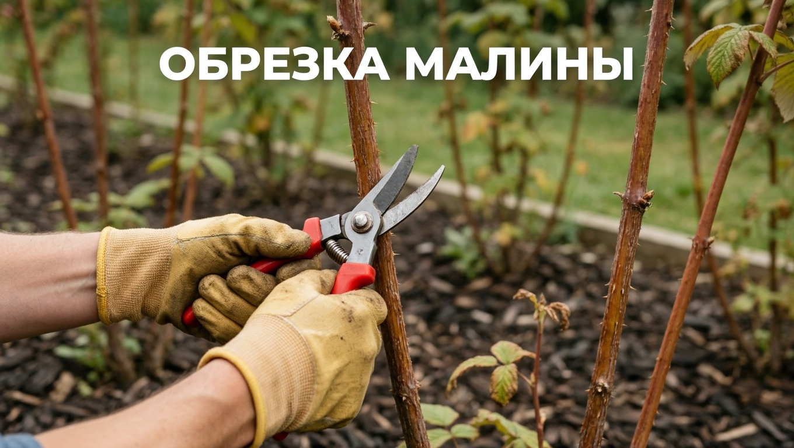
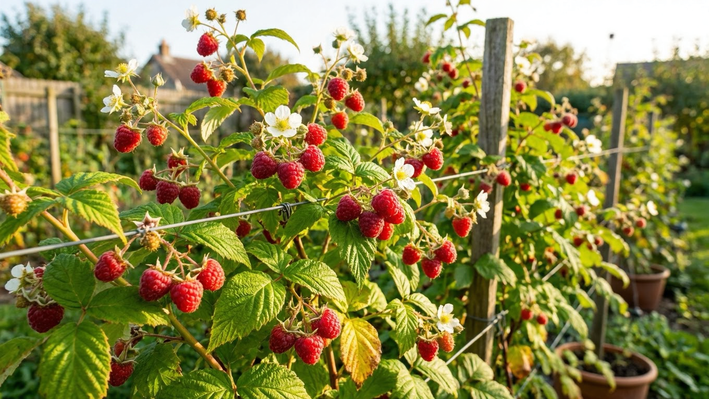
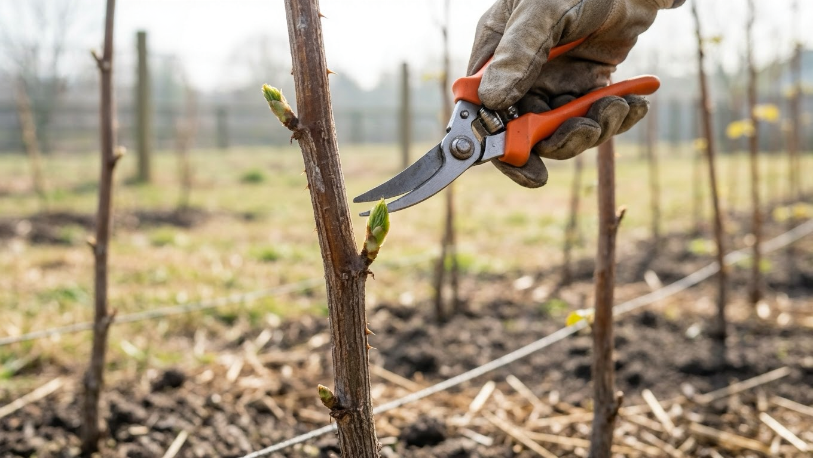
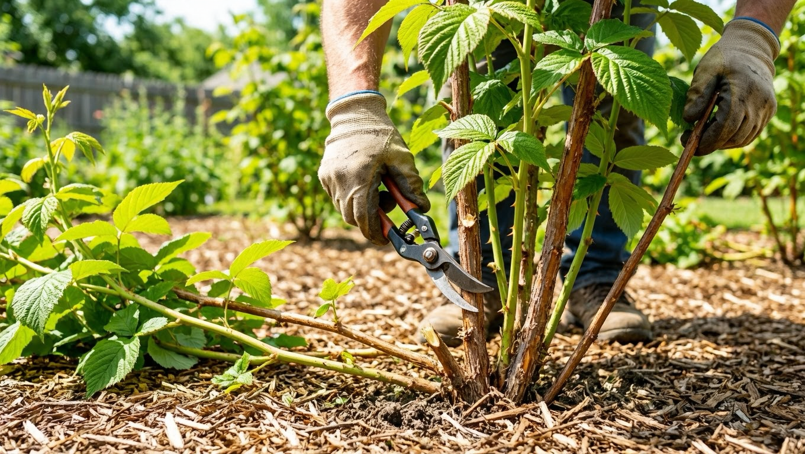
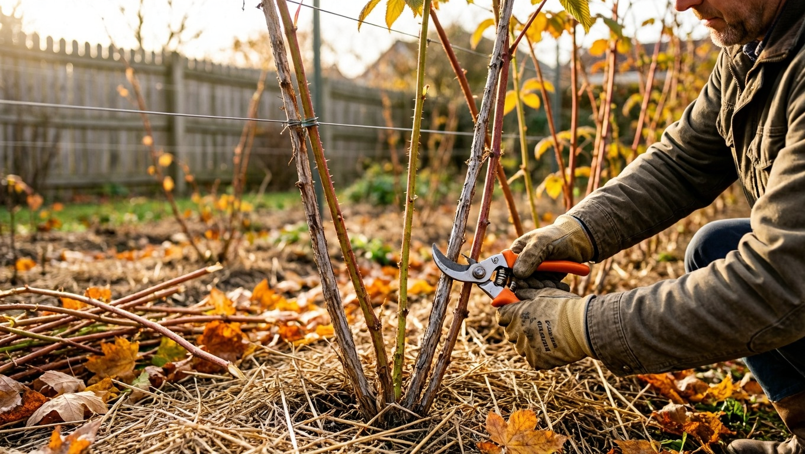
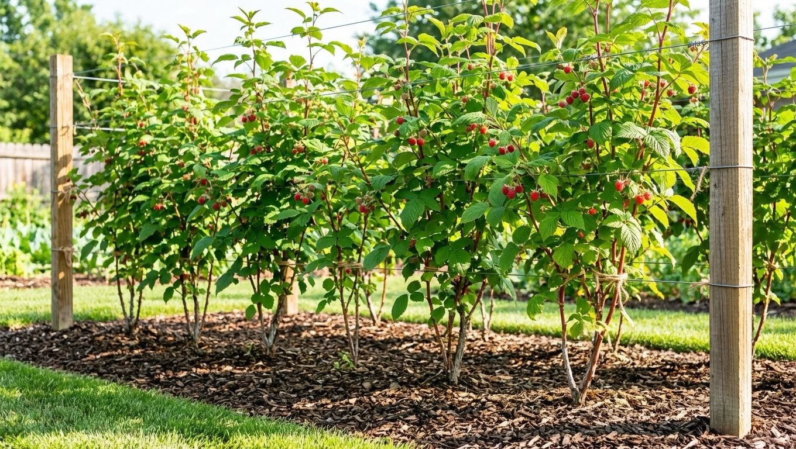

Без обрезки малинник за пару сезонов превращается в непролазные заросли: побеги загущаются, ягоды мельчают, а болезни и вредители чувствуют себя вольготно. Правильная обрезка, наоборот, повышает урожай, оздоравливает посадки и облегчает уход. Главное — понимать, какую малину вы выращиваете и что делать в каждый сезон. В этой статье разберём, когда и как правильно обрезать малину весной, летом и осенью, чем отличается обрезка обычной и ремонтантной малины и каких ошибок избегать.

## 🌿 Зачем обрезать малину

Обрезка решает сразу несколько задач:

- **Повышает урожай** — силы растения идут на плодоносные побеги, а ягоды становятся крупнее.
- **Прореживает посадки** — куст лучше проветривается и освещается.
- **Защищает от болезней** — в загущённых зарослях чаще развиваются грибки и вредители.
- **Омолаживает малинник** — на смену старым побегам приходят молодые.
- **Облегчает уход и сбор** — за ухоженной малиной удобнее ухаживать и собирать ягоды.
- **Снижает риск вымерзания** — вызревшие, не загущённые побеги лучше переносят зиму.

Без регулярной обрезки малина быстро дичает и снижает урожайность. Как и другим плодовым культурам — например, [яблоне](https://mir-doma.pro/opadayut-zavyazi-u-yabloni/), — малине нужен продуманный уход в течение всего сезона.

## 🍇 Обычная и ремонтантная малина: разница в обрезке

Прежде чем браться за секатор, важно понять тип малины — от него зависит вся схема обрезки.

- **Обычная (летняя) малина** плодоносит на побегах второго года. Первый год побег растёт, на второй даёт урожай и после этого отмирает — такие отплодоносившие побеги вырезают.
- **Ремонтантная малина** плодоносит на однолетних побегах, обычно осенью. Её часто обрезают полностью под корень на зиму, чтобы на следующий год получить урожай на новых побегах.

Спутать их — частая причина потери урожая, поэтому сначала определитесь с типом. Узнать его можно по времени плодоношения: если малина даёт ягоды в середине лета на прошлогодних побегах — она обычная, если во второй половине лета и осенью на побегах этого года — ремонтантная.

## 🌸 Весенняя обрезка

Весной, после схода снега, проводят санитарную обрезку:

- удалите сломанные, подмёрзшие, сухие и слабые побеги;
- укоротите подмёрзшие верхушки до первой живой почки;
- проредите посадки, оставив на каждый метр ряда 10–15 самых сильных побегов.

Весенняя обрезка задаёт основу урожая: чем меньше лишних побегов, тем крупнее ягоды на оставшихся. Проводят её до распускания почек, пока растение ещё не тронулось в активный рост.

## ☀️ Летняя обрезка

Летом у обычной малины сразу после сбора урожая **вырезают отплодоносившие двухлетние побеги** под самый корень, не оставляя пеньков. Они всё равно засохнут, а пока стоят — забирают питание и служат рассадником болезней.

Ещё один летний приём — **прищипка верхушек молодых побегов** при достижении ими высоты 60–90 см. Прищипка на 10–15 см стимулирует ветвление, и на побеге образуется больше плодовых веточек, что повышает урожай следующего года. Заодно летом удаляют лишнюю корневую поросль, которая загущает малинник и отнимает питание у основных кустов. Вырезать отплодоносившие побеги сразу после сбора урожая полезнее, чем откладывать на осень: молодые побеги получают больше света и лучше вызревают к зиме.

## 🍂 Осенняя обрезка

Осенью малинник готовят к зиме:

- у **обычной малины** вырезают все отплодоносившие, слабые и больные побеги, если это не сделали летом, и прореживают посадки;
- у **ремонтантной малины** после плодоношения скашивают всю надземную часть под корень — тогда весь урожай будущего года созреет на молодых побегах.

После обрезки побеги при необходимости подвязывают к шпалере или пригибают к земле, чтобы их укрыл снег, а почву мульчируют для защиты корней. Осенью же убирают все растительные остатки из-под кустов — в них зимуют вредители и споры болезней.

## 🌱 Нормирование и прореживание

Загущение — главный враг урожая. На каждый метр ряда или на куст оставляют ограниченное число самых сильных побегов (обычно 8–12), а остальные вырезают. Так каждому побегу хватает света и питания, ягоды становятся крупнее, а болезни распространяются меньше. Здоровому малиннику нужны питательные вещества — о питании растений читайте в статье о [летних подкормках](https://mir-doma.pro/letnie-podkormki-ovoshchey/).

## 🛠️ Правила обрезки

Чтобы обрезка пошла на пользу:

- работайте **острым чистым секатором** — о выборе инструмента мы рассказывали в статье об [инструментах для дачи](https://mir-doma.pro/instrumenty-dlya-dachi/);
- вырезайте побеги **у самой земли, без пеньков** — в пеньках зимуют вредители и инфекции;
- **убирайте и сжигайте** обрезанные побеги, особенно больные, чтобы не разносить болезни;
- обрезайте в сухую погоду, чтобы срезы быстрее подсыхали;
- не бойтесь удалять лишнее — загущённый малинник вредит урожаю сильнее, чем сильная обрезка.

## 🛡️ Частые ошибки

- **Не вырезают отплодоносившие побеги.** Малинник загущается, ягоды мельчают, растут болезни. Старые побеги удаляют.
- **Оставляют пеньки.** В них зимуют вредители. Срезайте у самой земли.
- **Путают обычную и ремонтантную малину.** Полная обрезка обычной малины осенью лишит урожая. Определяйте тип.
- **Загущают посадки.** Без прореживания урожай падает. Нормируйте число побегов.
- **Работают тупым и грязным инструментом.** Рваные раны хуже заживают и заносят инфекцию. Секатор должен быть острым и чистым.

## ❓ Частые вопросы

### Когда обрезать малину?

Обрезку проводят в три этапа: весной — санитарную (убирают повреждённые побеги и укорачивают верхушки), летом — вырезают отплодоносившие двухлетние побеги обычной малины и прищипывают молодые, осенью — удаляют старые и слабые побеги, а ремонтантную малину скашивают под корень.

### Как обрезать ремонтантную малину?

Ремонтантную малину, которая плодоносит на однолетних побегах, чаще всего осенью после плодоношения скашивают полностью под корень. Тогда весь урожай следующего года созреет на новых побегах. Такой способ проще и снижает число болезней и вредителей, зимующих в побегах.

### Нужно ли вырезать отплодоносившие побеги малины?

Да, обязательно. Двухлетние побеги обычной малины после сбора урожая отмирают, поэтому их вырезают под корень сразу после плодоношения или осенью. Оставленные старые побеги загущают куст, забирают питание и становятся рассадником болезней и вредителей.

### Зачем прищипывать верхушки малины?

Прищипка верхушек молодых побегов при высоте 60–90 см стимулирует ветвление: на побеге образуется больше боковых плодовых веточек, а значит, и больше ягод на следующий год. Это простой приём повышения урожая, известный как двойная обрезка.

### Как отличить обычную малину от ремонтантной?

Проще всего по времени плодоношения: обычная малина даёт урожай в середине лета на побегах прошлого года, а ремонтантная — во второй половине лета и осенью на побегах текущего года. От этого зависит схема обрезки, поэтому тип малины определяют в первую очередь.

### Нужно ли обрезать малину в первый год после посадки?

В первый год малину не обрезают радикально — молодым побегам дают окрепнуть. Убирают только повреждённые и слабые ветки, а у обычной малины при желании прищипывают верхушки для ветвления. Полноценная обрезка по сезонам начинается со второго года.

### Сколько побегов оставлять на кусте малины?

Обычно оставляют 8–12 самых сильных побегов на куст или 10–15 на метр ряда, а остальные вырезают. Прореживание обеспечивает каждому побегу достаточно света и питания, ягоды становятся крупнее, а малинник меньше болеет.

### Можно ли обрезать малину летом?

Да, летняя обрезка обычной малины даже необходима: сразу после сбора урожая вырезают отплодоносившие побеги, а у молодых прищипывают верхушки для ветвления. Также летом удаляют лишнюю поросль. Всё это повышает урожай и оздоравливает посадки.

## Заключение

Обрезка малины — несложный, но обязательный уход, от которого напрямую зависит урожай. Определите тип малины, весной проведите санитарную обрезку, летом вырежьте отплодоносившие побеги и прищипните молодые, а осенью подготовьте малинник к зиме, скосив ремонтантные сорта под корень. Не забывайте прореживать посадки, работать острым чистым инструментом и убирать обрезки. Тогда малинник будет здоровым, ухоженным и щедрым на крупные сладкие ягоды год за годом. Освоив простую сезонную схему один раз, вы будете тратить на обрезку совсем немного времени, а урожай заметно вырастет.

А как обрезаете малину вы? Делитесь опытом в комментариях и подписывайтесь, чтобы не пропустить новые статьи о саде и уходе за ягодными культурами.
