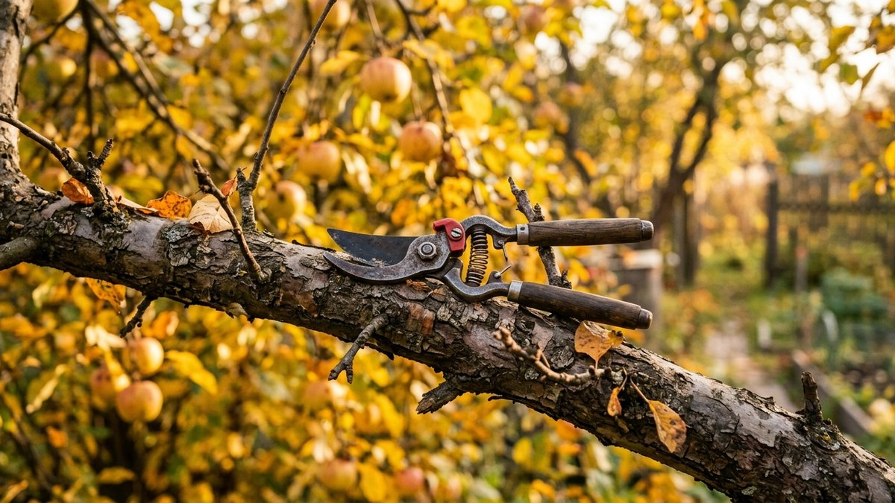
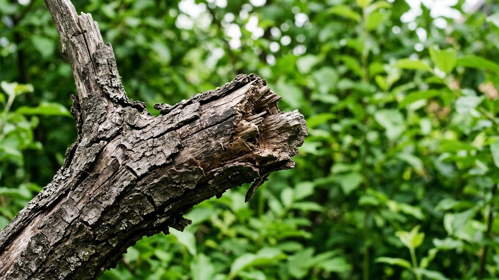
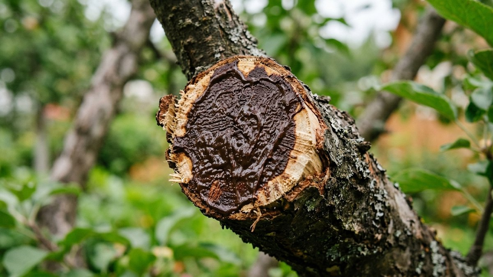
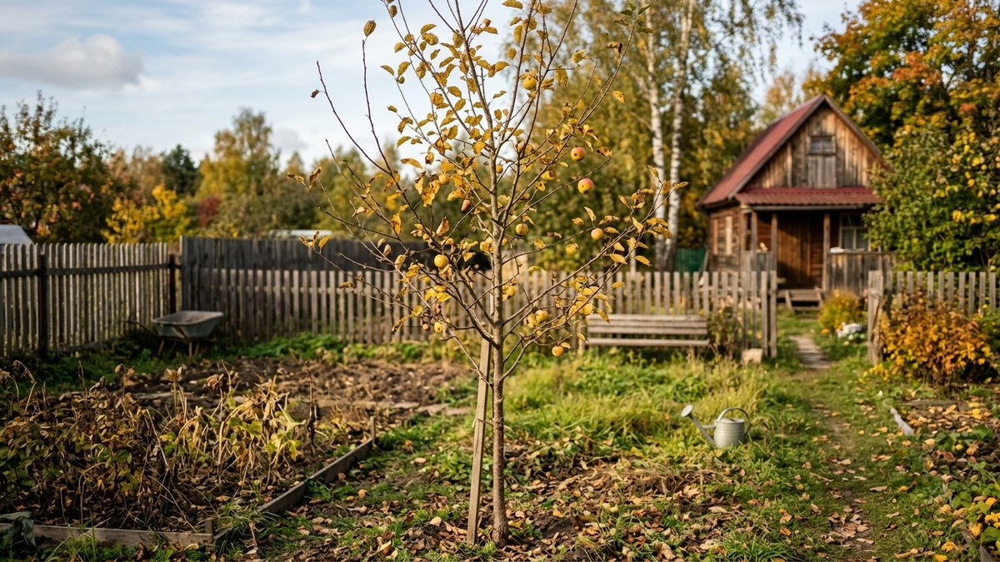
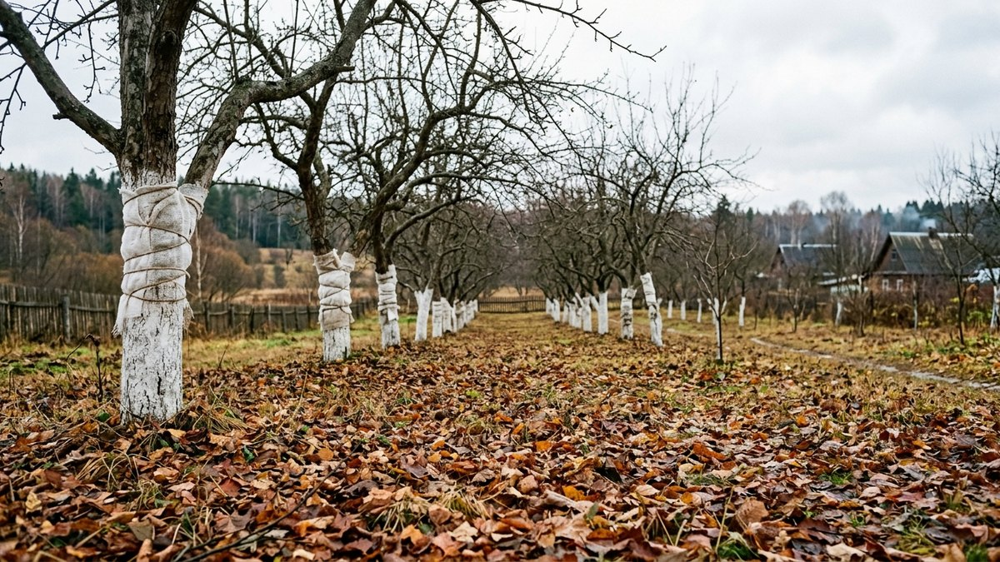
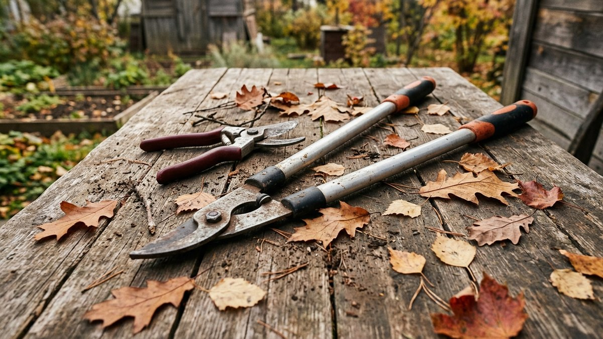

Вокруг осенней обрезки плодовых деревьев ходит путаница: одни советы предлагают формировать крону именно сейчас, другие — категорически ждать весны. Правда где-то посередине: осенью деревьям разрешена только санитарная обрезка, а формирующую и омолаживающую стоит отложить. Разберём, почему это так, что именно можно резать прямо сейчас и как не навредить дереву перед зимой.

## Почему осенью можно только санитарную обрезку

Любой срез — это рана, через которую дерево теряет влагу и рискует подхватить инфекцию, пока рана не затянулась естественным защитным слоем. Летом и весной на это уходит несколько недель активного сокодвижения. Осенью, ближе к зиме, сокодвижение замедляется, и рана затягивается намного медленнее — а если ударят морозы раньше, чем срез успеет заизолироваться, именно это место чаще всего подмерзает и становится точкой входа для гнили следующей весной.

Поэтому формирующую обрезку (изменение формы кроны, укорачивание молодых веток для ветвления) и омолаживающую (вырезка старых непродуктивных ветвей ради стимуляции роста) для яблонь, груш, слив и вишен переносят на раннюю весну, до начала сокодвижения. Осенью же убирают только то, что дереву и так больше не нужно, — это не откладывается без вреда.

Отдельный случай — колоновидная яблоня: у неё вообще нет привычной кроны для формирования, плоды растут прямо на стволе, и логика обрезки там своя — подробности в статье [«Посадка колоновидной яблони»](https://mir-doma.pro/posadka-kolonovidnoy-yabloni/).

## Что можно обрезать осенью

- **Сухие и погибшие ветви** — они всё равно не оживут, а до весны успеют стать рассадником вредителей и грибка.
- **Сломанные и повреждённые** — после ветра, града, механических повреждений; рваный край раны хуже заживает, чем ровный срез.
- **Явно больные ветви** — с признаками грибковых поражений, чёрными пятнами, трещинами коры, если поражение локальное и не требует полноценного лечения всего дерева.
- **Волчки** — вертикальные жировые побеги, которые забирают силы дерева впустую и не дают урожая; их можно убрать под самое основание.
- **Ветви, растущие внутрь кроны или перекрещивающиеся** — только если проблема очевидна и не требует серьёзного перепланирования кроны: убрать одну явно лишнюю ветку можно, перестраивать структуру — нет.

## Что нельзя делать осенью

- **Формирующую обрезку** — закладку скелетных ветвей, изменение формы кроны молодого дерева.
- **Омолаживающую обрезку** — крупные срезы старых веток ради стимуляции роста, особенно у деревьев старше 10–15 лет.
- **Сильное укорачивание однолетнего прироста** — молодые побеги ещё не одревеснели достаточно, чтобы безопасно пережить срез перед морозами.
- **Обрезку вплотную к заморозкам** — даже санитарную, если до устойчивых холодов остаётся меньше двух-трёх недель: рана просто не успеет затянуться.

## Когда именно обрезать

Оптимальное окно — после листопада, когда дерево полностью ушло в состояние покоя, но минимум за две-три недели до устойчивых заморозков. Для средней полосы это обычно конец сентября — октябрь, в зависимости от того, насколько тёплой была осень в конкретном году. Если листопад запоздал, а морозы уже близко, санитарную обрезку лучше перенести на раннюю весну целиком, а не спешить и резать по мёрзлой древесине — она крошится, а не режется, и раны получаются рваными.

## Инструмент и обработка срезов

Секатор и сучкорез должны быть остро заточены — рваный, а не ровный срез заживает намного дольше и охотнее пропускает инфекцию. Между деревьями, особенно если хотя бы одно из них показывало признаки болезни, лезвие протирают спиртовым раствором — иначе обрезка сама становится способом разнести грибок по всему саду.

Срезы диаметром до 1 см обычно заживают сами без обработки. Более крупные раны (от 1–1,5 см) стоит замазать садовым варом или закрасить садовой краской на основе олифы — это не даёт срезу пересыхать и трескаться и защищает от спор грибка, пока не нарастёт собственный защитный слой дерева.

## Молодые и старые деревья: разница в подходе

Молодые деревья (до 3–4 лет) осенью трогают по минимуму — только откровенно сухие или сломанные веточки, никакого «на всякий случай» формирования: любая лишняя рана на молодом деревце — риск для его развития следующей весной. Старые и запущенные деревья можно почистить более основательно в санитарном смысле — убрать больше сухих и повреждённых ветвей, — но крупную омолаживающую обрезку старой кроны всё равно переносят на весну, а лучше разбивают на два-три сезона, чтобы не подвергать дерево стрессу сразу со всех сторон.

Это касается именно деревьев. У ягодных кустарников логика обратная — малину и смородину как раз обрезают осенью после плодоношения, формирующая обрезка у них не ждёт весны: как и в каком объёме, разобрано в статьях [«Обрезка малины»](https://mir-doma.pro/obrezka-maliny/) и [«Обрезка смородины»](https://mir-doma.pro/obrezka-smorodiny/). Путать эти два подхода не стоит — то, что верно для куста, вредит дереву.

## Частые ошибки

- **Делать формирующую обрезку осенью вместо весны.** Свежие крупные раны перед морозами — главная причина подмерзания дерева зимой.
- **Тянуть до самых заморозков.** Рана должна успеть заизолироваться хотя бы частично — на это нужно две-три недели без сильных холодов.
- **Не обрабатывать крупные срезы.** Открытая рана диаметром больше сантиметра без вара — приглашение для спор грибка.
- **Резать тупым инструментом.** Рваный край заживает намного дольше ровного.
- **Переносить логику кустарников на деревья.** Малину и смородину обрезают осенью формирующе, яблони и груши — только санитарно.

Санитарная обрезка — лишь одна из осенних задач в саду; полный список работ перед зимовкой, включая полив, побелку и защиту от грызунов, — в статье [«Подготовка сада к зиме»](https://mir-doma.pro/podgotovka-sada-k-zime/). А если в планах осенью ещё и посадка новых деревьев, сроки и схема разобраны в статье [«Посадка деревьев осенью»](https://mir-doma.pro/posadka-plodovyh-derevev-osenyu/).

## Частые вопросы

### Можно ли вообще обрезать плодовые деревья осенью?

Можно, но только санитарную обрезку — удаление сухих, сломанных и больных ветвей. Формирующую и омолаживающую обрезку переносят на раннюю весну, до начала сокодвижения.

### Когда лучше обрезать яблоню — осенью или весной?

Санитарную чистку делают осенью, после листопада. Формирование кроны и любые крупные срезы — весной, пока дерево ещё не тронулось в рост. Это разные задачи, и обе имеют свой правильный сезон.

### Что будет, если обрезать дерево слишком поздно осенью?

Рана не успеет частично затянуться до морозов, и именно место среза чаще всего подмерзает зимой — это ослабляет дерево и открывает путь инфекции следующей весной.

### Нужно ли замазывать место среза после обрезки?

Мелкие срезы до 1 см заживают сами. Более крупные раны стоит закрыть садовым варом или садовой краской — это защищает от пересыхания, растрескивания и спор грибка, пока дерево не нарастит собственный защитный слой.

### Чем санитарная обрезка отличается от формирующей?

Санитарная убирает то, что дереву уже не нужно и не принесёт пользы, — сухие, больные и повреждённые ветви. Формирующая меняет саму структуру кроны и требует активного сокодвижения для быстрого заживления крупных ран, поэтому её оставляют на весну.
