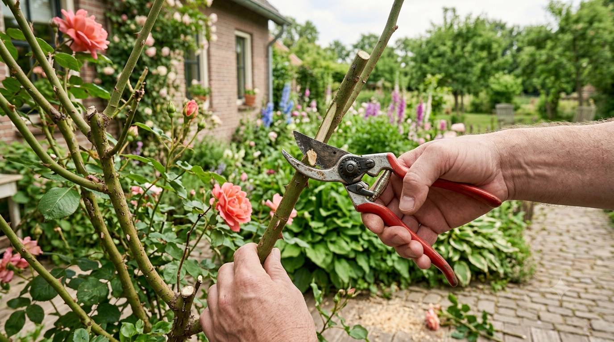
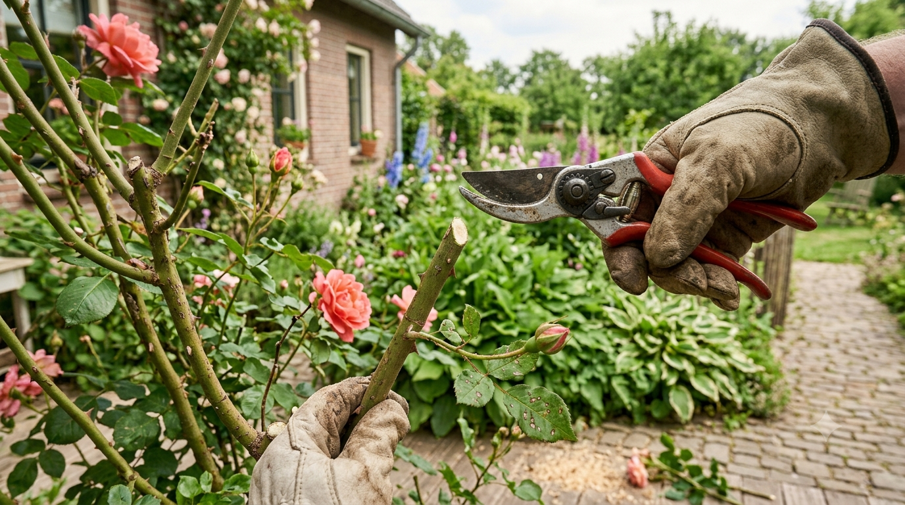
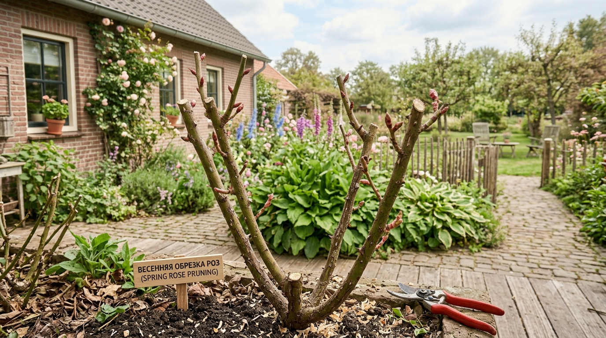
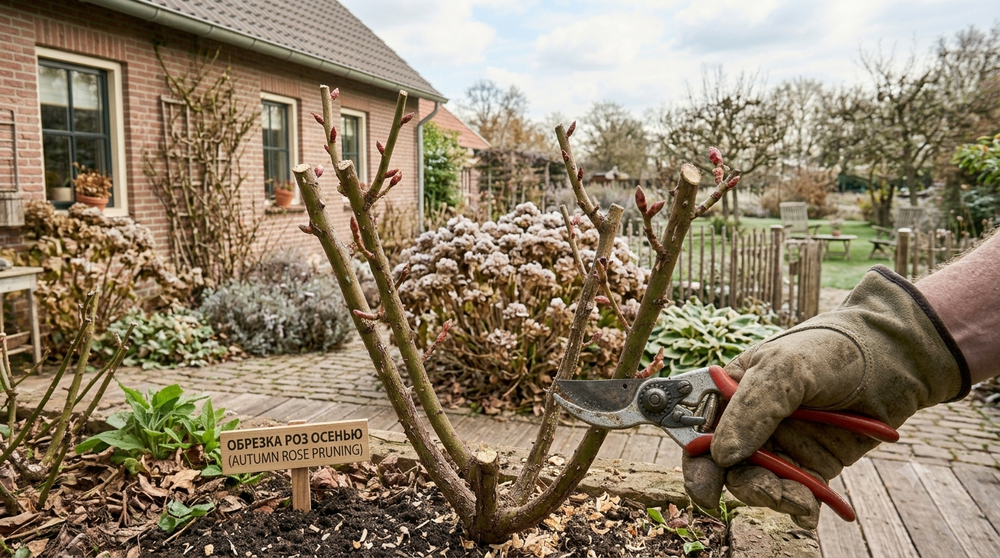
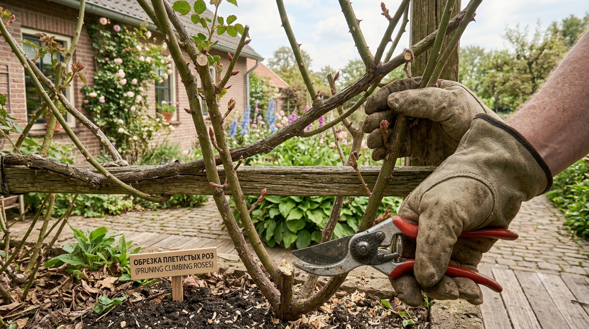

Обрезка — то, что превращает разросшийся колючий куст в аккуратную обильно цветущую розу. Без неё растение загущается, слабеет и цветёт всё скуднее, а неправильная обрезка способна лишить куст цветения на целый сезон. Разберём, когда и как обрезать розы весной, летом и осенью, чем отличаются схемы для разных групп и какие ошибки чаще всего оставляют садовода без цветов.

## ✂️ Зачем обрезать розы

Обрезка решает сразу несколько задач:

- **стимулирует цветение** — цветки закладываются на молодых побегах, и обрезка заставляет куст их наращивать;
- **формирует куст** — задаёт форму, не даёт разрастаться и заваливаться;
- **оздоравливает** — убирает сухие, больные и подмёрзшие ветви;
- **прореживает** — куст лучше проветривается, а значит меньше болеет;
- **омолаживает** — на смену старым ветвям приходят сильные новые.

Куст, который не обрезают годами, превращается в загущённые заросли с мелкими редкими цветками.

## 🧰 Чем обрезать

Инструмент решает многое:

- **секатор** — основной, обязательно **острый и чистый**: тупой мнёт побег, и срез загнивает;
- **сучкорез** — для толстых старых ветвей у основания;
- **садовая пила** — для очень толстых одревесневших стволов;
- **плотные перчатки** — розы колючие, тут без вариантов.

Инструмент **дезинфицируют** (спиртом или раствором марганцовки) перед работой и особенно после обрезки больного куста — иначе вы разнесёте инфекцию по всему саду. Что ещё пригодится на участке — в статье про [инструменты для дачи](https://mir-doma.pro/instrumenty-dlya-dachi/).

## 📐 Как правильно делать срез

Правила среза одинаковы для всех роз:

- срезают **над почкой, смотрящей наружу** куста — тогда новый побег пойдёт вбок, а не внутрь, и куст не загустится;
- срез делают **косым, под углом около 45°**, наклон — от почки, чтобы стекала вода;
- отступ от почки — **около 5 мм**: слишком близко повредит почку, слишком далеко оставит сохнущий пенёк;
- **здоровая древесина** на срезе белая; если сердцевина коричневая — режьте ниже, до здоровой ткани;
- толстые срезы можно замазать садовым варом.

## 🌱 Весенняя обрезка — главная

Это основная обрезка года. Проводят её **после снятия укрытия, когда почки набухли, но ещё не тронулись в рост** — обычно апрель, при устойчивом тепле.

Порядок работ:

1. Убрать все **сухие, чёрные, подмёрзшие** побеги — до здоровой белой древесины.
2. Вырезать **больные и слабые тонкие** веточки.
3. Удалить ветви, растущие **внутрь куста** и перекрещивающиеся.
4. Укоротить оставшиеся побеги — на сколько, зависит от группы (см. ниже).
5. Оставить **4–6 сильных побегов** — так куст будет крепким и обильно цветущим.

Степень укорачивания различают так: **сильная обрезка** (2–3 почки) — для омоложения и слабых кустов, **умеренная** (5–7 почек) — универсальная, **слабая** (лёгкое укорачивание) — для парковых и плетистых.

## ☀️ Летняя обрезка

Летом обрезка лёгкая, поддерживающая:

- **удаление отцветших цветков** — самое важное: куст перестаёт тратить силы на семена и закладывает новые бутоны. Срезают не сам цветок, а побег до первого полноценного листа с 5 листочками.
- **вырезание слепых побегов** — те, что растут без бутона, укорачивают, чтобы пробудить цветочные почки;
- **санитарная чистка** — сухие и больные ветви убирают в любое время;
- **дикая поросль** — побеги шиповника ниже прививки вырезают у самого корня, иначе они заглушат сорт.

Регулярное удаление отцветшего — простейший способ продлить цветение до осени. Подробнее о том, что ещё мешает розе цвести, — в статье [почему не цветут розы](https://mir-doma.pro/pochemu-ne-tsvetut-rozy/).

## 🍂 Осенняя обрезка

Осенью обрезка **лёгкая, только подготовительная** — перед укрытием:

- укоротить побеги до высоты будущего укрытия (у кустовых обычно 30–40 см);
- убрать невызревшие мягкие верхушки, больные и сломанные ветви;
- оборвать оставшиеся листья;
- **не делать сильную формирующую обрезку** — её оставляют на весну, иначе куст ослабнет перед зимой.

Проводят её непосредственно перед укрытием, после лёгких морозов. Как правильно укрыть кусты дальше — в статье про [укрытие роз на зиму](https://mir-doma.pro/ukrytie-roz-na-zimu/), а остальные осенние работы собраны в материале про [подготовку сада к зиме](https://mir-doma.pro/podgotovka-sada-k-zime/).

## 🌹 Обрезка по группам роз

Здесь кроются главные различия — и главные ошибки.

**Чайно-гибридные.** Цветут на побегах текущего года, поэтому обрезают сильно: весной укорачивают до 3–5 почек. Чем сильнее обрезка, тем крупнее цветы.

**Флорибунда.** Умеренная обрезка до 5–7 почек; часть побегов можно обрезать сильнее, часть слабее — тогда цветение растянется.

**Плетистые.** Самая частая ошибка садоводов. Многие плетистые цветут **на прошлогодних плетях**, поэтому их **нельзя укорачивать весной** — иначе цветения не будет. У таких роз весной только убирают сухое и подмёрзшее, а старые отплодоносившие плети вырезают у основания после цветения, оставляя молодые на замену. Повторноцветущие плетистые обрезают умереннее — укорачивают боковые побеги.

**Парковые и почвопокровные.** Обрезают слабо: санитарная чистка и лёгкое формирование. Раз в несколько лет проводят омолаживающую обрезку старых ветвей.

**Штамбовые.** Формируют крону шаром, укорачивая побеги умеренно, и обязательно удаляют поросль на штамбе и от корня.

Если не знаете группу своей розы — начните со щадящей санитарной обрезки: убрать сухое и больное можно любой розе без риска.

## ❌ Частые ошибки

- **Обрезали плетистую розу весной** — срезали прошлогодние плети, на которых были бы цветы. Самая обидная ошибка.
- **Сильная обрезка осенью** — куст ослаблен перед зимовкой.
- **Срез над почкой, смотрящей внутрь** — побег растёт внутрь, куст загущается.
- **Тупой или грязный секатор** — мятые срезы и перенос инфекции.
- **Оставили длинный пенёк** — он сохнет и становится очагом гнили.
- **Не вырезали дикую поросль** — шиповник глушит сортовую розу.
- **Обрезали слишком рано весной** — по набухшим почкам ударил возвратный мороз.

## ❓ Частые вопросы

**Когда обрезать розы весной?**
После снятия укрытия, когда почки набухли, но ещё не тронулись в рост — обычно в апреле при устойчивом тепле. Слишком ранняя обрезка опасна возвратными заморозками.

**Как правильно обрезать розу?**
Косым срезом под углом 45°, над почкой, смотрящей наружу куста, с отступом около 5 мм. Древесина на срезе должна быть белой — если сердцевина бурая, режут ниже.

**Нужно ли обрезать розы осенью?**
Только слегка: укоротить побеги до высоты укрытия, убрать невызревшие верхушки и больные ветви. Сильную формирующую обрезку переносят на весну.

**Как обрезать плетистую розу?**
Осторожно: многие плетистые цветут на прошлогодних плетях, и укорачивание весной лишает цветения. Убирают только сухое и подмёрзшее, а старые отцветшие плети вырезают у основания после цветения.

**Сколько побегов оставлять на кусте?**
Обычно 4–6 сильных здоровых побегов — этого достаточно для крепкого, хорошо проветриваемого и обильно цветущего куста.

**Что делать с отцветшими цветками?**
Удалять в течение всего лета, срезая побег до первого листа с пятью листочками. Это продлевает и усиливает цветение, потому что куст не тратит силы на семена.

**Почему после обрезки роза не цветёт?**
Чаще всего срезали побеги, на которых закладывались бутоны (типично для плетистых), либо обрезка была слишком поздней. Другие причины разобраны в статье о том, почему розы не цветут.

---

Обрезка роз строится на трёх простых правилах: главная обрезка — весенняя, летом убираем отцветшее, осенью только готовим куст к укрытию. Добавьте острый секатор, срез над внешней почкой и знание своей группы роз — и куст ответит здоровой формой и обильным цветением. Полный сезонный уход собран в статье [розы: посадка и уход](https://mir-doma.pro/rozy-posadka-i-uhod/). Кстати, схожие принципы работают и для ягодных кустарников — см. [обрезку смородины](https://mir-doma.pro/obrezka-smorodiny/) и [обрезку малины](https://mir-doma.pro/obrezka-maliny/).
