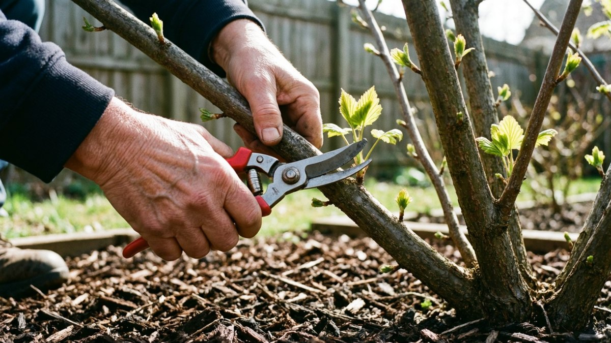
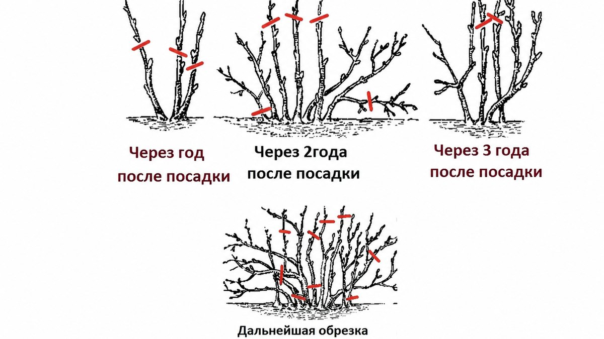
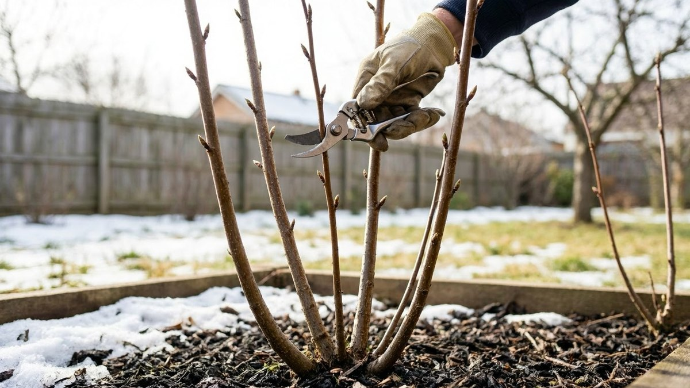
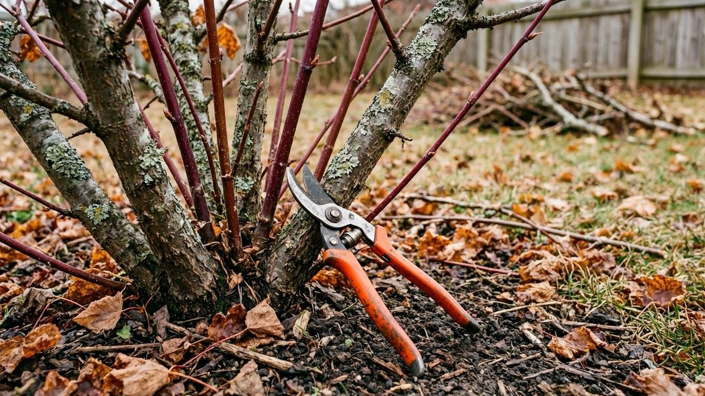
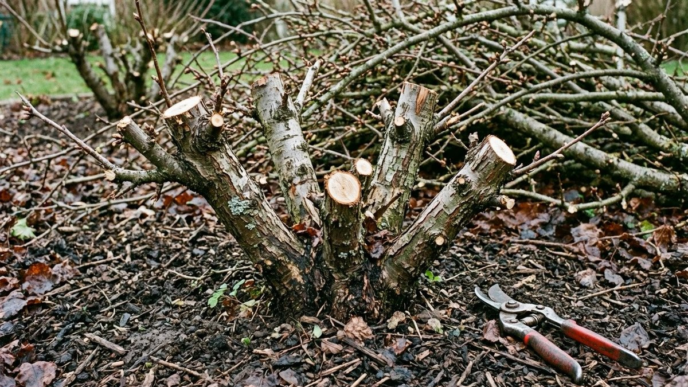
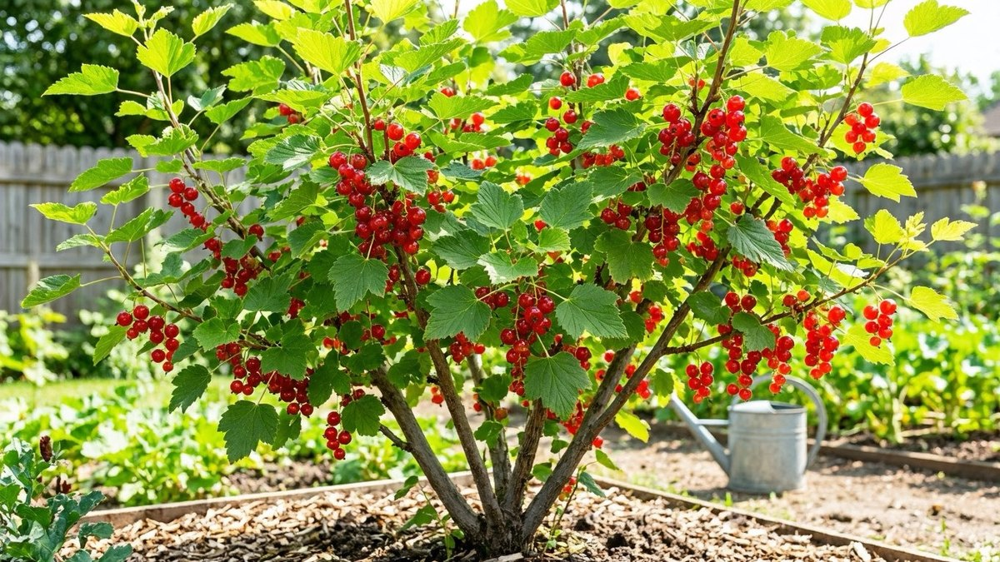

Смородина без обрезки быстро превращается в загущённый куст, где ягоды мельчают, а урожай сосредоточен лишь на макушках. Правильная обрезка омолаживает куст, открывает его свету и воздуху и год за годом поддерживает высокий урожай крупных ягод. Главное — понимать, как плодоносит смородина и чем отличается обрезка чёрной и красной. В этой статье разберём, как правильно обрезать смородину, когда это делать, как сформировать молодой куст и омолодить старый запущенный.

## 🌿 Зачем обрезать смородину

Ветви смородины со временем стареют и перестают давать хороший урожай, поэтому обрезка необходима:

- **Повышает урожай** — молодые продуктивные ветви дают больше крупных ягод.
- **Омолаживает куст** — на смену старым ветвям приходят новые.
- **Открывает куст свету и воздуху** — ягоды лучше вызревают, а болезни развиваются реже.
- **Облегчает уход и сбор** — за прореженным кустом удобнее ухаживать.

Без обрезки куст загущается, стареет, чаще болеет, а ягоды становятся мелкими и сосредотачиваются лишь на верхушках ветвей. Регулярная обрезка отнимает немного времени, но окупается заметной прибавкой урожая.

## 🍇 Как плодоносит смородина

Понимание того, где формируется урожай, — ключ к правильной обрезке.

- **Чёрная смородина** плодоносит в основном на молодых ветвях 1–3 лет, а лучший урожай дают 2–3-летние ветви. Ветви старше 4–5 лет малопродуктивны, и их вырезают.
- **Красная и белая смородина** плодоносят на более старых ветвях и остаются продуктивными до 6–7 лет, поэтому их обрезают реже и мягче.

Правильно сформированный куст состоит из 15–20 ветвей разного возраста — от однолетних до тех, что скоро пойдут под замену. Такой возрастной баланс и обеспечивает стабильный урожай: одни ветви только набирают силу, другие плодоносят в полную мощь, третьи готовятся уступить место молодым.

## 🌸 Когда обрезать смородину

Обрезку проводят в основном в два срока:

- **Осенью, после листопада** — основная обрезка, когда куст сбросил листья и хорошо видна его структура.
- **Ранней весной, до распускания почек** — санитарная обрезка: удаляют подмёрзшие и повреждённые за зиму ветви. Важно успеть до начала сокодвижения, иначе ранки будут дольше заживать.

Летом у чёрной смородины иногда прищипывают верхушки молодых побегов, чтобы они ветвились и закладывали больше плодовых почек. По принципу это похоже на летнюю работу с малиной — подробнее в статье об [обрезке малины](https://mir-doma.pro/obrezka-maliny/).

## 🫐 Обрезка смородины после сбора урожая

Летняя обрезка сразу после сбора ягод (у большинства сортов — вторая половина июля и август) не заменяет осеннюю, но сильно её облегчает. Сейчас старые ветви легко узнать: на них только что были ягоды, прирост на концах короткий, кора тёмная. Если вырезать их сразу, молодые нулевые побеги до осени получат свет и успеют одревеснеть.

Что делают после сбора урожая:

- **вырезают у земли отплодоносившие старые ветви** — у чёрной смородины старше 4–5 лет, у красной старше 6–7;
- **удаляют ветви с увядшими верхушками.** Если на срезе сердцевина чёрная или с ходом, внутри зимует гусеница смородинной стеклянницы: режьте ниже, до белой сердцевины, или целиком у земли;
- **прищипывают верхушки нулевых побегов у чёрной смородины**, но только до середины июля: тогда они успевают дать боковые ветви с плодовыми почками. Позже прищипка будит новые побеги, которые не вызреют и подмёрзнут;
- **не трогают красную и белую смородину сверху**: у них цветковые почки сидят на концах прироста и на коротких «кольчатках», укорачивание срезает урожай следующего года.

Сильную формирующую обрезку летом не делают: куст ещё активно растёт, и после неё пойдёт новая волна побегов. Всё, что не успели после сбора, доделывают осенью.

## 🍂 Осенняя обрезка смородины по шагам

Лучшее время — после листопада и до устойчивых морозов, в средней полосе это обычно октябрь — первая половина ноября. Ориентир по погоде: днём плюс, ночью не ниже −5 °C. Инструмент — острый секатор для ветвей до 1,5 см и сучкорез или садовая ножовка для старых ветвей у основания.

1. **Санитарная чистка.** Сломанные, лежащие на земле, засохшие ветви и ветви с чёрной сердцевиной — у земли или до здоровой древесины.
2. **Почки-«кочанчики».** Округлые вздутые почки размером с горошину на чёрной смородине — признак почкового клеща. Их выщипывают, а сильно поражённые ветви вырезают целиком.
3. **Определите возраст ветвей.** Однолетние нулевые побеги светлые, гладкие и не ветвятся. Двух-трёхлетние ветви с боковыми разветвлениями, кора светло-коричневая. Старые ветви тёмные, почти чёрные, часто с лишайником, прирост на концах 5–10 см и меньше. Каждый ярус боковых веток — примерно один год.
4. **Старые ветви — у земли, без пеньков.** Если куст запущен и старых ветвей больше половины, вырезайте не больше трети за осень и продолжайте на следующий год.
5. **Нулевые побеги.** Из новых прикорневых оставьте 3–5 самых сильных и правильно расположенных (не внутрь куста, не лёжа), остальные у земли.
6. **Загущение и «внутрь».** Ветви, растущие в центр куста и перекрещивающиеся, вырезают в пользу более сильной.
7. **Верхушки.** У чёрной смородины однолетние приросты можно укоротить до сильной наружной почки, если они тонкие или подмёрзшие. У красной и белой концы не трогают.

После обрезки под куст вносят калийно-фосфорную подкормку, а азот уже не дают. Чем подкормить ягодники осенью и в каких дозах, разобрано в статье про [осенние подкормки](https://mir-doma.pro/osennie-podkormki/); золу под смородину кладут 1–2 стакана на куст, подробнее — в статье про [золу как удобрение](https://mir-doma.pro/zola-kak-udobrenie/).

### Подборщик: сколько веток вырезать

Посчитайте ветви на кусте по трём группам из шага 3 и введите числа. Подборщик скажет, сколько вырезать в этот раз и каким куст будет после обрезки.

<!-- wp:html -->

  
Подборщик обрезки куста смородины

  <label class="md-calc__label" for="mdSmT">Какая смородина</label>
  <select id="mdSmT" class="md-calc__input">
    <option value="black">Чёрная</option>
    <option value="red">Красная или белая</option>
  </select>
  <label class="md-calc__label" for="mdSmZ">Нулевые побеги этого года (светлые, гладкие), шт.</label>
  <input type="number" id="mdSmZ" class="md-calc__input" min="0" step="1" value="7">
  <label class="md-calc__label" for="mdSmY">Молодые плодоносящие ветви (чёрная 2–4 года, красная 2–6 лет), шт.</label>
  <input type="number" id="mdSmY" class="md-calc__input" min="0" step="1" value="9">
  <label class="md-calc__label" for="mdSmO">Старые ветви (чёрная от 5 лет, красная от 7), шт.</label>
  <input type="number" id="mdSmO" class="md-calc__input" min="0" step="1" value="5">
  <label class="md-calc__label" for="mdSmD">Из них больные, сломанные, с чёрной сердцевиной, шт.</label>
  <input type="number" id="mdSmD" class="md-calc__input" min="0" step="1" value="1">
  
Заполните поля

<!-- /wp:html -->

## ❤️ Красная и белая смородина: чем обрезка отличается

| | Чёрная смородина | Красная и белая |
|---|---|---|
| Где урожай | На приросте прошлого года и ветвях 2–3 лет | На кольчатках и концах прироста ветвей 2–6 лет |
| Возраст ветвей под вырезку | Старше 4–5 лет | Старше 6–7 лет |
| Ветвей в кусте | 15–20 | 20–25 |
| Нулевых оставлять в год | 3–5 | 2–4 |
| Укорачивать однолетние приросты | Можно, до сильной почки | Нет, там цветковые почки |
| Прищипка летом | До середины июля | Не делают |
| Когда обрезать | Осенью после листопада или ранней весной | Лучше после сбора урожая или ранней весной |

Из-за этих различий одинаковая «стрижка» всех кустов и даёт типичную картину: чёрная смородина густая, но с мелкой ягодой, а красная после укорачивания верхушек почти без урожая.

## ✂️ Формирование молодого куста

Молодой куст формируют в течение нескольких лет:

1. **При посадке** саженец укорачивают, оставив на побегах по 2–4 почки, — это стимулирует рост прикорневых побегов.
2. **Каждый год** оставляют 3–4 самых сильных прикорневых (нулевых) побега, а слабые и лишние вырезают.
3. **За 4–5 лет** формируется полноценный куст из 15–20 ветвей всех возрастов — по нескольку веток каждого года.

Такой куст даёт стабильно высокий урожай, потому что в нём всегда есть и молодые, и вступающие в плодоношение ветви. Прикорневые побеги, отрастающие от основания куста, — это и есть будущий урожай, поэтому несколько самых сильных из них ежегодно оставляют.

## 🔪 Обрезка взрослого куста

У сформированного куста ежегодно проводят обрезку по простым правилам:

- **вырезают старые ветви** (у чёрной смородины — старше 4–5 лет, у красной — старше 6–7);
- **удаляют больные, сломанные и лежащие** на земле ветви;
- **прореживают загущающие** середину куста побеги, чтобы открыть его свету;
- **убирают слабый прирост**, оставляя 3–4 сильных новых нулевых побега на замену старым.

В итоге в кусте поддерживается постоянный баланс ветвей всех возрастов, а урожай не падает с годами. Старые ветви легко отличить по тёмной, растрескавшейся коре и слабому приросту на концах — именно они первыми идут под вырезку.

## 🌱 Омоложение старого куста

Запущенный старый куст можно вернуть к жизни:

- **постепенно** — за 2–3 года вырезают все старые ветви, давая вырасти молодым на замену;
- **радикально** — сильно запущенный куст срезают почти «на пень», и из корня вырастают новые побеги, из которых формируют куст заново.

После омоложения куст подкармливают, чтобы он быстрее восстановился и нарастил сильные молодые побеги. Радикальный способ на год лишает урожая, зато полностью обновляет куст, поэтому его применяют к совсем старым и запущенным растениям. О питании растений мы рассказывали в статье о [летних подкормках](https://mir-doma.pro/letnie-podkormki-ovoshchey/).

## 🛠️ Правила обрезки

Чтобы обрезка пошла кусту на пользу:

- работайте **острым чистым секатором**, а толстые ветви режьте сучкорезом или пилой — о выборе инструмента читайте в статье об [инструментах для дачи](https://mir-doma.pro/instrumenty-dlya-dachi/);
- **старые ветви вырезайте у самой земли, без пеньков** — в пеньках зимуют вредители;
- **молодые побеги укорачивайте над наружной почкой** наклонным срезом;
- **убирайте и сжигайте** обрезанные ветви, особенно больные.

## 🛡️ Частые ошибки

- **Не обрезают куст.** Он загущается, стареет, ягоды мельчают. Обрезка обязательна каждый год.
- **Оставляют пеньки.** В них поселяются вредители и болезни. Срезайте у земли.
- **Вырезают молодые вместо старых.** Урожай падает. Удаляют именно старые непродуктивные ветви.
- **Одинаково режут чёрную и красную.** Красная плодоносит на старых ветвях, её обрезают реже и мягче.
- **Загущают куст.** Без прореживания света не хватает. Оставляйте 15–20 ветвей.

## ❓ Частые вопросы

### Когда обрезать смородину?

Основную обрезку проводят осенью после листопада, когда хорошо видна структура куста, или ранней весной до распускания почек. Весной также делают санитарную обрезку, удаляя подмёрзшие ветви. Летом у чёрной смородины можно прищипывать верхушки молодых побегов для ветвления.

### Как обрезать старую смородину?

Старый запущенный куст омолаживают: постепенно за 2–3 года вырезают все старые ветви, давая вырасти молодым, либо радикально срезают куст почти под корень, и из него отрастают новые побеги. После омоложения куст обязательно подкармливают для быстрого восстановления.

### Чем отличается обрезка чёрной и красной смородины?

Чёрная смородина плодоносит на молодых ветвях 1–3 лет, поэтому ветви старше 4–5 лет вырезают. Красная и белая смородина плодоносят на более старых ветвях и продуктивны до 6–7 лет, поэтому их обрезают реже и щадяще, в основном удаляя совсем старые и загущающие ветви.

### Сколько веток оставлять на кусте смородины?

Правильно сформированный куст состоит из 15–20 ветвей разного возраста — от однолетних до готовых к замене. Ежегодно оставляют 3–4 сильных новых прикорневых побега, а такое же число старых вырезают, поддерживая постоянный баланс.

### Как обрезать смородину после сбора урожая

Сразу после сбора ягод вырезают у земли старые отплодоносившие ветви (у чёрной старше 4–5 лет, у красной старше 6–7) и ветви с увядшими верхушками и чёрной сердцевиной. Нулевые побеги чёрной смородины можно прищипнуть, но только до середины июля. Красную сверху не укорачивают.

### В каком месяце обрезать смородину осенью

После листопада и до устойчивых морозов: в средней полосе обычно октябрь — первая половина ноября. Обрезают в день, когда ночью не ниже −5 °C. Если не успели, перенесите на раннюю весну до распускания почек.

### Можно ли обрезать смородину летом?

Радикальную обрезку летом не проводят, но у чёрной смородины полезно прищипывать верхушки молодых побегов — это стимулирует ветвление и закладку плодовых почек. Также летом убирают явно больные и поломанные ветки. Основную же обрезку переносят на осень или раннюю весну.

### Что будет, если не обрезать смородину?

Без обрезки куст загущается, стареет и накапливает старые непродуктивные ветви. Урожай падает, ягоды мельчают и остаются в основном на верхушках, а в густом кусте активнее развиваются болезни и вредители. Поэтому обрезку проводят ежегодно.

### Нужно ли обрезать смородину после посадки?

Да, при посадке саженец укорачивают, оставляя на побегах по 2–4 почки. Такая обрезка стимулирует рост сильных прикорневых побегов, из которых и формируется будущий куст. Это первый шаг в формировании продуктивного куста смородины.

### Как омолодить смородину, чтобы был хороший урожай?

Вырезайте старые малопродуктивные ветви, освобождая место молодым, ежегодно оставляйте несколько сильных новых побегов, прореживайте куст и подкармливайте его. Сильно запущенный куст можно срезать почти на пень и вырастить заново. Молодые ветви дадут крупные ягоды и хороший урожай.

## Заключение

Обрезка смородины — залог крупных ягод и стабильного урожая из года в год. Помните главное: чёрная смородина плодоносит на молодых ветвях, поэтому старше 4–5 лет их вырезают, а красная продуктивна дольше и требует более мягкой обрезки. Формируйте молодой куст из ветвей всех возрастов, ежегодно удаляйте старые и загущающие побеги, а запущенный куст омолаживайте. Работайте острым инструментом, не оставляйте пеньков — и смородина отблагодарит вас щедрым урожаем сладких ягод. Освоить эту схему несложно, а куст будет радовать урожаем полтора-два десятка лет.

