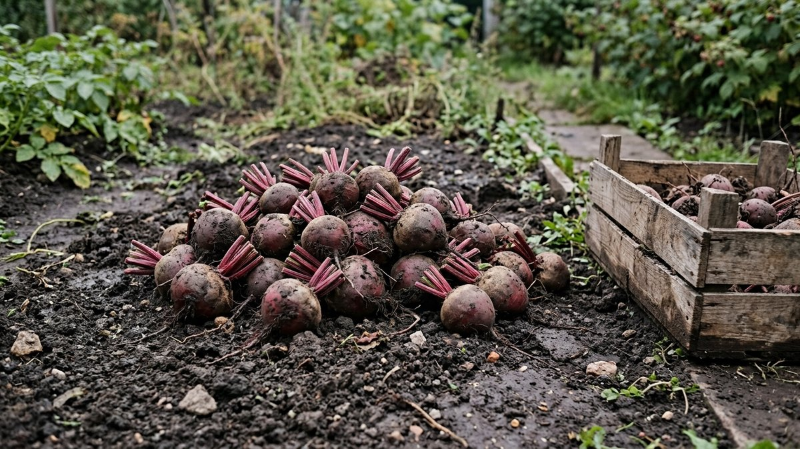
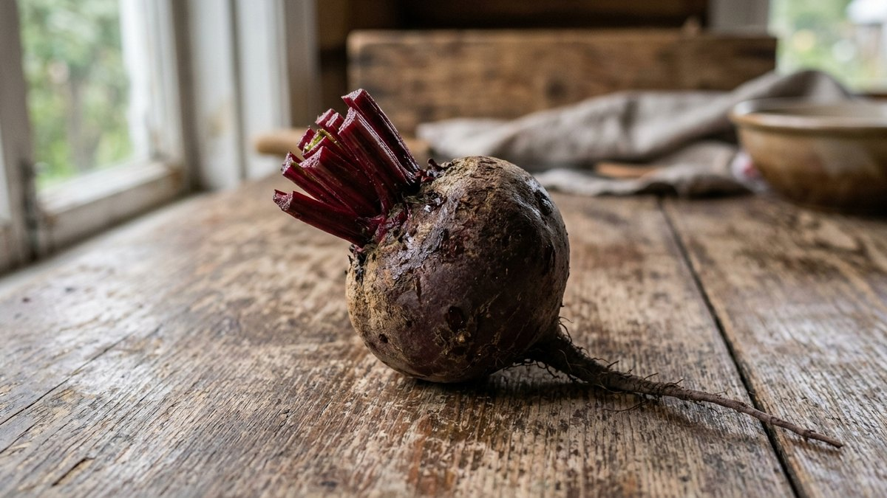
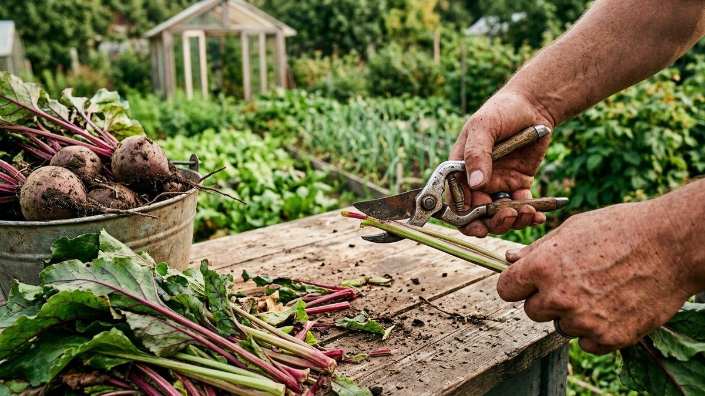
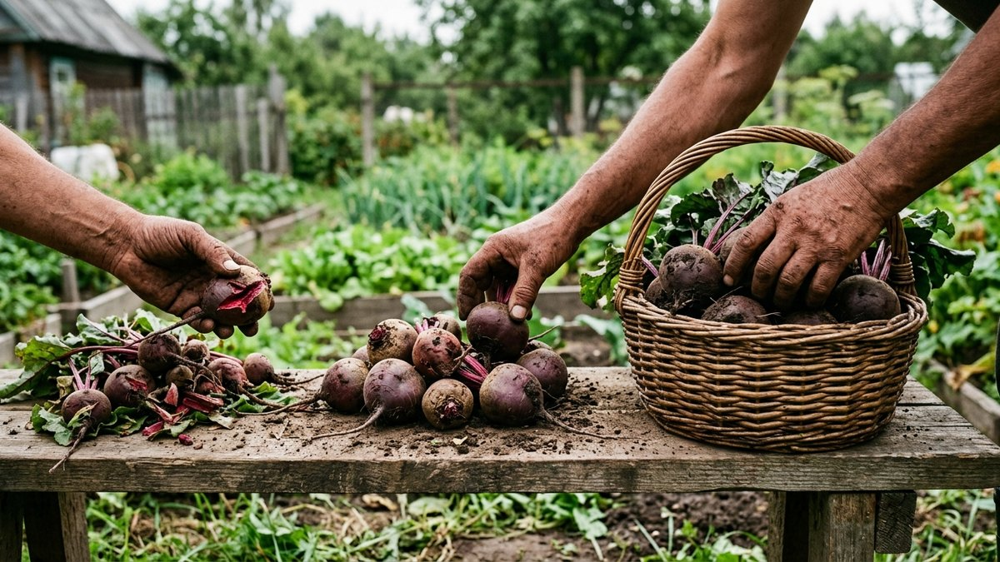
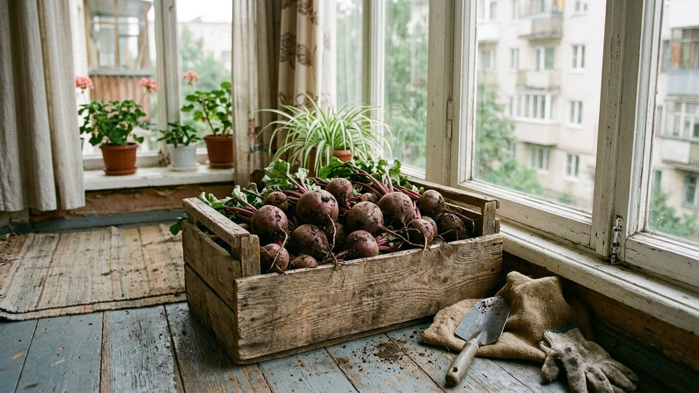
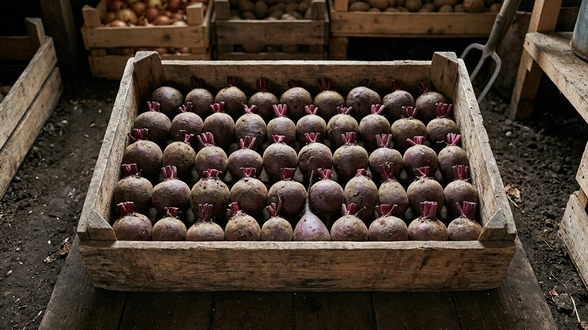

Свёкла считается самым нетребовательным к хранению корнеплодом — но только если её правильно подготовили сразу после выкопки. Ошибка происходит не в погребе, а на грядке: обрезали ботву под самый корешок — и через месяц половина урожая покрылась слизью. Разберём, на каком расстоянии от плода резать ботву и корешок, зачем вообще нужен этот запас и как подготовить свёклу к закладке, чтобы она долежала до весны.

## Почему нельзя обрезать под самый корень

У свёклы, в отличие от моркови, нет плотной защитной кожицы на верхушке — там, где растёт ботва, находится точка роста, через которую корнеплод дышит и испаряет влагу. Если срезать ботву заподлицо с плодом, срез повреждает эту зону, и через неё внутрь проникают бактерии гнили. То же самое происходит и с корешком снизу: обломанный или обрезанный слишком коротко, он оставляет открытую ранку, а через неё вытекает клеточный сок — питательная среда для плесени.

Именно поэтому свёклу обрезают с запасом в 1–2 см с обеих сторон, а не «под ноль», как иногда советуют для лука. Здесь работает другой принцип, и путать эти два подхода не стоит.

Обрезка имеет смысл только если корнеплод выкопан вовремя — слишком ранняя или слишком поздняя уборка портит лёжкость ещё до того, как дело доходит до ботвы. Как определить нужный момент для свёклы и моркови отдельно, разобрано в статье [«Когда выкапывать морковь и свёклу на хранение»](https://mir-doma.pro/kogda-vykapyvat-morkov-i-sveklu/).

## Сколько ботвы и корешка оставлять

- **Ботва** — оставляют черешки длиной **1–2 см**. Полностью удалять точку роста нельзя: именно она первой начинает подгнивать, если срез слишком глубокий.
- **Главный корешок (хвостик)** — не обрезают вообще, если он не слишком длинный. При длине больше 5–7 см его укорачивают до 5 см, стараясь не задевать сам плод.
- **Боковые корешки** — мелкие отростки можно аккуратно обломать руками, не срезая ножом у самого тела корнеплода.

Если случайно срезали слишком коротко и повредили точку роста — не страшно, но такой экземпляр в закладку на длительное хранение уже не годится: отправьте его в переработку в первую очередь, пока не подгнил.

## Инструмент: руки или нож

Для ботвы удобнее нож или секатор — так срез получается ровным, без вмятин, которые тоже становятся воротами для инфекции. Для корешков лучше работать руками: обломанный корешок заживает и подсыхает быстрее, чем срезанный ножом, потому что излом более рваный и меньше похож на открытую рану с гладкими краями, которая дольше сочится соком.

Нож между корнеплодами лучше периодически протирать или менять — если один плод уже был с скрытой гнилью, лезвие перенесёт инфекцию на следующие.

## Порядок подготовки к закладке

1. **Выкопать в сухую погоду.** Если земля влажная, грибок и бактерии переносятся легче.
2. **Отряхнуть землю руками**, не мыть. Мытая свёкла хранится хуже — смывается естественный защитный слой.
3. **Обрезать ботву**, оставив 1–2 см черешков.
4. **Осмотреть корешок**, при необходимости укоротить до 5 см, боковые отростки обломать.
5. **Просушить 2–3 часа в тени** на воздухе — не на солнце, чтобы не подвялить. Срезы должны заветриться и слегка затянуться.
6. **Перебрать**, отложив повреждённые лопатой, треснувшие и с признаками гнили экземпляры — для них годится только ближайшая переработка.
7. **Заложить на хранение** — общие условия (температура, тара, соседство с другими овощами) разобраны в статье про [хранение овощей зимой в погребе и дома](https://mir-doma.pro/kak-hranit-ovoshchi-zimoy/).

## Что делать, если погреба нет

Если хранить свёклу приходится не в погребе, а в квартире — балконе, кладовке, холодильнике, — подготовка та же, но добавляются свои нюансы по таре и температуре. Они разобраны отдельно в статье про [хранение овощей на балконе](https://mir-doma.pro/hranenie-ovoshchey-na-balkone/).

## Частые ошибки

- **Обрезали ботву «под ноль».** Кажется аккуратнее, но именно так повреждается точка роста — первый очаг гниения.
- **Оторвали корешок с мясом.** Резкий рывок при выдёргивании отрывает кончик корня вместе с частью плода — такую свёклу нужно съесть в первую очередь, для длительного хранения она не годится.
- **Помыли перед закладкой.** Вода смывает защитный восковой налёт и провоцирует раннее гниение.
- **Заложили без переборки.** Один подгнивший экземпляр в ящике за пару недель заражает соседние — сколько именно свёкла может пролежать при разных условиях, смотрите в статье про [сроки хранения заготовок и урожая](https://mir-doma.pro/skolko-hranyatsya-zagotovki/).
- **Срезали ботву сразу под корень острым секатором заподлицо с плодом** — тот же эффект, что и обрезка «под ноль», просто другим инструментом.

## Частые вопросы

### Можно ли вообще не обрезать ботву, а просто выкрутить её руками?

Можно, если ботва сухая и легко отделяется у основания без рывка — так даже безопаснее для точки роста, чем срез ножом. Но если черешки сочные и отрываются с мясом плода — лучше подрезать ножом, оставив запас 1–2 см.

### Что делать, если корешок обломился прямо у плода?

Такую свёклу используйте в ближайшие недели, на длительное хранение не закладывайте — риск загнивания у неё намного выше, чем у экземпляров с ровным запасом корешка.

### Нужно ли обрабатывать срезы золой или другими средствами?

Нет, для свёклы это не требуется: в отличие от лука и чеснока, свежий срез свёклы подсыхает сам за пару часов на воздухе, если корнеплод не мыли и не оставили под дождём.

### Через сколько дней после обрезки свёклу можно закладывать в погреб?

Через 2–3 часа просушки на воздухе в тени — этого достаточно, чтобы срезы заветрились. Долго держать выкопанную свёклу на улице не стоит: при заморозках она теряет лёжкость.

### Отличается ли обрезка кормовой и столовой свёклы?

Принцип тот же — запас 1–2 см у ботвы и не короче 5 см у корешка, независимо от сорта. Разница в лёжкости определяется не обрезкой, а сортовыми особенностями и условиями хранения.

## Заключение

Разница между свёклой, которая долежит до весны, и той, что сгниёт к январю, — это те самые 1–2 см черешков и аккуратный, а не рваный или слишком короткий срез. Дальше подготовленный урожай отправляется в погреб или другое место хранения по общим правилам для корнеплодов.
