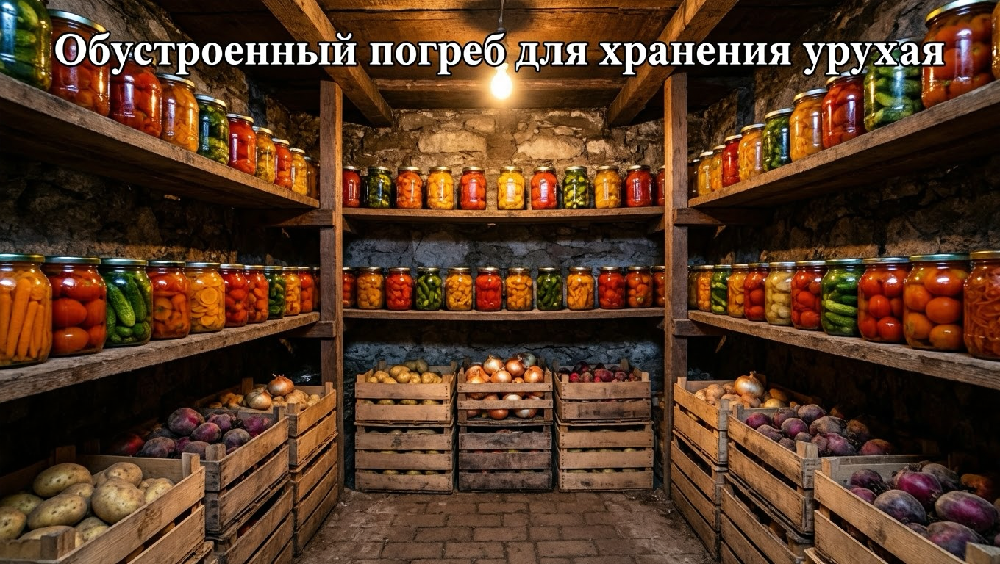
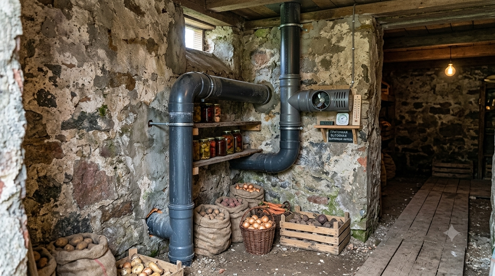
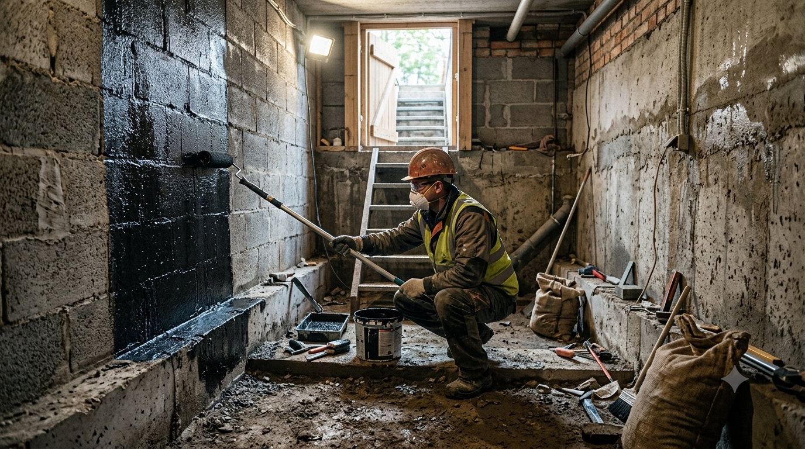
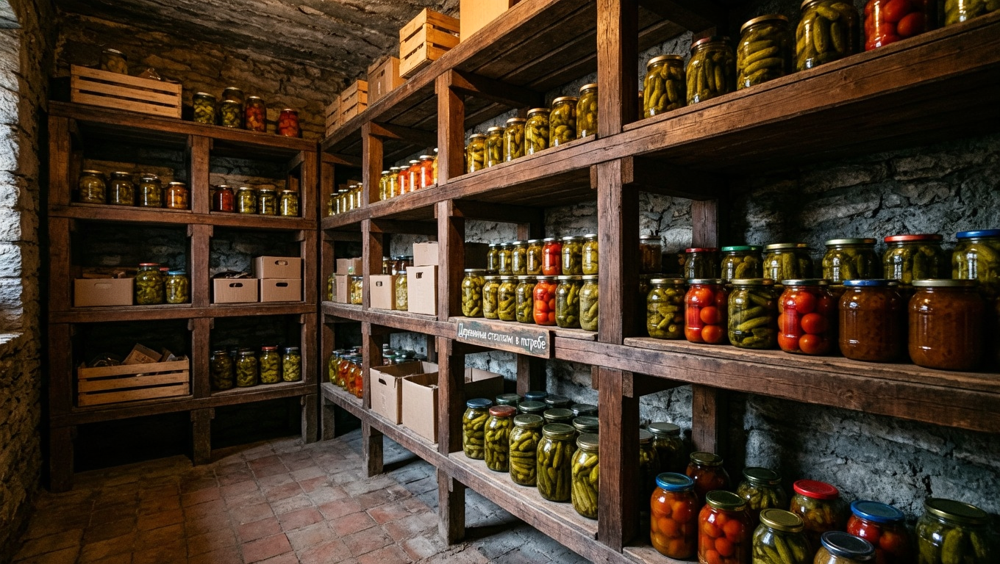
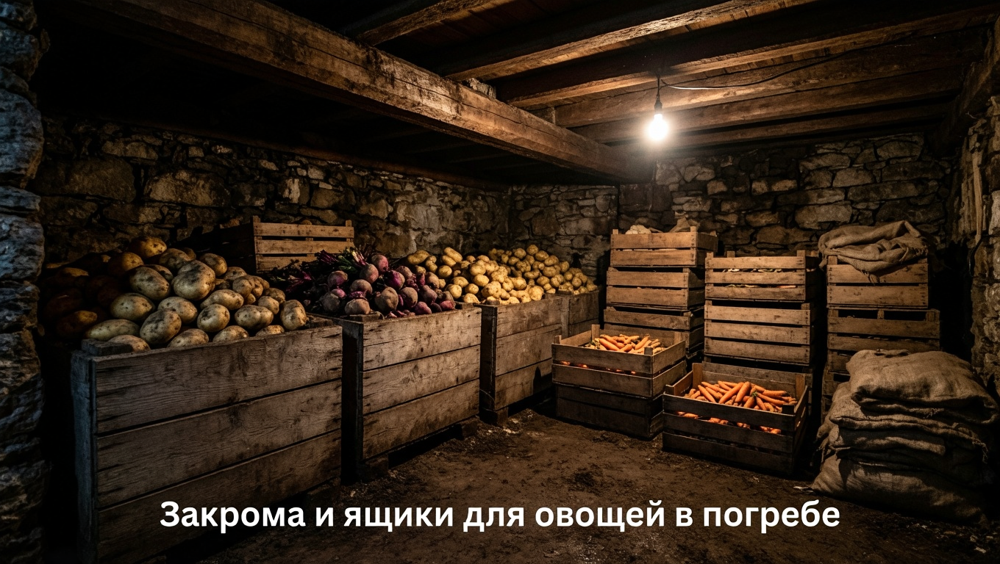
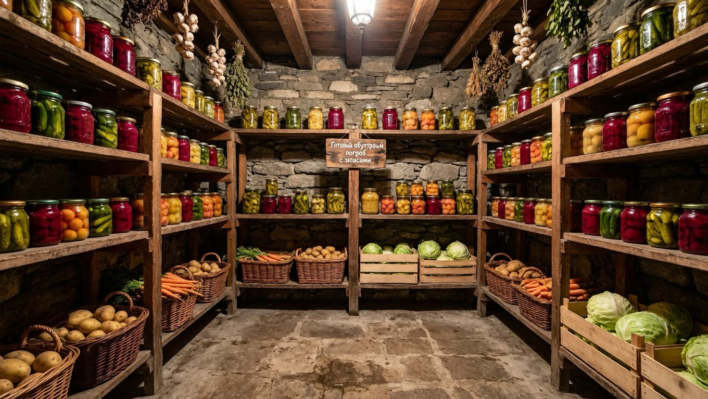

Погреб — сердце дачных заготовок: именно от него зависит, долежат ли до весны картофель, овощи и банки с соленьями. Но чтобы урожай хранился без потерь, погреб нужно правильно обустроить: наладить вентиляцию, справиться с сыростью, поставить удобные стеллажи и закрома. Сырой погреб с плесенью погубит любые запасы, а сухой и проветриваемый сохранит их месяцами. В этой статье разберём обустройство погреба своими руками: как сделать вентиляцию, побороть влажность, гидроизолировать стены и организовать хранение.

## 🏠 Каким должен быть хороший погреб

Прежде чем обустраивать погреб, важно понять, какие условия в нём нужно создать:

- **Прохлада** — стабильная температура около +2…+5 °C круглый год.
- **Влажность** — умеренно высокая (около 85–90%), чтобы овощи не вяли, но и не гнили.
- **Темнота** — свет провоцирует прорастание и позеленение овощей.
- **Хорошая вентиляция** — свежий воздух не даёт скапливаться сырости и плесени.
- **Отсутствие плесени и грызунов** — чистота и защита запасов.

Всё обустройство погреба сводится к тому, чтобы создать и поддерживать эти условия.

## 💨 Вентиляция погреба

Вентиляция — самое важное в погребе: без неё скапливаются сырость, конденсат и плесень. Лучший вариант — **приточно-вытяжная система из двух труб**:

- **Приточная труба** — по ней свежий воздух заходит в погреб. Её опускают почти до пола (на высоте 20–30 см), располагая в одном углу.
- **Вытяжная труба** — по ней тёплый влажный воздух уходит наружу. Её размещают под потолком в противоположном углу и выводят выше уровня земли (и выше приточной).

За счёт разницы высоты и температуры воздух циркулирует естественным образом. Трубы (диаметром 100–150 мм) снабжают заслонками, чтобы регулировать поток и прикрывать в сильные морозы. Если естественной тяги не хватает, в вытяжную трубу ставят небольшой вентилятор. Работу вентиляции легко проверить: поднесите к вытяжной трубе полоску бумаги или огонёк спички — если её отклоняет или тянет, воздух движется. Летом тяга слабее, поэтому в жару погреб дополнительно проветривают, открывая люк прохладными ночами. Как рассчитать диаметр труб по площади погреба, на какой высоте ставить их концы и что делать, если вытяжка не тянет, — подробно в отдельной статье про [вентиляцию в погребе](https://mir-doma.pro/ventilyaciya-v-pogrebe/).

## 💧 Влажность и гидроизоляция

Сырость — главный враг погреба. Бороться с ней помогают:

- **Гидроизоляция стен и пола** — обмазочная или рулонная, чтобы влага из грунта не проникала внутрь.
- **Дренаж вокруг погреба** — отводит грунтовые и дождевые воды.
- **Проветривание** — рабочая вентиляция убирает лишнюю влагу.
- **Осушители** — ёмкости с негашёной известью, солью или специальные средства впитывают сырость.

Если же в погребе, наоборот, слишком сухо (овощи вянут), ставят ёмкость с водой или влажным песком. Оптимальную влажность контролируют простым гигрометром. Признак избыточной сырости — капли конденсата на потолке и стенах, затхлый запах и плесень; если они появились, в первую очередь проверяют и усиливают вентиляцию.

## 🌡️ Температура

Заглублённый погреб сам по себе держит прохладу, но её нужно стабилизировать:

- **Утеплите люк, крышку и вход** — через них зимой заходит холод, а летом тепло.
- **Зимой** прикрывайте вентиляционные заслонки в сильные морозы, чтобы погреб не промерзал.
- **Летом** проветривайте прохладными ночами, чтобы не было жарко и душно.

Стабильная температура без резких колебаний — залог того, что запасы не замёрзнут и не запреют. Если погреб зимой всё же промерзает, вход и люк дополнительно утепляют, а овощи прикрывают старыми одеялами или мешковиной.

## 🗄️ Стеллажи и полки

Удобные стеллажи позволяют разместить банки и овощи с максимальной пользой:

- **Материал.** Стеллажи делают из дерева (обязательно обработав антисептиком от гнили и плесени) или из металла (крашеного либо оцинкованного, чтобы не ржавел во влаге).
- **Расположение.** Полки ставят с небольшим зазором от стен — так за ними циркулирует воздух и не скапливается сырость.
- **Прочность.** Полки под банки с заготовками делают крепкими: наполненные банки весят немало.
- **Ярусы.** Стеллажи делают в несколько ярусов до потолка — так небольшой погреб вмещает гораздо больше запасов.

На стеллажах удобно хранить банки с [маринованными огурцами](https://mir-doma.pro/marinovannye-ogurtsy-na-zimu/), помидорами и другими заготовками.

## 📦 Закрома, ящики и тара

Для овощей нужна отдельная тара:

- **Закрома или ящики с щелями** — для картофеля; их приподнимают над полом на 10–15 см для вентиляции.
- **Ящики с песком** — для моркови и свёклы, чтобы корнеплоды не вяли.
- **Сетки и косы** — для лука и чеснока в сухом углу.
- **Полки под банки** — отдельно от овощей, чтобы заготовки не отсыревали.

Овощи не хранят прямо на полу — снизу всегда делают поддон или решётку для циркуляции воздуха. Подробнее о том, как правильно хранить разные овощи, читайте в статье [как хранить овощи зимой](https://mir-doma.pro/kak-hranit-ovoshchi-zimoy/).

## 🧹 Защита от плесени и грызунов

Чтобы погреб оставался чистым и безопасным для запасов:

- **Дезинфицируйте погреб** перед закладкой урожая — белят стены известью (можно с добавлением медного купороса), при необходимости окуривают серной шашкой (строго по инструкции и без людей рядом).
- **Заделывайте щели и норы**, ставьте сетки на вентиляционные трубы — это защита от грызунов.
- **Просушивайте и проветривайте** погреб летом, пока он пустой.

Раз в год, перед новым сезоном хранения, эту обработку повторяют — тогда плесень и вредители не накапливаются из года в год.

## 💡 Освещение

В погребе используют влагозащищённые светильники, а проводку делают с соблюдением правил электробезопасности — во влажном помещении это особенно важно. Безопаснее применять светильники на пониженном напряжении. Достаточно неяркого света, чтобы удобно было находить нужные банки и овощи.

## 🛡️ Частые ошибки

- **Нет вентиляции.** Без неё погреб отсыревает, появляются конденсат и плесень. Приточно-вытяжная система обязательна.
- **Нет гидроизоляции.** Влага из грунта делает погреб сырым. Стены и пол гидроизолируют.
- **Деревянные полки без обработки.** Во влажном погребе необработанное дерево быстро покрывается плесенью и гниёт.
- **Овощи на полу.** Без поддона и вентиляции снизу они отсыревают и гниют.
- **Не заделаны щели.** Через них в погреб проникают грызуны и портят запасы.
- **Погреб не продезинфицирован.** Без обработки плесень и споры остаются и заражают новый урожай.

## ❓ Частые вопросы

### Как сделать вентиляцию в погребе?

Устанавливают две трубы: приточную опускают почти до пола в одном углу, вытяжную размещают под потолком в противоположном и выводят выше уровня земли. За счёт разницы высоты и температуры воздух циркулирует сам. Трубы снабжают заслонками для регулировки, а при слабой тяге ставят вентилятор.

### Как избавиться от сырости в погребе?

Нужно наладить вентиляцию, сделать гидроизоляцию стен и пола и дренаж вокруг погреба. От лишней влаги помогают осушители — ёмкости с негашёной известью или солью. Пустой погреб летом обязательно просушивают и проветривают.

### Какая должна быть температура и влажность в погребе?

Оптимально — прохлада около +2…+5 °C и влажность 85–90%. При такой температуре овощи не замерзают и не прорастают, а высокая влажность не даёт корнеплодам вянуть. Контролировать показатели удобно термометром и гигрометром.

### Из чего сделать стеллажи в погребе?

Стеллажи делают из дерева, обработанного антисептиком от гнили и плесени, или из металла — крашеного либо оцинкованного, чтобы он не ржавел во влаге. Полки ставят с зазором от стен для вентиляции и делают достаточно прочными для тяжёлых банок.

### Как избавиться от плесени в погребе?

Погреб освобождают, просушивают, счищают плесень и дезинфицируют — белят стены известью с медным купоросом или окуривают серной шашкой по инструкции. Затем налаживают вентиляцию и гидроизоляцию, иначе плесень появится снова. Профилактика — сухость и свежий воздух.

### Нужна ли гидроизоляция в погребе?

Да, гидроизоляция стен и пола обязательна, если есть риск проникновения влаги из грунта. Вместе с дренажом вокруг погреба она защищает помещение от сырости и подтопления. Без гидроизоляции даже хорошая вентиляция не всегда справляется с влагой.

### Как подготовить погреб к хранению урожая?

Летом, пока погреб пуст, его просушивают, проветривают, дезинфицируют стены, проверяют вентиляцию и гидроизоляцию, ремонтируют стеллажи и заделывают щели от грызунов. Подготовленный заранее сухой и чистый погреб сохранит урожай без потерь.

## Заключение

Обустройство погреба — это прежде всего правильная вентиляция, борьба с сыростью и удобное хранение. Сделайте приточно-вытяжную систему из двух труб, гидроизолируйте стены и пол, поставьте обработанные стеллажи и закрома, продезинфицируйте помещение и защитите его от грызунов. Тогда в погребе установится стабильная прохлада без плесени, и ваш урожай — картофель, овощи и банки с заготовками — сохранится свежим до самой весны. Подготовьте погреб заранее, летом, и осенью останется только заложить в него плоды своих трудов. Один раз вложившись в правильное обустройство, вы будете сохранять урожай без потерь много лет подряд.

А как обустроен ваш погреб? Делитесь опытом в комментариях и подписывайтесь, чтобы не пропустить новые статьи о хранении урожая и обустройстве дачи.
