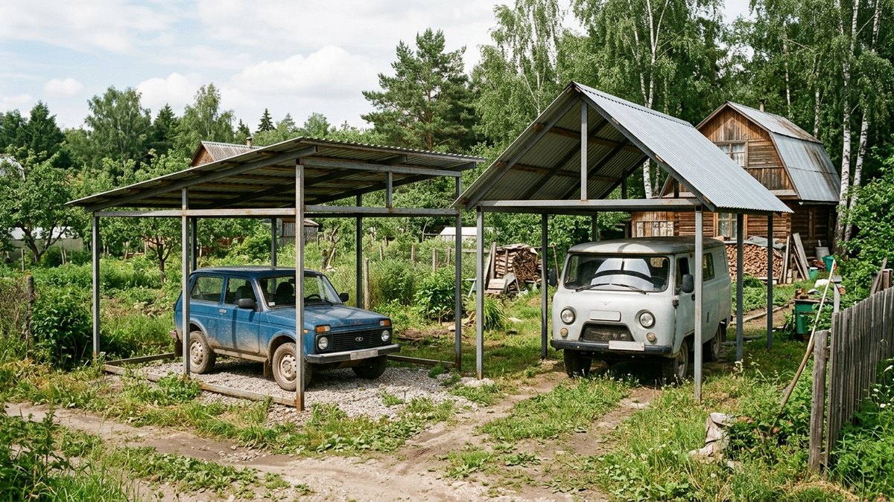
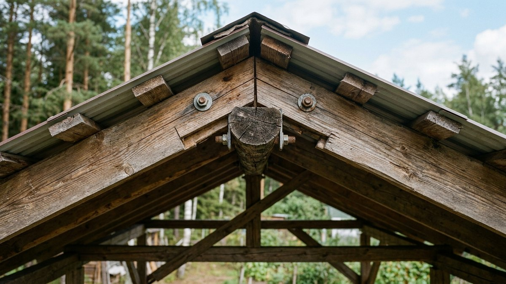
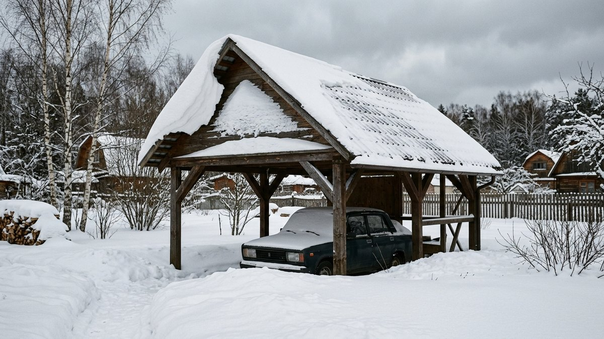
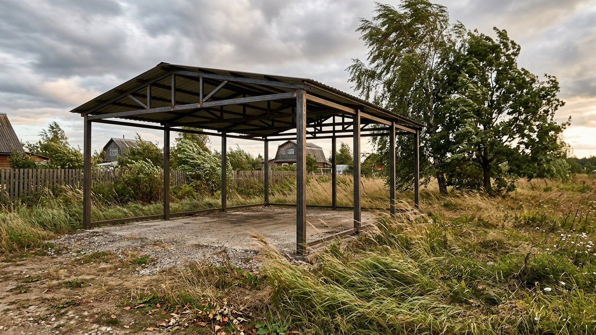
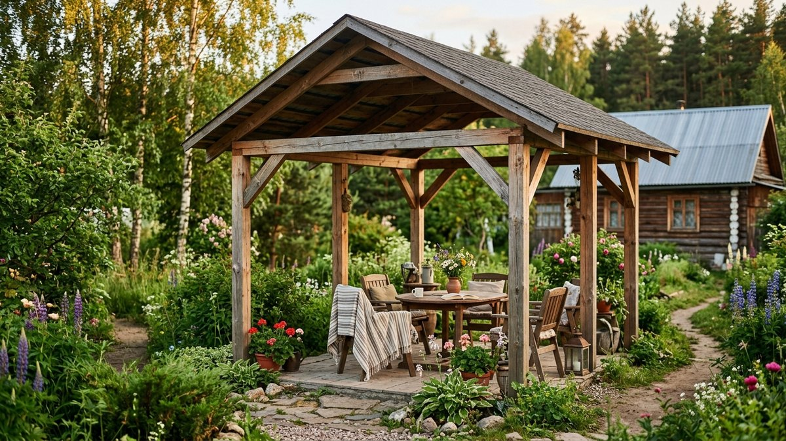
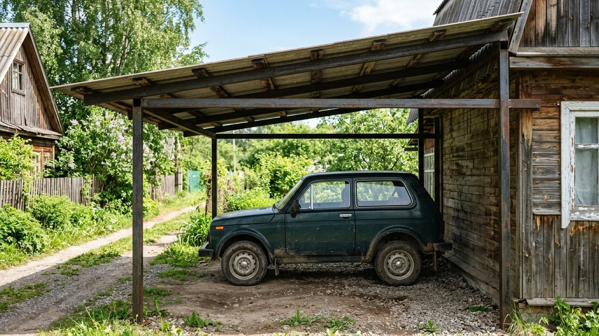

# Односкатный или двускатный навес: какую форму крыши выбрать

Вопрос формы крыши навеса решают на глаз — «двускатная выглядит солиднее»
или «односкатную проще сделать» — а потом удивляются, почему конструкцию
повело после первой снежной зимы или почему её сорвало ветром. На самом
деле выбор формы навеса — это не эстетика, а конкретный расчёт под снеговую
и ветровую нагрузку, площадь и то, стоит навес отдельно или примыкает к
дому. Разберём, чем формы отличаются технически, что показывают
нормативные документы и исследования, и как выбрать форму под свои условия.

## Конструктивная разница

Односкатная крыша навеса — это одна плоскость ската, поднятая с одной
стороны выше, чем с другой. Двускатная — две плоскости, сходящиеся коньком
посередине. Разница в конструкции определяет всё остальное:

- **Стропильная система.** У односкатного навеса стропила идут в одном
  направлении с равномерным уклоном — проще рассчитать и собрать. У
  двускатного добавляется коньковый прогон и узел стыковки скатов — на
  один узел больше, который нужно точно собрать и герметизировать.
- **Водоотвод.** Односкатный навес сбрасывает всю воду с одной стороны —
  туда и ставится единственный жёлоб. Двускатный делит сток на два ската —
  нужно два жёлоба или продуманный отвод с обеих сторон. Расчёт диаметра
  жёлоба и трубы по площади ската — в статье [водосток своими
  руками](https://mir-doma.pro/vodostok-svoimi-rukami/).
- **Высота конструкции.** Двускатная крыша на равной площади навеса выше в
  коньке, чем односкатная в своей верхней точке при том же минимальном
  уклоне — это больше материала на стойки и обшивку торцов, если они есть.

## Сравнение: таблица

| Критерий | Односкатная | Двускатная |
|---|---|---|
| Снеговая нагрузка | Ниже при том же уклоне, снег сходит в одну сторону | Требует расчёта неравномерного снегоотложения — снег может копиться на подветренном скате |
| Парусность (ветер) | Ниже, особенно при малом уклоне и небольшой высоте | Выше — два ската создают больше поверхности, воспринимающей боковой ветер |
| Стоимость каркаса | Дешевле — проще стропильная система, меньше высота | Дороже — конёк, два ската, обычно больше материала |
| Сложность монтажа | Проще, реальнее сделать в одиночку | Сложнее — нужно точно состыковать скаты в коньке |
| Водоотвод | Один жёлоб с одной стороны | Два жёлоба или отвод с обеих сторон |
| Где чаще ставят | Пристройка к дому, навес для машины у стены | Отдельно стоящий навес, зона отдыха, беседка-навес |

## Что говорят нормативы и исследования о снеговой нагрузке

<!-- wp:html -->

📚 Что говорят нормативы и исследования

<b>СП 20.13330.2016 «Нагрузки и воздействия»</b>, приложение Б, задаёт
коэффициент перехода от веса снегового покрова к расчётной нагрузке на
кровлю через угол ската: <i>«при угле наклона от 0° до 30° включительно —
коэффициент μ = 1,0; при угле наклона от 30° до 60° значение определяется
линейной интерполяцией; при угле наклона 60° и более — μ = 0»</i>. У
навесов уклон почти всегда меньше 30°, поэтому скидку на крутизну ската
закладывать не приходится — но норматив отдельно требует для двускатных
(и вообще скатных с двумя и более плоскостями) покрытий проверять
дополнительные схемы неравномерного снегоотложения, которые для
однопролётного односката не нужны.

Экспериментальное исследование неравномерных снеговых нагрузок на
двускатных крышах (Liu, Zhang, Fan, Shen, «Experimental investigation of
unbalanced snow loads on isolated gable-roof with or without scuttle»,
<i>Advances in Structural Engineering</i>, 2020) показывает, что ветер
переносит снег с наветренного ската на подветренный, и разница
нагрузки между скатами тем больше, чем сильнее ветер во время снегопада —
то есть двускатная крыша не просто требует более сложного расчёта, а
реально может нести на одном скате заметно больше снега, чем в среднем
по кровле.

Обзор американского нормативного расчёта снеговых нагрузок (ASCE 7-05
Snow Provisions, American Wood Council) отмечает ту же логику иначе: для
плоских и односкатных кровель достаточно проверить равномерную нагрузку
с учётом и без учёта переноса снега ветром, а для двускатных нужно
разбирать уже три отдельные схемы загружения — асимметрия добавляет не
косметическую, а расчётную сложность.

Источники: <a href="https://docs.cntd.ru/document/456044318" target="_blank" rel="noopener noreferrer">СП 20.13330.2016</a> ·
<a href="https://dx.doi.org/10.1177/1369433220902289" target="_blank" rel="noopener noreferrer">Liu et al., Advances in Structural Engineering, 2020</a> ·
<a href="https://awc.org/publications/snow-provisions-in-asce-7-05" target="_blank" rel="noopener noreferrer">ASCE 7-05 Snow Provisions, AWC</a>

<!-- /wp:html -->

Практический вывод из этого блока простой: если считаете снеговую нагрузку
для двускатного навеса самостоятельно, недостаточно взять нормативный вес
снега по своему району и умножить на площадь одного ската — нужно
закладывать запас на неравномерное распределение, а не делить нагрузку
поровну между скатами. Как выбрать сечение трубы под конкретную снеговую
нагрузку — подробно, с таблицами и примером, в статье [расчёт навеса из
профильной трубы](https://mir-doma.pro/raschet-navesa-iz-profilnoy-truby/).

## Ветровая нагрузка и парусность

У навеса нет стен, которые гасят ветер, поэтому парусность крыши — это
почти вся ветровая нагрузка на конструкцию. Односкатная крыша с небольшим
уклоном подставляет ветру меньшую площадь и меньшую высоту, чем двускатная
на той же площади навеса, — отсюда и общее правило: в открытых, продуваемых
местах (край участка, возвышенность, отсутствие защиты деревьями или
постройками) односкатная форма предпочтительнее именно по ветровой
нагрузке, а не только из-за простоты монтажа.

Двускатная крыша становится более уязвимой к ветру при увеличении угла
конька — чем он круче, тем больше боковая парусность каждого ската.
Компенсируется это более частым шагом стоек и жёстким креплением
стропильной фермы к обвязке — то есть тем же набором мер, что разобран в
статье [расчёт навеса из профильной трубы](https://mir-doma.pro/raschet-navesa-iz-profilnoy-truby/)
применительно к снеговой нагрузке: сечение трубы и шаг опор считаются под
худшее сочетание нагрузок, а не по одной из них.

## Когда выбирать одно-, а когда двускатную форму

**Односкатную стоит брать**, если навес пристраивается к дому или другой
стене (крепится верхним краем к стене, нижним — на стойки), если участок
открытый и продуваемый, если бюджет и простота монтажа своими руками важнее
внешнего вида, или если под навесом стоит одна машина и пролёт укладывается
в 3–4 м.

**Двускатную стоит брать**, если навес стоит отдельно посреди участка и
должен быть эстетически цельным с домом или беседкой, если под навесом
зона отдыха с высокими потолком в коньке (важна визуальная лёгкость
конструкции), или если ширина навеса большая (5–6 м и больше) — на такой
ширине односкатная крыша с нормативным уклоном даёт слишком большую
разницу высот между сторонами.

Материалы обшивки боковин навеса — по проёмам между стойками, если делаете
частичные стенки, — разобраны отдельно в статье [чем обшить навес
изнутри](https://mir-doma.pro/chem-obshit-naves-iznutri/): выбор формы
крыши на этот список материалов не влияет, но влияет на то, сколько торцов
придётся зашивать — у двускатной крыши их на один больше, фронтоны с обеих
сторон конька.

## Частые ошибки

- **Выбирать форму крыши по фотографии из интернета, не проверив уклон под
  свой снеговой район.** Красивая двускатная крыша с малым углом конька в
  снежном регионе копит снег на обоих скатах — нормативный уклон для схода
  снега начинается заметно выше, чем кажется на глаз.
- **Ставить двускатный навес впритык к дому.** Стык двух скатов и стены —
  сложный узел, требующий ендовы или примыкания с герметизацией; для
  навеса у стены почти всегда проще и надёжнее односкатная форма.
- **Не увеличивать сечение трубы при переходе на двускатную форму.**
  Двускатная крыша требует такого же или чуть большего сечения стоек и
  стропил при той же площади — экономить на трубе, ориентируясь на
  таблицы для односкатной формы, не стоит.
- **Игнорировать розу ветров участка.** Если преобладающий ветер дует
  вдоль конька, а не поперёк, парусность двускатной крыши меньше, чем в
  худшем случае — но это стоит проверить для конкретного участка, а не
  предполагать заранее.

## Частые вопросы

### Какая крыша навеса лучше при сильном ветре

Односкатная — за счёт меньшей высоты и меньшей площади, подставленной
боковому ветру. При выборе двускатной формы в ветреном месте нужно
уменьшать шаг стоек и усиливать крепление стропильной фермы к обвязке.

### Какой навес дешевле: односкатный или двускатный

Односкатный — проще стропильная система, меньше высота конструкции,
обычно на 15–25% меньше расход трубы на каркас при той же площади навеса.

### Можно ли сделать двускатный навес без конькового прогона

Нет, коньковый прогон — обязательный элемент двускатной крыши: он
принимает нагрузку от верхних концов стропил обоих скатов и передаёт её
на стойки. Без него узел в коньке ничем не держится.

### Какой уклон делать у односкатного навеса

Минимум 8–10° для схода воды и снега, оптимально 15–20° для профнастила.
Меньший уклон требует более тщательной герметизации нахлёстов кровельного
материала.

### Влияет ли форма крыши навеса на расчёт сечения трубы

Да — двускатная форма требует закладывать запас на неравномерное
распределение снега между скатами, а не считать нагрузку по среднему
значению. Пошаговый расчёт сечения трубы под конкретную снеговую нагрузку —
в статье [расчёт навеса из профильной трубы](https://mir-doma.pro/raschet-navesa-iz-profilnoy-truby/).

## Заключение

Односкатная крыша навеса дешевле, проще в сборке и лучше держит ветер;
двускатная — выигрывает по эстетике для отдельно стоящих построек и
позволяет большую ширину без чрезмерной разницы высот. Снеговая нагрузка
у двускатной формы требует более осторожного расчёта из-за неравномерного
снегоотложения — это подтверждают и нормативы, и отдельные инженерные
исследования. Выбор формы делайте не по картинке, а по трём параметрам:
пристроен навес к дому или стоит отдельно, насколько открытый и ветреный
участок, и какой снеговой район у вашего региона.
