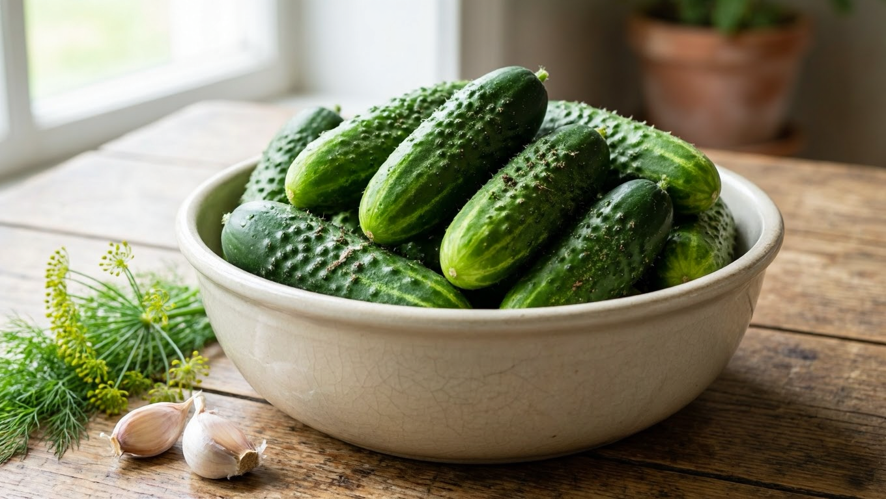
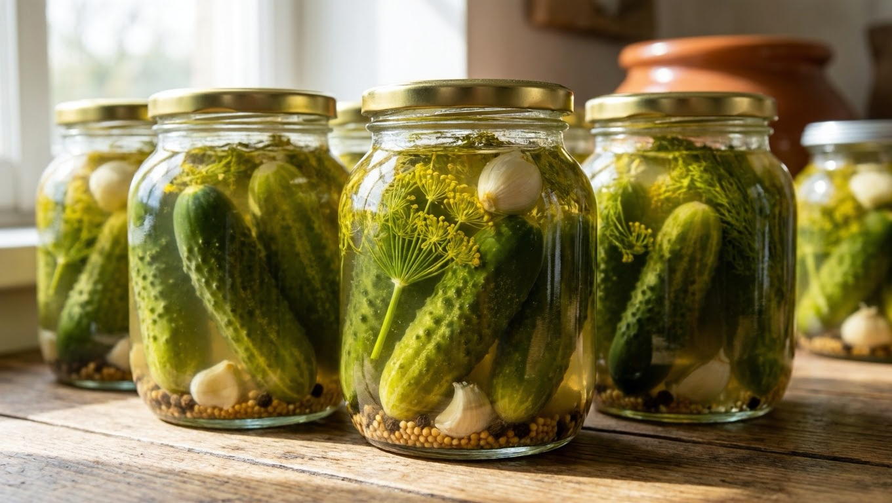
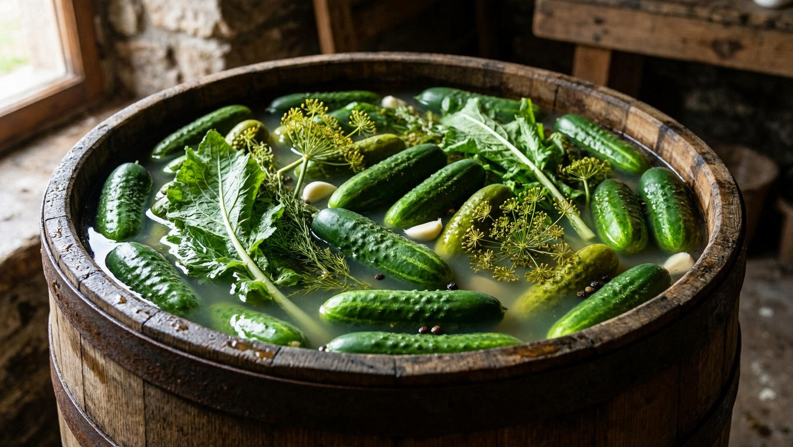
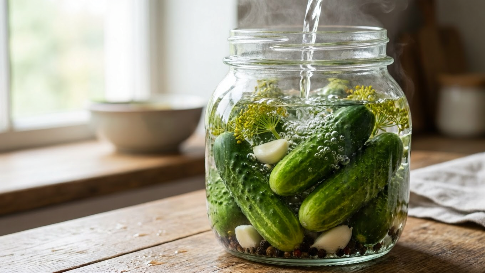
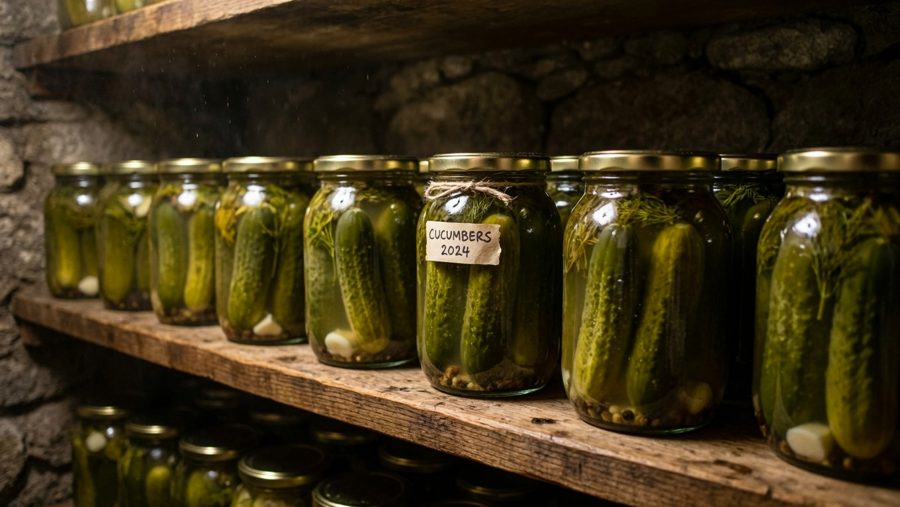

Огурцы — самая популярная зимняя заготовка: банка хрустящих огурчиков уходит на любом столе первой. Способов заготовить их на зиму несколько, и каждый даёт свой вкус — от острых маринованных до классических бочковых. Разберём все способы заготовки огурцов на зиму, как выбрать правильные огурцы, в чём секрет хруста и какой рецепт выбрать под ваш вкус.

## 🥒 Какие огурцы подходят для заготовки

От выбора огурцов зависит половина успеха — салатные сорта в банке размякнут. Что важно:

- **Засолочные сорта** — с тёмными пупырышками и чёрными шипами. Именно они получаются хрустящими. Салатные (с белыми шипами и гладкие) для консервации не годятся.
- **Небольшой размер** — 7–12 см, ровные, без пустот внутри.
- **Плотные и свежие** — только что с грядки или максимум суточные. Вялые огурцы хруста не дадут.
- **Замачивание.** Перед заготовкой огурцы **замачивают в холодной воде на 3–6 часов** — они напитываются влагой, становятся упругими и потом хрустят.

## 🔀 Способы заготовки огурцов

Есть четыре основных способа, и различаются они принципом консервации:

- **Маринование** — с уксусом. Быстро, надёжно, вкус остро-кисловатый. Хранятся долго даже в квартире.
- **Засолка (квашение)** — без уксуса, за счёт естественного брожения молочной кислоты. Тот самый «бочковой» вкус, но нужен холод для хранения.
- **Без стерилизации** — маринование методом двойной-тройной заливки кипятком: без возни со стерилизацией банок в кастрюле.
- **Без уксуса** — с лимонной кислотой или на основе брожения; для тех, кому уксус не подходит.

Разберём каждый с базовым рецептом.

## 🫙 Маринованные огурцы (с уксусом)

Самый популярный способ — надёжный и долгий в хранении. Базовый принцип:

1. На дно стерильных банок — специи: укроп (зонтики), чеснок, листья хрена, смородины, вишни, перец горошком.
2. Плотно уложить вымоченные огурцы.
3. Залить кипятком, дать постоять 10–15 минут, слить.
4. Из слитой воды сварить маринад с солью и сахаром, в конце добавить уксус.
5. Залить огурцы, закатать, перевернуть и укутать до остывания.

Подробный проверенный рецепт с точными пропорциями — в отдельной статье про [маринованные огурцы на зиму](https://mir-doma.pro/marinovannye-ogurtsy-na-zimu/).

## 🥬 Солёные (квашеные) огурцы

Это заготовка без уксуса — огурцы сохраняются за счёт естественного брожения. Вкус тот самый, «бочковой», в меру кислый.

1. В банку или бочку уложить огурцы со специями (укроп, хрен, чеснок, дубовые и смородиновые листья).
2. Залить холодным рассолом (примерно 60–70 г соли на литр воды).
3. Оставить при комнатной температуре на несколько дней для брожения.
4. Когда брожение утихнет, убрать в холод.

**Важно:** солёные огурцы хранят только в прохладе — погребе или холодильнике, иначе они перекиснут. Как обустроить хранилище — в статье про [обустройство погреба](https://mir-doma.pro/obustroystvo-pogreba/).

## ⚡ Огурцы без стерилизации

Удобный способ для тех, кто не хочет стерилизовать банки в кипящей кастрюле. Консервация происходит за счёт **многократной заливки кипятком**:

1. Уложить огурцы со специями в банки.
2. Залить крутым кипятком, накрыть, дать постоять 10–15 минут, слить.
3. Повторить заливку кипятком ещё раз (двойная заливка) или два (тройная).
4. Последний раз залить кипящим маринадом с солью, сахаром и уксусом, сразу закатать.

Многократная горячая заливка прогревает и обеззараживает содержимое не хуже стерилизации, а огурцы остаются хрустящими.

## 🍋 Огурцы без уксуса

Если уксус не подходит, его заменяют:

- **лимонной кислотой** — примерно 1/3–1/2 чайной ложки на литровую банку вместо уксуса; вкус мягче, без резкости;
- **брожением** — то есть засолкой (см. выше), где консервантом выступает естественная молочная кислота.

Технология маринования с лимонной кислотой та же, что и с уксусом, — меняется только кислота в заливке.

## 💡 Секреты хрустящих огурцов

Чтобы огурцы хрустели, а банки не «взрывались»:

- берите **засолочные сорта** и только свежие плотные огурцы;
- обязательно **замачивайте** огурцы в холодной воде перед заготовкой;
- добавляйте **листья хрена, дуба, смородины или вишни** — дубильные вещества дают хруст;
- **не переборщите с чесноком** — его избыток, наоборот, размягчает огурцы;
- **стерилизуйте банки и крышки** и заливайте всё горячим;
- обрезайте кончики огурцов — так они лучше просаливаются.

## 🫙 Как и сколько хранить

- **Маринованные и без стерилизации** (с уксусом) — стоят до года даже при комнатной температуре, в тёмном месте.
- **Солёные и квашеные** — только в прохладе: погреб, подвал, холодильник.

Общие правила хранения заготовок и урожая — в статье [как хранить овощи зимой](https://mir-doma.pro/kak-hranit-ovoshchi-zimoy/). А если огурцы девать некуда, часть можно [заморозить или переработать](https://mir-doma.pro/chto-zamorozit-na-zimu/).

## ❌ Частые ошибки

- **Взяли салатные огурцы** — в банке они размякнут, хруста не будет.
- **Не замочили огурцы** — вялые плоды получаются мягкими.
- **Много чеснока** — размягчает огурцы вместо хруста.
- **Плохо простерилизовали банки** — крышки вздуваются, заготовка портится.
- **Солёные огурцы оставили в тепле** — перекисают; их место в холоде.
- **Мутный рассол у маринованных** — признак нарушения технологии или нестерильной тары.

## ❓ Частые вопросы

**Какие огурцы лучше для заготовки на зиму?**
Засолочные сорта с чёрными шипами и пупырышками, небольшие (7–12 см), плотные и свежие. Салатные гладкие огурцы для консервации не годятся — размягчаются.

**Чем отличаются маринованные огурцы от солёных?**
Маринованные готовят с уксусом — они кисло-острые и хранятся долго даже в тепле. Солёные (квашеные) — без уксуса, за счёт брожения, с «бочковым» вкусом, но хранятся только в холоде.

**Как сделать огурцы хрустящими?**
Брать засолочные сорта, замачивать огурцы в холодной воде перед заготовкой, добавлять листья хрена, дуба или смородины и не класть много чеснока. Банки стерилизовать, заливать горячим.

**Нужно ли стерилизовать банки для огурцов?**
Для маринованных — да, банки и крышки стерилизуют. Способ «без стерилизации» заменяет её многократной заливкой кипятком, которая так же обеззараживает содержимое.

**Можно ли закрыть огурцы без уксуса?**
Да — с лимонной кислотой вместо уксуса или методом засолки (квашения), где консервантом служит естественная молочная кислота при брожении.

**Почему огурцы в банке становятся мягкими?**
Причины: салатный сорт, невымоченные вялые огурцы, избыток чеснока или нарушение стерильности. Для хруста нужны правильный сорт, замачивание и дубильные листья.

**Где хранить огурцы зимой?**
Маринованные — в тёмном месте при комнатной температуре до года. Солёные и квашеные — только в прохладе: погребе, подвале или холодильнике.

---

Огурцы на зиму можно заготовить на любой вкус: острые маринованные для длительного хранения, ароматные квашеные с бочковым духом или быстрые «без стерилизации». Секрет всегда один — правильный засолочный сорт, свежие вымоченные огурцы и дубильные листья для хруста. Готовые проверенные рецепты — в статьях про [маринованные огурцы](https://mir-doma.pro/marinovannye-ogurtsy-na-zimu/) и [малосольные огурцы](https://mir-doma.pro/malosolnye-ogurtsy/), а компанию им на столе составят [помидоры на зиму](https://mir-doma.pro/pomidory-na-zimu-recepty/).
