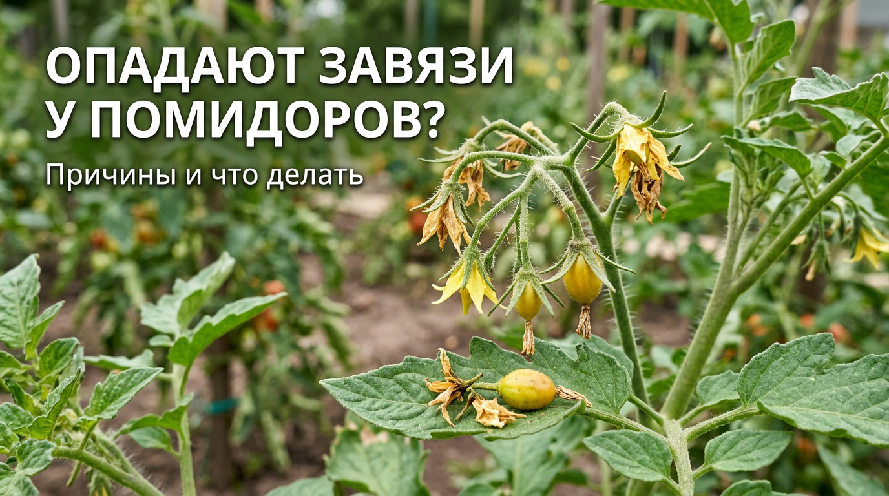
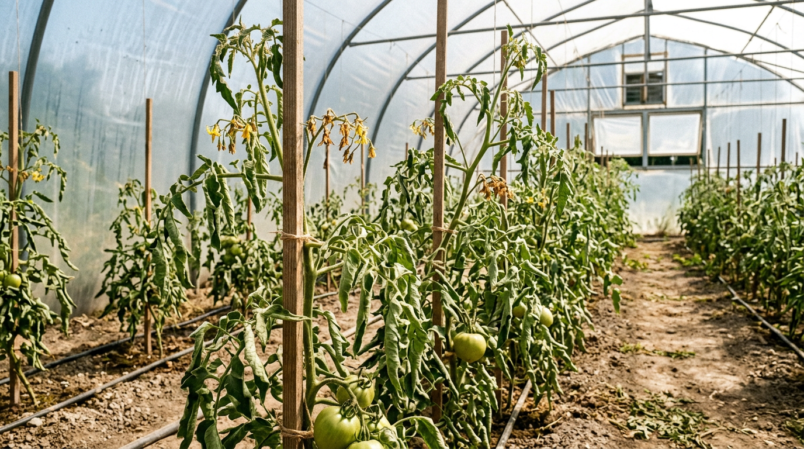
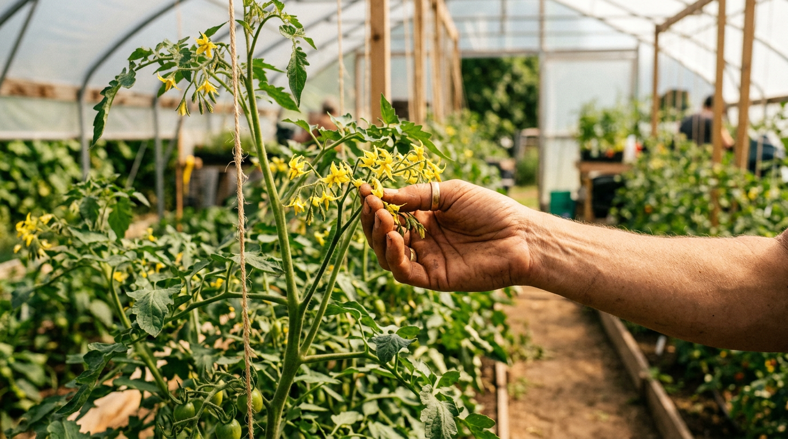
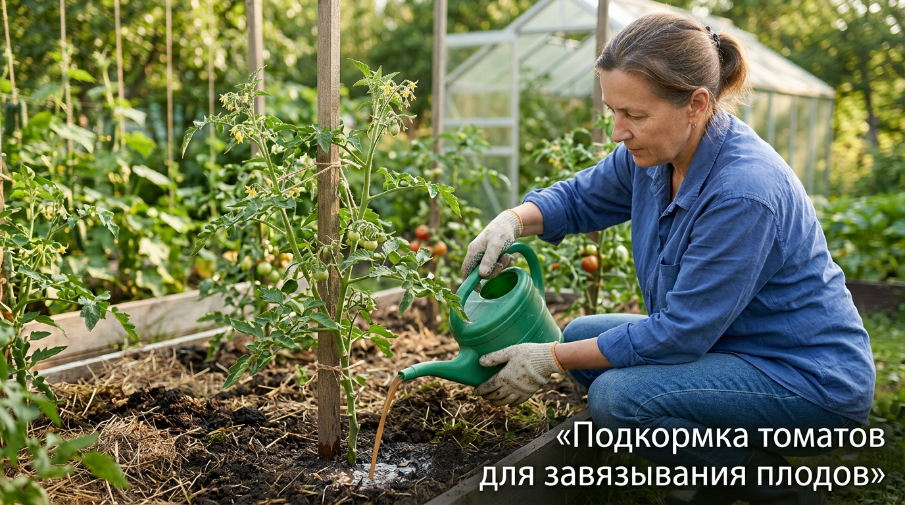
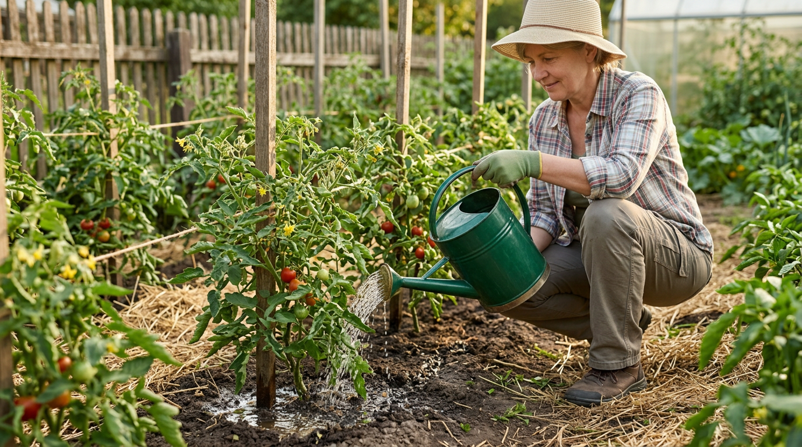
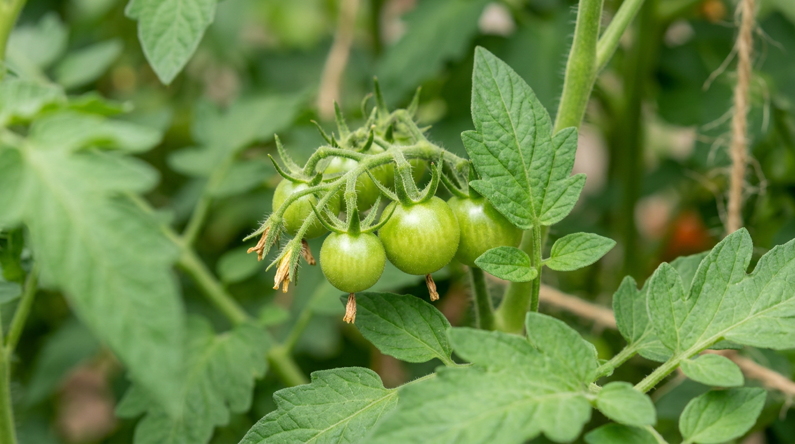

Помидоры цветут пышно, а завязей почти нет — цветки и маленькие завязи желтеют у основания и опадают. Знакомая и обидная картина: урожай буквально осыпается с куста. На самом деле опадение завязей у томатов — это защитная реакция растения на стресс, и почти всегда у неё есть понятная причина. В этой статье разберём, почему опадают завязи у помидоров, что именно вызывает сброс цветков и завязей и что делать, чтобы сохранить их и получить хороший урожай.

## 🍅 Что происходит, когда опадают завязи

В месте крепления цветка или завязи у томата образуется особый «сочленённый» участок. Когда растению что-то не нравится, оно сбрасывает цветок или завязь именно по этой линии — так помидор экономит силы в неблагоприятных условиях. Поэтому массовое опадение завязей — это сигнал: растение испытывает стресс, и нужно понять какой.

Чаще всего причин несколько, и действуют они вместе: жара, духота, ошибки полива и питания. Важно понимать, что сам по себе сброс — не болезнь, а реакция; вылечить нужно не завязи, а условия, в которых растёт куст. Разберём причины по порядку.

## 🌡️ Жара или холод

Температура — главная причина сброса завязей летом. При жаре выше 30–35 °C пыльца томатов становится стерильной: цветок не опыляется и опадает. Особенно критична жара в теплице, где воздух раскаляется ещё сильнее. Холод тоже вреден: при ночной температуре ниже 15 °C опыление и завязывание нарушаются. Резкие перепады «жаркий день — холодная ночь» усугубляют проблему. Оптимальная температура для завязывания плодов — примерно 20–27 °C днём и не ниже 15 °C ночью; выход за эти рамки и провоцирует сброс цветков.

## 🐝 Нет опыления

Томаты самоопыляемы, но для высыпания пыльцы им нужны сухой воздух и лёгкое движение — ветер или встряхивание. Проблемы возникают, когда:

- **в теплице духота и высокая влажность** (выше 70%) — пыльца отсыревает, слипается и не высыпается;
- **нет проветривания** и движения воздуха;
- **стоит дождливая пасмурная погода** — пыльца тяжёлая и влажная.

В результате цветки не опыляются и опадают, так и не образовав завязь. Парадокс в том, что и сухой перегретый воздух, и сырость одинаково вредны: в первом случае пыльца гибнет от жары, во втором — слипается от влаги. Поэтому в теплице так важен баланс — проветривание и умеренная влажность.

## 🌿 Избыток азота и нехватка питания

Перекормленный азотом куст «жирует»: гонит мощную ботву, толстый стебель и скручивает верхушку, а вот цветки формирует слабые, которые легко опадают. С другой стороны, при нехватке калия, фосфора и особенно бора завязи образуются плохо и осыпаются. Бор напрямую отвечает за опыление и завязывание, поэтому его дефицит — частая скрытая причина сброса цветков. О балансе питания подробно — в статье о [летних подкормках овощей](https://mir-doma.pro/letnie-podkormki-ovoshchey/). Дисбаланс питания — частая причина и других проблем, например [вершинной гнили томатов](https://mir-doma.pro/vershinnaya-gnil-tomatov/).

## 💧 Ошибки полива

Помидоры плохо переносят как пересушку, так и переувлажнение. Если почва пересохла, растение сбрасывает завязи, чтобы выжить; если переувлажнена — корни страдают, и результат тот же. Особенно вредна нерегулярность: засуха, а потом обильный полив — сильнейший стресс, от которого осыпаются цветки и трескаются плоды. О том, к чему ещё приводят ошибки ухода, читайте в статье, [почему желтеют листья у помидоров](https://mir-doma.pro/zhelteyut-listya-u-pomidorov/). Лучшее решение — редкий, но обильный полив под корень по графику, чтобы почва была равномерно влажной, без резких качелей «сушь — потоп».

## ⚖️ Перегрузка и загущение

Иногда куст сбрасывает часть завязей сам, если их образовалось слишком много, — он просто не может «прокормить» все плоды. Усугубляет ситуацию загущение: если кусты не пасынковать, в гуще листвы цветкам не хватает света, а влажность повышается. Правильное формирование куста разобрано в статье о [пасынковании помидоров](https://mir-doma.pro/pasynkovanie-pomidorov/).

## ✅ Что делать, чтобы сохранить завязи

Когда причина ясна, помочь растению несложно. Действуйте по нескольким направлениям.

1. **Наладьте температуру.** Проветривайте теплицу, открывая форточки и двери, в жару притеняйте растения сеткой или забелите стекло. Мульча сохраняет корни от перегрева, а в очень жаркую погоду теплицу держат открытой и днём, и ночью. Если жара стоит долго, помогает даже простое опрыскивание дорожек водой для повышения влажности до комфортного уровня — но без фанатизма, чтобы пыльца не отсырела.
2. **Помогите опылению.** Утром слегка встряхивайте цветочные кисти или постукивайте по шпалере, чтобы пыльца высыпалась. В теплице обязательно проветривайте, чтобы снизить влажность. При сильном сбросе опрыскайте по цветкам раствором борной кислоты (1–2 г на 10 л воды) — это улучшает завязывание.
3. **Скорректируйте питание.** Сократите азот, дайте калийно-фосфорную подкормку (зола, монофосфат калия) и бор для завязи.

4. **Наладьте полив.** Поливайте регулярно, обильно, но не часто, под корень и тёплой водой; мульчируйте почву, чтобы влага держалась равномерно.

5. **Нормируйте нагрузку.** Удаляйте пасынки и при необходимости лишние кисти, чтобы растение направляло силы на оставшиеся завязи.
6. **Используйте стимуляторы завязи** (специальные препараты) в неблагоприятную погоду — они помогают плодам завязаться даже в жару.

Не пытайтесь решить проблему одним приёмом: если стоит жара, одна только подкормка не спасёт — нужно прежде всего сбить температуру и наладить опыление. Эффект даёт именно сочетание мер.

Уже через короткое время после этих мер новые цветки начинают нормально завязываться.

## 🛡️ Профилактика

Чтобы завязи не опадали, проще создать томатам комфортные условия заранее:

- выбирайте сорта, устойчивые к жаре и перепадам температур;
- проветривайте теплицу и не допускайте перегрева и высокой влажности;
- поддерживайте баланс питания, не увлекаясь азотом;
- поливайте регулярно и тёплой водой, мульчируйте грядки;
- вовремя пасынкуйте и не загущайте посадки;
- помогайте опылению встряхиванием в жаркую и влажную погоду;
- мульчируйте грядки, чтобы сгладить колебания влажности и температуры почвы.

## ❓ Частые вопросы

### Почему у помидоров опадают цветки и завязи?

Чаще всего из-за жары выше 30–35 °C (пыльца становится стерильной), духоты и высокой влажности в теплице, отсутствия опыления, избытка азота, нехватки калия и бора или ошибок полива. Растение сбрасывает завязи в ответ на стресс, поэтому нужно устранить его причину.

### Что делать, если у томатов опадают завязи в теплице?

Прежде всего проветривайте теплицу, открывая форточки и двери, чтобы снизить температуру и влажность. Утром встряхивайте кисти для опыления, притеняйте растения в жару, наладьте регулярный полив тёплой водой и подкормите калием, фосфором и бором, сократив азот.

### Помогает ли борная кислота от опадания завязей?

Да, опрыскивание по цветкам раствором борной кислоты (1–2 г на 10 литров воды) улучшает завязывание плодов, особенно в жару и при нехватке бора. Обработку проводят по цветущим кистям, обычно один-два раза за сезон.

### При какой температуре опадают завязи у помидоров?

Пыльца томатов становится стерильной при температуре выше примерно 30–35 °C, и цветки не опыляются. Ночная температура ниже 15 °C тоже нарушает завязывание. Поэтому в жару теплицу проветривают и притеняют, а в холод растения укрывают.

### Почему завязи желтеют и опадают, не вырастая?

Маленькие завязи желтеют у плодоножки и опадают, когда цветок не опылился или растение испытывает стресс — от жары, нехватки питания, пересушки или перегрузки куста. По сути это та же реакция сброса: помидор избавляется от плодов, которые не может «потянуть» в текущих условиях.

### Опадают завязи на улице, в открытом грунте — почему?

В открытом грунте причины те же: аномальная жара, холодные ночи, затяжные дожди, мешающие опылению, избыток азота и нерегулярный полив. На улице добавляется зависимость от погоды, поэтому особенно важны баланс питания, регулярный полив и устойчивые к перепадам сорта.

### Как заставить помидоры завязывать плоды?

Создайте комфортную температуру (проветривание, притенение), помогите опылению встряхиванием кистей и борной кислотой, наладьте регулярный полив тёплой водой, дайте калийно-фосфорную подкормку с бором и сократите азот. В неблагоприятную погоду применяют стимуляторы завязи.

### Нужно ли обрывать лишние завязи у томатов?

При большой нагрузке нормирование помогает: если кисть перегружена, а растению не хватает сил, часть завязей удаляют, чтобы оставшиеся плоды были крупнее и вызрели. Особенно это важно в конце сезона, когда поздние завязи всё равно не успеют созреть.

## Заключение

Опадение завязей у помидоров — это реакция на стресс, и почти всегда виноваты жара, духота, отсутствие опыления, избыток азота или ошибки полива. Разберитесь, что именно беспокоит растения: наладьте температуру и проветривание, помогите опылению, сбалансируйте питание и полив, не загущайте посадки. Тогда цветки начнут нормально завязываться, и куст отблагодарит вас обильным урожаем. Главное — действовать в комплексе и не запускать проблему, ведь сохранить уже образовавшиеся завязи проще, чем вернуть осыпавшиеся. И помните: чаще всего достаточно просто сбить жару, проветрить теплицу и наладить полив — и помидоры завяжутся сами.

А вы сталкивались с опаданием завязей у томатов? Делитесь опытом в комментариях и подписывайтесь, чтобы не пропустить новые статьи об уходе за огородом.
